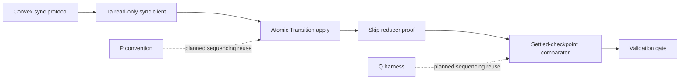
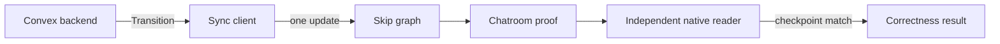

# Skip Sync-Protocol Client - Plan

## Goal Capsule

- **Objective:** Demonstrate that Skip can derive a correct, transaction-consistent, incrementally computed cross-table aggregate from convex-backend's live data, and bound the work a general sync-protocol integration would still require.
- **Means:** An in-process TypeScript Skip external service owns a WebSocket to convex-backend's `/api/sync` protocol, applies each fully assembled server transition to Skip as one atomic update, and relies on Skip's snapshot reconciliation instead of bridge-side row diffing.
- **Product authority:** Settled by the user across two sessions (an interrupted prior session and this one). This plan owns sub-direction 1a only — see How This Work Fits Together for the surrounding, deliberately-separated directions that are not active scope.
- **Open blockers:** None at product scope. Planning must choose between one combined Skip input domain and a narrowly scoped multi-collection atomic-write capability to satisfy R2.

---

## Product Contract

### Summary

A proof of concept where a Skip sync client speaks convex-backend's sync WebSocket protocol directly, with no backend changes. It preserves each synchronized server state transition as one atomic Skip update. A chatroom app combining a Skip example with the Convex tutorial demonstrates a cross-table aggregate maintained by Skip's incremental engine without bridge-side row diffing.

### Problem Frame

The only existing Skip+Convex integration is the `billf/convex/adapter` branch in `~/src/skip`. It already avoids polling by using the push-based `ConvexClient.onUpdate` callback. However, its Node-side `ExternalService` diffs every new query snapshot against a retained copy before feeding Skip, and independent per-query callbacks can expose intermediate cross-query states to the Skip graph.

convex-backend's reactivity is coarse: an invalidated query is run again and the sync protocol sends its full new result, not row-level changes. The protocol nevertheless groups the query modifications for one synchronized state advance in a `Transition`. The lower-level `BaseConvexClient.addOnTransitionHandler` also exposes this grouping, so owning the raw socket is not the only way to preserve it. This proof of concept keeps the direct-protocol choice to establish a client baseline with no dependency on `ConvexClient`; Direction 1c owns any future row-level backend changefeed.

### Key Decisions

- **Direct sync-protocol client, not a JS-client wrapper.** (User-directed, over polling or a client-side snapshot-diff shim.) Governs R1.
- **Preserve server-transition atomicity.** Every fully assembled `Transition` becomes one Skip update unit. Governs R2, R10.
- **No hand-rolled row diffing.** Skip's native snapshot reconciliation owns change detection. Governs R3.
- **In-process TypeScript, not an out-of-process Rust pump.** (User-directed: "prove first, generalize later" — a Rust sidecar pays a generalization cost this PoC doesn't need yet.) Governs R1.
- **Success is bounded semantic correctness, not performance or production readiness.** (User-directed, over quantifying latency/resource overhead against the adapter branch.) Governs R6, R11.
- **Failed queries freeze at last-good rather than going blank.** (User-directed, over the adapter branch's current blank-on-`QueryFailed` behavior — more graceful, but the demo must show a frozen value can be stale.) Governs R5.

### Requirements

**Sync-protocol client**
- R1. The Skip sync client implements the read-only `/api/sync` subset required for the proof without depending on the JS `ConvexClient` or changing convex-backend: connect, one pinned authentication mode, query-set changes, transitions, liveness, fatal errors, and reconnect with a fresh query snapshot.
- R2. Each fully reassembled `Transition` is this direction's `SnapshotBatch`: it records `end_version.ts`, contains every included query modification, and is applied/published atomically rather than through independent per-query writes. `QueryRemoved` is its complete-value delete form; reconnect replaces it with a fresh snapshot.

**Removal and transition integrity**
- R9. When the server acknowledges an unsubscribe with `QueryRemoved`, the client removes that query's rows inside the enclosing R2 atomic update; it does not preserve them as last-good state.
- R10. A chunk-eligible client reassembles and validates every `TransitionChunk` sequence before performing the single R2 update; individual chunks are never visible to Skip.

**Reconciliation**
- R3. The client presents each updated query's complete current row set to Skip with snapshot semantics, and Skip derives row additions, updates, and removals through its `isInit: true` reconciliation path rather than a bridge-computed diff. Revision tombstones, revision watermarks, and delta replay logic do not apply to this snapshot path.

**Skip-side computation**
- R4. Skip computes the Shared proof-vehicle contract's room-scoped feed and per-message `likeCount` reducer from data spanning more than one Convex query/table, so the demo evidences genuine incremental computation rather than a 1:1 relay of Convex data.

**Failure handling**
- R5. When a subscribed query enters a failed state, its previously-derived Skip view is retained (frozen at last-good) rather than cleared, and the demo surfaces that the value may be stale. If the query has never previously succeeded, the client instead shows an explicit not-yet-loaded state, distinct from both a frozen stale value and a removed query; it never renders as an empty frozen row set.

**Acceptance bar**
- R6. At each controlled checkpoint after the same writes have settled and before another write begins, Q12's four gates hold: the Transition is applied, the derived result is published, the same-version native oracle is observed, and the freshness disposition is recorded. The demo then canonically deep-equals the Shared proof-vehicle result across bootstrap, a multi-table update, unsubscribe, and reconnect with a fresh snapshot, and again after recovery from a query failure. No formal latency or resource-overhead comparison is required. This equality bar deliberately excludes the query-failure checkpoint itself: R5 requires the frozen last-good view to remain visibly stale rather than track the independent reader while the query is still failed, so failure is instead verified as retention-of-last-good plus a visible stale indicator (see AE2).
- R11. The proof records the implemented protocol surface, its code and test footprint, and every production concern it does not exercise, so a passing R6 establishes bounded semantic feasibility rather than an unqualified recommendation to generalize.

**Proof vehicle**
- R7. The demonstration implements the Shared proof-vehicle contract in `docs/plans/2026-09-11-1159-feat-skip-shared-prerequisites-plan.md`, using the Convex tutorial only as a fixture base and the Skip chatroom example only as an implementation reference.
- R8. The Convex side of the demo subscribes to plain per-table queries for the contract's five tables, not a pre-joined or pre-reduced query, so membership filtering, the user join, ordering, and the incremental `likeCount` happen inside Skip.

<!-- ce-section: work-relationships -->
### How This Work Fits Together

This plan owns sub-direction 1a: a client-side-only, real-sync-protocol Skip integration with no convex-backend changes. It sits inside a broader, deliberately-separated set of Skip/convex-backend integration directions the user chose to keep apart rather than entangle. This is the current understanding, not a committed roadmap.

- Direction 1 — Skip as a reactive client/observable source of convex-backend
  - 1a — Client-side only, real sync protocol (this plan)
  - 1b — Fine-grained query architecture (shaping the Convex query set itself to approximate row-level deltas without backend changes) — Can proceed independently of 1a; Shares the same wire-protocol grounding
  - 1c — Modest backend changes to emit real row-level change events for external consumers — Enables a future 1a/1b to drop client-side reconciliation entirely; Still to decide whether it's worth building
- Direction 2 — Native Skip support inside convex-backend (triggers, composable queries/filters/mappers authored in Skip, exported via the convex-backend API) — Can proceed independently of Direction 1; a large distance separates it from Direction 1 by the user's own framing; Still to decide

### Dependency relations

### Actors and flows

**Cross-document graph maintenance:** When this plan changes, update and revalidate relevant nodes, edges, statuses, and identifier-map rows in [README.md](README.md), [planning-timeline.md](planning-timeline.md), [prerequisites.md](prerequisites.md), [detailed-prerequisites.md](detailed-prerequisites.md), and [IDENTIFIER-MAP.md](IDENTIFIER-MAP.md); then render the affected diagrams and verify their references.

### Actors

- A1. convex-backend — source of truth; commits mutations and emits `Transition` messages over `/api/sync`.
- A2. Skip sync client — the new component this plan builds; owns the WebSocket and applies transitions to Skip.
- A3. Skip runtime — computes the canonical feed via its incremental engine.
- A4. Demo viewer — sees the canonical feed update in the chatroom UI.

### Key Flows

- F1. Live cross-table feed update
  - **Trigger:** A user action changes two or more of the demo's subscribed query results in one Convex transaction.
  - **Actors:** A1, A2, A3, A4
  - **Steps:** A1 advances the synchronized state and sends one `Transition` covering the changed query results. A2 reassembles it if necessary and applies its snapshot writes to Skip atomically. A3 incrementally updates the affected canonical feed. A4 sees the updated result.
  - **Outcome:** The feed reflects a state where every affected table has advanced together; it never displays an intermediate partial transaction.
  - **Covers:** R2, R3, R4.
- F2. Query failure and recovery
  - **Trigger:** A subscribed query transitions to a failed state (e.g. a transient backend error).
  - **Actors:** A1, A2, A4
  - **Steps:** A1 sends a failed-query modification. A2 leaves the query's existing rows in Skip untouched rather than clearing them. A4 continues to see the last-good derived value, with a visible indicator that it may be stale. When the query recovers, A2 resumes writing fresh `isInit: true` row sets and the view un-freezes.
  - **Outcome:** The demo never goes blank on a transient failure, and the viewer is not misled into thinking a stale value is current.
  - **Covers:** R5.
- F3. Unsubscribe cleanup
  - **Trigger:** The client removes a live query from its query set.
  - **Actors:** A1, A2, A3
  - **Steps:** A1 acknowledges the removal in a `Transition`. A2 clears the query's rows in the same atomic Skip update as the transition's other modifications. A3 removes their contributions from derived collections.
  - **Outcome:** An unsubscribed query cannot leave ghost rows in a reducer or join.
  - **Covers:** R2, R9.

### Acceptance Examples

- AE1. **Covers:** R2, R4, R6.
  - **Given:** A chatroom demo subscribed to the Shared proof-vehicle contract's per-table inputs.
  - **When:** One Convex transaction changes a sender's membership and adds a like.
  - **Then:** The canonical feed changes once, correctly, and matches an independent Convex reader at that checkpoint; no intermediate render shows only one side of the transaction.
- AE2. **Covers:** R5, R6.
  - **Given:** The demo is running and displaying a live per-room count.
  - **When:** The subscribed query underlying that count enters a failed state.
  - **Then:** The displayed count remains at its last-good value and the UI indicates it may be stale, until the query recovers, at which point the count matches an independent Convex reader.
- AE3. Chunked transition atomicity
  - **Covers:** R2, R10.
  - **Given:** A protocol fixture divides one valid transition into several ordered chunks.
  - **When:** The client receives all chunks.
  - **Then:** Skip observes exactly one complete update after reassembly and no partial update before it.
- AE4. Removal is not failure
  - **Covers:** R5, R6, R9.
  - **Given:** A live query contributes rows to the cross-table aggregate.
  - **When:** The client unsubscribes and the server returns `QueryRemoved`.
  - **Then:** Those rows stop contributing within the enclosing transition, and the resulting aggregate matches an independent Convex reader at that checkpoint, while `QueryFailed` still preserves last-good rows.
- AE5. Reconnect snapshot
  - **Covers:** R1, R3, R6.
  - **Given:** The demo has received a correct aggregate and then loses its WebSocket.
  - **When:** It reconnects, re-adds its live queries, and receives fresh full results.
  - **Then:** Skip reconciles to the fresh synchronized state without a bridge-side diff or stale rows from the prior connection.
- AE6. Bootstrap checkpoint
  - **Covers:** R1, R3, R6.
  - **Given:** A fresh sync connection to a convex-backend deployment with existing data in the demo's subscribed tables.
  - **When:** The client connects, establishes its query set, and receives the initial full result for each query.
  - **Then:** Before any subsequent write, the Skip-derived aggregate matches an independent Convex reader over that initial data.
- AE7. First-attempt failure
  - **Covers:** R5.
  - **Given:** A subscribed query has never previously produced a successful result.
  - **When:** That query enters a failed state on its first attempt.
  - **Then:** The client shows an explicit not-yet-loaded state, distinct from a frozen stale value (AE2) and from a removed query (AE4).
- AE8. Row removal on a live query
  - **Covers:** R2, R4.
  - **Given:** A chatroom demo showing a message with a nonzero `likeCount` in the canonical room feed.
  - **When:** A Convex mutation deletes one of that message's likes while the query remains subscribed and live.
  - **Then:** The Skip-derived `likeCount` decrements correctly, verifying the reducer's remove path independent of unsubscribe (AE4) or failure freezing (AE2).
- AE9. Liveness tolerance
  - **Covers:** R1.
  - **Given:** The demo is connected and displaying a correct aggregate with no pending writes.
  - **When:** The server sends a liveness signal.
  - **Then:** The client processes it without disrupting Skip state or the displayed aggregate.
- AE10. Fatal error surfacing
  - **Covers:** R1.
  - **Given:** The demo is connected and displaying a correct aggregate.
  - **When:** The server sends a `FatalError` message.
  - **Then:** The demo shows a distinct, visible failure state that is neither silent, a crash, nor indistinguishable from R5's frozen-stale indicator.
- AE11. Canonical 50-row boundary
  - **Covers:** R3, R6-R8.
  - **Given:** V4 of the versioned shared semantic corpus, including 51 qualifying messages and an equal-creation-time `_id` pair.
  - **When:** The client receives the complete per-table snapshots and the harness reaches a comparison-ready checkpoint.
  - **Then:** The directly compared descending output contains exactly the canonical first 50, excludes the 51st, and orders the tie by `_id`; it does not normalize into a different display order before comparison.

### Success Criteria

- Every R6 scenario produces the same aggregate as the independent Convex result at its controlled settled checkpoint.
- The aggregate uses a Skip reducer with correct add and remove behavior; forwarding Convex snapshots without maintained Skip computation does not pass.
- The protocol fixture suite proves that chunk boundaries and query removal cannot expose torn or orphaned Skip state.
- The shared V1-V6 corpus passes, including the V4 50th/51st and `_id` assertions and V6's final-state equality; AE1 remains this direction's live no-torn observation.
- The final report identifies the raw-client surface implemented by the proof and separately lists the untested production concerns named in Scope Boundaries.
- A passing proof supports a later generalization decision but does not make that decision by itself.

### Scope Boundaries

**Deferred for later**
- Sub-direction 1b — shaping the Convex query set itself so today's per-query delivery approximates row-level deltas without backend changes.
- Sub-direction 1c — modest convex-backend changes to emit real row-level change events for external consumers.
- The simpler one-collection-per-query variant of this plan's approach (without the transaction-atomicity mechanism) — a legitimate lighter-weight alternative worth its own follow-up if the atomicity mechanism turns out to add more complexity than value in practice.
- An out-of-process Rust client reusing convex-backend's existing Rust sync client, for a future publishable or language-agnostic version.
- A quantified latency/resource-overhead comparison against the `billf/convex/adapter` branch.
- Production sync-client behavior beyond the bounded read-only proof, including rotating/refreshing user authentication tokens, concurrent sessions, mutation and action request correlation, and durable replay.
- End-to-end testing with transitions above the chunk threshold; the proof covers chunk reassembly with protocol fixtures.

**Outside this product's identity**
- Direction 2 — convex-backend natively running Skip-authored logic (triggers, composable queries/filters/mappers) inside the backend itself. A separate, distant direction, not a later phase of this one.
- Rewriting convex-backend in Skip — rejected outright as too broad.

### Dependencies / Assumptions

- Assumes local checkouts of `~/src/skip` (for skipruntime-ts and the chatroom example) and `~/src/convex-tutorial` remain available and roughly in their current shape.
- Assumes the shared fixture's enabled static indexes, including `messages.by_sender[sender]`, are present. This direction does not test index lifecycle behavior.
- Assumes a running convex-backend deployment to connect to. The auth mode for the demo's sync connection (e.g. an admin key vs. a real user token) has no product-facing consequence for a correctness-only PoC and is left to planning.
- R2's atomic multi-collection write gap (Skip's public TypeScript API has no combined-write primitive) is tracked in `docs/plans/2026-09-11-1159-feat-skip-shared-prerequisites-plan.md`'s Problem Frame table (P — `AtomicSourceBatch` and external-source helpers); adoption is a planning decision, not assumed here.
- `BaseConvexClient.addOnTransitionHandler` provides a lower-cost way to validate transition grouping before the raw client is built, but it does not validate raw connection, authentication, query-set, chunk, liveness, or reconnect behavior.

### Outstanding Questions

**Deferred to Planning**
- The shared proof vehicle fixes the canonical feed and its `likeCount` reducer; planning may choose only transport-specific input topology, not another aggregate or result shape.
- The demo's auth mode for its sync connection (see Dependencies / Assumptions).
- Whether to adopt the shared-prerequisites plan's P `SnapshotBatch` helpers for R2 rather than a bespoke mechanism — see Dependencies/Assumptions.

### Alternatives Considered

- **Use `BaseConvexClient.addOnTransitionHandler`.** This preserves transition grouping with much less protocol code. It remains a valid fallback, but it does not establish the direct-protocol client baseline selected for 1a and still inherits the JS client's broader lifecycle and optimistic-update machinery.
- **Keep the existing per-query adapter and remove only its JavaScript diff.** Skip would own reconciliation, but separate callbacks could still expose intermediate cross-query states.
- **Reuse the Rust sync client in a sidecar.** This reduces protocol reimplementation and may suit a publishable follow-up. It adds a process boundary and does not provide the TypeScript `isInit: true` path directly, so it is outside this bounded proof.
- **Add backend row-level change events first.** This would remove full-query snapshots from the bridge, but it is Direction 1c and would violate 1a's no-backend-change boundary.

### Sources / Research

- `research/skip-convex-integration/research-convex-reactivity.md` — convex-backend's subscription/invalidation model: coarse, full-query-rerun, not fine-grained incremental computation.
- `research/skip-convex-integration/research-skip-engine.md` — Skip's incremental engine internals (`EagerCollection`/`LazyCollection`, `Mapper`/`Reducer`).
- `research/skip-convex-integration/research-skip-externals-adapter.md` — Skip's externals model, skipruntime-ts's public API shape, and the `billf/convex/adapter` branch's design and limitations.
- `research/skip-convex-integration/research-convex-query-composition.md` — convex-backend's query/UDF execution model.
- `research/skip-convex-integration/research-skip-atomic-write.md` — Skip Runtime's per-collection update boundary and the missing public multi-collection batch primitive.
- `research/skip-convex-integration/research-sync-wire-ts-checklist.md` — the read-only TypeScript protocol surface and transition-chunk behavior.
- `research/skip-convex-integration/research-1a-review-answers.md` — verified answers to the four review findings and the limits of a correctness-only proof.
- `crates/convex/sync_types/src/types/mod.rs` — wire contract: `StateModification` (full-value, not row-diff), `ServerMessage::Transition`, `AuthenticationToken`.
- `crates/convex/src/client/` — the Rust sync client; confirms the protocol has no browser/JS-specific requirements.
- `~/src/skip`, `skiplang/prelude/src/skstore/EagerDir.sk` — the structural-equality (`native_eq`) short-circuit that makes `isInit: true` writes a free, exact diff.
- `~/src/skip`, `skipruntime-ts/skiplang/core/src/Runtime.sk` and `skipruntime-ts/core/src/index.ts` — `isInit` reset semantics and the `ExternalService.update` wiring.
- `~/src/skip`, `skipruntime-ts/adapters/convex/src/index.ts` on branch `billf/convex/adapter` — the baseline being improved on.
- `npm-packages/convex/src/browser/sync/client.ts` — `BaseConvexClient` and `addOnTransitionHandler`, the lower-cost transition-grouping alternative.
- `research/skip-convex-integration/research-sync-protocol-skip-mapping.md` — 1a wire→Skip mapping: lifecycle, versions, chunks, bundle-preserving writes, PoC vehicle, correctness bar.
- `research/skip-convex-integration/research-atomic-source-batch.md`, `research/skip-convex-integration/research-logical-checkpoint-contract.md`, `research/skip-convex-integration/research-semantic-test-vectors.md`, `research/skip-convex-integration/research-core-metric-profile.md`, and `research/skip-convex-integration/research-static-vs-dynamic-indexes.md` — shared batch, checkpoint, corpus, metric, and static-index mappings used by this correctness-only snapshot direction.
- `docs/plans/2026-09-11-1159-feat-skip-shared-prerequisites-plan.md` — R2's atomic-write gap (P) and R6's comparator (Q); not yet built, adoption left to planning.
