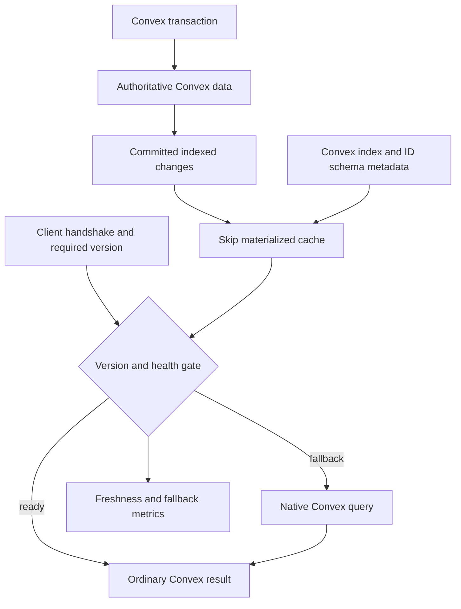

# Skip Incremental Materialized Cache Spike - Plan

## Goal Capsule

- **Objective:** Determine whether Convex can serve correct, current reactive results with update work that scales with the affected dependency neighborhood rather than the full result size.
- **Means:** Add an opt-in, backend-owned Skip materialized cache for one pre-registered chatroom view, feed it committed Convex changes, and retain native Convex query execution as the fallback.
- **Product authority:** Settled by the user in this brainstorm. This plan owns only the first Direction 2 feasibility spike; Direction 1 and later general-purpose Skip APIs remain separate work.
- **Open blockers:** None at product scope. The spike exists to resolve the technical viability, lifecycle cost, and scaling behavior of the proposed integration.

---

## Product Contract

### Summary

An internal Skip engine will maintain one pre-registered Convex chatroom view as a versioned, reactive materialized cache. Ordinary Convex clients opt into the experiment during connection setup, receive ordinary Convex results, and fall back to native query execution whenever the accelerated result cannot be served correctly.

### Problem Frame

Convex reactive subscriptions track transaction read sets and invalidate affected queries, but an invalidated public query is executed again to produce a fresh result. The subscription state preserves the query subscription and result identity, not a persistent operator graph for arbitrary user queries. Convex already maintains indexes and exact table counts incrementally and provides aggregate, counter, and denormalization patterns, so a credible comparison must use those capabilities rather than a naive full-table rescan.

Convex permits full table scans, so an application-defined index is not required for every query. Every table has built-in `by_id` and `by_creation_time` indexes for direct ID reads and default scans, while every named `withIndex` lookup must resolve to an enabled index. The two system indexes can therefore become implicit Skip base materializations for every table, and additional index declarations provide both invariants and planning signals for specialized Skip lookup structures.

A validated `v.id("targetTable")` schema field also preserves its target table as machine-readable metadata. It validates that an ID belongs to the named table but does not guarantee that the referenced document exists, so it can define an implicit forward Skip join edge only when the materialized view also preserves missing-target semantics. Reverse fan-out still needs an application index on the referencing field.

Skip Runtime maintains a long-lived reactive collection graph and propagates changed keys through deterministic mappers and reducers. A reducer with an inverse removal operation can update one affected group without rebuilding every group. That capability is materially different from using Skip syntax in a one-shot query operator or diffing whole query snapshots after Convex has already rerun the query.

The open question is whether Convex can host that incremental capability without changing its source-of-truth model, normal write path, UDF semantics, or application-facing result shapes. Correctness and freshness dominate the evaluation; performance evidence is about scaling behavior, not machine-specific microsecond or byte thresholds.

### Key Decisions

- **Maintain views from committed transaction changes.** (Over invalidation-driven reruns or an external change-feed sidecar — only the commit-level path preserves the incremental opportunity at a narrow backend boundary.) Governs R1-R4.
- **Keep Skip state derived and rebuildable.** (Over making Skip authoritative — Convex stays the sole source of truth.) Governs R5, R6.
- **Start with one eager, pre-registered view.** (Over lazy/read-through construction — the first spike must establish correctness, freshness, and the best achievable scaling bound.) Governs R7, R8.
- **Support version-gated freshness first.** (Over silently accepting arbitrary staleness — clients need a checkable relationship to Convex commit order.) Governs R9, R10.
- **Fall back silently and measure every fallback.** (Over failing accelerated reads — preserves availability without hiding accelerator failures.) Governs R11, R12.
- **Judge asymptotic behavior before absolute speed.** (Over fixed latency/memory thresholds — a scaling demonstration is the useful first result.) Governs R13-R15.
- **Keep the application surface ordinary Convex.** (Over exposing Skip-specific APIs — this spike tests engine integration, not a final product interface.) Governs R9, R16.
- **Use Convex indexes as the lookup contract.** (Over inventing independent lookup semantics — index declarations already encode supported access paths with transactionally maintained updates.) Governs R14, R17-R19.
- **Use validated IDs as join hints.** (Over restating every typed relationship manually — `v.id` already carries the target table for its implicit `by_id` join.) Governs R7, R20-R22.

### Why This Can Be Effective and Minimally Invasive

The engine is effective only if it receives committed row changes before Convex turns them back into whole query results. R1-R4 let Skip retain operator state across commits and update only the affected join, filter, ordering, and reduction dependencies. R17-R22 mirror Convex's system indexes, application indexes, and typed ID relationships instead of constructing a second, unrelated query planner. A one-shot Skip function inside the existing query pipeline would run Skip code but would not supply that persistent incremental maintenance.

The change is minimally invasive because the new state is an opt-in cache, not a second database. R5, R9, R11, and R16 leave authoritative writes, normal UDF execution, result shapes, and the native read path intact. The backend commit/write log is a plausible internal construction point, but it is not treated as an existing stable extension API or as a new public changefeed.

### Requirements

**Incremental maintenance**

- R1. A backend-owned, long-lived Skip graph consumes ordered row-level changes only after their Convex transaction commits; polling, post-rerun snapshots, and client-side snapshot diffing are not valid input mechanisms.
- R2. All source changes from one Convex transaction become visible to the materialized view atomically at one Convex commit version.
- R3. The view incrementally maintains joins, filters, grouped reductions, and ordering so unrelated source rows do not cause equivalent recomputation.
- R4. The spike instruments logical work at each maintained stage so its scaling behavior can be attributed to the changed dependency neighborhood.

**Authority, lifecycle, and recovery**

- R5. Convex remains the sole source of truth, and the Skip subsystem cannot perform or acknowledge authoritative application writes.
- R6. Bootstrap and recovery rebuild the view from a consistent Convex state without publishing an incomplete or transaction-torn accelerated result.

**Bounded proof vehicle**

- R7. The only accelerated view is a pre-registered, room-scoped recent-message feed whose validated ID fields connect rooms, users, memberships, messages, and likes for joins, membership filtering, grouped like reduction, deterministic ordering, and bounded output. Concretely: view membership is exactly the messages whose room matches the caller-supplied room ID and whose sender has an active membership row for that room at read time; likes are grouped-reduced per message; ordering is (`_creationTime` desc, `_id` desc) as the deterministic tiebreak; output is bounded to the most recent N messages, with N fixed by the harness configuration and no further pagination. The native oracle used for R13 uses this same membership, ordering, and limit definition.
- R8. The view is declared ahead of time as part of the experimental deployment; schema-driven generation, code-publish generation, and just-in-time construction are excluded from the spike.

**Read and fallback contract**

- R9. The ordinary Convex client connection handshake carries an experimental acceleration option while application query arguments and result values remain ordinary Convex values.
- R10. The first supported consistency mode waits until the view has reached at least the caller's required Convex commit version, while the client rejects every reserved but unsupported mode.
- R11. An unavailable, unhealthy, lagging, or known-incorrect accelerated view silently falls back to the equivalent native Convex query.
- R12. Metrics expose accelerated and fallback request counts, the fallback rate and reason, view progress versus required version, rebuild state, and detected result mismatches.

**Evaluation**

- R13. Correctness is checked against an independent native Convex result for the same logical commit version across bootstrap, inserts, updates, deletes, multi-table transactions, restart, lag, and recovery.
- R14. The comparison includes the strongest applicable idiomatic Convex baseline, including indexes, incrementally maintained exact counts, aggregate or counter components, and denormalization patterns where they fit the workload.
- R15. The scaling report varies total data size and affected dependency fan-out, then shows whether Skip update work and maintained state follow the expected complexity terms without imposing fixed microsecond or byte thresholds.
- R16. With acceleration disabled or bypassed, existing writes, UDF execution, reactive query behavior, application result shapes, and client behavior remain unchanged.

**Index alignment**

- R17. Rooms, users, memberships, messages, and likes — the tables used by the pre-registered view per R7 — each expose implicit Skip base-view definitions corresponding to Convex's built-in `by_id` and `by_creation_time` indexes; those five tables are also the only ones the spike materializes. Extending base-view definitions to every application table is out of scope for this spike.
- R18. Every additional Skip-maintained lookup, range, or ordering is backed by its corresponding enabled Convex application index.
- R19. View registration and activation validate the required Convex index definitions for the pre-registered view's tables, and any missing, staged, disabled, removed, or incompatible application index makes the accelerated path ineligible until it can be rebuilt against a compatible enabled index.

**Schema-derived joins**

- R20. For the pre-registered view's validated ID fields connecting rooms, users, memberships, messages, and likes (per R7), each field validated as `v.id("targetTable")` supplies an implicit join edge from that field to the target table's `by_id` base materialization. Deriving this join edge for schema fields outside the pre-registered view is ahead-of-time schema-derived generation and is excluded from this spike per R8.
- R21. The pre-registered view's schema-derived joins preserve its native behavior when the referenced target document is missing and never treat `v.id` as a referential-integrity guarantee.
- R22. A reverse join from a target document to its referencing documents within the pre-registered view (per R7) requires an enabled Convex application index on the referencing ID field. Deriving reverse-join support outside the pre-registered view is excluded from this spike per R8.

<!-- ce-section: work-relationships -->
### How This Work Fits Together

This plan owns Direction 2's first backend-native feasibility spike. The breakdown below records likely follow-up areas, not a committed roadmap; each later area requires its own brainstorm or plan.

- Direction 1 — Skip consumes Convex as an external reactive source
  - The existing sync-protocol client plan can proceed independently: `docs/plans/2026-09-10-1509-feat-skip-sync-protocol-client-plan.md`.
  - A future native external changefeed shares commit-ordering research with this spike but is not a dependency and must remain a separately justified product surface.
- Direction 2 — Convex uses Skip's language or incremental engine
  - This spike establishes a hand-crafted performance and correctness bound for one backend-maintained view.
  - Ahead-of-time view derivation from schemas or published code depends on the spike's lifecycle and consistency findings.
  - Just-in-time or read-through view construction depends on the same findings and must compete with the hand-crafted view's bound.
  - Native Skip APIs, specialized UDFs, and Skip-authored query composition can build on a successful engine integration but still require separate product design.
  - Effectful triggers require a delivery boundary outside deterministic Skip mappers and reducers and remain an independent work unit.

### Actors

- A1. Convex transaction system — commits authoritative writes and provides the ordered changes used to maintain the view.
- A2. Skip materialized-cache subsystem — maintains the pre-registered derived graph and reports its current Convex version and health.
- A3. Convex reactive read path — selects an accelerated result or the native query result without changing the application payload.
- A4. Convex client — negotiates the experimental option and supplies the required consistency mode and version.
- A5. Operator or evaluator — observes freshness, rebuild, mismatch, scaling, and fallback evidence.

### Key Flows

- F1. Bootstrap and activation
  - **Trigger:** An experimental deployment starts or enables its pre-registered chatroom view.
  - **Actors:** A1, A2, A3
  - **Steps:** A2 validates the view's required Convex indexes and typed ID join edges, builds from a consistent Convex state, consumes every later committed change in order, and reports progress. A3 continues using the native path until A2 can serve a complete version.
  - **Outcome:** Acceleration becomes eligible without exposing a partial view.
  - **Covers:** R5, R6, R11, R12, R17-R22.
- F2. Incremental transaction and reactive read
  - **Trigger:** One committed transaction changes source rows used by the feed.
  - **Actors:** A1, A2, A3, A4
  - **Steps:** A2 applies the transaction atomically, updates only affected dependencies, and advances the published view version. A3 serves the result when that version satisfies A4's requirement.
  - **Outcome:** The client observes an ordinary Convex result from a transaction-consistent incremental view.
  - **Covers:** R1-R4, R9, R10.
- F3. Fallback and recovery
  - **Trigger:** The view is unavailable, behind the required version, rebuilding, or known to disagree with the native result.
  - **Actors:** A2, A3, A4, A5
  - **Steps:** A3 runs the native query and returns its result without an application-visible acceleration error. A2 continues recovery, and A5 can attribute the fallback through metrics.
  - **Outcome:** Availability and correctness are preserved while accelerator failure remains observable.
  - **Covers:** R11, R12, R16.

### Acceptance Examples

- AE1. Atomic multi-table update
  - **Covers:** R2, R7, R13.
  - **Given:** A room feed contains a message, its author's membership, and its current likes at Convex version V.
  - **When:** One Convex transaction changes the membership and adds a like.
  - **Then:** The accelerated feed moves directly from V to the complete next version and never exposes only one of those changes.
- AE2. Version-gated read
  - **Covers:** R9, R10.
  - **Given:** The client requires version V2 while the materialized view has published only V1.
  - **When:** The view reaches V2 before the read is abandoned.
  - **Then:** The client receives the V2-or-newer accelerated result and no older snapshot.
- AE3. Silent but observable fallback
  - **Covers:** R11, R12, R16.
  - **Given:** The Skip subsystem is rebuilding or cannot reach the required version.
  - **When:** The client requests the feed with acceleration enabled.
  - **Then:** The application receives the native Convex result, while metrics count the fallback and identify its reason.
- AE4. Scaling demonstration
  - **Covers:** R3, R4, R14, R15.
  - **Given (unrelated-data axis):** Equivalent datasets whose unrelated rooms grow while the changed room and its affected join fan-out stay fixed.
  - **When:** The same one-row update is applied to each dataset.
  - **Then:** The measured Skip work follows the fixed affected neighborhood rather than the total unrelated data size, and the report compares that curve with the strongest applicable Convex-native design.
  - **Given (affected-fan-out axis):** Equivalent datasets where the changed room's own membership and like counts grow while unrelated rooms and their data stay fixed.
  - **When:** The same one-row update is applied to each dataset.
  - **Then:** The measured Skip work follows the expected complexity terms for the growing affected fan-out itself, distinguishing genuine incremental maintenance from a reducer that recomputes over its whole group on every change.
- AE5. Restart without stale publication
  - **Covers:** R6, R11-R13.
  - **Given:** The cache has served a correct view and then loses its process-local state.
  - **When:** It restarts while Convex continues accepting writes.
  - **Then:** Reads use the native fallback until rebuild and catch-up complete, after which the accelerated result matches the native result at the same version.
- AE6. Index lifecycle gate
  - **Covers:** R14, R17-R19, R22.
  - **Given:** Rooms, users, memberships, messages, and likes expose implicit `by_id` and `by_creation_time` base-view definitions and have those views materialized, and the view declares an enabled Convex application index for each additional indexed lookup and ordering.
  - **When:** One required index is staged, removed, disabled, or changed incompatibly.
  - **Then:** The accelerated view is not activated or served under the stale index contract, normal Convex behavior remains authoritative, and metrics identify the index-compatibility reason.
- AE7. Dangling typed reference
  - **Covers:** R7, R20, R21.
  - **Given:** A message contains an ID validated for the `users` table, but the referenced user document no longer exists.
  - **When:** Skip maintains the message-to-user join.
  - **Then:** The accelerated feed produces the same missing-user behavior as the native reference result rather than assuming the ID guarantees a matching document.

### Success Criteria

- Every accelerated result in the correctness matrix matches the independent native result at the same logical Convex version.
- The scaling evidence shows that update work is governed by the changed dependency neighborhood for at least one join-and-reduction path, and it states the maintained-state cost alongside the time complexity.
- Healthy steady-state benchmark traffic uses the accelerated path often enough to produce a scaling curve; a run that silently falls back for all relevant requests does not pass.
- Fallback, lag, rebuild, and mismatch metrics make every native-path substitution attributable.
- The pre-registered view's five tables (rooms, users, memberships, messages, likes) expose the two implicit base-view definitions and allocate their backing state; the lifecycle test proves that incompatible index changes cannot leave acceleration active.
- Every forward schema-derived join targets the declared table's `by_id` base materialization, every reverse fan-out uses an enabled application index, and both match native behavior for present and missing referenced documents.
- The completed spike identifies whether the backend integration is viable, which lifecycle or resource costs limit it, and whether later generalization is justified.

### Alternatives Considered

- **Invalidation-driven query cache:** Attach Skip after Convex invalidates a subscription and reruns its public query. Rejected because the expensive query work has already occurred and the approach does not establish persistent incremental maintenance across commits.
- **External change-feed sidecar:** Export a durable change protocol to an independent Skip service. Rejected for this spike because it adds a public protocol, delivery contract, deployment boundary, and failure mode before testing the engine; it also entangles this backend-native direction with Direction 1.
- **Per-UDF state or a one-shot Skip query operator:** Run Skip inside a user isolate or insert a hypothetical Skip filter into the existing query pipeline. Rejected because isolate reuse is conditional and a freshly constructed query pipeline does not retain a dependable incremental graph across commits.
- **Rewrite Convex in Skip:** Move authoritative backend behavior into Skip. Rejected as far beyond the stated goal and incompatible with the minimally invasive, derived-cache boundary.

### Scope Boundaries

- No polling or periodic snapshot refresh may be described as reactive input.
- No general view planner, schema compiler, code-publish derivation, lazy materialization, or read-through cache construction is part of this spike.
- No public Skip-specific query API, specialized Skip UDF type, or final consistency-mode API is designed here.
- No effectful trigger execution or delivery guarantee is included.
- No authoritative writes, write-through behavior, or replacement of Convex storage is permitted.
- No Direction 1 client/source integration or public Convex changefeed is included.
- No fixed microbenchmark threshold is used as the go/no-go test.

### Dependencies / Assumptions

- Skip's graph is treated as long-lived runtime state, not as state already proven durable across process restarts.
- Convex's internal committed-write and write-log machinery is a plausible construction seam, not an existing stable extension API; planning must choose and validate the narrowest safe hook.
- Convex gives every table `by_id` and `by_creation_time` indexes, which the spike assumes can seed implicit Skip base materializations; named indexed lookups still require enabled application indexes selected explicitly by the query.
- Convex schema validators expose the target table of each `v.id` field, but they do not enforce target-document existence; the native reference result owns each dangling-reference behavior.
- R2's atomic multi-collection write gap is tracked in `docs/plans/2026-09-11-1159-feat-skip-shared-prerequisites-plan.md`'s Problem Frame table (P — envelope convention), but P is an external TypeScript client over Skip's `ExternalService`/`CollectionWriter` surface — this spike is backend-owned (see Alternatives Considered) and cannot import it directly, so it needs its own backend-native implementation of the same pattern.
- The native reference implementation can express the same pre-registered feed semantics well enough to act as an independent correctness oracle and performance baseline.

### Outstanding Questions

**Deferred to Planning**

- Which internal committed-change hook minimizes coupling while preserving transaction order and rebuildability?
- Which existing Convex index metadata and committed index-change representation can drive Skip dependencies without coupling the spike to an unstable internal encoding?
- Which deployed schema representation should supply `v.id` join metadata to the Skip graph without duplicating Convex's validator semantics?
- Should the backend-owned engine run in the database process or in another backend-managed lifetime with equivalent consistency semantics?
- Will one combined Skip input domain or a scoped multi-collection atomic update mechanism satisfy R2 with less risk, as a native reimplementation of shared-prerequisites' P pattern (see Dependencies/Assumptions)?
- Which rebuild, checkpoint, or replay strategy best demonstrates R6 without turning the spike into a new persistence system?
- Which logical-work counters and dataset scale points make the asymptotic comparison reproducible?
- Should later versions activate the two implicit base views eagerly for every table, or allocate their backing state only when a registered or just-in-time view depends on the table?

### Sources / Research

- `research/skip-convex-integration/research-convex-reactivity.md` — Convex subscription tokens, invalidation, and full public-query reruns.
- `research/skip-convex-integration/research-skip-engine.md` — Skip's reactive graph, collections, mappers, reducers, and incremental behavior.
- `research/skip-convex-integration/research-skip-externals-adapter.md` — the existing push-based Convex adapter and its whole-snapshot JavaScript diffing boundary.
- `research/skip-convex-integration/research-skip-atomic-write.md` — the lack of a public multi-collection atomic update surface in the current Skip TypeScript runtime.
- `research/skip-convex-integration/research-poc-vehicle-and-harness.md` — the Convex tutorial and Skip chatroom proof vehicles.
- `research/skip-convex-integration/research-convex-query-composition.md` — Convex query construction and UDF isolate lifecycle.
- `crates/database/src/token.rs`, `crates/database/src/reads.rs`, and `crates/sync/src/worker.rs` — read-set invalidation and query rerun evidence.
- `crates/database/src/committer.rs` and `crates/database/src/write_log.rs` — the internal committed-change construction seam.
- `crates/database/src/transaction_index.rs` and `crates/database/src/snapshot_manager.rs` — existing incremental index and exact-count maintenance that the baseline must acknowledge.
- `npm-packages/convex/src/server/query.ts`, `crates/database/src/query/mod.rs`, and `crates/database/src/bootstrap_model/index.rs` — full-scan support and enabled-index validation for named indexed queries.
- `npm-packages/convex/src/values/validators.ts`, `crates/common/src/schemas/validator.rs`, and `npm-packages/convex/src/server/database.ts` — `v.id` target-table metadata, table validation, and the absence of an existence guarantee.
- [Convex indexes](https://docs.convex.dev/database/reading-data/indexes/) — the explicit `withIndex` contract, automatic system indexes, and staged-index lifecycle.
- [Skip introduction](https://skiplabs.io/docs/introduction) and [Skip externals](https://skiplabs.io/docs/externals) — official conceptual and external-source contracts.
- `research/skip-convex-integration/research-index-id-metadata.md` — stable vs. internal index metadata split, index lifecycle validation, `v.id` join edges and dangling-reference semantics.
- `research/skip-convex-integration/research-native-operator-spec.md` — composable `QueryOperator::Skip` interface design, touch list, and wire protocol example.
- `docs/plans/2026-09-11-1159-feat-skip-shared-prerequisites-plan.md` — the atomic-write gap (R2/P) and comparator methodology (R13/Q12) this spike needs; P/Q's TypeScript code can't be imported by this backend-owned spike, but Q12's spec and Q5's metric catalog are directly reusable.
