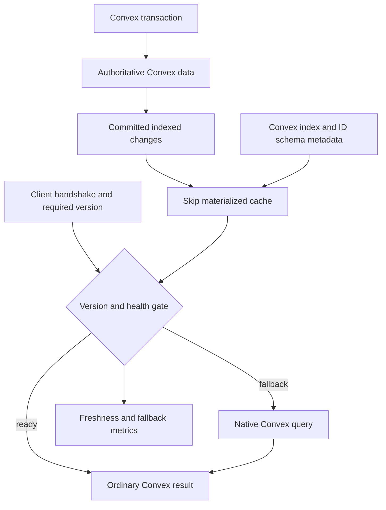
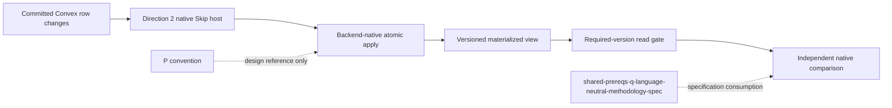
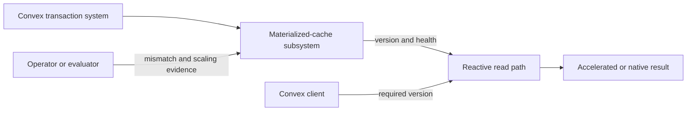
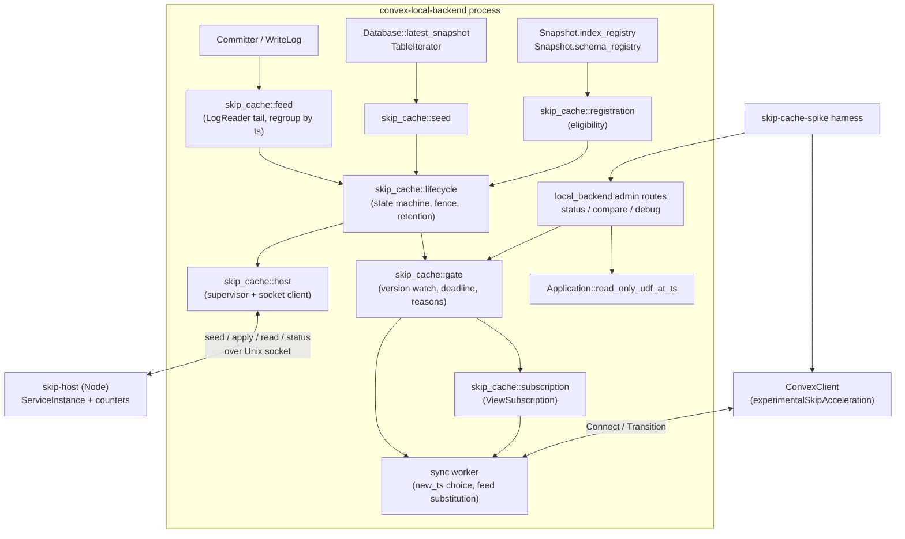
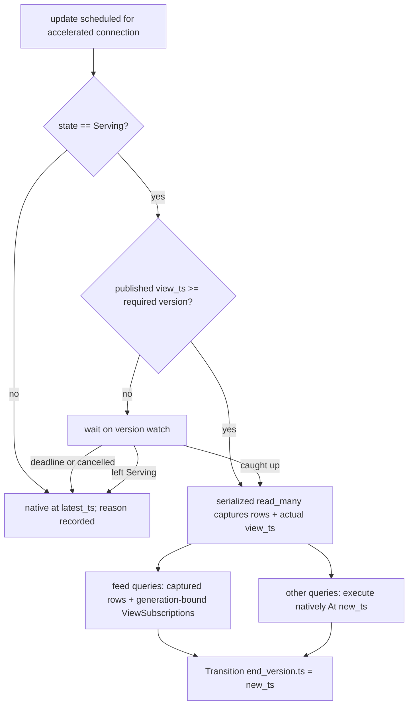

# Skip Incremental Materialized Cache Spike - Plan

## Goal Capsule

- **Objective:** Determine whether Convex can serve correct, current reactive results with update work that scales with the affected dependency neighborhood rather than the full result size.
- **Means:** Add an opt-in, backend-owned Skip materialized cache for one pre-registered chatroom view, feed it committed Convex changes, and retain native Convex query execution as the fallback. The engine runs in a backend-supervised Node child process (KTD1); Rust owns the feed, gate, fallback, and evidence (KTD2, KTD4, KTD6).
- **Product authority:** Settled by the user in this brainstorm. This plan owns only the first Direction 2 feasibility spike; Direction 1 and later general-purpose Skip APIs remain separate work.
- **Execution profile:** Spike-grade code on the open-source local backend (`crates/local_backend`) only. Every new surface is opt-in and knob-gated so that R16 holds by construction. Evidence quality and correctness outrank throughput or polish.
- **Open blockers:** None at product scope. The spike exists to resolve the technical viability, lifecycle cost, and scaling behavior of the proposed integration.
- **Stop conditions:** Stop and report rather than widen scope if (a) the Skip host cannot apply one commit batch atomically with `ServiceInstance.update`, (b) the write-log tail cannot keep the view within retention under the smallest scaling point, or (c) the descending take-50 per room cannot be maintained without whole-room recomputation and no bounded alternative exists inside Skip's public collection API. Each is a spike finding, not a reason to redesign the product contract.
- **Tail ownership:** If no stop condition fires, the implementer finishes all units through U8, runs the Verification Contract, and records the spike verdict in the U8 write-up. If a stop condition fires, the implementer halts the remaining implementation and produces the U8 report artifact with the available evidence, the failed condition, and an explicit negative or inconclusive verdict. Shipping beyond this branch is not part of this plan. The verdict limits feasibility claims to the tested view and attributes each limiting cost to the Node child host (KTD1), the no-persistence re-seed policy (KTD4), or Skip engine behavior (U8).

---

## Product Contract

**Product Contract preservation:** unchanged, with two bookkeeping edits. R1-R22, A1-A5, F1-F3, AE1-AE8, Key Decisions, Success Criteria, Scope Boundaries, and the origin's Dependencies/Assumptions are carried verbatim. The Outstanding Questions subsection was rewritten to point at the Planning Contract entries that resolve each formerly deferred question, and the two findings from the 2026-09-14 review were moved to Deferred / Open Questions and marked resolved on 2026-09-15. Dependencies/Assumptions gained two planning-time entries (Skip package source, Node availability).

### Summary

An internal Skip engine will maintain one pre-registered Convex chatroom view as a versioned, reactive materialized cache. Ordinary Convex clients opt into the experiment during connection setup, receive ordinary Convex results, and fall back to native query execution whenever the accelerated result cannot be served correctly.

### Problem Frame

Convex reactive subscriptions track transaction read sets and invalidate affected queries, but an invalidated public query is executed again to produce a fresh result. The subscription state preserves the query subscription and result identity, not a persistent operator graph for arbitrary user queries. Convex already maintains indexes and exact table counts incrementally and provides aggregate, counter, and denormalization patterns, so a credible comparison must use those capabilities rather than a naive full-table rescan.

Convex permits full table scans, so an application-defined index is not required for every query. Every table has built-in `by_id` and `by_creation_time` indexes for direct ID reads and default scans, while every named `withIndex` lookup must resolve to an enabled index. The two system indexes can therefore become implicit Skip base materializations for every table, and additional index declarations provide both invariants and planning signals for specialized Skip lookup structures.

A validated `v.id("targetTable")` schema field also preserves its target table as machine-readable metadata. It validates that an ID belongs to the named table but does not guarantee that the referenced document exists, so it can define an implicit forward Skip join edge only when the materialized view also preserves missing-target semantics. Reverse fan-out still needs an application index on the referencing field.

Skip Runtime maintains a long-lived reactive collection graph and propagates changed keys through deterministic mappers and reducers. A reducer with an inverse removal operation can update one affected group without rebuilding every group. That capability is materially different from using Skip syntax in a one-shot query operator or diffing whole query snapshots after Convex has already rerun the query.

The open question is whether Convex can host that incremental capability without changing its source-of-truth model, normal write path, UDF semantics, or application-facing result shapes. Correctness and freshness dominate the evaluation; performance evidence is about scaling behavior, not machine-specific microsecond or byte thresholds.

### Key Decisions

- **Maintain views from committed transaction changes.** (Over invalidation-driven reruns or an external change-feed sidecar — only the commit-level path preserves the incremental opportunity at a narrow backend boundary.) Governs R1-R4.
- **Keep Skip state derived and rebuildable.** (Over making Skip authoritative — Convex stays the sole source of truth.) Governs R5, R6.
- **Start with one eager, pre-registered view.** (Over lazy/read-through construction — the first spike must establish correctness, freshness, and the best achievable scaling bound.) Governs R7, R8.
- **Support version-gated freshness first.** (Over silently accepting arbitrary staleness — clients need a checkable relationship to Convex commit order.) Governs R9, R10.
- **Fall back silently and measure every fallback.** (Over failing accelerated reads — preserves availability without hiding accelerator failures.) Governs R11, R12.
- **Judge asymptotic behavior before absolute speed.** (Over fixed latency/memory thresholds — a scaling demonstration is the useful first result.) Governs R13-R15.
- **Keep the application surface ordinary Convex.** (Over exposing Skip-specific APIs — this spike tests engine integration, not a final product interface.) Governs R9, R16.
- **Use Convex indexes as the lookup contract.** (Over inventing independent lookup semantics — index declarations already encode supported access paths with transactionally maintained updates.) Governs R14, R17-R19.
- **Use validated IDs as join hints.** (Over restating every typed relationship manually — `v.id` already carries the target table for its implicit `by_id` join.) Governs R7, R20-R22.

### Why This Can Be Effective and Minimally Invasive

The engine is effective only if it receives committed row changes before Convex turns them back into whole query results. R1-R4 let Skip retain operator state across commits and update only the affected join, filter, ordering, and reduction dependencies. R17-R22 mirror Convex's system indexes, application indexes, and typed ID relationships instead of constructing a second, unrelated query planner. A one-shot Skip function inside the existing query pipeline would run Skip code but would not supply that persistent incremental maintenance.

The change is minimally invasive because the new state is an opt-in cache, not a second database. R5, R9, R11, and R16 leave authoritative writes, normal UDF execution, result shapes, and the native read path intact. The backend commit/write log is a plausible internal construction point, but it is not treated as an existing stable extension API or as a new public changefeed.



### Requirements

**Incremental maintenance**

- R1. A backend-owned, long-lived Skip graph consumes ordered row-level changes only after their Convex transaction commits; polling, post-rerun snapshots, and client-side snapshot diffing are not valid input mechanisms.
- R2. Each committed transaction is this direction's native `RevisionDeltaBatch` equivalent: all changes share one commit version and become visible to the materialized view atomically, with native delete/replay/rebuild handling rather than the external TypeScript helper.
- R3. The view incrementally maintains joins, filters, grouped reductions, and ordering so unrelated source rows do not cause equivalent recomputation.
- R4. The spike instruments logical work at each maintained stage using Q12's required/optional/N-A core profile, while retaining native stage names and index-lifecycle fields as Direction 2 extensions; its scaling behavior can therefore be attributed to the changed dependency neighborhood.

**Authority, lifecycle, and recovery**

- R5. Convex remains the sole source of truth, and the Skip subsystem cannot perform or acknowledge authoritative application writes.
- R6. Bootstrap and recovery rebuild the view from a consistent Convex state without publishing an incomplete or transaction-torn accelerated result.

**Bounded proof vehicle**

- R7. The only accelerated view is the pre-registered room-scoped feed defined by the Shared proof-vehicle contract in `docs/plans/2026-09-11-1159-feat-skip-shared-prerequisites-plan.md`: its five validated-ID tables, active-membership predicate, nullable sender projection, grouped like count, deterministic ordering, fixed 50-message bound, and no-pagination rule are all mandatory. The native oracle used for R13 uses that exact contract.
- R8. The view is declared ahead of time as part of the experimental deployment; schema-driven generation, code-publish generation, and just-in-time construction are excluded from the spike.

**Read and fallback contract**

- R9. The ordinary Convex client connection handshake carries an experimental acceleration option while application query arguments and result values remain ordinary Convex values. For an accelerated connection, the required version is the connection's existing causal sync watermark: the maximum Convex commit version it has observed from committed writes or received sync transitions.
- R10. The first supported consistency mode waits until the view has reached at least the connection's required Convex commit version. The required version advances with that causal sync watermark; the client rejects every reserved but unsupported mode.
- R11. An unavailable, unhealthy, or known-incorrect accelerated view silently falls back to the equivalent native Convex query. A healthy view behind the required version waits only until it catches up, the read is cancelled or reaches its request deadline, or the view becomes unhealthy; the latter two cases silently fall back with their reason recorded.
- R12. Metrics expose accelerated and fallback request counts, the fallback rate and reason, view progress versus required version, rebuild state, and detected result mismatches.

**Evaluation**

- R13. Correctness is checked against an independent native Convex result for the same logical commit version across bootstrap, inserts, updates, deletes, multi-table transactions, restart, lag, and recovery. Equality is claimed only after Q12's source-applied, result-published, oracle-observed, and freshness-recorded gates; `current` is a runtime state, while `comparison-ready` is harness-only.
- R14. The comparison includes the strongest applicable idiomatic Convex baseline, including indexes, incrementally maintained exact counts, aggregate or counter components, and denormalization patterns where they fit the workload.
- R15. The scaling report varies total data size and affected dependency fan-out, then shows whether Skip update work and maintained state follow the expected complexity terms without imposing fixed microsecond or byte thresholds.
- R16. With acceleration disabled or bypassed, existing writes, UDF execution, reactive query behavior, application result shapes, and client behavior remain unchanged.

**Index alignment**

- R17. Rooms, users, memberships, messages, and likes — the tables used by the pre-registered view per R7 — each expose implicit Skip base-view definitions corresponding to Convex's built-in `by_id` and `by_creation_time` indexes; those five tables are also the only ones the spike materializes. Extending base-view definitions to every application table is out of scope for this spike.
- R18. Every additional Skip-maintained lookup, range, or ordering is backed by its corresponding enabled Convex application index.
- R19. View registration and activation validate the required Convex index definitions for the pre-registered view's tables, and any missing, staged, disabled, removed, or incompatible application index makes the accelerated path ineligible until it can be rebuilt against a compatible enabled index.

**Schema-derived joins**

- R20. For the pre-registered view's validated ID fields connecting rooms, users, memberships, messages, and likes (per R7), each field validated as `v.id("targetTable")` supplies an implicit join edge from that field to the target table's `by_id` base materialization. Deriving this join edge for schema fields outside the pre-registered view is ahead-of-time schema-derived generation and is excluded from this spike per R8.
- R21. The pre-registered view's schema-derived joins preserve its native behavior when the referenced target document is missing and never treat `v.id` as a referential-integrity guarantee.
- R22. A reverse join from a target document to its referencing documents within the pre-registered view (per R7) requires an enabled Convex application index on the referencing ID field. The nullable-sender user rename/deletion path uses the shared enabled `messages.by_sender[sender]` index. Deriving reverse-join support outside the pre-registered view is excluded from this spike per R8.

<!-- ce-section: work-relationships -->
### How This Work Fits Together

This plan owns Direction 2's first backend-native feasibility spike. The breakdown below records likely follow-up areas, not a committed roadmap; each later area requires its own brainstorm or plan.

- Direction 1 — Skip consumes Convex as an external reactive source
  - The existing sync-protocol client plan can proceed independently: `docs/plans/2026-09-10-1509-feat-skip-sync-protocol-client-plan.md`.
  - A future native external changefeed shares commit-ordering research with this spike but is not a dependency and must remain a separately justified product surface.
- Direction 2 — Convex uses Skip's language or incremental engine
  - This spike establishes a hand-crafted performance and correctness bound for one backend-maintained view.
  - Ahead-of-time view derivation from schemas or published code depends on the spike's lifecycle and consistency findings.
  - Just-in-time or read-through view construction depends on the same findings and must compete with the hand-crafted view's bound.
  - Native Skip APIs, specialized UDFs, and Skip-authored query composition can build on a successful engine integration but still require separate product design.
  - Effectful triggers require a delivery boundary outside deterministic Skip mappers and reducers and remain an independent work unit.

### Dependency relations



### Actors and flows



**Cross-document graph maintenance:** When this plan changes, update and revalidate relevant nodes, edges, statuses, and identifier-map rows in [README.md](README.md), [planning-timeline.md](planning-timeline.md), [prerequisites.md](prerequisites.md), [detailed-prerequisites.md](detailed-prerequisites.md), and [IDENTIFIER-MAP.md](IDENTIFIER-MAP.md); then render the affected diagrams and verify their references.

### Actors

- A1. Convex transaction system — commits authoritative writes and provides the ordered changes used to maintain the view.
- A2. Skip materialized-cache subsystem — maintains the pre-registered derived graph and reports its current Convex version and health.
- A3. Convex reactive read path — selects an accelerated result or the native query result without changing the application payload.
- A4. Convex client — negotiates the experimental option and supplies the required consistency mode and version.
- A5. Operator or evaluator — observes freshness, rebuild, mismatch, scaling, and fallback evidence.

### Key Flows

- F1. Bootstrap and activation
  - **Trigger:** An experimental deployment starts or enables its pre-registered chatroom view.
  - **Actors:** A1, A2, A3
  - **Steps:** A2 validates the view's required Convex indexes and typed ID join edges, builds from a consistent Convex state, consumes every later committed change in order, and reports progress. A3 continues using the native path until A2 can serve a complete version.
  - **Outcome:** Acceleration becomes eligible without exposing a partial view.
  - **Covers:** R5, R6, R11, R12, R17-R22.
- F2. Incremental transaction and reactive read
  - **Trigger:** One committed transaction changes source rows used by the feed.
  - **Actors:** A1, A2, A3, A4
  - **Steps:** A2 applies the transaction atomically, updates only affected dependencies, and advances the published view version. A3 waits while the read remains active until that version satisfies A4's causal sync watermark, then serves the result.
  - **Outcome:** The client observes an ordinary Convex result from a transaction-consistent incremental view.
  - **Covers:** R1-R4, R9, R10.
- F3. Fallback and recovery
  - **Trigger:** The view is unavailable, rebuilding, known to disagree with the native result, becomes unhealthy while a read waits, or remains behind the required version until that read is cancelled or reaches its deadline.
  - **Actors:** A2, A3, A4, A5
  - **Steps:** A3 runs the native query and returns its result without an application-visible acceleration error. A2 continues recovery, and A5 can attribute the fallback through metrics.
  - **Outcome:** Availability and correctness are preserved while accelerator failure remains observable.
  - **Covers:** R11, R12, R16.

### Acceptance Examples

- AE1. Atomic multi-table update
  - **Covers:** R2, R7, R13.
  - **Given:** A room feed contains a message, its author's membership, and its current likes at Convex version V.
  - **When:** One Convex transaction changes the membership and adds a like.
  - **Then:** The accelerated feed moves directly from V to the complete next version and never exposes only one of those changes.
- AE2. Version-gated read
  - **Covers:** R9, R10.
  - **Given:** The client requires version V2 while the materialized view has published only V1.
  - **When:** The view reaches V2 before the read is cancelled or reaches its request deadline.
  - **Then:** The client receives the V2-or-newer accelerated result and no older snapshot.
- AE3. Silent but observable fallback
  - **Covers:** R11, R12, R16.
  - **Given:** The Skip subsystem is rebuilding, is unhealthy, or cannot reach the required version before the read is cancelled or reaches its request deadline.
  - **When:** The client requests the feed with acceleration enabled.
  - **Then:** The application receives the native Convex result, while metrics count the fallback and identify its reason.
- AE4. Scaling demonstration
  - **Covers:** R3, R4, R14, R15.
  - **Given (unrelated-data axis):** Equivalent datasets whose unrelated rooms grow while the changed room and its affected join fan-out stay fixed.
  - **When:** The same one-row update is applied to each dataset.
  - **Then:** The measured Skip work follows the fixed affected neighborhood rather than the total unrelated data size, and the report compares that curve with the strongest applicable Convex-native design.
  - **Given (affected-fan-out axis):** Equivalent datasets where the changed room's own membership and like counts grow while unrelated rooms and their data stay fixed.
  - **When:** The same one-row update is applied to each dataset.
  - **Then:** The measured Skip work follows the expected complexity terms for the growing affected fan-out itself, distinguishing genuine incremental maintenance from a reducer that recomputes over its whole group on every change.
- AE5. Restart without stale publication
  - **Covers:** R6, R11-R13.
  - **Given:** The cache has served a correct view and then loses its process-local state.
  - **When:** It restarts while Convex continues accepting writes.
  - **Then:** Reads use the native fallback until rebuild and catch-up complete, after which the accelerated result matches the native result at the same version.
  - **And:** The recovery test commits one change immediately before the consistent-snapshot cursor is captured and another immediately after it, before the change-consumption catch-up fence completes. It verifies that neither change is omitted when acceleration becomes eligible.
- AE6. Index lifecycle gate
  - **Covers:** R14, R17-R19, R22.
  - **Given:** Rooms, users, memberships, messages, and likes expose implicit `by_id` and `by_creation_time` base-view definitions and have those views materialized, and the view declares an enabled Convex application index for each additional indexed lookup and ordering.
  - **When:** One required index is staged, removed, disabled, or changed incompatibly.
  - **Then:** The accelerated view is not activated or served under the stale index contract, normal Convex behavior remains authoritative, and metrics identify the index-compatibility reason.
- AE7. Dangling typed reference
  - **Covers:** R7, R20, R21.
  - **Given:** A message contains an ID validated for the `users` table, but the referenced user document no longer exists.
  - **When:** Skip maintains the message-to-user join.
  - **Then:** The accelerated feed produces the same missing-user behavior as the native reference result rather than assuming the ID guarantees a matching document.
- AE8. Shared semantic corpus
  - **Covers:** R2, R7, R13, R20-R22.
  - **Given:** Versioned V1-V6 fixtures, with `messages.by_sender` enabled.
  - **When:** Each vector reaches a comparison-ready native-version checkpoint.
  - **Then:** V4 directly checks the descending 50th/51st boundary and `_id` tie-breaker, V6 reaches the common final state, and the live transaction assertion remains no-torn under the native publish boundary.

### Success Criteria

- Every accelerated result in the correctness matrix matches the independent native result at the same logical Convex version.
- The scaling evidence shows that update work is governed by the changed dependency neighborhood for at least one join-and-reduction path, and it states the maintained-state cost alongside the time complexity.
- Healthy steady-state benchmark traffic uses the accelerated path often enough to produce a scaling curve; a run that silently falls back for all relevant requests does not pass.
- Fallback, lag, rebuild, and mismatch metrics make every native-path substitution attributable.
- The pre-registered view's five tables (rooms, users, memberships, messages, likes) expose the two implicit base-view definitions and allocate their backing state; the lifecycle test proves that incompatible index changes cannot leave acceleration active.
- Every forward schema-derived join targets the declared table's `by_id` base materialization, every reverse fan-out uses an enabled application index, and both match native behavior for present and missing referenced documents.
- The shared V1-V6 corpus, including its manifest version, passes; index-lifecycle failures remain attributable through Direction 2 fallback/rebuild metrics rather than being imposed on the other directions.
- The completed spike identifies whether the backend integration is viable, which lifecycle or resource costs limit it, and whether later generalization is justified.

### Alternatives Considered

- **Invalidation-driven query cache:** Attach Skip after Convex invalidates a subscription and reruns its public query. Rejected because the expensive query work has already occurred and the approach does not establish persistent incremental maintenance across commits.
- **External change-feed sidecar:** Export a durable change protocol to an independent Skip service. Rejected for this spike because it adds a public protocol, delivery contract, deployment boundary, and failure mode before testing the engine; it also entangles this backend-native direction with Direction 1.
- **Per-UDF state or a one-shot Skip query operator:** Run Skip inside a user isolate or insert a hypothetical Skip filter into the existing query pipeline. Rejected because isolate reuse is conditional and a freshly constructed query pipeline does not retain a dependable incremental graph across commits.
- **Rewrite Convex in Skip:** Move authoritative backend behavior into Skip. Rejected as far beyond the stated goal and incompatible with the minimally invasive, derived-cache boundary.

### Scope Boundaries

- No polling or periodic snapshot refresh may be described as reactive input.
- No general view planner, schema compiler, code-publish derivation, lazy materialization, or read-through cache construction is part of this spike.
- No public Skip-specific query API, specialized Skip UDF type, or final consistency-mode API is designed here.
- No effectful trigger execution or delivery guarantee is included.
- No authoritative writes, write-through behavior, or replacement of Convex storage is permitted.
- No Direction 1 client/source integration or public Convex changefeed is included.
- No fixed microbenchmark threshold is used as the go/no-go test.

**Deferred to Follow-Up Work**

- Embedding the Skip host bundle into the backend binary the way `crates/isolate/src/bundled_js.rs` embeds the Node executor; the spike launches the host from a pre-built package directory (KTD1).
- Registering the cache's tail reader with the write log's `RetentionCoordinator` so the log is retained for it; the spike treats out-of-retention as a rebuild signal (KTD3).
- Restoring or re-creating the Rust database/application test fixtures that commit `ba16e0638` removed from this checkout; the spike's Rust verification is limited to self-contained unit tests plus end-to-end runs (KTD9).
- Converging the spike's Rust-side comparator endpoint with the shared-prerequisites Q harness once Q exists (Q11/Q12 alignment stays at the naming level here).
- Running the spike against the cloud backend crates; only `crates/local_backend` is wired.

### Dependencies / Assumptions

- Skip's graph is treated as long-lived runtime state, not as state already proven durable across process restarts.
- Convex's internal committed-write and write-log machinery is a plausible construction seam, not an existing stable extension API; planning must choose and validate the narrowest safe hook.
- Convex gives every table `by_id` and `by_creation_time` indexes, which the spike assumes can seed implicit Skip base materializations; named indexed lookups still require enabled application indexes selected explicitly by the query.
- Convex schema validators expose the target table of each `v.id` field, but they do not enforce target-document existence; the native reference result owns each dangling-reference behavior.
- R2's atomic multi-collection write gap is tracked in `docs/plans/2026-09-11-1159-feat-skip-shared-prerequisites-plan.md`'s Problem Frame table (P — `AtomicSourceBatch`), but P's helpers target external TypeScript consumers — this spike is backend-owned (see Alternatives Considered) and implements the specification natively rather than importing them.
- The native reference implementation can express the same pre-registered feed semantics well enough to act as an independent correctness oracle and performance baseline.
- `npm-packages/skip-host` resolves `@skipruntime/core` and `@skipruntime/wasm` (optionally `@skipruntime/native`) from the npm registry, pinned to 0.0.23, the version the `~/src/skip` checkout carries. The checkout is a read-only reference: its `skipruntime-ts/wasm` package is unbuilt and needs the Skip compiler toolchain (`skargo`). If the registry does not carry 0.0.23, building `skipruntime-ts/wasm` with that toolchain and linking it via `file:` becomes an explicit U1 prerequisite.
- A Node version satisfying `.nvmrc` is available to the local backend, as the existing local Node executor already requires.

### Outstanding Questions

All questions previously deferred to planning are resolved in the Planning Contract:

- Committed-change hook → KTD2. Index metadata and index-change representation → KTD5. Deployed schema representation for `v.id` join metadata → KTD5. Database process vs. another backend-managed lifetime → KTD1. Combined input domain vs. scoped multi-collection update for R2 → KTD3. Rebuild/checkpoint/replay strategy for R6 → KTD4. Logical-work counters and scale points → KTD8. Eager vs. lazy allocation of the two implicit base views for later versions remains out of scope; the spike allocates both eagerly for the five tables (R17).

### Sources / Research

- `research/skip-convex-integration/research-convex-reactivity.md` — Convex subscription tokens, invalidation, and full public-query reruns.
- `research/skip-convex-integration/research-skip-engine.md` — Skip's reactive graph, collections, mappers, reducers, and incremental behavior.
- `research/skip-convex-integration/research-skip-externals-adapter.md` — the existing push-based Convex adapter and its whole-snapshot JavaScript diffing boundary.
- `research/skip-convex-integration/research-skip-atomic-write.md` — the lack of a public multi-collection atomic update surface in the current Skip TypeScript runtime.
- `research/skip-convex-integration/research-atomic-source-batch.md`, `research/skip-convex-integration/research-logical-checkpoint-contract.md`, `research/skip-convex-integration/research-semantic-test-vectors.md`, `research/skip-convex-integration/research-core-metric-profile.md`, and `research/skip-convex-integration/research-static-vs-dynamic-indexes.md` — native-batch, checkpoint, corpus, metrics, and reverse-join/index-lifecycle mappings.
- `research/skip-convex-integration/research-poc-vehicle-and-harness.md` — the Convex tutorial and Skip chatroom proof vehicles.
- `research/skip-convex-integration/research-convex-query-composition.md` — Convex query construction and UDF isolate lifecycle.
- `research/skip-convex-integration/research-backend-change-hook.md` — the five-candidate hook comparison behind KTD2 and its retention budget.
- `research/skip-convex-integration/research-publication-state-semantics.md` and `research/skip-convex-integration/semantic-vectors-v1.md` — the shared runtime-state vocabulary behind KTD6 and the materialized V1-V6 manifest U7 vendors.
- `~/src/skip/docs/research/research-dir2-host-requirements.md`, `~/src/skip/docs/research/research-skip-atomic-write-gap.md`, and `~/src/skip/docs/research/research-skip-externals-contract.md` — the Skip-side host checklist and the single-collection `update` boundary.
- `crates/database/src/token.rs`, `crates/database/src/reads.rs`, and `crates/sync/src/worker.rs` — read-set invalidation and query rerun evidence.
- `crates/database/src/committer.rs` and `crates/database/src/write_log.rs` — the internal committed-change construction seam.
- `crates/database/src/transaction_index.rs` and `crates/database/src/snapshot_manager.rs` — existing incremental index and exact-count maintenance that the baseline must acknowledge.
- `npm-packages/convex/src/server/query.ts`, `crates/database/src/query/mod.rs`, and `crates/database/src/bootstrap_model/index.rs` — full-scan support and enabled-index validation for named indexed queries.
- `npm-packages/convex/src/values/validators.ts`, `crates/common/src/schemas/validator.rs`, and `npm-packages/convex/src/server/database.ts` — `v.id` target-table metadata, table validation, and the absence of an existence guarantee.
- `crates/node_executor/src/local.rs` and `crates/isolate/src/bundled_js.rs` — the backend-managed Node child process precedent behind KTD1.
- `crates/application/src/api.rs` (`SubscriptionClient`, `SubscriptionTrait`) and `crates/application/src/table_summary_worker.rs` — the subscription abstraction behind KTD7 and the long-lived worker shape U3 mirrors.
- [Convex indexes](https://docs.convex.dev/database/reading-data/indexes/) — the explicit `withIndex` contract, automatic system indexes, and staged-index lifecycle.
- [Skip introduction](https://skiplabs.io/docs/introduction) and [Skip externals](https://skiplabs.io/docs/externals) — official conceptual and external-source contracts.
- `research/skip-convex-integration/research-index-id-metadata.md` — stable vs. internal index metadata split, index lifecycle validation, `v.id` join edges and dangling-reference semantics.
- `research/skip-convex-integration/research-native-operator-spec.md` — composable `QueryOperator::Skip` interface design, touch list, and wire protocol example.
- `docs/plans/2026-09-11-1159-feat-skip-shared-prerequisites-plan.md` — the atomic-write gap (R2/P) and comparator methodology (R13/Q12) this spike needs; P/Q's TypeScript code can't be imported by this backend-owned spike, but Q12's spec and Q5's metric catalog are directly reusable.
- `docs/solutions/tooling-decisions/opencode-ce-doc-review-external-provider.md` and `docs/solutions/tooling-decisions/ce-doc-review-cross-model-coverage-limitations.md` — cross-model review mechanics that apply to this plan's review, not to its implementation.

---

## Planning Contract

### Repository Boundaries

- **Target repo:** `convex-backend` (this repository). All paths below are repo-relative unless prefixed `skip:` (the `~/src/skip` checkout, read-only for this plan).
- New Rust crate `crates/skip_cache` owns every backend-side concern. It depends on `database`, `common`, `application` (for `SubscriptionTrait`), `metrics`, and `runtime`; `sync` and `local_backend` depend on it. No existing crate gains a dependency on Skip.
- Two new npm workspace packages: `npm-packages/skip-host` (the Node-hosted Skip service) and `npm-packages/skip-cache-spike` (the proof-vehicle Convex app, the V1-V6 corpus, and the harness).
- Existing files change only in `crates/convex/sync_types`, `crates/sync`, `crates/local_backend`, `crates/common/src/knobs.rs`, and `npm-packages/convex/src/browser/sync`, each behind an optional field or knob so R16 holds when nothing is opted in.

### Output Structure

```text
crates/skip_cache/
  Cargo.toml
  src/
    lib.rs            # SkipCacheClient handle, feature knobs, wiring entry point
    registration.rs   # pre-registered view declaration + validation against a Snapshot
    host.rs           # Node child supervisor + local-socket protocol client
    protocol.rs       # request/response types shared with skip-host (serde)
    feed.rs           # write-log tail, per-commit regrouping, index/schema event extraction
    seed.rs           # consistent snapshot capture + table iteration into a seed batch
    lifecycle.rs      # state machine, fence, retention handling, rebuild driver
    gate.rs           # version-gated read, wait/deadline, fallback reasons
    subscription.rs   # view-backed SubscriptionTrait
    compare.rs        # same-version compare (accelerated vs native oracle)
    metrics.rs
npm-packages/skip-host/
  package.json
  src/
    service.ts        # combined input collection, mappers, reducers, room feed resource
    counters.ts       # instrumented mapper/reducer wrappers and per-batch work totals
    host.ts           # headless ServiceInstance + HTTP-over-Unix-socket request loop
    protocol.ts       # message types mirrored from crates/skip_cache/src/protocol.rs
    service.test.ts
    host.test.ts
npm-packages/skip-cache-spike/
  package.json
  convex/
    schema.ts         # five tables + shared static index set
    chat.ts           # roomFeed (canonical + oracle), roomFeedDenormalized (baseline), mutations
    view.json         # pre-registered view declaration consumed by SKIP_CACHE_VIEW_FILE
  corpus/v1/          # V1-V6 fixtures + manifest vendored from semantic-vectors-v1
  harness/
    client.ts         # opted-in + native ConvexClient pair, admin endpoint calls
    comparator.ts     # Q12 four-gate comparison and structured mismatch report
    faults.ts         # host kill, index disable/enable, retention pressure, schema push
    scaling.ts        # N/K/F dataset builder and one-row-update driver
    report.ts         # JSONL recorder using the Q5/Q11 names
    *.test.ts
```

### Key Technical Decisions

- KTD1. **The Skip engine runs in a backend-supervised Node child process ("Skip host"), launched from a pre-built package directory named by the `SKIP_HOST_DIR` knob and reached over a private Unix socket.** Skip ships only a NAPI addon whose C surface is untyped (`skip: skipruntime-ts/addon/src/common.h` defines every runtime handle as `void*`) and a WASM build that still needs a JavaScript host for mappers and reducers, so there is no Rust-callable engine; `crates/isolate` is per-invocation and cannot hold a long-lived graph. `crates/node_executor/src/local.rs` already spawns a health-checked, `kill_on_drop` Node child over a Unix socket, and the host mirrors that shape; where its spawn and health-check helpers can be factored out without touching the action protocol, the host reuses them rather than growing `LocalNodeExecutor` itself. Host runtime contract: Node resolves the same way as the executor (`.nvmrc` version under the user's version manager, then `node` on PATH, version-checked); the platform is `wasm` unless `SKIP_HOST_PLATFORM=native`, and native is opt-in because the addon is platform-specific; the socket lives in a per-spawn temp directory so the path stays short and stale sockets die with the directory; restarts are bounded by `SKIP_HOST_MAX_RESTARTS` with `Backoff`, after which the view is Unhealthy until the backend restarts. This is not the rejected external change-feed sidecar: there is no public protocol, no independent deployment, and no durable change contract — the child is private to one backend process and is torn down with it. The cost the origin's rejection named (a second failure mode) is real and is measured by the fallback and restart metrics rather than designed away. A bake-off was not warranted: only this option is demonstrated, so the choice needed judgment on evidence, not further development. Governs R1, R5, R11.
- KTD2. **The change feed is a tail of the published write log grouped by commit timestamp.** A worker holds a cloned `LogReader` from `Database::log`, waits with `wait_for_higher_ts`, and iterates `for_each_index`, which yields every index vector in the log; the worker's closure keeps the five tables' `by_id` vectors plus the `_tables`, `_index`, and `_schemas` system tables, counts everything else as unrelated, and regroups entries by `WriteInIndex.ts` so every observed commit becomes one batch. A commit with no kept entries becomes a zero-entry host apply, preserving the view data while advancing the host's applied timestamp. Payload for kept entries is `document_id` + old/new presence + `new_document` post-image; `IndexKeyBytes` is never decoded. Committer hooks, read-set overlap, `PendingWrites`, snapshot diffing, and the `subscribe` signal path were rejected in `research/skip-convex-integration/research-backend-change-hook.md` and nothing in the code contradicts that. Governs R1, R2, R4.
- KTD3. **One combined Skip input collection, updated once per commit, is the native `RevisionDeltaBatch` equivalent.** The host keys the collection by `"<table>/<id>"` with a tagged `{table, doc}` value and calls `ServiceInstance.update` exactly once per batch; that call is the only atomic publication primitive Skip exposes (`skip: skipruntime-ts/core/src/index.ts` `update`, fork-then-merge, single collection). Deletes are `[key, []]` entries. Because Rust owns the apply cursor and the host is process-local, a batch is applied at most once; the host still rejects a non-monotonic batch timestamp defensively. The host serializes `apply` and `read_many` on one per-generation queue so a read never observes a batch mid-propagation and a multi-table batch produces exactly one room notification; U1 tests both properties. This reimplements the P1-P3 contract inside the host's own TypeScript and imports nothing from the P library. Out-of-retention, host failure, and any apply error are handled by rebuild, never by replay. Governs R2, R3, R5, R6.
- KTD4. **Rebuild is seed-then-tail with a catch-up fence and no persistence.** Activation captures a repeatable snapshot timestamp S (`Database::latest_snapshot` / `table_iterator_with_ts(S)`), streams the five tables at S through `TableIterator` into one seed batch, sends it to a fresh host generation, and tails the log from S+1. `TableIterator` reads a consistent snapshot at S regardless of concurrent writes, and every commit after S is in the log, so one fence suffices: the fence is the log's `max_ts` observed when the seed finished, the view becomes servable only when its applied timestamp reaches it, and the tail keeps running past it. The only seed-time hazard is retention: if seeding outlasts the write-log window, S+1 is purged and the lifecycle re-seeds. Skip host state is process-local: restart, apply failure, mismatch, ineligibility, or out-of-retention all discard the generation and re-seed. Consecutive failed re-seeds beyond a knob-bounded count mark the view ineligible for retention. This satisfies R6 without adding a checkpoint store. Governs R6, R11, R12.
- KTD5. **Eligibility is validated against the snapshot registries at activation and re-validated from the same ordered tail.** Registration is a JSON declaration (`SKIP_CACHE_VIEW_FILE`) naming the five tables, the four application indexes with their fields, the four forward `v.id` edges, the reverse edge on `messages.by_sender`, and the accelerated UDF path and room argument. At S the declaration is checked against `Snapshot.index_registry` (each index present and `is_enabled`, fields equal in order) and `Snapshot.schema_registry` (each declared `v.id` field carries `Validator::Id(target)`). Because `_index` and `_schemas` writes flow through the same tail at their commit timestamps, any later disable, drop, spec change, or schema push is observed in order and flips the view to ineligible before a stale contract can be served; there is no activation race window. While Ineligible (including the startup case where the app has not been deployed yet, so the five tables do not exist), the lifecycle runs a registry-only tail over the `_tables`, `_index`, and `_schemas` vectors from the latest log timestamp with no generation and no host apply; on each commit touching those tables it re-validates against a fresh `latest_snapshot()`, re-resolves the five tables' tablet ids, and only then enters Rebuilding with a new snapshot S. Governs R17-R22.
- KTD6. **Lifecycle states are Inactive, Rebuilding, Serving, Unhealthy, and Ineligible, with an enumerated fallback reason on every non-accelerated read.** Reasons: `disabled`, `inactive`, `rebuilding`, `behind-deadline`, `behind-cancelled`, `view-version-expired`, `unhealthy-host`, `unhealthy-apply`, `ineligible-index`, `ineligible-schema`, `ineligible-retention`, `known-incorrect`. Serving is the only state that can produce an accelerated result. A compare mismatch transitions the view to Rebuilding with `known-incorrect` retained as its rebuild cause and fallback reason until a successful rebuild clears it. Every transition out of Serving and every host-generation change invalidates subscriptions created from the prior serving generation. This is the runtime `current`/`rebuilding`/`fallback` vocabulary from `docs/plans/CROSS-SPIKE-TRACEABILITY.md` made concrete. Governs R11, R12.
- KTD7. **Accelerated reads use a view-backed subscription and pin each connection Transition to the version captured by its host read.** After the version gate reports that the view has reached the connection's required version, the sync worker collects every accelerated room needed by the update and issues one serialized host `read_many` operation. That operation returns all requested rows plus the host generation's actual applied timestamp from the same queue turn; this returned `view_ts` becomes the Transition's `new_ts`, so ordinary queries in the same query set run natively `At(new_ts)` and cannot be combined with accelerated rows from another version. If `view_ts` is no longer readable by Convex, the whole update falls back to native execution at the latest timestamp with reason `view-version-expired`. Each accelerated result is invalidated by a `SubscriptionTrait` implementation whose `wait_for_invalidation` resolves when the host reports the room's feed changed after `view_ts`, the lifecycle leaves Serving, or the host generation changes; `extend_validity(new_ts)` is valid only when the subscription's generation is still Serving and no feed change for that room lies in `(view_ts, new_ts]`. The host learns per-room feed changes by subscribing to its own room resource instance. The required version is the maximum of: the connection's current state timestamp, the Connect-time `max_observed_timestamp`, every commit timestamp the worker has returned in a mutation response on this session, and the `invalid_ts` retained from any native subscription whose invalidation triggered the current update. Without the last two terms a connection whose own mutation outran the view would pin `new_ts` below that commit, re-run its native queries in a loop, and never confirm the mutation, contradicting R9. If the view is behind, the worker waits on a version watch until the view catches up, the request deadline knob elapses, or the view leaves Serving; the last two fall back to native execution at the latest timestamp with the reason recorded. Synthesizing a native-shaped read-set token was rejected because it re-derives the query's read set outside the UDF and over- or under-invalidates; the per-room signal is exact and demonstrates the incremental value on the read path. Governs R9, R10, R11, R16.
- KTD8. **Logical work is counted on both sides with Q12/Q5 names and reported at fixed N/K/F points.** Host counters wrap every mapper and reducer (mapper calls per stage, reducer add, reducer remove, reducer recompute when `remove` returns null, feed keys changed per room, entries applied) and report the maintained-state term R15 and the Success Criteria require: entry count per Skip collection (the combined input, the ten implicit `by_id`/`by_creation_time` base materializations, the specialized per-table/index splits, the like-count reduction, and the per-room feed rows) plus host process RSS, sampled after seed and after each applied batch. Rust counters cover batches applied, log entries scanned, unrelated entries skipped, empty ticks, seed rows, rebuilds by reason, accelerated reads, fallbacks by reason, wait time, view lag, and mismatches. Scale points: unrelated rooms N ∈ {100, 1000, 10000}; affected fan-out K and F ∈ {1, 10, 100} for the changed room's memberships and likes, using three geometric points spanning two orders of magnitude, matching `research/skip-convex-integration/research-spike-comparison.md`. For each logical-work counter on each 100× axis, the largest-to-smallest ratio is neighborhood-bounded at ≤2, total-data at ≥10, and inconclusive between those bounds; the worst applicable counter supplies the axis label, and the report publishes every raw ratio. Growth on the affected-fan-out axis describes the cost of the affected neighborhood and is interpreted separately from unrelated-data growth. No wall-clock threshold is a pass criterion. Governs R4, R12, R14, R15.
- KTD9. **Verification is unit tests on pure logic plus end-to-end runs against the local backend, because this checkout has no Rust integration fixtures.** Commit `ba16e0638` removed `database::test_helpers`, `runtime::testing::TestRuntime`, `Application::new_for_tests`, and every `crates/database` and `crates/application` test. Rust units therefore keep regrouping, lifecycle, eligibility, and gate logic behind small traits so they are testable with hand-built inputs, and every database- or UDF-touching behavior is proven by the U7 harness against `just run-local-backend`. Governs R13, R16.
- KTD10. **The harness reaches the cache through spike-only admin endpoints on the local backend.** `GET /api/skip_cache/status` (state, versions, counters), `POST /api/skip_cache/compare` (accelerated rows and native oracle rows for one room at the same commit timestamp, via `Application::read_only_udf_at_ts`), and knob-gated `POST /api/skip_cache/debug/{activate,deactivate,kill_host,pause_after_seed,mark_incorrect,corrupt_row}`. `deactivate` stops the tail and discards the host generation before moving the cache to Inactive; `activate` re-validates the declaration and enters Rebuilding from a fresh snapshot. Endpoints require admin auth, exist only when `SKIP_CACHE_ENABLED` is set, and are the Rust-side implementation of Q12 gates three and four for R13 without importing the shared Q TypeScript. Governs R12, R13.

### High-Level Technical Design

Component topology and ownership:



Lifecycle state machine (KTD4, KTD5, KTD6):

```mermaid
stateDiagram-v2
  [*] --> Inactive
  Inactive --> Rebuilding: startup or debug activate; declaration valid at snapshot S
  Inactive --> Ineligible: declaration fails index or schema validation
  Rebuilding --> Serving: applied_ts >= fence_ts
  Rebuilding --> Unhealthy: host exit or apply error
  Rebuilding --> Rebuilding: out of retention (re-seed, count++)
  Rebuilding --> Ineligible: _index / _schemas event breaks declaration, or re-seed count exceeded
  Serving --> Unhealthy: host exit, apply error, or protocol error
  Serving --> Ineligible: _index / _schemas event breaks declaration
  Serving --> Rebuilding: out of retention, or mismatch with known-incorrect cause
  Serving --> Inactive: debug deactivate; stop tail and discard generation
  Unhealthy --> Rebuilding: host restarted
  Ineligible --> Ineligible: registry-only tail re-validates on each _tables / _index / _schemas commit
  Ineligible --> Rebuilding: declaration valid again at a new snapshot
```



Seed, fence, and steady-state apply (KTD2, KTD3, KTD4):

```mermaid
sequenceDiagram
  participant L as lifecycle
  participant DB as Database
  participant H as skip-host
  L->>DB: latest repeatable snapshot ts S; validate declaration at S
  L->>DB: TableIterator over five tables at S
  DB-->>L: seed rows
  L->>H: seed(generation, S, rows)
  H-->>H: one plain ServiceInstance.update into the empty input collection of a fresh generation
  H-->>L: ok, applied_ts = S
  L->>DB: fence_ts = log.max_ts()
  loop tail from S+1
    L->>DB: wait_for_higher_ts(applied_ts); for_each_index(applied_ts+1, to)
    DB-->>L: index writes (by_id vectors, _index, _schemas)
    L->>L: regroup by commit ts; extract index/schema events
    L->>H: apply(batch ts, entries)
    H-->>H: one ServiceInstance.update; wrapped counters; room resource notifies
    H-->>L: ok, applied_ts = ts, changed rooms, counters
    L->>L: state = Serving once applied_ts >= fence_ts
  end
```

Accelerated read inside one sync-worker update (KTD6, KTD7):



Directional sketch of the host graph (not a specification):

```text
rows                        : combined input, key "<table>/<id>", value {table, doc}
messagesByRoom              : rows(table=messages)   keyed by room
membershipsByRoomUser       : rows(table=memberships) keyed by [room, user]   (active only)
usersById                   : rows(table=users)       keyed by _id
likeCountByMessage          : rows(table=likes)       mapReduce -> count reducer with add/remove
feedRowsByRoom              : messagesByRoom join membershipsByRoomUser, usersById (nullable), likeCountByMessage
roomFeed(room)              : resource over feedRowsByRoom(room) ordered (_creationTime desc, _id desc) take 50
```

Whether Skip can maintain the ordered take-50 slice without touching every message in the room is a spike finding, not an assumption; U1 keys `feedRowsByRoom` so that the room's descending order is the key order and measures the alternative if `take` proves whole-group.

### Implementation Sequence

U1 and U2 can proceed in parallel once the protocol types in U2 are agreed; U3 → U4 → U5 are sequential; U6 wires everything and unblocks U7; U8 runs last. Milestone A (U1-U4) proves seed, apply, and gate in isolation; milestone B (U5-U7) proves the ordinary-client path and correctness matrix; milestone C (U8) produces the scaling evidence and verdict.

---

## Implementation Units

### U1. Build the Skip host package

- **Goal:** A headless Node process that maintains the room-feed graph and its ten implicit base materializations from per-commit batches, exposes seed/apply/read/status over a Unix socket, and counts its own logical work.
- **Requirements:** R1, R2, R3, R4, R7, R17, R20, R21, R22; AE1, AE7, AE8; KTD1, KTD3, KTD8.
- **Dependencies:** None (protocol shape agreed with U2).
- **Files:**
  - `npm-packages/skip-host/package.json`, `tsconfig.json` — new workspace package depending on `@skipruntime/core` and `@skipruntime/wasm` (optional `@skipruntime/native`).
  - `npm-packages/skip-host/src/service.ts` — combined input collection; eager `by_id` and `by_creation_time` base materializations for all five tables; specialized per-table/index mappers; membership filter, nullable-sender join, like-count reducer with inverse `remove`, room feed resource.
  - `npm-packages/skip-host/src/counters.ts` — mapper/reducer wrappers and per-batch totals.
  - `npm-packages/skip-host/src/host.ts` — `initService` from the selected platform, request loop over `--ipc-path`, generation handling, per-room resource subscription for change detection.
  - `npm-packages/skip-host/src/protocol.ts` — message types.
  - `npm-packages/skip-host/src/service.test.ts`, `npm-packages/skip-host/src/host.test.ts`.
  - `npm-packages/pnpm-workspace.yaml` — register the package.
- **Approach:**
  1. Build the service with the P1-P3 batch semantics from KTD3: one `update` per batch, `[key, []]` tombstones, seed is a single `update` on a fresh generation (`ServiceInstance.update` has no `isInit` flag; that flag belongs to the external-resource writer KTD3 does not use), non-monotonic batch timestamps rejected.
  2. Eagerly allocate `by_id` and `by_creation_time` base materializations for rooms, users, memberships, messages, and likes. Key each `by_id` view by document ID and each `by_creation_time` view by `[_creationTime, _id]`; expose all ten entry counts in status and build the specialized view graph from these bases.
  3. Implement the canonical projection and ordering from R7 as the resource output; key `feedRowsByRoom` so descending `(_creationTime, _id)` is key order and record whether `take(50)` is maintained incrementally.
  4. Instantiate a resource per room on first read, subscribe to it, and record the batch timestamp of every notification as that room's feed-changed timestamp.
  5. Wrap every mapper and reducer with the counters in KTD8 and return per-batch totals in the `apply` response.
  6. Expose `seed`, `apply`, `read_many(rooms, minVersion)`, `status`, `reset(generation)`, and a knob-gated `debug_corrupt(room, messageId, field)` over HTTP on the socket path, mirroring the request loop shape of `npm-packages/node-executor/src/local.ts`; `apply` and `read_many` are serialized on one per-generation queue (KTD3), `read_many` returns every requested room plus the generation's actual applied timestamp from that queue turn, and `status` and every `apply` response include the per-collection entry counts and process RSS from KTD8.
- **Patterns to follow:** `skip: examples/convex_reactive/skip/service.ts` (split-and-rejoin mappers, `AddTaskTotals.add/remove`); `skip: skipruntime-ts/core/src/index.ts` `ServiceInstanceFactory.initService`, `ServiceInstance.update`, `subscribe`; `npm-packages/node-executor/src/local.ts` for the socket server.
- **Execution note:** Implement the graph test-first against the V1-V6 corpus semantics so the reducer inverse and nullable-sender behavior are proven before any Rust exists.
- **Test scenarios:**
  - Covers AE8. Applying V1-V6 base fixtures then each vector's delta as one batch yields the manifest's expected canonical output for the room, including V4's 50th/51st boundary and `_id` tie-break.
  - All five tables eagerly allocate both implicit base materializations after seed; status reports ten distinct backing collections with the expected entry counts and ordering keys.
  - Covers AE1. One batch that flips a membership and adds a like moves the room feed from the prior output directly to the final output; a subscriber on the room resource observes exactly one notification.
  - Covers AE7. Deleting a user referenced by a message keeps the message with `sender: null`; re-inserting the user restores `{ _id, name }`.
  - Removing a like decrements `likeCount` through the reducer's `remove` without a recompute counter increment; a reducer whose `remove` returns null increments the recompute counter.
  - A batch touching only an unrelated room leaves the observed room's feed-changed timestamp unchanged and reports mapper calls proportional to the batch size, not to the number of rooms.
  - A zero-entry batch leaves every room result and feed-changed timestamp unchanged while advancing the host's applied timestamp.
  - A batch whose timestamp is not greater than the last applied timestamp is rejected and leaves state untouched.
  - A `read_many` issued while a multi-table `apply` is in flight returns either the pre-batch or the post-batch feeds at their matching version, never a mix, and the batch still yields exactly one room notification per affected room.
  - With the debug knob set, `debug_corrupt` changes one field of one cached feed row; without it the request is rejected.
  - `read_many` returns every requested room from one queue turn with the same actual applied timestamp; a room with no messages returns an empty array, and `minVersion` above the applied timestamp returns a behind response, never stale rows.
  - `reset` to a new generation discards all collections and counters; a `seed` afterwards restores service.
  - Host responds to `status` before any seed with `applied_ts` absent and the selected platform name.
- **Verification:** `npm run test` in `npm-packages/skip-host` passes; the host starts against a temp socket path and answers `status`; the per-batch counters for a one-row change are reported and stable across repeated runs.

### U2. Create the skip_cache crate with registration and host supervision

- **Goal:** A Rust crate that loads and validates the pre-registered view declaration and supervises the Skip host process over the protocol from U1.
- **Requirements:** R7, R8, R17, R18, R19, R20, R22; F1; KTD1, KTD5.
- **Dependencies:** None (protocol shape agreed with U1).
- **Files:**
  - `crates/skip_cache/Cargo.toml`, `crates/skip_cache/src/lib.rs` — crate, `SkipCacheClient` handle, feature entry point.
  - `crates/skip_cache/src/registration.rs` — declaration types, JSON loading, validation against `Snapshot`.
  - `crates/skip_cache/src/host.rs` — spawn, health check, restart with backoff, socket client.
  - `crates/skip_cache/src/protocol.rs` — serde request/response types.
  - `crates/common/src/knobs.rs` — `SKIP_CACHE_ENABLED`, `SKIP_HOST_DIR`, `SKIP_CACHE_VIEW_FILE`, `SKIP_HOST_PLATFORM`, `SKIP_HOST_MAX_RESTARTS`, `SKIP_CACHE_WAIT_DEADLINE_MS`, `SKIP_CACHE_MAX_RESEEDS`, `SKIP_CACHE_DEBUG_ENDPOINTS`.
  - Inline `#[cfg(test)]` modules in `registration.rs` and `host.rs`.
- **Approach:**
  1. Define the declaration per KTD5 (tables, application indexes with ordered fields, forward edges, reverse edge, UDF path, room argument key) and a pure `validate(declaration, IndexFacts, SchemaFacts) -> Result<(), IneligibleReason>` where the facts structs are extracted from `Snapshot.index_registry` and `Snapshot.schema_registry` by a thin adapter.
  2. Spawn the host from `SKIP_HOST_DIR` with `--ipc-path`, reusing the Node discovery, version check, health loop, and `kill_on_drop` pattern from `crates/node_executor/src/local.rs`.
  3. Surface host exit and protocol errors as an `Unhealthy` signal to U3 and restart with `Backoff`.
- **Patterns to follow:** `crates/node_executor/src/local.rs` (`InnerLocalNodeExecutor::new`, `start_node_with_listener`); `crates/common/src/knobs.rs` `LazyLock` + `env_config`; `crates/application/src/table_summary_worker.rs` for the client-handle shape.
- **Test scenarios:**
  - A declaration matching the shared static index set validates against facts where all four indexes are enabled with matching ordered fields and every declared `v.id` field targets the declared table.
  - A staged, backfilling, deleted, or missing required index yields `ineligible-index` naming the index; a field-order change on `memberships.by_room_user` yields `ineligible-index` as incompatible.
  - A declared join field whose validator is not `Id(target)` (or targets another table) yields `ineligible-schema` naming the field.
  - Loading a declaration file with an unknown table or a missing UDF path fails at startup with a descriptive error.
  - A stub host script that exits immediately produces `Unhealthy` and a bounded number of restart attempts with increasing backoff; a stub that answers `status` becomes healthy within the health-check window.
  - Dropping the supervisor kills the child process.
- **Verification:** `cargo test -p skip_cache` passes; with `SKIP_HOST_DIR` pointing at the built U1 package, the crate's supervisor starts the real host and reads its status.

### U3. Implement the change feed, seeding, and lifecycle

- **Goal:** Feed the host with per-commit atomic batches from the write log, seed and rebuild from consistent snapshots, and drive the KTD6 state machine including eligibility re-validation from the tail.
- **Requirements:** R1, R2, R5, R6, R17, R19, R21; F1, F3; AE5, AE6; KTD2, KTD3, KTD4, KTD5, KTD6.
- **Dependencies:** U1, U2.
- **Files:**
  - `crates/skip_cache/src/feed.rs` — tail loop, regrouping, index/schema event extraction, out-of-retention detection.
  - `crates/skip_cache/src/seed.rs` — snapshot capture, table iteration, seed batch assembly.
  - `crates/skip_cache/src/lifecycle.rs` — state machine, fence, re-seed counting, debug pause hook.
  - `crates/skip_cache/src/metrics.rs` — batches, entries scanned/unrelated, empty ticks, seed rows, rebuilds by reason, lag, state gauge.
  - Inline `#[cfg(test)]` modules in `feed.rs` and `lifecycle.rs`.
- **Approach:**
  1. Regroup behind a small trait over "index write entries" (index name, ts, document id, old/new presence, post-image) so the grouping and event extraction are unit-testable without a `Database`.
  2. Tail per KTD2: `wait_for_higher_ts(applied_ts)`, `for_each_index(applied_ts + 1, to)`, group every observed commit by `ts`, and apply each group in ascending order. A group with no kept entries is sent as a zero-entry apply so the host acknowledges that version without changing the view; only then advance `applied_ts`. Count an empty tick only when the scanned range contains no commit group.
  3. Map `_index` and `_schemas` writes to eligibility events and re-run U2's validation before applying the batch that carries them; on failure transition to Ineligible and discard the generation. While Ineligible, run the registry-only tail from KTD5 (`_tables`, `_index`, `_schemas`; no generation, no host apply), re-validate against a fresh `latest_snapshot()` on each commit touching those tables, re-resolve tablet ids, and enter Rebuilding at a new snapshot once validation passes.
  4. Seed per KTD4 with the fence computed after the seed batch is acknowledged; expose a knob-gated pause between snapshot capture and tail start for AE5.
  5. Treat out-of-retention errors from `for_each_index` as a rebuild trigger; count consecutive re-seeds and flip to `ineligible-retention` past `SKIP_CACHE_MAX_RESEEDS`.
  6. Run the loop as a spawned worker with cancel signal and backoff, mirroring `TableSummaryWorker`.
- **Patterns to follow:** `crates/database/src/subscription.rs` tail discipline (`wait_for_higher_ts` → `for_each_index` → advance); `crates/database/src/write_log.rs` `LogReader`; `crates/table_iteration/src/table_iterator.rs`; `crates/database/src/snapshot_manager.rs` `Snapshot`.
- **Execution note:** Prove the regrouping and state machine with table-driven unit tests before wiring the real `LogReader`; the end-to-end behaviors are proven in U7.
- **Test scenarios:**
  - Entries from one commit spread across `messages.by_id`, `likes.by_id`, and `memberships.by_id` regroup into one batch with that commit's timestamp and all three changes.
  - Two commits interleaved across index vectors produce two batches in ascending timestamp order with no cross-contamination.
  - Entries for a table outside the five are counted as unrelated and excluded from the batch.
  - A commit containing only unrelated entries produces one zero-entry batch; the host acknowledges its timestamp, leaves the view and per-room change timestamps unchanged, and only then advances `applied_ts`.
  - A tick whose scanned range contains no commit group produces no batch, increments the empty-tick counter, and advances only the scan cursor.
  - A delete arrives as old-present/new-absent and becomes a tombstone entry; an insert arrives as old-absent/new-present with the post-image.
  - Three commits updating the same document before a single tail read regroup into three batches in order, each carrying that commit's own post-image; an entry that arrives without a post-image for a live document fails activation closed.
  - An `_index` write that disables `likes.by_message` at ts T transitions Serving → Ineligible before any batch at ts ≥ T is applied; a later `_index` write re-enabling it allows Ineligible → Rebuilding at a new snapshot.
  - A declaration whose tables do not exist at startup lands in Ineligible (`ineligible-index`), the registry-only tail observes the `_tables`/`_index`/`_schemas` commits of a later schema push, and the lifecycle transitions to Rebuilding with tablet ids resolved from the new snapshot.
  - A `_schemas` write whose new active schema drops `messages.sender`'s `Id(users)` validator transitions to `ineligible-schema`.
  - Rebuilding → Serving fires only when `applied_ts ≥ fence_ts`, including when the fence is ahead of the seed timestamp by several commits.
  - An out-of-retention result during Rebuilding triggers a re-seed and increments the rebuild counter with reason `retention`; the (N+1)th consecutive occurrence transitions to `ineligible-retention`.
  - A host apply error transitions to Unhealthy, discards the generation, and re-seeds after the host reports healthy.
- **Verification:** `cargo test -p skip_cache` passes; against a running local backend with the proof-vehicle app deployed, the status endpoint shows Rebuilding → Serving after the seed and the applied timestamp advancing with each mutation.

### U4. Implement the version gate, view subscription, and compare

- **Goal:** Serve an accelerated room read at a known view version with wait/deadline/fallback semantics, invalidate it through a view-backed subscription, and compare it with the native oracle at the same version.
- **Requirements:** R9, R10, R11, R12, R13, R16; F2, F3; AE2, AE3; KTD6, KTD7, KTD10.
- **Dependencies:** U3.
- **Files:**
  - `crates/skip_cache/src/gate.rs` — `read_feeds(rooms, required_ts, deadline) -> Accelerated | Fallback(reason)`, published-version watch and one serialized host read.
  - `crates/skip_cache/src/subscription.rs` — `ViewSubscription` implementing `application::api::SubscriptionTrait`.
  - `crates/skip_cache/src/compare.rs` — same-version compare producing a structured mismatch and setting `known-incorrect`.
  - `crates/skip_cache/src/metrics.rs` — accelerated/fallback counters by reason, wait histogram, view-lag gauge, mismatch counter.
  - Inline `#[cfg(test)]` modules in `gate.rs` and `subscription.rs`.
- **Approach:**
  1. Keep the published version, lifecycle state, host generation, and per-room feed-changed timestamps in watch-style channels updated by U3, so gate waits and subscription invalidations are event-driven rather than polled.
  2. Implement the gate per KTD6/KTD7: only Serving can accelerate; behind-and-healthy waits until caught up, deadline, cancellation, or state change, then one serialized `read_many` captures every accelerated room and its actual host timestamp.
  3. Bind each `ViewSubscription` to the serving host generation that produced its rows. `wait_for_invalidation` resolves on the first feed change for the room after `view_ts`, any transition out of Serving, or a generation change; `extend_validity(new_ts)` is `Valid` only while that generation remains Serving and no room change lies in `(view_ts, new_ts]`.
  4. Implement compare per KTD10: read accelerated rows at `view_ts`, run the canonical UDF `At(view_ts)` through `Application::read_only_udf_at_ts`, normalize per Q3 (already canonical), and report per-key field diffs.
- **Patterns to follow:** `crates/application/src/api.rs` (`SubscriptionTrait`, `ApplicationSubscription::extend_validity`); `crates/sync/src/metrics.rs` for counter/histogram registration.
- **Test scenarios:**
  - Covers AE2. With the view at V1 and required V2, a read waits and returns the V2 result once the published version advances to V2 within the deadline.
  - Covers AE3. With the view at V1, required V2, and no advance before the deadline, the read returns `Fallback(behind-deadline)`; cancelling the read future first returns `Fallback(behind-cancelled)`.
  - A read while Rebuilding, Unhealthy, or Ineligible returns the matching reason without waiting.
  - A read whose required version is already at or below the published version returns immediately with `view_ts` equal to the published version.
  - If an apply advances the host after gate readiness but before `read_many`, the returned rows and `view_ts` both come from the newer version.
  - If the captured `view_ts` has left Convex's readable window, the whole update falls back with reason `view-version-expired`.
  - `wait_for_invalidation` for room A does not resolve on a feed change for room B; it resolves on the first change for room A after `view_ts`.
  - `extend_validity(new_ts)` is `Valid` when the room's last change is at or before `view_ts` and `Invalid` with the change timestamp when a change lies in `(view_ts, new_ts]`.
  - Leaving Serving or replacing the host generation resolves every subscription from the prior generation; `extend_validity` returns `Invalid` under the same conditions.
  - A seeded mismatch (host rows differ from oracle rows in `likeCount` for one message) produces a structured report naming the message id and field, transitions the view to Rebuilding, and retains `known-incorrect` as the fallback and rebuild reason until a successful rebuild.
  - Fallback counters increment under the exact reason label for each path above.
- **Verification:** `cargo test -p skip_cache` passes; the compare endpoint (wired in U6) reports zero mismatches for a seeded room and a named mismatch when the debug endpoint marks the view incorrect.

### U5. Add the acceleration opt-in to the sync protocol and sync worker

- **Goal:** Let an ordinary Convex client opt in during `Connect`, and let the sync worker substitute the accelerated feed for the registered query while keeping every other query native and every Transition snapshot-consistent.
- **Requirements:** R9, R10, R11, R16; F2, F3; AE2, AE3; KTD7.
- **Dependencies:** U4.
- **Files:**
  - `crates/convex/sync_types/src/types/mod.rs` — optional `experimental_skip_acceleration` mode field on `ClientMessage::Connect` (one supported value, `wait-for-required-version`) and its JSON (de)serialization.
  - `crates/sync/src/worker.rs` — record the opt-in on `SyncWorker` (alongside `client_clock_skew`); choose `new_ts` per KTD7; substitute the registered feed query; attach `ViewSubscription`.
  - `crates/sync/src/state.rs` — preserve each native subscription's `invalid_ts` with the query id so the next update can include it in the required version.
  - `crates/sync/Cargo.toml` — depend on `skip_cache`.
  - `npm-packages/convex/src/browser/sync/protocol.ts` — the Connect field; `npm-packages/convex/src/browser/sync/client.ts` — `experimentalSkipAcceleration` on `BaseConvexClientOptions`, validated to the one supported mode and sent on Connect.
  - `npm-packages/convex/src/browser/sync/*.test.ts` — protocol round-trip.
  - Inline `#[cfg(test)]` in `crates/convex/sync_types` for serialization.
- **Approach:**
  1. Add the field as an optional mode string following the existing optional-field shape of `max_observed_timestamp` and `component_path`; absent means disabled, `wait-for-required-version` is the only accepted value, and both the client option and the server deserializer reject any other value so R10's reserved-mode rule has a concrete surface without designing the final consistency-mode API.
  2. Give `SyncWorker` an `Option<Arc<SkipCacheClient>>` (constructed in U6); with none, or with the connection not opted in, every path is byte-for-byte the existing one (R16).
  3. Preserve the `invalid_ts` returned by every native subscription invalidation alongside its query id. In the update loop, when accelerated and Serving, compute the required version per KTD7 (state timestamp, Connect watermark, this session's mutation-response timestamps, and those retained triggering invalidation timestamps), then wait for gate readiness; on wait failure fall back to the latest timestamp for the whole update and record the reason.
  4. Before running any native query, collect every query whose path and arguments match the registered contract and read all of their rooms in one serialized host `read_many` call. Use the response's actual applied timestamp as `new_ts`, build those query returns from the matching rows, and subscribe through `ViewSubscription`; execute every other query natively `At(new_ts)`. If that timestamp is no longer readable, fall back to the latest timestamp for the whole update and record `view-version-expired`.
  5. Keep the result value shape identical to the native UDF's return (canonical projection) so the client cannot distinguish paths.
- **Patterns to follow:** `crates/sync/src/worker.rs` Connect handling of `max_observed_timestamp` and the `run_update_queries` loop; `crates/convex/sync_types/src/types/mod.rs` optional fields and their JSON tests.
- **Test scenarios:**
  - A `Connect` JSON without the new field deserializes with `None`; with `wait-for-required-version` it round-trips; any other mode value is rejected on the server, and the client option rejects it before sending.
  - A query on the registered path with an extra argument, a different limit, or a pagination argument runs natively and is never substituted.
  - Covers AE2. An opted-in client whose own mutation advanced `max_observed_timestamp` receives the feed at a version at or beyond that timestamp, never an older snapshot.
  - Covers AE3. With the debug endpoint forcing Rebuilding, an opted-in client receives the native result with identical value shape and the fallback counter shows `rebuilding`.
  - A query set with the feed plus an ordinary query produces one Transition whose `end_version.ts` equals the view version and whose native query result is computed at that same timestamp.
  - If one apply lands after gate readiness but before the serialized host read, all accelerated rows, native query results, subscriptions, and `end_version.ts` use the actual timestamp returned by that read.
  - If the host read returns a timestamp outside Convex's readable window, the whole update runs natively at the latest timestamp and increments the `view-version-expired` fallback counter.
  - A feed change for the subscribed room wakes the worker and produces a new Transition; a change to another room does not.
  - An opted-in client's own mutation to a table outside the feed at commit Tm is confirmed by a Transition whose `end_version.ts` is at or beyond Tm, and no native query in the set re-runs more than once for that commit while the view catches up.
  - A non-opted-in client on the same backend sees no change in Transition timing, timestamps, or results with the cache Serving.
  - With `SKIP_CACHE_ENABLED` unset, the sync worker never constructs a `SkipCacheClient` and the opt-in field is ignored.
- **Verification:** `cargo test -p convex_sync_types` and `npm run test -- browser/sync` in `npm-packages/convex` pass; against the local backend, an opted-in `ConvexClient` subscribed to the feed receives updates whose timestamps match the status endpoint's published version.

### U6. Wire the local backend, knobs, and admin endpoints

- **Goal:** Start the cache in `convex-local-backend` when enabled, expose the status/compare/debug endpoints, and pass the client handle to the sync worker.
- **Requirements:** R12, R13, R16; AE3, AE5, AE6; KTD9, KTD10.
- **Dependencies:** U4, U5.
- **Files:**
  - `crates/local_backend/src/lib.rs` — construct `SkipCacheClient` when `SKIP_CACHE_ENABLED`, pass to the sync worker constructor, shut down on exit.
  - `crates/local_backend/src/skip_cache.rs` — admin routes `status`, `compare`, `debug/activate`, `debug/deactivate`, `debug/kill_host`, `debug/pause_after_seed`, `debug/mark_incorrect`, `debug/corrupt_row` (forwards to the host's `debug_corrupt`).
  - `crates/local_backend/src/router.rs` — mount routes under `/api/skip_cache` with admin auth.
  - `crates/local_backend/Cargo.toml` — depend on `skip_cache`.
- **Approach:**
  1. Follow the existing `LocalNodeExecutor` construction site for lifecycle ownership and shutdown.
  2. Route handlers delegate to U4's gate and compare; debug routes are rejected with 404 unless `SKIP_CACHE_DEBUG_ENDPOINTS` is set. `deactivate` stops the tail, discards the host generation, and leaves the client handle in Inactive; `activate` re-validates and starts a fresh rebuild without restarting the backend.
  3. Status returns the KTD6 state, applied/published/fence timestamps, latest log timestamp, per-reason counters, host counters from the last apply, and the host platform.
- **Patterns to follow:** `crates/local_backend/src/router.rs` route mounting and admin-auth extractors used by existing `/api` admin routes; `crates/local_backend/src/lib.rs` `LocalNodeExecutor::new` wiring.
- **Test expectation:** none at the Rust unit level — this unit is wiring and thin handlers; behavior is proven by U7's harness (status shape, compare output, debug lifecycle controls, fault effects).
- **Verification:** `just run-local-backend` with `SKIP_CACHE_ENABLED=1` and the U1 package built starts the host, reports Rebuilding then Serving on `/api/skip_cache/status`, and `compare` returns matching rows for a seeded room. With debug endpoints enabled, `deactivate` reports Inactive with no host generation and `activate` returns through Rebuilding to Serving.

### U7. Build the proof-vehicle app, corpus, and correctness harness

- **Goal:** An independent oracle app plus a harness that proves the correctness matrix, the fault and lifecycle behaviors, and the shared corpus against the running local backend.
- **Requirements:** R7, R13, R14, R16, R17, R19, R21, R22; AE1, AE3, AE5, AE6, AE7, AE8; KTD9, KTD10.
- **Dependencies:** U1, U6.
- **Files:**
  - `npm-packages/skip-cache-spike/package.json` — workspace package with `convex`, `vitest`.
  - `npm-packages/skip-cache-spike/convex/schema.ts` — five tables, `memberships.by_room_user`, `messages.by_room`, `messages.by_sender`, `likes.by_message`.
  - `npm-packages/skip-cache-spike/convex/chat.ts` — `roomFeed` (canonical query, oracle, and the indexed native baseline), `roomFeedDenormalized` (R14 baseline reading a mutation-maintained `likeCount`), deterministic mutations including the multi-table membership+like transaction and the dangling-sender case. These two queries are the pre-registered R14 baseline set; U8 states why an aggregate/counter component is not applicable to a per-message count that denormalization already maintains exactly.
  - `npm-packages/skip-cache-spike/convex/view.json` — the KTD5 declaration for this app.
  - `npm-packages/skip-cache-spike/corpus/v1/` — V1-V6 fixtures and manifest vendored from `research/skip-convex-integration/semantic-vectors-v1.md`.
  - `npm-packages/skip-cache-spike/harness/client.ts`, `comparator.ts`, `faults.ts`, `report.ts`.
  - `npm-packages/skip-cache-spike/harness/correctness.test.ts`, `faults.test.ts`, `corpus.test.ts`.
- **Approach:**
  1. Deploy the app to the local backend with `just convex dev`-style tooling; the harness drives mutations through an admin `ConvexClient` and observes the feed through an opted-in client.
  2. Implement the Q12 gates: gate one and two from the status endpoint (applied and published timestamps), gate three from `compare`, gate four recorded by `report.ts` as the freshness disposition (`current`, `stale-with-reason`, or `fallback-with-reason`); a checkpoint is `comparison-ready` only once all four gates pass, and equality is asserted only then (R13).
  3. Fault runners: kill host (debug endpoint), disable/enable an index by pushing a schema variant, apply retention pressure by pausing the tail (debug pause) while writing, push a schema that changes a `v.id` target.
  4. Mismatch self-test: `debug/corrupt_row` changes one field of one cached row, and the comparator must report that row's id and field, move the view to Rebuilding, and retain `known-incorrect` as the rebuild cause and fallback reason until the rebuild succeeds, proving it is a real oracle.
- **Patterns to follow:** `npm-packages/convex/src/browser/sync` client usage; the shared proof-vehicle contract in `docs/plans/2026-09-11-1159-feat-skip-shared-prerequisites-plan.md`; the fixture discipline in `research/skip-convex-integration/research-semantic-test-vectors.md`.
- **Execution note:** Establish the native oracle's expected outputs for every corpus vector with the cache disabled first, so the oracle is independent of the accelerated path before any comparison runs.
- **Test scenarios:**
  - Covers AE8. Each V1-V6 vector, applied as its base plus delta, reaches comparison-ready and deep-equals the manifest's canonical descending output; the manifest version is asserted.
  - Covers AE1. The multi-table transaction is observed by the opted-in client as one Transition containing both effects; the status endpoint shows exactly one batch applied for it.
  - Covers AE7. Deleting the sender leaves the message with `sender: null` on both accelerated and native reads at the same version.
  - Covers AE5. With the pause hook armed, one mutation committed before the snapshot capture and one after it, before the fence completes, both appear in the first accelerated result after Serving resumes, and reads during the rebuild were native with reason `rebuilding`.
  - Covers AE6. After seed, status reports all ten implicit base-view backing collections with their expected entry counts. Pushing a schema that stages or removes `likes.by_message` moves the view to `ineligible-index` and invalidates existing accelerated subscriptions before any read reflects the stale index; restoring the index leads to Rebuilding then Serving, and the reason appears in the status counters.
  - Covers AE3. Killing the host during steady state invalidates existing accelerated subscriptions and yields a native fallback Transition with reason `unhealthy-host` without any unrelated client or database activity, then automatic restart, rebuild, and matching accelerated results.
  - A schema push that changes `messages.sender` to a plain string yields `ineligible-schema`.
  - Retention pressure (tail paused past the write-log minimum retention while writes continue) yields a rebuild with reason `retention` and a matching result afterwards.
  - With acceleration disabled on the connection, all corpus assertions pass unchanged against the native path (R16).
  - The corrupt-row self-test invalidates existing accelerated subscriptions without unrelated activity, reports the diverging message id and field, and reports Rebuilding with retained reason `known-incorrect` until rebuilt; without the debug knob the corrupt route returns 404 and the comparator reports no mismatch.
- **Verification:** `npm run test` in `npm-packages/skip-cache-spike` passes against a local backend started with the cache enabled; the JSONL report lists every Q5 core-profile metric for Direction 2 as a value or explicit not-applicable.

### U8. Run the scaling study and write the spike verdict

- **Goal:** Produce the asymptotic evidence on both axes, compare it with the idiomatic Convex baseline, and record whether the backend integration is viable.
- **Requirements:** R3, R4, R14, R15; AE4; KTD8.
- **Dependencies:** U7.
- **Files:**
  - `npm-packages/skip-cache-spike/harness/scaling.ts` — dataset builder for N/K/F points and the one-row-update driver.
  - `npm-packages/skip-cache-spike/harness/scaling.test.ts` — smoke run at the smallest points.
  - `npm-packages/skip-cache-spike/package.json` — `scaling` script that runs the full N/K/F matrix outside the vitest suite.
  - `docs/plans/2026-09-10-1702-feat-skip-incremental-materialized-cache-spike-report.md` — new report: curves, maintained-state cost, baseline comparison, lifecycle costs, verdict.
- **Approach:**
  1. For each N (unrelated rooms) with fixed K/F, and for each K/F (changed room's memberships and likes) with fixed N, call the debug `deactivate` operation, bulk-load the dataset while the tail and host generation are stopped, call `activate`, wait for Serving, snapshot every counter, apply the same one-row update, and record host and Rust counters plus the pre-registered baseline set from U7 in named logical-work categories at the same version; keep the baseline's read-set size as a secondary observation.
  2. Report update-only counter deltas as the scaling curves; report seed, rebuild, and maintained-state costs in a separate initialization section; separate logical counts from wall-clock timers.
  3. State the maintained-state term from KTD8 (per-collection entry counts and host RSS from `status`) at every N/K/F point alongside per-update work, and the seed cost as O(N).
  4. For every logical-work counter on each 100× axis, publish the raw largest-to-smallest ratio and apply the pre-registered rule from KTD8: ≤2 is neighborhood-bounded, ≥10 is total-data, and a ratio between those bounds is inconclusive. Use the worst applicable counter as the axis classification. Interpret affected-fan-out growth as the cost of the affected neighborhood; only unrelated-data growth contradicts the primary scaling objective.
  5. Record the take-50 finding from U1 explicitly. Skip exposes no runtime hooks below the wrapped mappers and reducers, so when ordered-slice maintenance is not observable through those counters, report the ordering term as inconclusive rather than flat and use per-batch apply time versus room size as the secondary signal.
  6. Close with a verdict matrix that limits feasibility claims to the tested view, names the untested dimensions each follow-up direction (view derivation, read-through construction, public Skip APIs) still needs, and attributes each limiting cost to the Node child host (KTD1), the no-persistence re-seed policy (KTD4), or Skip engine behavior.
- **Patterns to follow:** `research/skip-convex-integration/research-spike-comparison.md` axes and catalog names; `research/skip-convex-integration/research-core-metric-profile.md` Direction 2 column.
- **Test scenarios:**
  - Covers AE4. Along the unrelated-data axis, update-window host mapper and reducer counts and log entries scanned for the same one-row update stay flat across N, while seed rows and maintained-state size grow with N and appear only in the initialization section.
  - Covers AE4. Along the affected-fan-out axis, counts grow with K/F in the expected terms, and a reducer recompute count of zero distinguishes incremental maintenance from whole-group recomputation.
  - Both pre-registered baselines are measured at every point; the indexed query's work grows with the room's message and like counts and the denormalized query's with its message count, giving the comparison curves.
  - The classification rule labels synthetic ratios of 1.5 as neighborhood-bounded, 20 as total-data, and 5 as inconclusive; a mixed counter set receives its worst applicable classification.
  - A run in which every relevant request fell back is reported as a failed run, not as a curve.
  - The verdict matrix names each follow-up direction with its untested dimensions and attributes every limiting cost to one of the three sources.
- **Verification:** The report exists with curves for both axes, the maintained-state and lifecycle costs, and a viability verdict that cites the Success Criteria line by line.

---

## Verification Contract

| Gate | Command (from repo root unless noted) | Applies to | Passing outcome |
|---|---|---|---|
| Rust format and lint | `just format-rust` then `just lint-rust` | U2-U6 | No diffs, no clippy failures |
| Rust unit tests | `cargo test -p skip_cache`; `cargo test -p convex_sync_types`; `cargo test -p sync` | U2-U5 | All pass; regrouping, lifecycle, gate, subscription, and serialization scenarios covered |
| Rust build | `cargo build -p local_backend` | U6 | Builds with `skip_cache` linked |
| JS format and lint | `just format-js` then `just lint-js` | U1, U5, U7, U8 | No diffs, no lint failures |
| Skip host tests | `cd npm-packages/skip-host && npm run test` | U1 | Corpus semantics, reducer inverse, protocol, counters pass |
| Client protocol tests | `cd npm-packages/convex && npm run test -- browser/sync` | U5 | Connect field round-trips; existing sync tests unchanged |
| Backend build for JS packages | `just turbo run build --filter=skip-host... --filter=skip-cache-spike...` | U1, U7 | Packages build in the pnpm workspace |
| End-to-end correctness | `SKIP_CACHE_ENABLED=1 SKIP_CACHE_DEBUG_ENDPOINTS=1 SKIP_HOST_DIR=<built skip-host> SKIP_CACHE_VIEW_FILE=<view.json> just run-local-backend`, then `cd npm-packages/skip-cache-spike && npm run test` | U6, U7 | Correctness, corpus, and fault suites pass; report lists every Direction 2 core metric |
| Regression with acceleration off | Same backend without `SKIP_CACHE_ENABLED`; `cd npm-packages/skip-cache-spike && npm run test -- correctness` | R16 | Native-path assertions pass unchanged |
| Scaling study | `cd npm-packages/skip-cache-spike && npm run scaling` (script defined in U8) | U8 | Curves for both axes produced; no all-fallback run |

Unit tests cannot depend on `database::test_helpers`, `runtime::testing`, or `Application::new_for_tests`; they do not exist in this checkout (KTD9).

---

## Definition of Done

- When no stop condition fires, every unit U1-U8 is implemented, its listed test scenarios exist and pass, and its Verification statement holds. When a stop condition fires, remaining implementation stops and the U8 report records the available evidence, the failed condition, and an explicit negative or inconclusive verdict.
- All Verification Contract gates pass, including the regression run with acceleration disabled.
- Every Success Criterion in the Product Contract is addressed in the U8 report with evidence or an explicit negative finding.
- No public API, result shape, or default behavior changes for clients that do not opt in; the opt-in field is optional in the protocol and absent from generated client types by default.
- Every fallback in the harness runs is attributable to one KTD6 reason in the report.
- Abandoned approaches, debug scaffolding not covered by `SKIP_CACHE_DEBUG_ENDPOINTS`, and experimental code paths that did not pan out are removed from the diff.
- The cross-document graph maintenance rule is honored: `docs/plans/README.md`, `docs/plans/planning-timeline.md`, `docs/plans/prerequisites.md`, `docs/plans/detailed-prerequisites.md`, and `docs/plans/IDENTIFIER-MAP.md` reflect this plan's implementation-ready state and any identifiers newly cited across documents, and the affected Mermaid diagrams render with every cross-plan reference resolving.

---

## Deferred / Open Questions

- **Ordered take-50 maintenance inside Skip.** Whether `take` over a keyed, descending-ordered per-room collection is maintained within the affected neighborhood or recomputes the room is unknown until U1 measures it. If whole-group, U1 records the finding and U8 reports the bound; a bounded alternative (a reducer maintaining a top-50 structure with inverse removal) is in scope only if it stays within Skip's public collection API.
- **Waiting healthy-but-behind reads and client-visible staleness.** The spike makes the wait invisible to the client (the Transition simply arrives later). Whether a future consistency mode should expose "stale" is a product question for the next brainstorm, matching the open item in `research/skip-convex-integration/research-publication-state-semantics.md`.
- **`ExecuteQueryTimestamp::At(view_ts)` for ordinary queries when the view lags.** Running native queries at the view version is valid while the lag stays inside `MAX_TRANSACTION_WINDOW` (10 s default); the harness records observed lag, and U5 falls back to the latest timestamp if the gate ever returns a version older than that window.
- **Resolved (2026-09-15) — host embedding path.** The 2026-09-14 review found no non-TypeScript embedding path; KTD1 adopts the backend-managed Node child as the only demonstrated option and measures its lifecycle cost instead of assuming in-process embedding.
- **Resolved (2026-09-15) — R2 atomic mechanism.** KTD3 names the mechanism: one combined input collection updated once per commit through `ServiceInstance.update`, the same single-collection boundary the shared-prerequisites plan documents, reimplemented in the host rather than imported.
