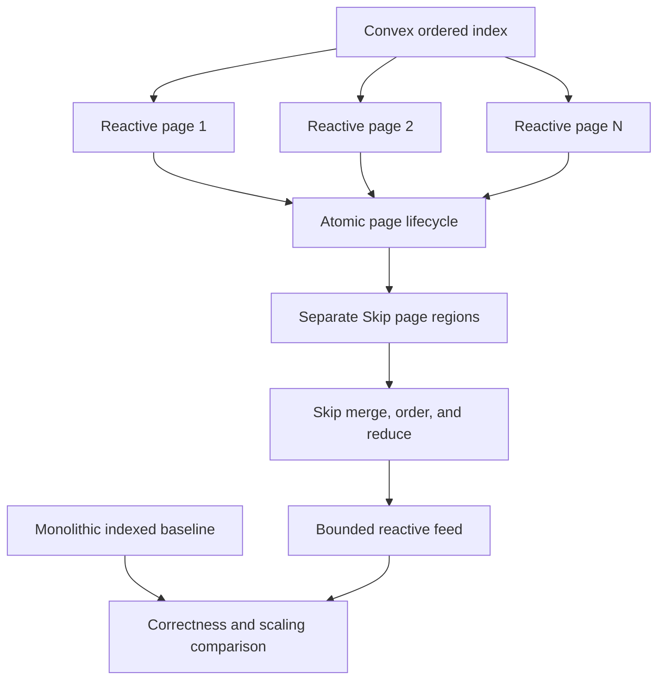

# Skip Paginated Reactive Source Spike - Plan

## Goal Capsule

- **Objective:** Determine whether index-ordered Convex page subscriptions let Skip maintain a correct reactive feed with source-to-Skip steady-state update work governed by affected page size rather than the total loaded result.
- **Means:** Preserve Convex reactive pages as separate Skip input regions, replace split pages atomically, and let Skip merge, order, and reduce the loaded window.
- **Product authority:** The user selected page subscriptions over point-query fan-out and application-defined shards. This plan owns Direction 1b only; the direct client, a backend changefeed, and backend-native Skip remain separate work.
- **Open blockers:** None at product scope. Planning must choose the smallest atomic Skip input representation for page replacement.

---

## Product Contract

### Summary

This spike reshapes a Convex query set into stable, index-ordered reactive pages without changing convex-backend. Each page remains a separate input region through the Skip boundary. Skip combines the pages into a gapless feed and maintains derived values incrementally.

### Problem Frame

Direction 1a consumes each changed Convex query as a full snapshot. If one query returns all loaded messages, a one-row change can make convex-backend rerun that query and send the whole result, after which Skip must inspect the whole snapshot even when most rows are unchanged.

Convex reactive pagination already divides an ordered index range into cursor-bounded queries. A page can grow or shrink as data changes, and `numItems` is only its initial size. Convex returns `splitCursor` and `pageStatus` when the range should or must be divided. Existing pagination clients keep an old page active until both replacement pages load, then swap them to preserve adjacent, non-overlapping results.

The optimization disappears at the Skip boundary if JavaScript concatenates every live page and republishes the complete loaded result. This spike carries page identity and lifecycle into Skip so a changed page can be reconciled without revisiting unaffected pages. It does not claim that Convex emits row-level deltas; Direction 1c owns that capability.

### Key Decisions

- **Use index-ordered page subscriptions.** (session-settled: user-directed — chosen over point-query fan-out and application-defined shards: it reuses Convex's existing reactive pagination while supporting inserts and a changing feed.) Governs R1-R5.
- **Preserve page granularity through the Skip boundary.** JavaScript does not flatten the loaded window before Skip. Governs R3, R8, R14.
- **Publish page replacement atomically.** The old page remains authoritative until all replacements are ready. Governs R4, R5, R9.
- **Measure the trade, not only the win.** Update work, bootstrap work, and live subscription state are reported together. Governs R11-R14.
- **Keep transport independent from Direction 1a.** The spike may use Convex's existing transition-level client surface and does not require a raw sync client. Governs R15.

### Requirements

**Page topology**

- R1. The source query uses an enabled Convex index and reactive pagination to expose an ordered recent-message feed as cursor-bounded pages.
- R2. The experiment loads a configured, bounded prefix of that feed rather than materializing unbounded history.
- R3. Each live page has a stable logical identity and reaches Skip as its own snapshot region; the bridge neither concatenates the complete loaded window nor computes row-level diffs.
- R4. When a page must split, the old page remains active until both replacement ranges have complete results, after which old and new page regions are exchanged in one atomic Skip update.
- R5. A result marked `SplitRequired` is treated as incomplete and is never published as a complete page range.

**Skip computation**

- R6. Skip merges live page regions only after asserting that their Convex document-ID sets are disjoint, then orders messages by the indexed order with `_id` as the deterministic tie-breaker.
- R7. At least one reducer maintains an aggregate over the loaded window with valid add and remove behavior, so the proof exercises Skip's incremental engine rather than only relaying pages.
- R8. A page update dirties only that page's changed keys and their dependent Skip nodes; unchanged pages are not republished to the input graph.

**Correctness and lifecycle**

- R9. At controlled settled checkpoints, the Skip feed and aggregate match an independent monolithic indexed Convex query covering the same loaded prefix across bootstrap, insert, update, delete, page split, load-more, reconnect, and query failure recovery.
- R10. When any required page fails or its cursor becomes invalid, the source retains the last complete window as stale until it rebuilds a coherent page set; it never labels a partial window current.

**Scaling evidence**

- R11. The comparison varies total loaded rows and target page size, records actual page sizes and affected-page counts, and reports the observed update-work terms rather than assuming pages remain exactly at their initial size.
- R12. Counts and timers cover received page results, live and changed pages, query-set additions and removals, rows and bytes delivered, Skip keys reconciled, dependent nodes updated, reducer additions and removals, page splits, rebuilds, end-to-end publication, and any backend query metrics already available to the harness.
- R13. The report compares the paginated source with a monolithic indexed query returning the same logical window and states both steady-state update cost and the bootstrap and subscription-state trade-off.
- R14. A run that republishes all loaded rows to Skip for each page change, omits page-split workloads, or reports only elapsed time without logical-work counts does not pass.

**Isolation from adjacent directions**

- R15. The spike requires transition-grouped query updates from its client harness but does not require Direction 1a's raw WebSocket client, a convex-backend protocol change, or backend-native Skip execution.

<!-- ce-section: work-relationships -->
### How This Work Fits Together

This plan owns Direction 1b: reducing the granularity of existing full-query snapshots by changing the client-visible Convex query topology. The surrounding areas remain separately valuable work, not phases required by this spike.

- Direction 1 — Skip consumes Convex as an external reactive source
  - 1a — Direct sync-protocol client: can provide the transition-grouped transport later, but 1b can proceed independently through an existing transition-level client surface.
  - 1b — Paginated query topology: this plan; shares the 1a correctness harness and Skip atomic-update constraint without requiring its raw socket.
  - 1c — Backend row-level changefeed: can eventually replace page snapshots with actual document changes; it is not required to evaluate page granularity.
- Direction 2 — Backend-native Skip materialized cache: can proceed independently and uses committed changes before the query snapshot boundary.

### Actors

- A1. Convex query runtime — evaluates cursor-bounded indexed page queries and returns split metadata.
- A2. Page lifecycle coordinator — maintains the live page query set and exchanges split pages without gaps.
- A3. Skip runtime — reconciles changed page snapshots and incrementally maintains the combined feed and aggregate.
- A4. Demo viewer — consumes the ordinary ordered feed and sees loading or stale state when the complete window is unavailable.
- A5. Evaluator — drives controlled writes and records correctness and scaling evidence.

### Key Flows

- F1. Steady-state page update
  - **Trigger:** A write changes rows inside one live page range.
  - **Actors:** A1, A2, A3, A4
  - **Steps:** A1 reruns the affected page query. A2 forwards that page snapshot without rebuilding the full loaded window. A3 reconciles the changed keys and updates dependent results. A4 receives the complete ordered feed.
  - **Outcome:** Unchanged pages do not cross the Skip input boundary again.
  - **Covers:** R1-R3, R6-R8.
- F2. Atomic page split
  - **Trigger:** A live page returns a usable `splitCursor` with `SplitRecommended` or `SplitRequired`.
  - **Actors:** A1, A2, A3, A4
  - **Steps:** A2 subscribes to the two replacement ranges while retaining the old page. After both replacements are complete, A2 swaps the three page regions in one Skip update. A3 publishes the same gapless ordered rows once.
  - **Outcome:** Page maintenance never exposes a duplicate, gap, or incomplete required split.
  - **Covers:** R4-R6, R9.
- F3. Comparison run
  - **Trigger:** A5 runs the same controlled workload at another dataset or page size.
  - **Actors:** A1, A3, A5
  - **Steps:** A5 compares the paginated Skip result with the monolithic indexed result at settled checkpoints and records logical-work counts, state size, payload, and timers for both paths.
  - **Outcome:** The report shows where page granularity changes the scaling curve and what subscription or bootstrap cost it introduces.
  - **Covers:** R9, R11-R14.

### Acceptance Examples

- AE1. One-page update
  - **Covers:** R3, R6-R9.
  - **Given:** The loaded feed spans several complete pages and no split is in progress.
  - **When:** One message in the middle page is updated.
  - **Then:** Only that page reaches Skip, the ordered feed matches the monolithic result, and aggregate changes are limited to the affected keys.
- AE2. Head insertion and split
  - **Covers:** R4, R5, R9.
  - **Given:** The first page has grown enough for Convex to recommend or require a split.
  - **When:** A new message arrives and the two replacement page queries load.
  - **Then:** The viewer sees the old complete feed until one atomic replacement publishes the new gapless feed, with no duplicate message IDs.
- AE3. Delete from the loaded window
  - **Covers:** R6-R9.
  - **Given:** A message contributes to the feed and the Skip aggregate.
  - **When:** The message is deleted and its page reruns.
  - **Then:** Skip removes the row and its reducer contribution without republishing unrelated pages.
- AE4. Scaling by loaded rows
  - **Covers:** R11-R14.
  - **Given:** Equivalent datasets with target page size held fixed and progressively more pages loaded.
  - **When:** The same single-page update runs against each dataset.
  - **Then:** The report shows whether delivered rows and Skip reconciliation follow observed affected-page size rather than total loaded rows, while live subscription state and bootstrap work grow with page count.
- AE5. Forced reconnect
  - **Covers:** R5, R9, R10, R12.
  - **Given:** The paginated source has a complete loaded window.
  - **When:** Its connection is replaced and the page query set is rebuilt.
  - **Then:** The viewer retains the last-good value and marks it stale until every required page is complete, and the next current result matches the monolithic baseline.

### Success Criteria

- Every published current result matches the monolithic indexed baseline at its controlled settled checkpoint.
- Page splitting, query failure, and reconnect never publish a complete-looking result with missing or duplicate rows.
- At least one steady-state workload shows delivered rows and Skip reconciliation governed by observed affected-page size rather than total loaded rows.
- The report states the corresponding growth in bootstrap work, live queries, and retained page state; a smaller update path is not presented as a free reduction in total system cost.
- Skip maintains a real reducer across page updates and page replacement, including correct removal behavior.
- Metrics contain both counts and timers, and explain any run whose apparent improvement came from missing work, stale output, or an incomplete page.

### Alternatives Considered

- **Point-query fan-out behind an ID manifest:** A known document update approaches constant-size delivery, but discovering inserts still needs a broader membership query and the live query set grows with document count. Rejected for the first 1b spike because discovery and subscription churn would dominate the page-topology question.
- **Application-defined indexed shards:** Stable buckets avoid cursor choreography, but they require schema and write-path changes and trade shard size against a fixed subscription fan-out. Rejected because reactive pages exercise an existing Convex capability without changing application data.
- **Concatenate pages in JavaScript before writing to Skip:** This can reduce an individual Convex query result while still sending the entire loaded window through Skip reconciliation. Rejected because it breaks the end-to-end granularity this spike measures.
- **Backend row-level change events:** True document deltas remove the page-snapshot compromise. Rejected here because they require convex-backend changes and belong to Direction 1c.

### Scope Boundaries

- No convex-backend code or sync-protocol shape changes are included.
- No claim is made that page snapshots are row-level deltas.
- No point-query manifest, application-defined shard field, or general query-topology planner is included.
- No unbounded history is loaded; the proof owns a configured recent-message window.
- No production client packaging or public Skip adapter API is designed.
- No raw `/api/sync` implementation is required; that remains Direction 1a.
- No backend-native Skip graph, materialized cache, query language, or trigger is included.
- The scaling claim applies to the paginated message path. Any small user lookup source used for display is held constant and reported separately.

### Dependencies / Assumptions

- Convex reactive pagination uses `cursor` and `endCursor` to define adjacent ranges and returns a `splitCursor` when a range should be divided.
- `numItems` is an initial target, not a hard page bound. The experiment must record actual range sizes and honor `SplitRequired` rather than reason from the target alone.
- Sparse post-index filters can scan far more rows than they return. The proof uses an index whose range expresses the feed selection and configures applicable row and byte limits.
- The existing `PaginatedQueryClient` and React pagination code provide lifecycle references, but their concatenated result is not a valid Skip input for R3.
- Atomic replacement of one page with two requires either a combined tagged Skip input domain or a narrowly scoped multi-region atomic update mechanism.
- The current Convex tutorial has a global messages feed rather than rooms. A room-scoped index may be added only if planning deliberately expands the proof vehicle; it is not required for the scaling claim.

### Outstanding Questions

**Deferred to Planning**

- Which target page sizes, loaded-page counts, and dataset sizes make the two scaling axes reproducible?
- Should the harness reuse the transition-level `BaseConvexClient` surface directly or implement the minimal interface needed by `PaginatedQueryClient`?
- Which combined-domain or atomic multi-region representation satisfies R4 with the least Skip Runtime change?
- Which internal metrics can count actual page query executions and rows read without changing backend behavior?
- Which failure injection produces `SplitRequired`, invalid-cursor reset, query failure, and reconnect deterministically?
- Should the proof display author IDs or use a separately measured, fixed-size user lookup source for names?

### Sources / Research

- `docs/plans/2026-09-10-1509-feat-skip-sync-protocol-client-plan.md` — Direction 1a's transition grouping, snapshot reconciliation, failure, and transport boundaries.
- `research/skip-convex-integration/research-convex-reactivity.md` — query invalidation and full-rerun behavior.
- `research/skip-convex-integration/research-skip-engine.md` — Skip collections, mappers, reducers, and incremental maintenance.
- `research/skip-convex-integration/research-skip-atomic-write.md` — current atomic-write constraints at the Skip Runtime boundary.
- `npm-packages/convex/src/server/pagination.ts` — reactive pagination options, split metadata, and row and byte limits.
- `npm-packages/convex/src/server/query.ts` — `paginate` behavior and the warning against unbounded `collect`.
- `npm-packages/convex/src/browser/sync/paginated_query_client.ts` — transition-level page-set maintenance and split replacement.
- `npm-packages/convex/src/react/use_paginated_query.ts` — the existing keep-old-until-replacements-load split behavior.
- `crates/database/src/query/mod.rs` — cursor-bounded index ranges, query fingerprints, and reactive split-cursor construction.
- `crates/isolate/src/environment/udf/async_syscall.rs` — actual page growth and `SplitRecommended` or `SplitRequired` selection.
