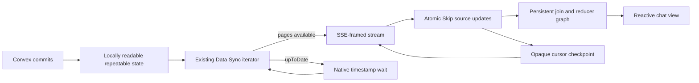

# Skip Data Sync Push Source Spike - Plan

## Goal Capsule

- **Objective:** Determine whether a modest convex-backend change can expose selected Convex documents as a genuine push-reactive Skip source whose steady-state delivery and input work follow changed documents rather than complete query results.
- **Means:** Add an experimental, authenticated, SSE-framed stream over Convex's existing Data Sync snapshot and cursor semantics, suspend it on a native readable-timestamp notification when caught up, and apply its document revisions to a real incremental Skip graph.
- **Product authority:** The user selected a continuous push stream over a blocking request loop and an extension to `/api/sync`. This plan owns Direction 1c only; the client-only source experiments and backend-native Skip remain separate work.
- **Open blockers:** None at product scope. Planning must validate the smallest streaming HTTP surface and the Skip-side atomic input representation before implementation.

---

## Product Contract

### Summary

An external Skip service will connect to an experimental server-to-server Convex endpoint and receive an initial consistent snapshot followed by document upserts and tombstones. The backend will produce the stream by repeatedly advancing the existing Data Sync cursor while work is available, then waiting on Convex's native readable-snapshot notification instead of asking the client to poll.

The Skip service will retain the selected source tables by document ID and incrementally maintain a joined chat feed and grouped reduction. Convex remains authoritative for all writes. The spike will prove document-level delivery, transaction-consistent publication, recovery, and scaling shape; it will not establish a general public changefeed API.

### Problem Frame

Convex's `/api/sync` protocol is push-reactive, but its result updates are produced after an invalidated query has run again. Even when the wire result is patched, it is not a database row-change stream, so a broad query can still impose work based on its complete result.

Convex already has a stronger starting point for an external document source. `/api/v1/data/sync` provides table selection, document revisions and tombstones, table truncations, opaque resumable cursors, paged initial snapshot construction, and a continuous CDC phase. During CDC it does not split a transaction across pages. The caller must currently issue another HTTP request for every page and periodically poll after `upToDate`.

Direction 1c changes that last delivery step, not the capture model. While pages are immediately available, the backend drains them into one streaming response. At `upToDate`, it suspends on the same locally readable repeatable-snapshot progression that the application supplies as the floor for the next Data Sync page. This is genuine backend push: a client timer does not manufacture reactivity, and a wake-up cannot be lost between checking the cursor and registering the wait.

The live application supplies Data Sync with its latest locally readable repeatable snapshot, while the low-level iterator can otherwise advance from persistence's maximum repeatable timestamp. The spike must measure the actual commit-to-readable and readable-to-delivered delays rather than assume `/api/sync`-equivalent freshness or a fixed persistence delay. Data Sync selection is also table- and column-granular, not row-granular, so initial transfer and retained Skip source state grow with all selected documents even when the derived output is bounded.

### Key Decisions

- **Use an SSE-framed Data Sync stream.** (session-settled: user-selected — chosen over blocking Data Sync requests and extending `/api/sync` because it provides one continuous server-pushed response while reusing the existing document-sync contract.) Governs R1-R5.
- **Wake on locally readable repeatable progress.** The caught-up stream waits on the backend notification advanced with the snapshot state the next application-level Data Sync page can use; a periodic client or server timer is not a data-delivery mechanism. Governs R3, R4, R17.
- **Reuse Data Sync correctness and recovery.** Snapshot status, truncations, document timestamps, opaque cursors, retention errors, and table selection remain the source contract rather than being reimplemented from the write log. Governs R2, R6-R11.
- **Accept at-least-once delivery.** A cursor advances durably for the consumer only after the corresponding Skip update succeeds; reconnect may replay work, which must be idempotent. The spike does not claim exactly-once processing across two systems. Governs R8-R10.
- **Keep selection fixed for a connection.** The proof registers the `messages` and `users` tables when the stream opens. Changing the selection requires a new connection and resynchronization. Governs R2, R6, R19.
- **Exercise Skip's incremental engine.** Document changes feed a persistent join and reducer graph rather than being relayed unchanged to the viewer. Governs R12-R16.
- **Measure asymptotic work and freshness together.** Logical counts establish the scaling result, while timers reveal the cost of persisted-repeatable delivery and recovery. Governs R14-R18.

### Why This Is Effective and Minimally Invasive

The approach is effective because Data Sync crosses the external boundary with document revisions instead of recomputed query snapshots. Once the source is initialized, a transaction changing `K` selected documents sends those document changes to Skip. Skip can then maintain keyed state, joins, and reductions with work governed by the changed keys and their affected fan-out instead of reconciling a result containing `N` rows. Bootstrap and retained source state remain proportional to `N`, and a high-fan-out join can still cost proportionally to that fan-out; the experiment reports both limits.

The backend change is narrow because Convex already owns the difficult parts: a consistent initial snapshot, CDC iteration, transaction page boundaries, selection reconciliation, tombstones, encrypted cursors, retention validation, authorization, and usage accounting. The new surface adds streaming framing, backpressure, cancellation, and a narrow wait-for-readable-progress path around the existing page operation. It does not alter authoritative storage, writes, query evaluation, `/api/sync`, or Skip execution inside convex-backend.

### Requirements

**Push transport**

- R1. An experimental authenticated server-to-server endpoint returns a versioned SSE-framed HTTP response consumable by the Skip service with streaming `fetch`; it retains Data Sync's streaming-export enablement and `deployment:data:view` authorization requirements.
- R2. The opening request supplies an optional opaque Data Sync cursor and one fixed selection for the connection. The proof selection includes all columns of the Convex tutorial's `messages` and `users` tables and excludes unrelated tables and components.
- R3. The backend emits available Data Sync pages without a request round trip. After an `upToDate` page, it waits for the repeatable snapshot to advance beyond that page's `snapshotTs`, rechecks Data Sync, and resumes emission without a polling interval.
- R4. The wait path is race-free and cancellation-safe. Heartbeats may preserve transport liveness but cannot trigger a data read or be counted as source reactivity.
- R5. Streaming output has a bounded page and byte backlog. A consumer that cannot keep up is disconnected or otherwise forced to resume from its last applied cursor rather than causing unbounded backend memory growth.

**Snapshot, atomicity, and recovery**

- R6. Cold start builds selected source state in a staging generation while status is `snapshotting`. No derived result is labeled current until the first `stale` or `upToDate` page establishes a consistent snapshot.
- R7. The consumer applies every table truncation before values from the same page. If table replacement returns an established sync to `snapshotting`, it preserves the last-good published result as stale while a complete candidate generation is rebuilt and then promotes that generation atomically.
- R8. During normal CDC, the consumer groups page values by Convex revision timestamp and applies every upsert and tombstone from one transaction to Skip atomically before publishing its derived effects. A page may contain several transactions, but Data Sync's no-split transaction guarantee is preserved.
- R9. The client records a page's opaque next cursor only after all of that page's Skip updates succeed. Replayed revisions and tombstones are idempotent, and per-document revision ordering prevents an older replay from replacing newer retained state.
- R10. A transport reconnect resumes from the last applied cursor. A process restart that loses process-local Skip state starts a fresh snapshot; an expired or invalid cursor also starts a fresh snapshot. Both paths retain a last-good result only when that state still exists, mark it stale, and count the resynchronization reason.
- R11. Disconnects, authorization failures, malformed events, unsupported stream versions, cursor failures, and Skip apply failures never advance the published freshness watermark or present a partial candidate as current.

**Incremental Skip proof**

- R12. The source stores selected Convex documents under stable `(component, table, _id)` keys, preserves their revision timestamps, and represents deletions as removals with sufficient revision metadata for replay safety.
- R13. The Skip graph joins each message's validated user ID to the selected user row, preserves the tutorial's `"Unknown"` behavior for a missing user, orders a bounded recent-message output deterministically, and incrementally maintains at least one grouped message-count reduction.
- R14. Inserts, updates, deletes, a user rename, a missing user, and a multi-document transaction propagate through Skip's retained mapper, join, ordering, and reducer state. Republishing all selected rows or recomputing the reduction from scratch on each change does not pass.

**Correctness, freshness, and scaling evidence**

- R15. A comparison harness drives deterministic writes, pauses writes at settled checkpoints, and compares the current Skip result with an independent native Convex query over the same logical data. It covers bootstrap, CDC, reconnect before and after apply, duplicate delivery, stream cancellation, table replacement, cursor expiry, and Skip-process restart.
- R16. The scaling comparison varies total selected rows `N`, changed selected documents per transaction `K`, and affected join fan-out `F`. It reports whether steady-state external payload and Skip input work follow `O(K)` and derived update work follows `O(K + F)`, versus a monolithic reactive query snapshot containing `O(N)` rows; it also reports the unavoidable `O(N)` bootstrap and retained source state.
- R17. Counts cover native wake-ups, empty and non-empty Data Sync pages, snapshot and CDC pages, document-log rows examined when available, selected revisions and bytes emitted, transactions, truncations, reconnects, replayed or ignored revisions, cursor resets, Skip keys added/changed/removed, dependent nodes updated, reducer additions/removals, current publications, and stale intervals.
- R18. Timers cover mutation acknowledgment to readable repeatable progress, repeatable progress to stream emission, stream receipt to atomic Skip apply, Skip apply to derived publication, end-to-end mutation acknowledgment to publication, snapshot duration, reconnect recovery, and stale duration. The report distinguishes logical Convex timestamps from wall-clock latency and explains empty wake-ups and unrelated-log scan work.

**Isolation from adjacent directions**

- R19. The spike is an administrative export source, not an ordinary browser subscription. It does not design per-user authorization, row-level access control, effectful triggers, writes through Skip, or a final public protocol.
- R20. Direction 1c neither requires nor modifies Direction 1a's raw `/api/sync` client, Direction 1b's page topology, or Direction 2's backend-owned Skip materialized cache.

<!-- ce-section: work-relationships -->
### How This Work Fits Together

This plan owns Direction 1c: a modest backend change that exports actual document revisions to an external Skip service. The neighboring directions answer different questions and remain independently executable.

- Direction 1 — Skip consumes Convex as an external reactive source
  - 1a — Direct sync-protocol client: receives transaction-grouped full-query results without backend changes.
  - 1b — Paginated query topology: bounds individual query snapshots using existing reactive pagination without backend changes.
  - 1c — Data Sync push source: this plan; adds a backend streaming surface so Skip receives document changes rather than query snapshots.
- Direction 2 — Backend-native Skip materialized cache: embeds a derived Skip subsystem inside convex-backend and keeps the ordinary Convex query API. It does not depend on this external stream.

Direction 1c can later be judged against 1a and 1b as a source-granularity trade-off, but neither client-only spike is an implementation prerequisite. The existing Data Sync API is the protocol and correctness foundation for 1c.

### Actors

- A1. Convex Data Sync subsystem — selects tables, builds consistent snapshots, advances CDC cursors, and emits document revisions, tombstones, and truncations.
- A2. Push-stream endpoint — drains immediately available pages, waits on native repeatable progress when caught up, enforces authorization and backpressure, and frames stream events.
- A3. Skip source client — validates events, stages snapshots, applies transaction groups, and checkpoints the last applied cursor.
- A4. Skip incremental graph — retains selected documents and maintains the joined feed and grouped reduction.
- A5. Evaluator — drives writes and failures, compares native and Skip results, and records correctness, freshness, and scaling evidence.

### Key Flows

- F1. Cold snapshot and activation
  - **Trigger:** A3 opens a stream without a cursor.
  - **Actors:** A1, A2, A3, A4
  - **Steps:** A2 drains Data Sync pages. A3 applies truncations and revisions to a staging generation while status remains `snapshotting`. At the first consistent status, A3 atomically activates the generation and A4 publishes its derived result.
  - **Outcome:** No incomplete initial traversal is exposed as a current reactive view.
  - **Covers:** R1-R7, R11-R13.
- F2. Caught-up reactive change
  - **Trigger:** A1 reports `upToDate`, then Convex advances to a newer readable repeatable timestamp.
  - **Actors:** A1, A2, A3, A4
  - **Steps:** A2 wakes without a poll, advances the existing cursor, and emits selected revisions. A3 applies each timestamp group atomically and checkpoints the page cursor. A4 updates only the affected join and reduction dependencies.
  - **Outcome:** A document change reaches a correct Skip-derived view without rerunning and transmitting a full Convex query result.
  - **Covers:** R3-R5, R8-R9, R12-R14.
- F3. Disconnect and replay
  - **Trigger:** The stream ends after a page was sent but before A3 records its cursor.
  - **Actors:** A2, A3, A4
  - **Steps:** A3 marks the last-good result stale, reconnects with its prior applied cursor, receives the page again, ignores or safely reapplies duplicate revisions, records the cursor, and resumes current publication.
  - **Outcome:** Recovery is at-least-once, gap-free, and does not double-count reducer input.
  - **Covers:** R5, R8-R11, R15, R17-R18.
- F4. Scaling run
  - **Trigger:** A5 repeats a controlled change at another `N`, `K`, or `F`.
  - **Actors:** A1, A3, A4, A5
  - **Steps:** A5 records source scan and delivery counts, Skip dependency work, state, and stage timers for the push source and a monolithic snapshot baseline, then verifies both outputs at a settled checkpoint.
  - **Outcome:** The report separates the steady-state document-delta advantage from bootstrap, retained-state, scan, and freshness costs.
  - **Covers:** R15-R18.

### Acceptance Examples

- AE1. One-message update after catch-up
  - **Covers:** R3, R8, R12-R18.
  - **Given:** The stream is `upToDate` with `N` selected messages and users retained by Skip.
  - **When:** One mutation changes one message.
  - **Then:** The native notification wakes the stream, one selected revision reaches Skip, the affected joined row and reduction update correctly, and the payload and input counts do not grow with `N`.
- AE2. Atomic multi-document transaction
  - **Covers:** R8, R11, R14-R15.
  - **Given:** A transaction changes a user and multiple messages that reference that user.
  - **When:** Data Sync emits the transaction among one or more transactions in a page.
  - **Then:** Skip never publishes a state with only part of that transaction, and its settled result matches the native query.
- AE3. Disconnect before checkpoint
  - **Covers:** R5, R9-R11, R15, R17.
  - **Given:** A page has arrived but its cursor has not been recorded as applied.
  - **When:** The connection is terminated and resumed from the prior cursor.
  - **Then:** Replayed upserts and tombstones do not duplicate rows or reducer contributions, no changes are lost, and replay metrics identify the event.
- AE4. Table replacement during a live sync
  - **Covers:** R6-R7, R10-R11, R15, R17-R18.
  - **Given:** Skip is serving a current result from an established stream.
  - **When:** A selected table is replaced and Data Sync emits its truncation and returns to `snapshotting`.
  - **Then:** The prior result is marked stale, all new pages build a candidate generation, and only a complete consistent generation replaces it.
- AE5. Scaling by selected state and fan-out
  - **Covers:** R14-R18.
  - **Given:** Equivalent datasets vary total selected documents while a one-message change stays fixed, followed by datasets that vary the number of messages affected by one user change.
  - **When:** The harness repeats each change against the push source and monolithic snapshot baseline.
  - **Then:** The report shows constant-size source delivery for the fixed change, fan-out-sensitive derived work for the user change, linear bootstrap and retained state, and any backend scan amplification separately.
- AE6. Slow consumer
  - **Covers:** R5, R9-R11, R15, R17-R18.
  - **Given:** A3 stops consuming while Convex continues to commit selected changes.
  - **When:** The bounded stream backlog is exhausted.
  - **Then:** The backend does not accumulate an unbounded queue; the connection is recovered from the last applied cursor or by a measured full resnapshot, and no partial state is called current.

### Success Criteria

- No test in the correctness and recovery matrix publishes a partial snapshot, a transaction-torn result, a lost change, a double-counted replay, or a current result whose cursor was not fully applied.
- Once caught up, selected changes reach the Skip source through a native backend wake-up and continuous response; neither the client nor the endpoint periodically polls Data Sync for data.
- The proof performs a real incremental join and grouped reduction, and its steady-state delivered revisions and Skip input work follow the changed set rather than the full selected state for at least one scaling axis.
- The report shows bootstrap work, retained Skip source state, affected fan-out, backend scan amplification, and repeatable-timestamp latency alongside the favorable steady-state curve.
- Counts and timers make every reconnect, replay, resnapshot, truncation rebuild, stale interval, empty wake-up, and correctness mismatch attributable.
- The finished spike states whether the narrow push surface is worth hardening, which Data Sync semantics would need to become a supported contract, and whether its freshness is suitable for a reactive external source.

### Alternatives Considered

- **Blocking Data Sync request:** Hold one request until data becomes available, return one page, and let the client immediately issue the next request. Rejected because it preserves a request loop and makes continuous delivery and backpressure less direct than the selected stream, even though it would be a smaller HTTP change.
- **Extend `/api/sync` with document changes:** Add a second subscription type to the ordinary Convex WebSocket protocol. Rejected because it would mix administrative table export with user query authentication, query-set lifecycle, optimistic updates, and browser-client compatibility while duplicating Data Sync's snapshot and recovery model.
- **Poll the existing Data Sync API from a Skip adapter:** Repeatedly call `/api/v1/data/sync` and treat changed pages as reactive input. Rejected because client polling is the behavior this direction exists to remove.
- **Expose `LogReader` directly:** Tail the backend's subscription write log and design a new external cursor and snapshot protocol around it. Rejected because that short-retention internal seam would duplicate Data Sync's durable snapshot, CDC, selection, truncation, cursor, and retention behavior.
- **Emit query-result patches:** Reuse `/api/sync`'s `QueryUpdated` or `QueryPatched` messages. Rejected because Convex still reruns the invalidated query before producing those messages; they are not source document deltas.
- **Run Skip inside convex-backend:** Avoid an external stream by maintaining the view in the backend process. Rejected here because that is the separately scoped Direction 2 materialized-cache spike.

### Scope Boundaries

- No production or generally supported public changefeed API is committed by the spike.
- No ordinary browser `EventSource` client is required; the authenticated POST response may be SSE-framed and consumed with streaming `fetch`.
- No user-scoped query authorization or row-level access control is designed.
- No dynamic selection changes occur within a connection.
- No row predicate, index-range selection, or bounded source retention is added to Data Sync; the selected tables are retained in full.
- No exactly-once guarantee spans Convex, the network, and process-local Skip state.
- No durable Skip state or durable two-system cursor transaction is required; a Skip process restart may rebuild from a fresh snapshot.
- No mutation, trigger, or authoritative write originates from Skip.
- No change is made to `/api/sync`, normal Convex query execution, or existing Data Sync response semantics.
- No backend-native Skip graph, Skip-authored UDF, composable Skip query API, or generalized schema-derived view is included.

### Dependencies / Assumptions

- `DataSyncIterator` initial pages are not individually consistent; its first `stale` or `upToDate` status is the activation boundary for the staged source state.
- CDC pages never split a transaction, but their count and byte limits are soft and one large transaction can exceed them. Backpressure and metrics must use actual page sizes.
- Data Sync revisions are ordered per document, and truncations logically precede values in their page.
- The existing public Data Sync format exposes postimages and tombstones, not previous revisions. Skip derives removes from its retained value by ID.
- `SnapshotManager::wait_for_higher_ts` is notified whenever the committer publishes a newer local snapshot, including ordinary commits and persisted maximum-repeatable bumps. `Application::data_sync` constructs every page from `latest_database_snapshot`, whose timestamp becomes the iterator's repeatable floor. Planning must expose a narrow database/application wait method and preserve that alignment without exposing the snapshot manager itself.
- A repeatable-timestamp wake-up can produce no selected changes because the timestamp may advance for unrelated writes or maintenance. The endpoint may advance its in-memory cursor without emitting a data event, but it must remain cancel-safe and observable.
- The Data Sync cursor is opaque, encrypted, and resumable only within retention. Although the existing page API can reconcile selection changes, this spike always reconnects with its original fixed selection and never interprets or manufactures the cursor.
- The Convex tutorial already has `messages.user` validated as an ID of `users` and defines native missing-user behavior, making its `messages` and `users` tables a sufficient two-table correctness proof.
- The Skip examples already demonstrate persistent mappers, joins, reducers, and downstream SSE output; they are implementation references, not substitutes for the Convex source correctness work.

### Outstanding Questions

**Deferred to Planning**

- What experimental route name, request type, stream-version field, and event envelope introduce the least public API commitment?
- Should every Data Sync page be emitted as one event, or should empty `upToDate` advances remain server-local while periodic status events expose freshness?
- What narrow application/database API should pair reading a page with waiting past its `snapshotTs` while preserving the existing lost-wake protection?
- Which bounded buffering and cancellation behavior is already provided by the Axum response body, and what explicit slow-consumer limit is still required?
- What combined Skip input representation applies a timestamp group atomically across the `messages` and `users` collections with the fewest runtime changes?
- How will revision watermarks be represented so a replayed tombstone is idempotent without retaining tombstones indefinitely?
- Which deterministic fault injection produces disconnect-before-checkpoint, cursor expiry, table replacement, and a large transaction that exceeds the nominal page target?
- Which existing database metrics expose document-log rows examined, and which spike-only counters are needed to distinguish selection scan work from emitted rows?
- What `N`, `K`, and `F` values make the complexity curves clear without turning the proof into a machine-specific benchmark?

### Sources / Research

- `crates/streaming_export/src/lib.rs` — public Data Sync wrapper, name-addressed revisions and tombstones, truncations, cursor encryption, status conversion, and authorization.
- `crates/table_iteration/src/data_sync.rs` — initial snapshot and CDC guarantees, transaction page boundaries, cursor atomicity requirement, repeatable-timestamp lag, page limits, and selection iteration.
- `crates/common/src/types/streaming_export/mod.rs` and `selection.rs` — public request, response, selection, status, revision, and truncation shapes.
- `crates/local_backend/src/streaming_export.rs` — `/api/v1/data/sync` authorization, cursor handling, JSON encoding, progress recording, usage accounting, and current polling guidance.
- `crates/application/src/streaming_export.rs` — application boundary that drives one Data Sync page from the latest database snapshot.
- `crates/database/src/snapshot_manager.rs` and `crates/database/src/committer.rs` — repeatable-snapshot waiter and the commit and maximum-repeatable publications that wake it.
- `crates/database/src/write_log.rs` and `crates/database/src/subscription.rs` — existing write-log notification path and why it is an internal subscription seam rather than the external cursor contract.
- `research/skip-convex-integration/research-convex-reactivity.md` — Convex's invalidation and full-query-rerun behavior.
- `research/skip-convex-integration/research-skip-engine.md` — persistent Skip collections, joins, mappers, reducers, and incremental maintenance.
- `research/skip-convex-integration/research-delta-seam.md` and `research-backend-change-hook.md` — earlier candidate backend seams, superseded for this external-source direction by the existing Data Sync contract.
- `docs/plans/2026-09-10-1509-feat-skip-sync-protocol-client-plan.md` — Direction 1a boundaries and transaction-grouped query-result baseline.
- `docs/plans/2026-09-10-1843-feat-skip-paginated-reactive-source-spike-plan.md` — Direction 1b page-granularity baseline and scaling evidence requirements.
- `/Users/bill/src/convex-tutorial/convex/chat.ts` and `schema.ts` — proof query, message-to-user relation, missing-user behavior, and two selected source tables.
- `/Users/bill/src/skip/examples/chatroom/reactive_service/src/chatroom.service.ts` and `/Users/bill/src/skip/examples/convex_reactive/skip/service.ts` — Skip join/reducer and Convex-adapter examples to reuse selectively.
