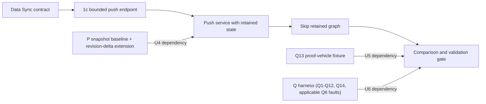
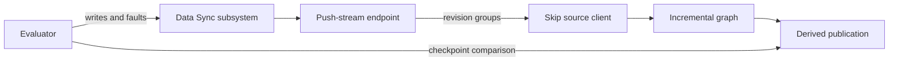
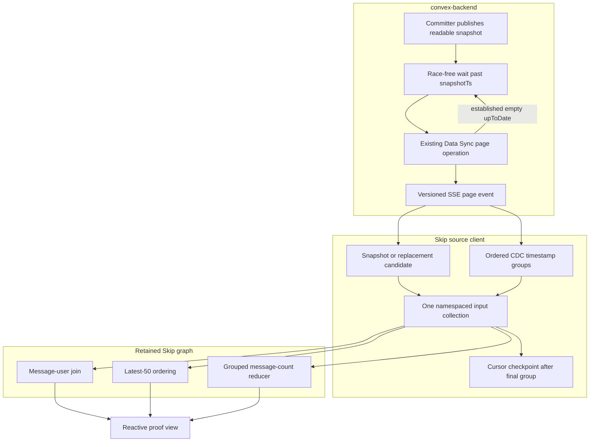
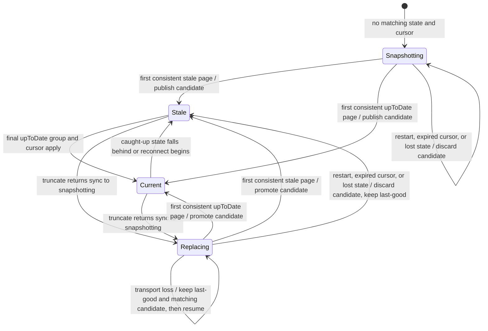
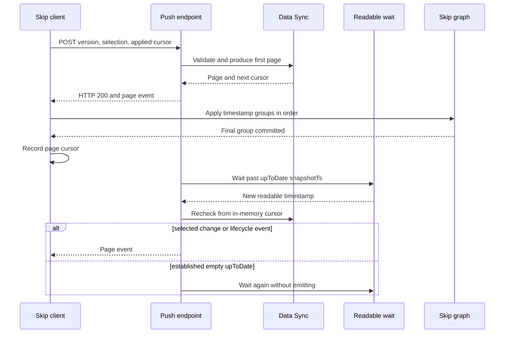

# Skip Data Sync Push Source Spike - Plan

## Goal Capsule

- **Objective:** Determine whether a modest convex-backend change can expose selected Convex documents as a push-reactive Skip source whose steady-state delivery and input work follow changed documents rather than complete query results.
- **Means:** Add an experimental, authenticated Data Sync SSE stream, suspend it on native readable-timestamp notification, and apply document revisions to a retained Skip graph (KTD1, KTD3, KTD7).
- **Product authority:** The user selected a continuous push stream over a blocking request loop and an extension to `/api/sync`. This plan owns Direction 1c only; the client-only source experiments and backend-native Skip remain separate work.
- **Execution profile:** Six dependency-ordered units across `convex-backend`, `skip`, and `convex-tutorial`, each sized for an independently reviewable commit. U4-U6 consume the shared-prerequisites deliverables P and Q rather than hand-building their equivalents.
- **Open blockers:** None at this plan's own scope. **(Noted 2026-09-12; adopted 2026-09-23)** U4, U5, and U6 depend on P and Q from `docs/plans/2026-09-11-1159-feat-skip-shared-prerequisites-plan.md`: U4 on P's snapshot baseline plus its revision-delta extension (P4, P5, P9), U5 on Q13's proof-vehicle fixture, and U6 on Q including Q6's revision-delta fault extension and Q14's no-torn observer. That plan is requirements-only and not yet built. U1-U3 and U4's parser/transport work can start now; U4-U6 are not verified done until P/Q satisfy their test scenarios.
- **Stop conditions:** Stop the spike if Data Sync cannot provide gap-free document revisions at the chosen readable boundary, if deterministic tests cannot eliminate a stream-induced progress wake loop without changing the existing paged endpoint, or if Skip cannot apply a cross-table transaction group atomically without changing its runtime API. **(Added 2026-09-12; revised 2026-09-23)** This plan does not hand-build KTD7-KTD9 or a bespoke comparator/fault-injection core. If P or Q is missing or insufficient when a depending unit reaches its Verification gate, raise the gap as a P/Q defect against the shared-prerequisites plan and hold that unit's verification until it is fixed there; the 2026-09-12 local-fallback option is withdrawn (user decision, 2026-09-23).
- **Tail ownership:** The final unit owns the correctness/scaling report and the recommendation to stop, revise, or harden the experiment.

---

## Product Contract

The Product Contract preserves the requirements-only artifact's scope and stable R/A/F/AE identifiers. R4 is refined around the existing throttled progress model to prevent a delayed self-wake cycle, and R6-R12 are clarified where planning found lifecycle and numeric-precision requirements.

### Summary

An external Skip service will connect to an experimental server-to-server Convex endpoint and receive an initial consistent snapshot followed by document upserts and tombstones. The backend will produce the stream by repeatedly advancing the existing Data Sync cursor while work is available, then waiting on Convex's native readable-snapshot notification instead of asking the client to poll.

The Skip service will retain the selected source tables by document ID and incrementally maintain a joined chat feed and grouped reduction. Convex remains authoritative for all writes. The spike will prove document-level delivery, transaction-consistent publication, recovery, and scaling shape; it will not establish a general public changefeed API.

### Problem Frame

Convex's `/api/sync` protocol is push-reactive, but its result updates are produced after an invalidated query has run again. Even when the wire result is patched, it is not a database row-change stream, so a broad query can still impose work based on its complete result.

Convex already has a stronger starting point for an external document source. `/api/v1/data/sync` provides table selection, document revisions and tombstones, table truncations, opaque resumable cursors, paged initial snapshot construction, and a continuous CDC phase. During CDC it does not split a transaction across pages. The caller must currently issue another HTTP request for every page and periodically poll after `upToDate`.

Direction 1c changes that last delivery step, not the capture model. While pages are immediately available, the backend drains them into one streaming response. At `upToDate`, it suspends on the same locally readable repeatable-snapshot progression that the application supplies as the floor for the next Data Sync page. This is backend push: a client timer does not manufacture reactivity, and a wake-up cannot be lost between checking the cursor and registering the wait.

The live application supplies Data Sync with its latest locally readable repeatable snapshot, while the low-level iterator can otherwise advance from persistence's maximum repeatable timestamp. The spike must measure mutation-acknowledgment-to-readable-observation and readable-to-delivered delays rather than assume `/api/sync`-equivalent freshness or a fixed persistence delay. The former is a local-harness proxy for commit-to-readable delay, not a portable claim about commit timing. Data Sync selection is also table- and column-granular, not row-granular, so initial transfer and retained Skip source state grow with all selected documents even when the derived output is bounded.

### Key Decisions

- **Use an SSE-framed Data Sync stream.** (session-settled: user-directed — chosen over blocking Data Sync requests and extending `/api/sync` because it provides one continuous server-pushed response while reusing the existing document-sync contract.) Governs R1-R5.
- **Wake on locally readable repeatable progress.** The caught-up stream waits on the backend notification advanced with the snapshot state the next application-level Data Sync page can use; a periodic client or server timer is not a data-delivery mechanism. Governs R3, R4, R17.
- **Require progress quiescence.** The stream must not refresh `_data_sync_progress` for an established empty `upToDate` recheck, because the resulting commit and delayed persisted-repeatable bump can otherwise form a self-sustaining wake cycle. First pages, state changes, real progress, and the existing paged endpoint retain their current accounting. Because KTD5 renews every connection at a bounded age and every response's first page records progress, an idle stream's `_data_sync_progress.last_updated` stays at most one connection age stale, well inside the three-day `DATA_SYNC_ACTIVE_WINDOW` used by `list_active_syncs`. Governs R3, R4, R17.
- **Reuse Data Sync correctness and recovery.** Snapshot status, truncations, document timestamps, opaque cursors, retention errors, and table selection remain the source contract rather than being reimplemented from the write log. Governs R2, R6-R11.
- **Accept at-least-once delivery.** The consumer considers a cursor applied only after the corresponding Skip update succeeds; reconnect may replay work, which must be idempotent. The spike does not claim exactly-once processing across two systems. Governs R8-R10.
- **Keep selection fixed for a connection.** The proof registers the Shared proof-vehicle contract's five tables when the stream opens. Changing the selection requires a new connection and resynchronization. Governs R2, R6, R19.
- **Exercise Skip's incremental engine.** Document changes feed a persistent join and reducer graph rather than being relayed unchanged to the viewer. Governs R12-R16.
- **Measure asymptotic work and freshness together.** Logical counts establish the scaling result, while timers reveal readable-snapshot delivery and recovery costs. Governs R14-R18.

### Why This Is Effective and Minimally Invasive

The approach is effective because Data Sync crosses the external boundary with document revisions instead of recomputed query snapshots. Once the source is initialized, a transaction changing `K` selected documents sends those document changes to Skip. Skip can then maintain keyed state, joins, and reductions with work governed by the changed keys and their affected fan-out instead of reconciling a result containing `N` rows. Bootstrap and retained source state remain proportional to `N`, and a high-fan-out join can still cost proportionally to that fan-out; the experiment reports both limits.

The backend change is narrow because Convex already owns the difficult parts: a consistent initial snapshot, CDC iteration, transaction page boundaries, selection reconciliation, tombstones, encrypted cursors, retention validation, authorization, and usage accounting. The new surface adds streaming framing, backpressure, cancellation, and a narrow wait-for-readable-progress path around the existing page operation. It does not alter authoritative storage, writes, query evaluation, `/api/sync`, or Skip execution inside convex-backend.

### Requirements

**Push transport**

- R1. An experimental authenticated server-to-server endpoint returns a versioned SSE-framed HTTP response consumable by the Skip service with streaming `fetch`; it is disabled by default, returns HTTP 404 while disabled, retains Data Sync's streaming-export enablement and `deployment:data:view` authorization requirements, and bounds credential staleness by requiring periodic reconnect and reauthorization.
- R2. The opening request supplies an optional opaque Data Sync cursor and one fixed selection for the connection. The proof selection includes all columns of the Shared proof-vehicle contract's `rooms`, `users`, `memberships`, `messages`, and `likes` tables and excludes unrelated tables and components.
- R3. The backend emits available Data Sync pages without a request round trip. After an `upToDate` page, it waits for the repeatable snapshot to advance beyond that page's `snapshotTs`, rechecks Data Sync, and resumes emission without a polling interval.
- R4. The wait path is race-free and cancellation-safe. After the first emitted page, an established empty `upToDate` recheck (any later unchanged `upToDate` status, with no truncation or lifecycle transition on that recheck itself — see the emission rule in the High-Level Technical Design) does not refresh `_data_sync_progress`; this narrow stream-only rule must prevent one or more idle streams from scheduling a self-sustaining wake loop across progress-throttle and persisted-repeatable-bump periods. A prior truncation or lifecycle transition earlier in the same connection does not disqualify a later, otherwise-established empty recheck from suppression — only a truncation or transition on the recheck being evaluated does. Native maintenance or unrelated-write notifications may still cause measured empty rechecks. Heartbeats may preserve transport liveness but cannot trigger a data read or be counted as source reactivity.
- R5. Streaming output has bounded per-stream page and byte backlogs plus a deployment-scoped active-stream limit. A consumer that cannot keep up is disconnected or otherwise forced to resume from its last applied cursor, and excess connections fail before streaming rather than causing unbounded backend memory or scan work. Emitted pages retain existing Data Sync progress, database-egress, and usage accounting except for the explicit empty-recheck rule in R4.

**Snapshot, atomicity, and recovery**

- R6. Cold start builds selected source state in a staging generation while status is `snapshotting`. The first `stale` page publishes the complete candidate as usable but stale, while the first `upToDate` page publishes it as current; no partial traversal is published.
- R7. The consumer applies every table truncation before values from the same page. If table replacement returns an established sync to `snapshotting`, it clones the last-good state, clears only truncated table namespaces, applies replacement and concurrent revisions to that candidate, and promotes it atomically at the next `stale` or `upToDate` boundary while the prior view remains stale.
- R8. During normal CDC, each exact-`ts` group is this direction's `RevisionDeltaBatch`: it has revision `ts` plus `snapshotTs`, applies every upsert, `_id`-only tombstone, and freshness-control change from one transaction atomically before publication, and never exposes a torn group. A page may contain several transactions, but Data Sync's no-split transaction guarantee is preserved.
- R9. The client records a page's opaque next cursor only after every `RevisionDeltaBatch` in that page succeeds. A generation-bound pending-page ledger and per-document revision watermarks apply only entries newer than retained state, make replays idempotent, and prevent a tombstone from being resurrected after a failure between groups or after a tombstone.
- R10. A transport reconnect resumes from the last applied cursor and retains any matching candidate plus pending-page replay state, including during initial snapshotting. A process restart that loses process-local Skip state starts a fresh snapshot; an expired or invalid cursor also starts a fresh snapshot. Both cold paths retain a last-good result only when that state still exists, mark it stale, and count the resynchronization reason.
- R11. Request failures discovered before the first event remain ordinary HTTP errors, while post-header failures use a versioned terminal error event when framing remains possible. Disconnects, authorization failures, malformed events, unsupported versions, cursor failures, and Skip apply failures never advance the published freshness watermark or present a partial candidate as current.

**Incremental Skip proof**

- R12. The source stores selected Convex documents under stable `(component, table, _id)` keys, carries revision and snapshot timestamps as lossless decimal strings at the JavaScript boundary, and represents deletions as removals with sufficient revision metadata for replay safety.
- R13. The Skip graph implements the Shared proof-vehicle contract's active-membership filter, nullable sender join, deterministic 50-message room feed, and grouped per-message `likeCount` reduction.
- R14. Inserts, updates, deletes, a user rename, membership activation/deactivation, like add/remove, a missing user, and a multi-document transaction propagate through Skip's retained mapper, join, ordering, and reducer state. Republishing all selected rows or recomputing the reduction from scratch on each change does not pass.

**Correctness, freshness, and scaling evidence**

- R15. A comparison harness drives deterministic writes and claims equality only after Q12's four gates: the revision group is applied, the result is published, the independent native oracle for the same logical version is observed, and the freshness disposition is recorded. It covers bootstrap, CDC, reconnect before and after apply, duplicate delivery, stream cancellation, table replacement, cursor expiry, and Skip-process restart.
- R16. The scaling comparison varies total selected rows `N`, changed selected documents per transaction `K`, and affected join fan-out `F` independently across at least three geometric points spanning at least one order of magnitude per varied axis. It reports whether steady-state external payload and Skip input work follow `O(K)` and derived update work follows `O(K + F)`, versus a monolithic reactive query snapshot containing `O(N)` rows; it also reports the unavoidable `O(N)` bootstrap and retained source state. It uses the shared-prerequisites plan's Q11 catalog units (the same units Direction 1b reports through Q) and labels that direction unmeasured rather than requiring a rerun.
- R17. The required core profile records direction-tagged revisions/bytes, atomic revision groups, changed keys, dependent/reducer work, stale duration, and mismatches. Cursor extensions record native wake-ups by observable outcome, stream-suppressed progress refreshes, empty rechecks, pages, document-log rows examined, transactions, truncations, reconnects, replayed/ignored revisions, and cursor resets; no direct efficiency ratio is computed against 1b snapshot rows. The report does not claim an unknowable causal label from a timestamp-only notification.
- R18. Timers cover mutation acknowledgment to readable repeatable progress, repeatable progress to stream emission, stream receipt to atomic Skip apply, Skip apply to derived publication, end-to-end mutation acknowledgment to publication, snapshot duration, reconnect recovery, and stale duration. The report distinguishes logical Convex timestamps from wall-clock latency and explains empty wake-ups and unrelated-log scan work.

**Isolation from adjacent directions**

- R19. The spike is an administrative export source, not an ordinary browser subscription. Its narrowly scoped proof credential comes from the environment and is never written to logs, metrics, fixtures, or result artifacts. Skip proof listeners remain loopback-only or isolated on an equivalent test network, and any non-loopback transport uses TLS; the spike does not design per-user authorization, row-level access control, effectful triggers, writes through Skip, or a final public protocol.
- R20. Direction 1c neither requires nor modifies Direction 1a's raw `/api/sync` client, Direction 1b's page topology, or Direction 2's backend-owned Skip materialized cache.

<!-- ce-section: work-relationships -->
### How This Work Fits Together

This plan owns Direction 1c: a modest backend change that exports actual document revisions to an external Skip service. The neighboring directions answer different questions and remain independently executable.

- Direction 1 — Skip consumes Convex as an external reactive source
  - 1a — Direct sync-protocol client: receives transaction-grouped full-query results without backend changes.
  - 1b — Paginated query topology: bounds individual query snapshots using existing reactive pagination without backend changes.
  - 1c — Data Sync push source: this plan; adds a backend streaming surface so Skip receives document changes rather than query snapshots.
- Direction 2 — Backend-native Skip materialized cache: embeds a derived Skip subsystem inside convex-backend and keeps the ordinary Convex query API. It does not depend on this external stream.

Direction 1c can later be judged against 1a and 1b as a source-granularity trade-off, but neither client-only spike is an implementation prerequisite. The existing Data Sync API is the protocol and correctness foundation for 1c; the shared-prerequisites plan (P and Q) is its source-apply and evidence foundation, shared with 1a and 1b.

**Reconciliation with the shared-prerequisites plan (added 2026-09-12).** This plan was independently deepened to `implementation-ready` on 2026-09-11 without consuming or being consumed by any sibling plan. The same day, a fifth plan — `docs/plans/2026-09-11-1159-feat-skip-shared-prerequisites-plan.md` — identified that this plan's KTD7-KTD9 (a generation-fenced, replay-safe combined-collection write scheme) and U5-U6 (a deterministic-mutation oracle and comparison harness) independently re-derive two pieces of infrastructure every Skip/Convex spike needs: an atomic multi-collection write convention (its "P") and a correctness-comparator plus fault-injection harness (its "Q"). Because this plan is implementation-ready but not yet built — no code exists, only the plan document — this is the cheap point to fix the duplication: after U4/U6 land, unwinding a bespoke implementation onto a shared library costs a rewrite; before they land, this plan can simply consume P and Q as dependencies.

That plan's own Problem Frame also directly resolves this plan's Deferred / Open Questions entry (filed 2026-09-11) asking whether Skip's `ExternalService` supports KTD7-KTD8's staging/atomicity design: a direct source read of `skipruntime-ts/core/src/index.ts:476-501,768-782` (HEAD `7973dce6`, 2026-09-10) confirms `CollectionWriter.update`/`ServiceInstance.update` are single-collection-only, and the shipped `~/src/skip/examples/convex_reactive` example proves the single-merged-collection workaround KTD8 already designs. The one-`callbacks.update`-call atomicity KTD8 needs is proven and shipped; only the generation-fencing/replay-ledger bookkeeping around it (KTD7, KTD9) is this plan's own application logic, not an unverified Skip capability. See the Dependencies/Assumptions entry above and the Deferred / Open Questions section for the resolution.

**Sequencing (revised 2026-09-23):** This plan is a direct consumer of P and Q, not an optional adopter. U4 imports P rather than hand-building KTD7-KTD9's staging map, last-good map, and pending-page ledger; P's revision-delta extension (P4, P5, P9) is scoped to this plan's exact requirements because this plan is P's most advanced concrete consumer, so U4 validates P against those requirements rather than inventing a parallel implementation. U5 adopts Q13's proof-vehicle fixture in `convex-tutorial` (five tables, indexes, deterministic mutations with acknowledgment data, bounded native oracle, per-table queries, the all-selected-rows monolithic baseline, V1-V6 corpus loader) instead of adding its own. U6 builds on Q's readiness detector (Q1), dual reader (Q2), comparator (Q3/Q4), recorder (Q5, with Q11's single-authority catalog), Q14's no-torn observer, and the Q6 faults that apply to a Data Sync source (the baseline's disconnect, multi-table transaction, and slow-consumer faults plus the whole revision-delta extension); it supplies only the wiring, the `N`/`K`/`F` sweep, and the Data Sync trigger mechanisms for R15's faults (Q7). KTD10's JSONL is expressed in Q11's schema rather than defining its own names. Both P and Q are owned and built by the shared-prerequisites plan; gaps are escalated there, never worked around locally.

### Dependency relations



### Actors and flows



**Cross-document graph maintenance:** When this plan changes, update and revalidate relevant nodes, edges, statuses, and identifier-map rows in [README.md](README.md), [planning-timeline.md](planning-timeline.md), [prerequisites.md](prerequisites.md), [detailed-prerequisites.md](detailed-prerequisites.md), and [IDENTIFIER-MAP.md](IDENTIFIER-MAP.md); then render the affected diagrams and verify their references.

### Actors

- A1. Convex Data Sync subsystem — selects tables, builds consistent snapshots, advances CDC cursors, and emits document revisions, tombstones, and truncations.
- A2. Push-stream endpoint — drains immediately available pages, waits on native repeatable progress when caught up, enforces authorization and backpressure, and frames stream events.
- A3. Skip source client — validates events, stages snapshots, applies transaction groups, and checkpoints the last applied cursor.
- A4. Skip incremental graph — retains selected documents and maintains the joined feed and grouped reduction.
- A5. Evaluator — drives writes and failures, compares native and Skip results, and records correctness, freshness, and scaling evidence.

### Key Flows

- F1. Cold snapshot and activation
  - **Trigger:** A3 opens a stream without a cursor.
  - **Actors:** A1, A2, A3, A4
  - **Steps:** A2 drains Data Sync pages. A3 applies truncations and revisions to a staging generation while status remains `snapshotting`. At the first consistent status, A3 atomically activates the generation and A4 publishes its derived result.
  - **Outcome:** No incomplete initial traversal is exposed as a current reactive view.
  - **Covers:** R1-R7, R11-R13.
- F2. Caught-up reactive change
  - **Trigger:** A1 reports `upToDate`, then Convex advances to a newer readable repeatable timestamp.
  - **Actors:** A1, A2, A3, A4
  - **Steps:** A2 wakes without a poll, advances the existing cursor, and emits selected revisions. A3 applies each timestamp group atomically and checkpoints the page cursor. A4 updates only the affected join and reduction dependencies.
  - **Outcome:** A document change reaches a correct Skip-derived view without rerunning and transmitting a full Convex query result.
  - **Covers:** R3-R5, R8-R9, R12-R14.
- F3. Disconnect and replay
  - **Trigger:** The stream ends after a page was sent but before A3 records its cursor.
  - **Actors:** A2, A3, A4
  - **Steps:** A3 marks the last-good result stale, reconnects with its prior applied cursor, receives the page again, ignores or safely reapplies duplicate revisions, records the cursor, and resumes current publication.
  - **Outcome:** Recovery is at-least-once, gap-free, and does not double-count reducer input.
  - **Covers:** R5, R8-R11, R15, R17-R18.
- F4. Scaling run
  - **Trigger:** A5 repeats a controlled change at another `N`, `K`, or `F`.
  - **Actors:** A1, A3, A4, A5
  - **Steps:** A5 records source scan and delivery counts, Skip dependency work, state, and stage timers for the push source and a monolithic snapshot baseline, then verifies both outputs at a settled checkpoint.
  - **Outcome:** The report separates the steady-state document-delta advantage from bootstrap, retained-state, scan, and freshness costs.
  - **Covers:** R15-R18.

### Acceptance Examples

- AE1. One-message update after catch-up
  - **Covers:** R3, R8, R12-R18.
  - **Given:** The stream is `upToDate` with `N` selected rows from the Shared proof-vehicle contract retained by Skip.
  - **When:** One mutation changes one message.
  - **Then:** The native notification wakes the stream, one selected revision reaches Skip, the affected joined row and reduction update correctly, and the payload and input counts do not grow with `N`.
- AE2. Atomic multi-document transaction
  - **Covers:** R8, R11, R14-R15.
  - **Given:** A transaction changes a membership and multiple likes in the same room.
  - **When:** Data Sync emits the transaction among one or more transactions in a page.
  - **Then:** Q14's no-torn observer records no Skip-published state with only part of that transaction, and its settled result matches the native query.
- AE3. Disconnect before checkpoint
  - **Covers:** R5, R9-R11, R15, R17.
  - **Given:** A page has arrived but its cursor has not been recorded as applied.
  - **When:** The connection is terminated and resumed from the prior cursor.
  - **Then:** Replayed upserts and tombstones do not duplicate rows or reducer contributions, no changes are lost, and replay metrics identify the event.
- AE4. Table replacement during a live sync
  - **Covers:** R6-R7, R10-R11, R15, R17-R18.
  - **Given:** Skip is serving a current result from an established stream.
  - **When:** A selected table is replaced and Data Sync emits its truncation and returns to `snapshotting`.
  - **Then:** The prior result is marked stale, all new pages build a candidate generation, and only a complete consistent generation replaces it.
- AE5. Scaling by selected state and fan-out
  - **Covers:** R14-R18.
  - **Given:** Equivalent datasets vary total selected documents while a one-message change stays fixed, followed by datasets that vary the number of messages affected by one user change.
  - **When:** The harness repeats each change against the push source and monolithic snapshot baseline.
  - **Then:** The report shows constant-size source delivery for the fixed change, fan-out-sensitive derived work for the user change, linear bootstrap and retained state, and any backend scan amplification separately.
- AE6. Slow consumer
  - **Covers:** R5, R9-R11, R15, R17-R18.
  - **Given:** A3 stops consuming while Convex continues to commit selected changes.
  - **When:** The bounded stream backlog is exhausted.
  - **Then:** The backend does not accumulate an unbounded queue; the connection is recovered from the last applied cursor or by a measured full resnapshot, and no partial state is called current.
- AE7. Shared semantic corpus
  - **Covers:** R8-R9, R13-R15.
  - **Given:** Versioned V1-V6 fixtures and their canonical descending expected output.
  - **When:** Each vector reaches a comparison-ready checkpoint.
  - **Then:** V4 directly asserts the 50th/51st boundary and `_id` tie-breaker, V6 final-state equality matches the oracle, and Q14's shared observer, watching exact-`ts` groups, records no torn timestamp group.

### Success Criteria

- No test in the correctness and recovery matrix publishes a partial snapshot, a transaction-torn result, a lost change, a double-counted replay, or a current result whose cursor was not fully applied.
- Once caught up, selected changes reach the Skip source through a native backend wake-up and continuous response; neither the client nor the endpoint schedules a Data Sync read to discover data.
- An idle caught-up stream does not schedule work from its own progress accounting. Deterministic tests span several progress-throttle and persisted-repeatable-bump periods; unrelated writes and native maintenance wakes are counted separately and may still cause empty rechecks.
- The proof performs a real incremental join and grouped reduction, and its steady-state delivered revisions and Skip input work follow the changed set rather than the full selected state for at least one scaling axis.
- The report shows bootstrap work, retained Skip source state, affected fan-out, backend scan amplification, and repeatable-timestamp latency alongside the favorable steady-state curve.
- Counts and timers make every reconnect, replay, resnapshot, truncation rebuild, stale interval, empty wake-up, and correctness mismatch attributable.
- The V1-V6 manifest version and every canonical expected result are recorded with the run; V4's limit/tie assertions and V6's final-state equality pass.
- The finished spike states whether the narrow push surface is worth hardening, which Data Sync semantics would need to become a supported contract, and whether its freshness is suitable for a reactive external source.

### Alternatives Considered

- **Blocking Data Sync request:** Hold one request until data becomes available, return one page, and let the client immediately issue the next request. Rejected because it preserves a request loop and makes continuous delivery and backpressure less direct than the selected stream, even though it would be a smaller HTTP change.
- **Extend `/api/sync` with document changes:** Add a second subscription type to the ordinary Convex WebSocket protocol. Rejected because it would mix administrative table export with user query authentication, query-set lifecycle, optimistic updates, and browser-client compatibility while duplicating Data Sync's snapshot and recovery model.
- **Poll the existing Data Sync API from a Skip adapter:** Repeatedly call `/api/v1/data/sync` and treat changed pages as reactive input. Rejected because client polling is the behavior this direction exists to remove.
- **Expose `LogReader` directly:** Tail the backend's subscription write log and design a new external cursor and snapshot protocol around it. Rejected because that short-retention internal seam would duplicate Data Sync's durable snapshot, CDC, selection, truncation, cursor, and retention behavior.
- **Wake only from selected write-log keys:** Filter native notifications before rechecking Data Sync. Deferred because it couples the spike to an internal, short-retention seam and still needs Data Sync for correctness. Revisit only if measured unrelated-write or maintenance rechecks dominate the proof; use it as a wake hint, never as the external cursor or recovery contract.
- **Emit query-result patches:** Reuse `/api/sync`'s `QueryUpdated` or `QueryPatched` messages. Rejected because Convex still reruns the invalidated query before producing those messages; they are not source document deltas.
- **Run Skip inside convex-backend:** Avoid an external stream by maintaining the view in the backend process. Rejected here because that is the separately scoped Direction 2 materialized-cache spike.

### Scope Boundaries

- No production or generally supported public changefeed API is committed by the spike.
- No ordinary browser `EventSource` client is required; the authenticated POST response may be SSE-framed and consumed with streaming `fetch`.
- No user-scoped query authorization or row-level access control is designed.
- No dynamic selection changes occur within a connection.
- No row predicate, index-range selection, or bounded source retention is added to Data Sync; the selected tables are retained in full.
- No exactly-once guarantee spans Convex, the network, and process-local Skip state.
- No durable Skip state or durable two-system cursor transaction is required; a Skip process restart may rebuild from a fresh snapshot.
- No mutation, trigger, or authoritative write originates from Skip.
- No change is made to `/api/sync`, normal Convex query execution, or existing Data Sync response semantics.
- No backend-native Skip graph, Skip-authored UDF, composable Skip query API, or generalized schema-derived view is included.

### Dependencies / Assumptions

- `DataSyncIterator` initial pages are not individually consistent; its first `stale` or `upToDate` status is the activation boundary for the staged source state.
- CDC pages never split a transaction, but their count and byte limits are soft and one large transaction can exceed them. Backpressure and metrics must use actual page sizes.
- Data Sync revisions are ordered per document, and truncations logically precede values in their page.
- The existing public Data Sync format exposes postimages and tombstones, not previous revisions. Skip derives removes from its retained value by ID.
- `SnapshotManager::wait_for_higher_ts` is notified whenever the committer publishes a newer local snapshot, including ordinary commits and persisted maximum-repeatable bumps. `Application::data_sync` constructs every page from `latest_database_snapshot`, whose timestamp becomes the iterator's repeatable floor; the stream preserves that alignment through a narrow database/application wait method without exposing the snapshot manager itself.
- A repeatable-timestamp wake-up can produce no selected changes because the timestamp may advance for unrelated writes or maintenance. The endpoint may advance its in-memory cursor without emitting a data event, but it must remain cancel-safe and observable.
- `DataSyncProgressModel::update` writes on a status-variant change, caught-up document-count change, or throttle expiry. A progress commit schedules a persisted-repeatable bump, and that delayed bump can arrive after the throttle expires and trigger another unchanged write. The stream therefore preserves ordinary progress recording for its first page and meaningful pages but skips it for established empty `upToDate` rechecks; the existing paged endpoint and progress model remain unchanged.
- The Data Sync cursor is opaque, encrypted, and resumable only within retention. Although the existing page API can reconcile selection changes, this spike always reconnects with its original fixed selection and never interprets or manufactures the cursor.
- The Shared proof-vehicle contract defines the five-table schema, required indexes, missing-user behavior, and native oracle; the tutorial is only a fixture base, not the product contract.
- All shared static fixture indexes, including `messages.by_sender[sender]`, are enabled at start; index staging, incompatibility, and rebuild/fallback lifecycle are Direction 2-only behavior.
- The Skip examples already demonstrate persistent mappers, joins, reducers, and downstream SSE output; they are implementation references, not substitutes for the Convex source correctness work.
- **(Added 2026-09-12, reconciled with the shared-prerequisites plan; corrected 2026-09-12 after round-3 review.)** Skip Runtime's public TypeScript API has no multi-collection batch-write primitive (`CollectionWriter.update`/`ServiceInstance.update` are single-collection-only, confirmed by direct source read and exhaustive grep against `skipruntime-ts` at HEAD `7973dce6`) — this is the same gap KTD8's one-`callbacks.update`-call design works around by merging tables into one tagged collection. `~/src/skip/examples/convex_reactive` already ships and proves that specific workaround (the one-atomic-call primitive itself). The shared-prerequisites plan (`docs/plans/2026-09-11-1159-feat-skip-shared-prerequisites-plan.md`, itself `artifact_readiness: requirements-only` and not yet committed to this repository) proposes extracting this proven primitive into a reusable library, P, additionally scoped to match this plan's stricter generation-fencing/replay-ledger bar (its P9). This narrows, but does not close, the capability question KTD7-KTD9 depend on: the one-atomic-call primitive KTD8 needs is proven and shipped in `convex_reactive`, but the generation-fencing/replay-ledger bookkeeping around it (KTD7, KTD9) is a design this plan originated — it is not yet built or proven anywhere, whether as P or as this plan's own code. U4 imports P once P exists and satisfies U4's own test scenarios; U5 adopts Q13's fixture; U6 builds on the shared correctness-comparator and fault-injection harness, Q (see each unit's Dependencies). If P or Q falls short, the gap is raised against the shared-prerequisites plan rather than hand-built here (Goal Capsule stop conditions). Both P and Q are external to this plan's own execution profile — see How This Work Fits Together for the cross-plan sequencing.

### Sources / Research

- `crates/streaming_export/src/lib.rs` — public Data Sync wrapper, name-addressed revisions and tombstones, truncations, cursor encryption, status conversion, and authorization.
- `crates/table_iteration/src/data_sync.rs` — initial snapshot and CDC guarantees, transaction page boundaries, cursor atomicity requirement, repeatable-timestamp lag, page limits, and selection iteration.
- `crates/common/src/types/streaming_export/mod.rs` and `selection.rs` — public request, response, selection, status, revision, and truncation shapes.
- `crates/local_backend/src/streaming_export.rs` — `/api/v1/data/sync` authorization, cursor handling, JSON encoding, progress recording, usage accounting, and current polling guidance.
- `crates/application/src/streaming_export.rs` — application boundary that drives one Data Sync page from the latest database snapshot.
- `crates/database/src/snapshot_manager.rs` and `crates/database/src/committer.rs` — repeatable-snapshot waiter and the commit and maximum-repeatable publications that wake it.
- `crates/database/src/write_log.rs` and `crates/database/src/subscription.rs` — existing write-log notification path and why it is an internal subscription seam rather than the external cursor contract.
- `research/skip-convex-integration/research-convex-reactivity.md` — Convex's invalidation and full-query-rerun behavior.
- `research/skip-convex-integration/research-skip-engine.md` — persistent Skip collections, joins, mappers, reducers, and incremental maintenance.
- `research/skip-convex-integration/research-delta-seam.md` and `research-backend-change-hook.md` — earlier candidate backend seams, superseded for this external-source direction by the existing Data Sync contract.
- `docs/plans/2026-09-10-1509-feat-skip-sync-protocol-client-plan.md` — Direction 1a boundaries and transaction-grouped query-result baseline.
- `docs/plans/2026-09-10-1843-feat-skip-paginated-reactive-source-spike-plan.md` — Direction 1b page-granularity baseline and scaling evidence requirements.
- `docs/plans/2026-09-11-1159-feat-skip-shared-prerequisites-plan.md` — source of the P `AtomicSourceBatch` contract and revision-delta extension (KTD7-KTD9's dependency, U4), the Q13 proof-vehicle fixture (U5's dependency), and the Q comparator/fault-injection harness and Q11 metric schema (U6's and KTD10's dependency); its Problem Frame's direct source verification of `skipruntime-ts/core/src/index.ts` resolves this plan's own KTD7-KTD8 capability question at the one-atomic-call level (see Deferred / Open Questions).
- `research/skip-convex-integration/research-data-sync-source.md` — Data Sync contract reused by the push stream (snapshot/CDC, revisions/tombstones/truncations, cursors, retention, selection, status, authz).
- `research/skip-convex-integration/research-push-stream-seam.md` — push-stream seam design: readable-timestamp wait with lost-wake protection, bounded SSE framing, cursor-after-apply checkpointing.
- `research/skip-convex-integration/research-atomic-source-batch.md`, `research/skip-convex-integration/research-logical-checkpoint-contract.md`, `research/skip-convex-integration/research-semantic-test-vectors.md`, `research/skip-convex-integration/research-core-metric-profile.md`, and `research/skip-convex-integration/research-static-vs-dynamic-indexes.md` — revision-delta, checkpoint, corpus, metric, and static-index requirements reconciled with this direction.
- `docs/plans/2026-09-11-1159-feat-skip-shared-prerequisites-plan.md` — the shared five-table proof vehicle, canonical feed, oracle projection, and required indexes used by all four spikes.
- `skip: examples/chatroom/reactive_service/src/chatroom.service.ts` and `examples/convex_reactive/skip/service.ts` — Skip join/reducer and Convex-adapter examples to reuse selectively.
- [Skip external services](https://skiplabs.io/docs/externals) — `ExternalService` is the supported custom reactive-source extension point; `PolledExternalService` is a separate polling helper and is not used here.
- [Skip introduction](https://skiplabs.io/docs/introduction) — retained collections, mappers, and reducers are the basis of the incremental-work claim.
- [Axum SSE response](https://docs.rs/axum/0.8/axum/response/sse/index.html) — native `Sse`, `Event`, and `KeepAlive` framing for the repository's Axum 0.8 line.

---

## Planning Contract

### Repository Boundaries

This plan coordinates three repositories. Paths below are relative to the repository label that precedes them.

- `convex-backend` — this plan's repository; owns Data Sync statistics, the readable-timestamp wait, and the experimental stream.
- `skip` — owns the push `ExternalService`, retained graph, example, and comparison harness.
- `convex-tutorial` — hosts the shared-prerequisites plan's Q13 proof-vehicle fixture (deterministic mutations, independent native oracle, baseline queries), which this plan consumes and extends only with 1c-specific proof support.

Apart from the shared-prerequisites P and Q packages that U4-U6 import, no unit requires a source dependency between these repositories. The stream contract is the boundary. The backend owns the canonical version-1 fixture corpus, the Skip adapter vendors a byte-identical copy for standalone tests, and the cross-repository harness verifies their manifests and contents before an integration run.

### Output Structure

The new Skip proof stays separate from the existing query-snapshot example:

```text
skip/
  skipruntime-ts/adapters/convex/src/
    data_sync_push.ts
    data_sync_push.test.ts
  skipruntime-ts/adapters/convex/testdata/data_sync_stream/v1/
    manifest.json
    *.json
  examples/convex_data_sync_push/
    package.json
    README.md
    RESULTS.md
    shared/model.ts
    skip/server.ts
    skip/service.ts
    skip/service.test.ts
    bench/compare.ts
    bench/compare.test.ts
    bench/verify_protocol_fixtures.ts
```

### Key Technical Decisions

**Backend stream**

- KTD1. **Use a default-off undocumented POST route with native Axum SSE framing.** Add `/api/data_sync_stream` to `streaming_export_routes()` behind a spike knob that returns HTTP 404 while disabled. Keep its request and event types local to `local_backend`; use Axum 0.8 `Sse`, `Event`, and `KeepAlive`, and leave the platform OpenAPI and existing `DataSyncResponse` unchanged. (session-settled: user-directed — chosen over a blocking request loop and `/api/sync` extension because one authenticated response can drain Data Sync and then block on native progress.)
- KTD2. **Finish first-page preflight before HTTP 200 and always emit that page.** Authenticate, validate the fixed selection and version, decrypt and validate the opening cursor, produce the first Data Sync page, record required initial progress/audit data, convert it, and serialize its event before committing response headers. The first page of every response is emitted even when it is an unchanged empty `upToDate` page; suppression applies only to later rechecks in that response. Later failures use a terminal version-1 `error` event containing a stable code and retryable flag when framing is still possible; an incomplete frame or abrupt EOF is a transport failure.
- KTD3. **Wait strictly past the page's readable timestamp through a narrow database API.** Add a `Database` wait operation that registers under the snapshot-manager lock and awaits after releasing it, then expose it through `Application`; do not expose `SnapshotManager` or add a timer-driven data read. Preserve existing progress behavior for the paged endpoint and for a stream's first or meaningful pages, return whether recording inserted, updated, or was throttled, and omit recording for later established empty `upToDate` rechecks. Deterministic one- and two-stream tests must exercise the real committer schedule across several progress-throttle and persisted-repeatable-bump periods.
- KTD4. **Bound each producer and the deployment aggregate.** A producer task sends through a capacity-one Tokio channel and stops after 30 seconds blocked on a full channel. The nominal queued-event budget is 64 MiB, matching `DATA_SYNC_PAGE_BYTES_LIMIT`; one transaction/page that exceeds it is admitted alone, measured as an overrun, and no later page is built until it drains. The response keeps at most one encoded queued event and one event being produced, so peak stream-owned encoded storage is approximately two actual events rather than one nominal limit and may include one measured oversized event. A deployment-scoped semaphore admits four active streams by default, rejects saturation with HTTP 429 before headers, and releases its permit on every close path.
- KTD5. **Reauthorize by ending streams at a bounded age.** A connection accepts the same server-to-server credentials as Data Sync, sends heartbeats every 15 seconds without reading data, and sends a version-1 `reconnect` control event before closing at a default age of 15 minutes. The proof supplies a narrowly scoped credential through the environment and redacts authorization headers and request values from diagnostics. Connection age, heartbeat interval, send timeout, and nominal queued bytes are spike knobs; client disconnect, slow-consumer timeout, age renewal, backend `zombify_rx`, and fatal stream error remain distinct close causes.

**Wire and Skip consumer**

- KTD6. **Use a stream-specific lossless timestamp representation.** Version-1 `page` events preserve the existing Data Sync page fields but encode every revision `ts` and status `snapshotTs` as canonical decimal strings. The page cursor remains inside the event payload rather than the SSE `id`, and existing `/api/v1/data/sync` JSON numbers remain unchanged.
- KTD7. **Model ingestion as a generation-fenced state machine, via the shared envelope library P.** Cold snapshot pages build a private candidate; a first consistent page publishes it once. A replacement clones last-good state, clears only truncated tables, and promotes a complete candidate. Ordinary CDC applies timestamp groups in order, and a page-local replay ledger keeps the cursor behind until the final group succeeds. Connection generations reject late events from an older response. (Reconciled 2026-09-12: U4 imports and configures P — `docs/plans/2026-09-11-1159-feat-skip-shared-prerequisites-plan.md`, P9 — rather than hand-building this state machine; U4 validates P's generation-fencing and replay-ledger behavior against this description and this plan's own test scenarios, it does not re-derive them.)
- KTD8. **Put documents and source-control metadata in one Skip collection, via P.** Use tagged keys for `(component, table, _id)` plus a reserved control namespace. One `callbacks.update` call can therefore apply every affected table and freshness state atomically for a Convex transaction. Snapshot promotion uses one replacement update; mapper stages split this collection into rooms, users, memberships, messages, likes, and control state without a Skip runtime change. (Reconciled 2026-09-12: this is P's `RevisionDeltaBatch` external helper and split-mapper mapping, P1-P3; the underlying one-atomic-call primitive is proven and shipped in `~/src/skip/examples/convex_reactive`, not an unverified capability — see Dependencies/Assumptions.)
- KTD9. **Retain replay watermarks only as long as their checkpoint risk exists, via P.** Live rows carry their latest revision, while deleted-key watermarks and the pending-page ledger remain generation-scoped until the containing page cursor is recorded. A process that loses that state discards its cursor and starts cold; a table truncation clears the affected candidate rows and watermarks, not unaffected tables. (Reconciled 2026-09-12; revised 2026-09-23: this is P's revision-delta extension — watermark/tombstone convention P4-P5 plus P9's generation-scoped watermarks — which this plan consumes as a direct dependency.)

**Evidence**

- KTD10. **Expose diagnostic facts without expanding the public Data Sync contract.** Add internal page statistics through `DataSyncPage` and `SyncResult`, put per-page diagnostics and server-local stage durations in the experimental event, and emit labeled backend metrics. The single-host harness records its own mutation-acknowledgment, receipt, apply, and publication times; it treats acknowledgment-to-readable observation as an approximate local proxy and never subtracts unrelated process-monotonic clocks. JSONL is produced by Q's recorder (Q5) and uses the field names and units of the shared-prerequisites plan's Q11 authority (`research-spike-comparison.md`'s shared catalog with `research-core-metric-profile.md`'s required/optional/N-A mapping), so 1a, 1b, and 1c report in one schema; 1c-specific cursor extensions stay direction-tagged. The report judges complexity curves and correctness, not machine-specific latency or allocation thresholds.
- KTD11. **Use two native Convex baselines for different claims.** A bounded native proof query is the settled correctness oracle for the Skip outputs, while an all-selected-rows query is the monolithic `O(N)` snapshot transport baseline. Both come from the shared-prerequisites plan's Q13 fixture (its bounded canonical feed query and its all-selected-rows monolithic baseline); U5 adds only what 1c needs beyond them. This avoids pretending the tutorial's bounded `getMessages` result grows with the entire source table.

### High-Level Technical Design



The client lifecycle is authoritative for publication and recovery:



The steady-state protocol never uses a timer to discover data:



After the mandatory first page of a response, an established empty `upToDate` page with no truncation and no lifecycle transition advances only the server's in-memory cursor and diagnostics. It neither emits nor records progress. Empty cold or replacement pages, any truncation, and every status transition are emitted and recorded because they can activate, clear, or reclassify the published view.

### Version-1 Stream Contract

- The request contains `version: 1`, one fixed Data Sync selection, and an optional encrypted cursor. Unsupported versions fail before HTTP 200.
- A `page` event contains the lossless page, encrypted next cursor, stream diagnostics, and status. The response always begins with one precomputed `page` event, including for an empty established cursor. One page remains one SSE event, including a soft-limit overrun; a Convex transaction is never split to satisfy transport sizing.
- An `error` event contains `version`, a stable error code, a retryable flag, and a non-sensitive message, then the stream closes. Cursor expiry is non-retryable with the same cursor and directs a cold snapshot; transient backend and transport failures are retryable.
- A `reconnect` event contains `version` and reason `connectionAge`, then closes without changing the client's applied cursor.
- Heartbeats are SSE comments. They carry no cursor or freshness state and never invoke Data Sync.
- The client incrementally decodes UTF-8 and SSE fields across arbitrary chunks, including multiple events per chunk and multiline `data:` fields. It does not fetch or parse the next data event until the current Skip update settles.

### Implementation Sequence

0. **(Added 2026-09-12; revised 2026-09-23)** External prerequisite: P and Q from `docs/plans/2026-09-11-1159-feat-skip-shared-prerequisites-plan.md` reach a stable interface. U4 depends on P's snapshot baseline plus revision-delta extension; U5 on Q13; U6 on Q including Q14 and the Q6 faults that apply to Data Sync (both tiers, excluding the baseline's query-state faults). This plan does not build P or Q and does not gate its own start on them: U1-U3 and U4's parser/transport work proceed in parallel, and U4-U6 may develop against P/Q's specified interfaces before those packages exist. U4-U6's Definition of Done and Verification Contract rows require P/Q integration. There is no local hand-build fallback; a P/Q gap is escalated to the shared-prerequisites plan (Goal Capsule stop conditions).
1. U1 makes backend scan and emission work observable without changing public JSON.
2. U2 adds the native wake and proves progress quiescence across the delayed committer schedule.
3. **(Revised 2026-09-23)** The canonical version-1 wire fixtures and manifest are hand-authored from KTD6's written contract in `convex-backend` (`crates/local_backend/testdata/data_sync_stream/v1/`, U3's fixture directory) before any route exists; U4 vendors a byte-identical copy. U4 then imports P and proves the version-1 parser, lifecycle, and atomic Skip update against that vendored copy before the backend route is built.
4. U3 composes U1 and U2 into the bounded experimental stream and proves that its route output reproduces the canonical corpus; U6's fixture check confirms U4's vendored copy is still byte-identical.
5. U5 adopts Q13's tutorial fixture as the deterministic source, oracle, and monolithic baseline, adding only 1c-specific proof support.
6. U6 imports Q and builds the retained graph, running the end-to-end correctness and scaling comparison.

### System-Wide Impact

- **Data lifecycle:** Convex remains authoritative. Skip holds process-local source state and cursors; losing either forces a new snapshot.
- **Authorization:** The default-off route exposes table-selected administrative data under existing Data Sync enablement and `deployment:data:view`, with bounded credential staleness through reconnect. The proof credential is environment-only and absent from logs and artifacts.
- **Resource use:** Each independent source instance owns one backend stream and one full selected-table copy, subject to the deployment stream limit. Multiple downstream Skip viewers share that external resource through the Skip service graph.
- **Compatibility:** Existing Data Sync and `/api/sync` wire formats do not change. Version 1 is explicitly experimental, and production proxy parity is deferred until the endpoint is considered for hardening.
- **Operations:** New metrics distinguish normal reconnects, faults, empty wakes, progress writes, scan amplification, slow consumers, and oversized pages.

### Risks and Mitigations

| Risk | Consequence | Mitigation |
|---|---|---|
| Readable progress advances for unrelated writes | Empty scans consume backend work | Suppress only established no-op emissions and progress refreshes, count observable wake outcomes and rows examined, and report scan amplification separately from delivered revisions. |
| JavaScript rounds nanosecond timestamps | Transactions merge or replay ordering regresses | KTD6 uses decimal strings and tests adjacent timestamps above `2^53`. |
| A failure occurs between groups in one page | Skip state gets ahead of its stored cursor | KTD7 and KTD9, through P9's pending-page ledger and generation-scoped watermarks, hold the page checkpoint until the final group succeeds. |
| A table replacement resends only one table | A blank candidate drops unaffected tables | Clone last-good state and clear only truncated namespaces before promotion. |
| A slow or abandoned consumer retains memory and work | Backend memory or task count grows without bound | Capacity-one buffering, actual-byte metrics, send timeout, receiver-close cancellation, and backend shutdown selection bound the producer. |
| Valid credentials open many concurrent streams | Aggregate waiters, scans, and queued pages exhaust the deployment | Admit a small configurable number of streams per deployment, reject saturation before headers, and count every rejection and permit release. |
| Long connections outlive credential or enablement changes | Revoked access remains effective too long | The 15-minute maximum connection age forces regular preflight and reauthorization. |
| Progress rows wake one or more idle streams | A progress commit and its delayed repeatable bump can sustain empty work indefinitely | Skip progress recording only for established empty stream rechecks, preserve the ordinary endpoint, and prove quiescence across several real bump/throttle periods with one and two streams. |
| The proof's query baseline is accidentally bounded | The reported `O(N)` contrast is false | KTD11 separates the bounded correctness oracle from an all-selected-rows transport baseline. |
| The local route does not exist in production proxy configuration | A local spike is mistaken for a deployable feature | Document local-backend scope in the result; add private proxy routing only in a hardening follow-up. |

### Deferred to Implementation

- Choose the smallest test-only page-provider or pause hook that can deterministically inject cursor expiry, mid-page failure, replacement, and cancellation. Do not expose it in production APIs.
- Confirm the exact `Sse`, `Event`, and `KeepAlive` methods available in the repository's pinned Axum 0.8.3 before settling helper names.
- The harness starts with `N = 100, 1,000, 10,000`, `K = 1, 10, 100`, and `F = 1, 10, 100`. It may reduce the largest point if local execution is impractical, but it must retain at least three geometric points per varied axis and record the actual parameters.

---

## Implementation Units

### U1. Carry Data Sync page-work diagnostics

- **Goal:** Make iterator scan and emission work available to the experimental stream and comparison report without changing the public Data Sync response.
- **Requirements:** R5, R16-R18.
- **Dependencies:** None.
- **Files:**
  - `convex-backend: crates/table_iteration/src/data_sync.rs` — add internal page statistics and inline unit coverage.
  - `convex-backend: crates/streaming_export/src/lib.rs` — propagate statistics through `SyncResult` and add conversion coverage.
- **Approach:**
  1. Record the scan dimension, persistence rows examined, candidate/selected entries, emitted logical bytes, timestamp groups, truncations, and which soft limit ended the page.
  2. Preserve statistics when tablet-addressed entries become component/table-addressed `SyncEntry` values.
  3. Keep the fields internal and out of `common::types::streaming_export::DataSyncResponse` under KTD10.
- **Patterns to follow:** `DataSyncPage`, `DataSyncIterator::by_id_page`, `DataSyncIterator::ts_page`, and the existing `FunctionUsageStats` propagation in `streaming_export::data_sync`.
- **Execution note:** Add characterization coverage for transaction-boundary and soft-overrun behavior before threading new fields through the wrappers.
- **Test scenarios:**
  - A `by_id` snapshot page reports scanned and emitted documents without labeling document-log work.
  - A CDC page with filtered-out rows reports rows examined separately from selected revisions.
  - Multiple revisions at one timestamp remain one transaction group in the statistics.
  - A transaction exceeding the nominal entry or byte target stays intact and records the overrun cause.
  - Existing cursor, status, truncation, and entry outputs are unchanged when diagnostics are ignored.
- **Verification:** Crate tests show that diagnostic totals describe the existing iterator behavior and that the public Data Sync serialization remains byte-for-byte compatible for fixed fixtures.

### U2. Add readable-timestamp waiting and progress outcomes

- **Goal:** Give the stream a race-free native wake primitive and prove that Data Sync progress bookkeeping reaches bounded quiescence.
- **Requirements:** R3-R5, R17-R18.
- **Dependencies:** None.
- **Files:**
  - `convex-backend: crates/database/src/database.rs` — add the narrow wait and inline tests.
  - `convex-backend: crates/database/src/snapshot_manager.rs` — extend waiter characterization only if the database-level tests cannot cover the race directly.
  - `convex-backend: crates/model/src/data_sync_progress/mod.rs` — return an explicit written-versus-throttled outcome and test deterministic timing.
  - `convex-backend: crates/application/src/streaming_export.rs` — expose the wait, preserve page creation, propagate the progress outcome, and accept the stream-only decision to omit an established empty refresh.
- **Approach:**
  1. Register a wait for a timestamp strictly greater than `snapshotTs` while holding the snapshot-manager lock, then await outside it as required by KTD3.
  2. Keep `Application::data_sync` based on `latest_database_snapshot()` and expose the matching wait through `Application`.
  3. Make progress recording report whether it inserted, updated, was throttled, or was deliberately omitted for an established empty stream recheck. Keep `DataSyncProgressModel` and `/api/v1/data/sync` behavior unchanged.
- **Patterns to follow:** `Database::wait_for_write_ts`, `SnapshotManager::wait_for_higher_ts`, `Database::latest_database_snapshot`, and `DataSyncProgressModel::update`.
- **Execution note:** Use deterministic runtime clocks; elapsed wall time is not acceptable evidence for the quiescence rule.
- **Test scenarios:**
  - A target below the current readable timestamp returns immediately.
  - A wait at the current timestamp blocks and wakes only after a strictly greater timestamp is published.
  - Progress that advances between the caller's page completion and wait registration is not lost.
  - Canceling the wait drops its receiver and a later notification cleans it up without leaking a task.
  - The first stream page records progress, while a later established empty `upToDate` recheck omits progress even after the throttle expires.
  - The existing paged endpoint still records a throttle-expired refresh exactly as before.
  - One idle stream and two idle streams remain blocked across several real committer bump/throttle periods instead of sustaining themselves or one another; native maintenance and unrelated writes remain observable external wake sources.
- **Verification:** Database, model, and application tests demonstrate lost-wake safety, strict timestamp ordering, unchanged paged-endpoint semantics, and deterministic single- and dual-stream quiescence across the real delayed committer schedule.

### U3. Expose the bounded experimental SSE stream

- **Goal:** Serve Data Sync pages continuously, wait natively when caught up, and terminate safely under errors, backpressure, credential age, disconnect, or backend shutdown.
- **Requirements:** R1-R5, R11, R17-R20.
- **Dependencies:** U1, U2, and the canonical version-1 wire fixtures authored from KTD6 in this unit's fixture directory (Implementation Sequence step 3). U3 owns that corpus; it does not depend on U4's vendored copy.
- **Files:**
  - `convex-backend: crates/common/src/knobs.rs` — add spike transport and connection-lifetime knobs.
  - `convex-backend: crates/local_backend/src/streaming_export.rs` — share page conversion, define version-1 local types, precompute the first event, and run the stream loop.
  - `convex-backend: crates/local_backend/src/streaming_export_metrics.rs` — add labeled counters, gauges, and timers.
  - `convex-backend: crates/local_backend/src/lib.rs` — declare the metrics and test modules.
  - `convex-backend: crates/local_backend/src/router.rs` — register `POST /api/data_sync_stream` outside the platform OpenAPI router.
  - `convex-backend: crates/local_backend/src/streaming_export_tests.rs` — add protocol, fault, backpressure, and cancellation integration coverage.
  - `convex-backend: crates/local_backend/testdata/data_sync_stream/v1/` — own the canonical wire fixtures and manifest mirrored by U4.
- **Approach:**
  1. Extract one lossless page-conversion path used by the existing JSON handler and the stream, with a stream-only timestamp representation at the final envelope boundary.
  2. Put the route behind its default-off knob, then complete KTD2 preflight and first-event serialization before constructing the SSE response.
  3. Drain snapshotting and stale pages immediately; after `upToDate`, wait through U2 and apply the emission rule in the High-Level Technical Design.
  4. Run the producer under KTD4 and select every wait, page, and send phase against receiver closure, `zombify_rx`, maximum connection age, and timeout.
  5. Acquire the deployment-scoped stream permit during preflight, reject saturation before headers, and release it on every terminal path.
  6. Track page work from U1, progress outcomes from U2, actual encoded bytes, queue delay, observable wake outcome, connection close cause, admission rejection, and error code under KTD10 without recording credentials.
- **Patterns to follow:** `_data_sync`, `streaming_export_routes`, `crates/local_backend/src/subs/metrics.rs`, `crates/local_backend/src/logs.rs` cancellation selection, and existing `Body::from_stream` response sites. Use the official Axum SSE API cited in Sources.
- **Execution note:** Begin with version, precision, and first-byte error-contract tests; they constrain every later loop decision.
- **Test scenarios:**
  - The default-off route returns HTTP 404; invalid auth, disabled export, unsupported version, invalid selection, cursor ahead, expired cursor, first-page read failure, and first-page serialization failure return the expected HTTP error before SSE headers after the route is enabled.
  - Version-1 page fixtures preserve Convex export values, encode adjacent timestamps above `2^53` as distinct decimal strings, and match U4's vendored fixture manifest byte for byte.
  - Reconnecting with an established caught-up cursor still emits one empty first page before later unchanged pages become suppressible.
  - Snapshotting and stale pages drain without a timer, then `upToDate` blocks until a greater readable timestamp.
  - An unrelated write causes one measured empty recheck and no page event for an established unchanged status.
  - Empty cold start, empty table replacement, truncation-only pages, and status-only transitions are emitted.
  - An established empty recheck does not record progress after the throttle expires, and one or two streams stay quiescent across multiple delayed persisted-repeatable bumps.
  - Across an age renewal, an idle stream's progress row is refreshed by the new response's first page, so `active_syncs` keeps listing it and its `last_updated` is never more than one connection age old.
  - A capacity-one queue never holds more than the planned pages; a large transaction is one exclusive overrun event; a blocked send closes with the slow-consumer cause after the configured timeout.
  - A fifth stream at the default per-deployment limit fails with HTTP 429, and disconnect, timeout, connection-age renewal, stream error, and shutdown each release a permit for a later connection.
  - Dropping the response cancels production while waiting, building a page, and blocked on send.
  - Backend `zombify_rx`, connection-age renewal, and client disconnect produce distinct terminal behavior and metrics.
  - A post-header retryable failure emits one terminal `error` event; a forced partial-frame disconnect is observed as EOF and does not invent a cursor.
  - Existing `/api/v1/data/sync` response fixtures and usage accounting remain unchanged.
- **Verification:** Local-backend integration tests consume the response as a stream, prove native wake-up and bounded memory/task behavior, and account for every termination path without modifying the platform OpenAPI artifact.

### U4. Implement the Skip Data Sync push service

- **Goal:** Convert version-1 stream events into exact, atomic, replay-safe updates of one Skip external resource.
- **Requirements:** R2, R6-R12, R17-R20.
- **Dependencies:** KTD6's version-1 contract and a vendored copy of the canonical wire fixtures authored in `convex-backend` (Implementation Sequence step 3), which allow implementation before a live backend or U3's route exists. **(Reconciled 2026-09-12; revised 2026-09-23)** the shared-prerequisites plan's P (`docs/plans/2026-09-11-1159-feat-skip-shared-prerequisites-plan.md`): the snapshot baseline (P1-P3 contract, split-mapper and order-key helpers, P6-P8) plus the revision-delta extension (P4 watermark idempotency, P5 tombstone/GC, P9 generation fencing and pending-page ledger) for the state machine and bookkeeping KTD7-KTD9 describe. The extension targets this plan's exact bar; if P's interface cannot satisfy a test scenario below, escalate it as a P defect and hold this unit's verification until it is fixed there.
- **Files:**
  - `skip: skipruntime-ts/adapters/convex/src/data_sync_push.ts` — add the streaming transport, parser, and lifecycle wiring around P; import P for the generation-fenced state machine and replay ledger rather than reimplementing them.
  - `skip: skipruntime-ts/adapters/convex/src/data_sync_push.test.ts` — add fake-fetch and real Skip-runtime tests, including validating P's behavior against this unit's own test scenarios below.
  - `skip: skipruntime-ts/adapters/convex/src/index.ts` — export the push service without changing `ConvexExternalService`.
  - `skip: skipruntime-ts/adapters/convex/README.md` — document the experimental server credential, fixed selection, lifecycle, restart behavior, and the dependency on P.
  - `skip: skipruntime-ts/adapters/convex/testdata/data_sync_stream/v1/` — vendor the version-1 wire-format fixtures and canonical manifest for standalone adapter tests (KTD6's envelope framing, distinct from P's own test fixtures).
- **Approach:**
  1. Validate parameters, read the narrowly scoped credential from the environment, and open a POST streaming fetch for the pre-registered `rooms`, `users`, `memberships`, `messages`, and `likes` selection without logging request authorization.
  2. Parse the stream incrementally under KTD6 and serialize delivery through the existing adapter promise-chain and generation-fence patterns.
  3. Import P and configure it for this plan's `(component, table, _id)` keying and per-revision-timestamp-group atomic apply (KTD7-KTD9); validate P's generation-fencing, replay-ledger, and watermark/tombstone behavior against this unit's test scenarios rather than re-deriving that state machine from scratch.
  4. Emit one namespaced collection update per CDC timestamp group and one replacement update per snapshot promotion via P's revision-delta/split-mapper helpers. Keep source lifecycle metadata under reserved keys in the same update.
  5. Reconnect on typed retryable errors, age renewal, and transport EOF with bounded backoff; discard the cursor on expiry or any restart without its matching retained state.
- **Patterns to follow:** `ConvexExternalService` delivery serialization, retry bounds, fake subscriber, and generation fencing in `src/index.ts` and `src/index.test.ts`; Skip's `ExternalService` and `useExternalResource` contracts; the shared-prerequisites plan's P library interface (envelope type, split-mapper, keying/ordering helpers, watermark/tombstone convention).
- **Execution note:** Keep the new source beside the snapshot adapter. Do not retrofit query-snapshot diffing or poll fallback into this class. Do not hand-build a second generation-fenced state machine alongside P — if P's interface is insufficient for a requirement below, escalate as a P defect against the shared-prerequisites plan rather than duplicating the logic locally.
- **Test scenarios:**
  - The parser accepts events split at every byte boundary, multiple events in one chunk, CRLF, comments, and multiline data; malformed UTF-8 or JSON reports an error without advancing state.
  - Adjacent timestamps above `2^53` remain distinct and correctly ordered.
  - Covers F1. A cold multi-page snapshot produces no partial update and one activation update at its first consistent page.
  - A first `stale` snapshot publishes usable stale state, and the later final group atomically changes control state to current.
  - Covers AE2. One timestamp group changing memberships and likes produces one observable Skip update across every affected table.
  - Failure before the first group, between groups, and after the final update but before cursor assignment replays without lost or double-counted changes.
  - An upsert followed by a tombstone in an uncheckpointed page cannot be resurrected by replay; tombstone metadata is released after checkpoint.
  - Covers AE3. Disconnect before page checkpoint, including during a cold snapshot, retains matching candidate state, resumes from the prior cursor, and ignores already-applied groups.
  - Covers AE4. Replacement clones unaffected tables, clears a truncated table, incorporates concurrent changes, survives replayed truncation, and promotes on both `stale` and `upToDate`.
  - A second replacement during rebuild restarts only the affected candidate generation.
  - A late event from an old connection generation cannot regress data, freshness, or cursor.
  - Two Skip viewers share one external resource, while two independent resource instances open independent streams.
  - Process restart with an old cursor but no retained Skip state starts cold.
- **Verification:** Adapter tests prove every lifecycle transition and failure boundary against fixtures, and a real Skip service instance observes no transaction-torn resource update.

### U5. Adopt the shared proof-vehicle fixture and add 1c proof support

- **Goal:** Make chat changes, transaction grouping, correctness results, and the `O(N)` snapshot baseline reproducible from public tutorial functions, using the shared-prerequisites plan's Q13 fixture rather than a 1c-specific copy.
- **Requirements:** R2, R13-R16, R18-R20.
- **Dependencies:** **(Revised 2026-09-23)** the shared-prerequisites plan's Q13 proof-vehicle fixture (`docs/plans/2026-09-11-1159-feat-skip-shared-prerequisites-plan.md`): five-table schema and indexes, deterministic mutations with acknowledgment data, the all-selected-rows monolithic baseline, bounded canonical native-oracle feed query, per-table baseline queries, and the V1-V6 corpus loader. U5 may be written against Q13's specified interface before Q13 exists, but U5 is not verified until Q13 has landed. If Q13 lacks something a scenario below needs, the addition is made as a Q13 change under the shared-prerequisites plan (with Q13's tests, reviewed with Q by the plan owner), not in a 1c-only commit, and U5 waits for it.
- **Files:**
  - `convex-tutorial: convex/chat.ts` — only 1c-specific proof support not already in Q13. Q13 already supplies mutation acknowledgment data and the all-selected-rows baseline, so none is expected; anything a scenario still lacks is added to Q13 instead.
  - `convex-tutorial: convex/chat.test.ts` — cover the 1c-specific additions; Q13's own tests cover the shared schema, mutations, oracle, and corpus.
- **Approach:**
  1. Keep `getMessages` behavior intact and consume Q13's fixture as-is; add the smallest 1c-specific functions needed to drive each acceptance example.
  2. Use Q13's mutation acknowledgment data to start wall-clock timing without inferring internal Convex timestamps.
  3. Use Q13's bounded proof query as the exact latest-50 room feed oracle and Q13's deliberately monolithic all-selected-rows query for KTD11.
- **Patterns to follow:** Existing `query`, `mutation`, `schema.doc`, `ctx.db.patch`, `ctx.db.delete`, and `convex-test` patterns. Read `convex/_generated/ai/guidelines.md` before implementation as required by the tutorial repository.
- **Execution note:** Preserve application-facing tutorial behavior; harness-only functions should be clearly named and documented as proof support.
- **Test scenarios:**
  - Updating and deleting a message changes the bounded native proof result deterministically.
  - Renaming a user updates every joined message name; deleting the user preserves messages with a `null` sender.
  - Activating or deactivating a membership includes or excludes that sender's messages from the room feed, and adding or deleting a like updates only the message's `likeCount`.
  - One multi-table mutation changes a membership and multiple likes in one Convex transaction and returns deterministic identifiers.
  - More than 50 messages select the latest 50 by descending `_creationTime` and `_id`, then compare both native and Skip results directly in canonical descending order with no display-order normalization.
  - `likeCount` reflects add, remove, delete, and missing liked-user cases.
  - The all-selected-rows baseline contains every selected room, user, membership, message, and like and grows with `N`.
- **Verification:** Tutorial tests establish an independent expected result for every harness mutation and distinguish the bounded correctness oracle from the full snapshot baseline.

### U6. Build the retained graph and comparison harness

- **Goal:** Demonstrate correctness, freshness, and favorable steady-state complexity with a real Skip join, latest-window mapper, and reducer driven by the push source.
- **Requirements:** R13-R20.
- **Dependencies:** U3-U5. **(Reconciled 2026-09-12; revised 2026-09-23)** the shared-prerequisites plan's Q harness (`docs/plans/2026-09-11-1159-feat-skip-shared-prerequisites-plan.md`, Q1-Q14): readiness detector (Q1), dual-reader wiring (Q2, using `ConvexClient` on the same deployment as its native reader), normalized comparator and V1-V6 corpus (Q3/Q4), counter/timer recorder (Q5) under Q11's single-authority catalog, the Q6 faults that apply to a Data Sync source with Q7's assertion helpers, Q12's four-gate specification, Q13's fixture, and Q14's no-torn observer. KTD10's JSONL is expressed in Q11's schema. This dependency supplies the comparator/fault-injection core this unit previously designed from scratch; gaps are escalated as Q defects.
- **Files:**
  - `skip: examples/convex_data_sync_push/package.json` — define isolated build, test, and harness scripts.
  - `skip: package.json` — register the new example workspace.
  - `skip: package-lock.json` — lock the new workspace dependency graph.
  - `skip: examples/convex_data_sync_push/README.md` — document setup, administrative scope, expected lifecycle, how to interpret results, and the dependencies on P and Q.
  - `skip: examples/convex_data_sync_push/shared/model.ts` — define tagged source, control, joined-message, and count shapes, built on P's `RevisionDeltaBatch` type.
  - `skip: examples/convex_data_sync_push/skip/service.ts` — build the persistent split, join, descending latest-50 ordering, and grouped reduction, using P's split-mapper/order-key helpers for the split and ordering stages, and mount P's exported `groupProbe` graph function for Q14's V6 no-torn assertion.
  - `skip: examples/convex_data_sync_push/skip/service.test.ts` — prove incremental graph behavior and publication atomicity.
  - `skip: examples/convex_data_sync_push/skip/server.ts` — expose the proof resources (including `groupProbe`) and instrumentation only on a loopback or equivalent isolated test-network listener.
  - `skip: examples/convex_data_sync_push/bench/compare.ts` — wire Q's settled-checkpoint detector, dual-reader comparator, and counter/timer recorder to this plan's `N`/`K`/`F` sweep and R15's fault scenarios, rather than reimplementing comparison logic.
  - `skip: examples/convex_data_sync_push/bench/compare.test.ts` — verify this unit's wiring of Q against controlled fixtures; Q's own comparator/fault-injection correctness is proven by Q's test suite (Q8), not re-verified here.
  - `skip: examples/convex_data_sync_push/bench/verify_protocol_fixtures.ts` — compare the backend's canonical KTD6 wire-format fixture corpus with U4's vendored copy before live integration (distinct from Q's own fixtures; this stays this unit's concern).
  - `skip: examples/convex_data_sync_push/RESULTS.md` — record parameters, curves, failures, limits, and hardening recommendation.
- **Approach:**
  1. Split KTD8's namespaced input by table using P's split-mapper helper, enforce the shared contract's active-membership predicate, join each message to its user with nullable-sender parity, key messages in descending `_creationTime` plus `_id` order using P's order-key helper before `take(50)`, and maintain each message's `likeCount` with exact inverse removal.
  2. At every settled checkpoint (detected via Q's settled-checkpoint predicate), dual-read the Skip outputs and U5's bounded native proof query through Q's dual-reader wiring and normalized comparator. Treat any mismatch or unexpected stale/current state as a failed run, not a performance sample.
  3. Compare push-source delivery with U5's all-selected-rows query snapshot. Vary one of `N`, `K`, and `F` at a time using at least three geometric points spanning an order of magnitude, and repeat insert, update, delete, rename, reconnect, replacement, expiry, and restart cases. Use Q6's snapshot-path baseline for disconnect-before-checkpoint, multi-table transaction, and slow consumer, and Q6's revision-delta fault extension for cursor expiry, table replacement, oversized transaction, and restart mid-CDC. This unit supplies only the Data Sync trigger for each fault and reuses Q7's detection/recovery/count assertions. The baseline's query-state faults (`QueryFailed` vs `QueryRemoved` vs not-yet-loaded) are not run here: a Data Sync source emits document revisions, not reactive query results, so it has no trigger for them, and they stay with the query-subscription consumers 1a and 1b.
  4. Combine backend event diagnostics, Skip counters, and harness wall-clock timestamps into JSONL records via Q's counter/timer recorder (Q5), using Q11's catalog field names plus direction-tagged 1c cursor extensions (KTD10), before generating the human-readable result. Include an idle run with no selected writes across several progress-throttle and persisted-repeatable-bump periods; report native maintenance and unrelated-write rechecks without treating them as client polling.
  5. State whether observations support `O(K)` selected delivery/input work, `O(K + F)` affected derived work, and `O(N)` bootstrap/state and monolithic snapshot work. Report backend scan amplification, freshness, and the exact backend change footprint separately. Compare logical units with Direction 1b's result if present; otherwise mark that comparison unmeasured.
  6. Fail startup when either Skip listener would be publicly reachable, and state that public exposure requires a separately designed authenticated gateway.
- **Patterns to follow:** `examples/convex_reactive` for package/server/resource layout, `examples/chatroom/reactive_service` for lookup joins, and the existing adapter's recorder tests for deterministic update counts; the shared-prerequisites plan's Q harness interface (settled-checkpoint predicate, dual-reader wiring, normalized comparator, counter/timer recorder, fault injectors) and P's split-mapper/order-key helpers.
- **Execution note (added 2026-09-12):** Do not hand-build a second comparator or fault-injection core alongside Q. If Q's interface cannot express one of this unit's required fault scenarios or metrics, escalate as a Q gap against the shared-prerequisites plan rather than duplicating the logic locally — mirrors U4's execution note for P.
- **Execution note:** Correctness gates every sample. Run cases serially, pause writes until both systems report the expected checkpoint, and keep the scale modest enough for repeatable subscription-funded development.
- **Test scenarios:**
  - Covers AE1. A one-message change at each `N` produces the same settled native and Skip result while selected payload and Skip input counts stay flat with `N`.
  - Covers AE2. Q14's observer records no intermediate joined or reduced state for the multi-document transaction.
  - Covers AE3. Forced disconnect at each checkpoint boundary produces correct replay counts and no reducer duplication.
  - Covers AE4. Table replacement preserves last-good stale output and atomically promotes the rebuilt result.
  - Covers AE5. Increasing user-message fan-out changes affected join work with `F`, while increasing source size changes bootstrap/state and monolithic snapshot work with `N`.
  - Covers AE6. A non-consuming client triggers bounded backlog termination and later recovery from the last applied cursor or a measured resnapshot.
  - Cursor expiry, malformed terminal event, stream cancellation, and process restart all produce the expected stale interval and recovery classification.
  - The harness refuses to include a sample when native/Skip outputs mismatch, freshness never settles, or required counters are absent.
  - The protocol-fixture check fails on any manifest or byte difference between the backend-owned and adapter-vendored version-1 corpus.
  - An idle run shows no Data Sync reads scheduled by the stream's own progress accounting across multiple bump/throttle periods; any native maintenance or unrelated-write wakes are counted by observable outcome.
  - The example starts on loopback, rejects a non-isolated bind configuration, and never exposes its control listener to the public network.
- **Verification:** The example's tests pass without a live backend, an end-to-end run produces machine-readable records and `RESULTS.md`, and the report gives an evidence-backed stop/revise/harden recommendation without relying on microsecond or byte-count targets.

---

## Verification Contract

| Repository | Commands | Applies to | Required outcome |
|---|---|---|---|
| `convex-backend` | `just format-rust`; `just lint-rust` | U1-U3 | Formatting and workspace Rust lint checks accept the changed crates. |
| `convex-backend` | `cargo build -p local_backend -p application -p database -p streaming_export -p table_iteration` | U1-U3 | All affected crate boundaries and feature combinations compile. |
| `convex-backend` | `cargo test -p table_iteration`; `cargo test -p streaming_export`; `cargo test -p model data_sync_progress`; `cargo test -p database`; `cargo test -p application`; `cargo test -p local_backend` | U1-U3 | Diagnostics, waits, progress, protocol, cancellation, and compatibility scenarios pass. |
| `skip` | `npm run typecheck --workspace=@skip-adapter/convex`; `npm test --workspace=@skip-adapter/convex`; `npm run build --workspace=@skip-adapter/convex` | U4 | The adapter typechecks, passes parser/state-machine tests, and builds its published output. |
| `convex-tutorial` | `npm test`; `npm run build` | U5 | Q13's fixture tests and this plan's 1c-specific additions pass, and the tutorial still builds. |
| Shared-prerequisites P and Q packages | Their own test suites (P7, Q8) at the versions U4 and U6 pin | U4, U6 | The P snapshot baseline and revision-delta extension, and Q including both Q6 tiers and Q14, pass their standalone suites before this plan's integration tests rely on them. |
| `skip` | `npm test --workspace=skip-convex-data-sync-push-example`; `npm run build --workspace=skip-convex-data-sync-push-example` | U6 | The retained graph and comparison logic pass, and the proof package builds. |
| Cross-repository | Run the comparison harness against the modified local backend and tutorial deployment | U6 | Every correctness checkpoint matches, required metrics are present, and JSONL plus `RESULTS.md` show the `N`, `K`, and `F` curves and recovery cases. |
| `convex-backend`, `skip`, `convex-tutorial` (each, at its own unit's merge) | Run a standard secret scanner (e.g. `gitleaks detect`) against each repository's full commit history for the unit's branch, not only the final diff | U1-U6 | No credential, header value, or other secret appears in any commit, fixture, log, or `RESULTS.md` on the branch, closing the gap between this table and the Definition of Done's no-secrets requirement. |

Verification must preserve three compatibility gates: the existing `/api/v1/data/sync` fixtures do not change, the existing Skip `ConvexExternalService` tests remain green, and the tutorial's current UI-facing chat behavior remains green. The spike does not require `release:validate`; it does require all repository-native lint, build, and test gates listed above.

---

## Definition of Done

- U1 is done when actual iterator scan/emission statistics reach the stream layer without entering the public Data Sync response.
- U2 is done when the readable wait is race-free and deterministic tests prove strict advancement, cancellation, unchanged paged-endpoint behavior, and one- and two-stream quiescence across multiple real committer bump/throttle periods.
- U3 is done when the default-off experimental endpoint passes preflight, first-page, admission-limit, timestamp precision, empty-event, backpressure, error, accounting, disconnect, age-renewal, fixture-parity, and shutdown tests while existing Data Sync remains compatible.
- U4 is done when the Skip service passes parser, snapshot, replacement, atomic-group, replay, restart, and generation-fencing tests without polling or a Skip runtime change, using P's snapshot baseline and revision-delta extension with no locally hand-built state machine.
- U5 is done when Q13's fixture plus any 1c-specific additions drive every acceptance example, both native baselines are tested, and existing tutorial behavior is preserved.
- U6 is done when isolated proof listeners serve a retained graph with a real join, bounded ordering, and grouped reduction; every dual-read checkpoint is correct through Q's comparator; the applicable Q6 faults run through Q7 and the no-torn checks through Q14; JSONL uses Q11's schema; and the recorded curves separate `N`, `K`, `F`, scan amplification, and freshness.
- The entire plan is done when `RESULTS.md` explains why document-delta ingestion plus Skip's retained graph can reduce steady-state work, why the backend change stayed narrow, where the approach loses, and whether to stop, revise, or harden it.
- No abandoned transport experiments, unused metrics, stale fixtures, generated build output, secrets, or dead test hooks remain in any repository diff.

---

## Deferred / Open Questions

### From 2026-09-11 review

- **No pre-agreed threshold for "worth hardening"** — Success Criteria (P1, product-lens, confidence 75)

  The Success Criteria ask the finished spike to state "whether the narrow push surface is worth hardening" and "whether its freshness is suitable," but no numeric threshold for acceptable latency, backend scan amplification, or freshness is agreed upstream. Without one, the Convex backend and Skip teams could reach opposite conclusions from the same `RESULTS.md` curves. Align on thresholds with both teams before the spike's recommendation is treated as settled.

- **No decision criteria for pivoting to Direction 2** — How This Work Fits Together (P1, product-lens, confidence 75)

  Direction 1c is stated to not depend on Direction 2 (the backend-native Skip materialized cache), but the plan does not say what spike outcome should trigger a pivot to Direction 2 versus hardening Direction 1c versus falling back to Direction 1b. Deciding this after the spike completes risks a contested pivot; deciding it now gives the spike a clear target to measure against.

- ~~**Skip `ExternalService` support for generation-fenced staging and one atomic multi-table update is unverified against Skip's source**~~ — Key Technical Decisions, KTD7-KTD8 (P1, feasibility, confidence 75) — **RESOLVED 2026-09-12**

  KTD7's generation-fenced state machine and KTD8's one-`callbacks.update`-call design for atomically updating both tables and control state assume specific `ExternalService` capabilities. The plan cites Skip's external-services and introduction docs as general grounding, but does not confirm that the specific staging/atomicity behavior KTD7-KTD8 need actually exists in Skip's current API. Confirm before U4 architecture is finalized — if the primitives are not available as assumed, KTD7-KTD9 need rework.

  **Resolution:** The shared-prerequisites plan's Problem Frame (`docs/plans/2026-09-11-1159-feat-skip-shared-prerequisites-plan.md`) directly verified this via a source read of `skipruntime-ts/core/src/index.ts:476-501,768-782` (HEAD `7973dce6`): `CollectionWriter.update`/`ServiceInstance.update` are confirmed single-collection-only, and the shipped `~/src/skip/examples/convex_reactive` example proves the single-merged-collection workaround KTD8 already designs. The one-atomic-call primitive is proven and shipped; only the generation-fencing/replay-ledger bookkeeping (KTD7, KTD9) is this plan's own application logic. U4 now imports the shared P library instead of hand-building this bookkeeping — see KTD7-KTD9, U4 Dependencies, and How This Work Fits Together.

- **Is the 15-minute connection-age window the right reauthorization interval?** — KTD5, Risks and Mitigations (P2, security-lens, confidence 50)

  The plan already documents and mitigates the risk that a long-lived connection outlives a credential or enablement change, via the 15-minute forced reconnect (Risks and Mitigations table). This is a deliberate, disclosed tradeoff, not a gap — but it is worth an explicit sanity check on whether 15 minutes is tight enough for the `deployment:data:view` access this endpoint exposes, versus how quickly access revocation is expected to take effect elsewhere in the system.

- **No stated rotation or isolation policy for the proof credential across repositories** — R19, KTD5 (P2, security-lens, confidence 50)

  R19 and KTD5 require the proof credential to come from the environment and never be logged. The spike spans three repositories (`convex-backend`, `skip`, `convex-tutorial`), including vendored fixture directories and CI configuration in each. No explicit policy states how the credential is rotated, scoped per-repository, or kept out of vendored fixtures and CI secrets during cross-repository development.

- **Does the bounded 50-message proof plus the per-user count reducer sufficiently demonstrate value for Skip's real query patterns?** — KTD11, R13 (P2, adversarial, confidence 50)

  KTD11 uses a bounded latest-50-messages query as the correctness oracle and an all-selected-rows query as the monolithic `O(N)` baseline. R13's grouped message-count reducer does run over the full selected set rather than just the latest 50, which partially demonstrates unbounded incremental-maintenance value. Whether this combination is sufficient evidence for Skip's real (potentially unbounded) query shapes, or whether one additional explicitly unbounded acceptance example should be added, is worth a second look before treating the spike's scaling claims as conclusive.

### From 2026-09-12 review

- ~~**The Implementation Sequence does not gate U4 on the unverified Skip-capability confirmation it names**~~ — Implementation Sequence, U4 Dependencies (P0, product-lens + coherence + scope-guardian + feasibility + adversarial, confidence 100) — **RESOLVED 2026-09-12**

  Five independent reviewers converged on this: the Skip-capability Open Question above (KTD7-KTD8, filed 2026-09-11) says its confirmation must happen "before U4 architecture is finalized," but the Implementation Sequence schedules U4 as step 3 — before U3 exists — and U4's own Dependencies line requires only KTD6's fixtures, not that confirmation. Nothing in the document's structure actually blocks U4 from starting before the confirmation lands, contradicting the Goal Capsule's "Open blockers: None." Resolve by either resequencing U4 behind the confirmation, or adding an explicit go/no-go gate to U4's Dependencies — not a silent fix, since the current fixture-first ordering may be a deliberate choice to enable parallel work ahead of a live backend.

  **Resolution:** Superseded rather than gated — U4 no longer hand-builds the unverified capability at all. U4 now imports the shared-prerequisites plan's P library (see U4 Dependencies), which resolves the underlying capability question directly (see the entry above) rather than requiring a pre-implementation confirmation step. Implementation Sequence item 0 (added 2026-09-12) makes P/Q's readiness each unit's own completion gate — U4 cannot be verified done until P satisfies its test scenarios — rather than a precondition on starting work, which is the deliberate fixture-first-parallelism choice the original finding flagged as a possible intentional tradeoff. No implementation effort is now spent hand-building the previously-unverified state machine, so the "sunk cost into rework" failure scenario the reviewers described no longer applies.

- **Three sections disagree on which repository originates the version-1 wire fixtures first** — Repository Boundaries, Implementation Sequence, U3 and U4 Dependencies (P1, feasibility, confidence 75)

  Repository Boundaries and U3's file list say `convex-backend`/U3 owns the canonical fixture corpus that the Skip adapter vendors a copy of. But the Implementation Sequence puts U4 before U3 ("U4 proves the version-1 parser... against recorded fixtures before the backend route is built"), and U3's own Dependencies line lists U4's fixtures as a prerequisite for U3 — the reverse of the ownership claim. Reconcile which repository authors the fixtures first, or clarify that both sides independently author fixtures against KTD6's written spec and cross-verify later.

  **Note (2026-09-12):** unaffected by the P/Q reconciliation above — these are KTD6's wire-format envelope fixtures (SSE page framing, timestamp encoding), a distinct concern from P's own test fixtures (P7) or Q's reference-implementation fixtures (Q9).

  **Resolved (2026-09-23):** `convex-backend` authors the canonical corpus first, by hand from KTD6's written contract and before any route exists; U4 vendors a byte-identical copy; U3's route must reproduce the canonical corpus; U6's fixture check guards the vendored copy against drift. U3's Dependencies no longer list U4's fixtures (Implementation Sequence step 3, U3 and U4 Dependencies).

- **KTD4's deployment-aggregate memory bound is not a real ceiling under concurrent oversized transactions** — KTD4, Risks and Mitigations (P2, adversarial, confidence 75)

  KTD4 admits one oversized "overrun" transaction/page alone per stream with no stated size cap, and the deployment-wide semaphore only bounds stream *count* (four by default), not aggregate bytes. If several of the up to four concurrently admitted streams each receive a large transaction at once, aggregate backend memory has no real ceiling, contradicting KTD4's stated goal of bounding "the deployment aggregate." No test scenario exercises concurrent oversized-transaction admission across multiple simultaneous streams.

- **Correlated reconnect storms from the flat 15-minute connection age plus the small stream semaphore** — KTD4, KTD5 (P2, adversarial, confidence 50)

  Multiple streams opened close together in time will all reach the unjittered 15-minute forced-reconnect boundary at correlated times. If several reconnect simultaneously, the resulting burst can transiently exceed the 4-stream semaphore, producing spurious HTTP 429s and connection churn that could be mistaken for correctness failures or add noise to freshness/latency measurements.

- **Cross-direction (1a/1b/1c) metric comparability is not guaranteed** — How This Work Fits Together, R16, KTD10 (P2, product-lens, confidence 50)

  The plan promises Direction 1c can "later be judged against 1a and 1b as a source-granularity trade-off," and R16/KTD10 both hedge with "where available"/"if present" language for comparing against Direction 1b's results. Nothing commits the sibling directions to a shared metric schema, sweep points, or a named owner keeping their instrumentation comparable, so the promised cross-direction judgment may not have comparable data when it's needed.

  **Resolved (2026-09-23):** The shared-prerequisites plan owns the schema. Its Q11 makes `research-spike-comparison.md`'s catalog (with the core-profile mapping) the single authority, Q5's recorder emits it for 1a, 1b, and 1c, and Q12 fixes the N/K/F axes and gate definitions. R16 and KTD10 now use that schema. Sweep points remain per-direction, and Direction 1b stays "unmeasured" in this report until its own run exists.

- **Two similarly-named "Deferred" sections could be confused** — Deferred to Implementation, Deferred / Open Questions (P3, coherence, confidence 50)

  "Deferred to Implementation" (implementation-detail choices left for coding time) and "Deferred / Open Questions" (review findings needing a decision) are different kinds of lists but share enough of their name that a reader searching for deferred items could check only one and miss the other.
