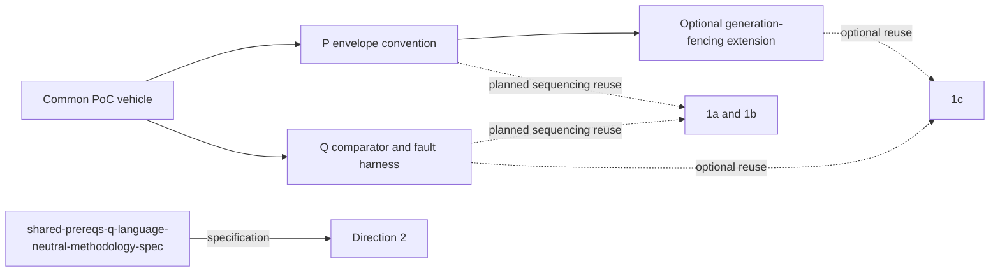
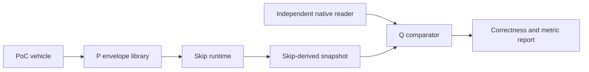

# Skip Shared Prerequisites - Plan

## Goal Capsule

- **Objective:** Build, once, the two pieces of infrastructure two Skip/Convex spikes (1a and 1b) are hard-blocked on and independently defer to "planning" — a documented atomic multi-table write convention for Skip, and a correctness-comparator plus fault-injection harness — as two independently reviewable, independently useful deliverables, so neither re-solves either and neither correctness claim rests on ungrounded ad hoc code. Direction 2 shares the underlying atomicity and comparison problems, but its backend-native implementation cannot consume P or Q as code; it is a design-reference consumer, not an implementation dependency. The remaining spike, 1c, already designed its own equivalent of both (KTD7-KTD9; `bench/compare.ts`/KTD10) before either existed as a shared artifact — for 1c this plan is a beneficial reuse opportunity, not a blocking dependency (see Problem Frame and Key Decisions for the classification, and How This Work Fits Together for the per-spike detail).
- **Means:** (P) Extract and formalize the tagged-envelope pattern already proven in `~/src/skip/examples/convex_reactive` into a documented convention and a small reusable TypeScript library. (Q) Build a shared correctness-comparator and fault-injection harness against the PoC vehicle already frozen by research (`~/src/convex-tutorial`'s `messages`/`users` tables plus aggregates A1/A2), exposing counters and timers matching the shared catalog research already defined.
- **Product authority:** Not separately brainstormed — derived directly from four already product-authority-settled sibling plans. 1a and 1b explicitly defer the same two structural problems to their own planning under different requirement numbers and remain direct consumers of this plan. Direction 2 names the same problems but requires backend-native implementation, so this plan supplies design evidence rather than a direct dependency. The fourth plan (1c) already solved its own version and is not blocked. This plan owns the shared prerequisite tier beneath 1a/1b, with a design-reference relationship to Direction 2 and beneficial-reuse relationship with 1c; see How This Work Fits Together for the exact per-spike mapping.
- **Open blockers:** None at product scope. Planning must choose a packaging location for the P library (a new directory under `npm-packages/` in this repo vs. a contribution to `~/src/skip/examples/` or `skipruntime-ts/adapters/`) and a process topology for the Q harness (in-process test helper vs. a small standalone server).

---

## Product Contract

### Summary

A foundational, fifth plan alongside the four Skip/Convex integration spikes (1a, 1b, 1c, Direction 2). It builds no spike itself. It extracts the already-proven tagged-envelope atomic-write convention from `~/src/skip/examples/convex_reactive` into a reusable TypeScript library (P), and it builds the correctness-comparator and fault-injection harness that none of the four spikes currently has (Q), wired to the PoC vehicle research already froze: `~/src/convex-tutorial`'s `messages`/`users` tables and the A1 (per-user reducer count) and A2 (joined latest-N feed) aggregates. Both sub-deliverables are reviewable on their own terms, independent of which (if any) spike is later generalized to production.

### Problem Frame

Two sibling plans (1a and 1b) independently state the same two open items and defer both to their own planning as unresolved Outstanding Questions, using different requirement numbers for what is structurally one problem in each case. That combination supports P/Q as the shared plan's proposed sequencing dependency; it does not prove either spike cannot close the gaps independently. Direction 2 states the same structural problems but cannot consume this plan's external TypeScript/SSE implementation, so it is a design-reference consumer rather than an implementation dependency. The remaining plan, 1c, already designed and documents its own solution to both; its relationship to this plan is reuse, not blocking — see the Reconciliation subsection under How This Work Fits Together.

Each sibling plan hits both gaps independently, in its own vocabulary — real duplication, not a coincidence of terminology:

| Gap | 1a | 1b | Direction 2 | 1c (context only) |
|---|---|---|---|---|
| Atomic multi-collection write | R2 blocked; Dependencies line 188, OQ line 196 | R4 blocked; Dependencies line 193, OQ line 202 | R2 design-reference; Dependencies line 236, OQ line 247 | KTD7-KTD9, solved independently |
| Correctness comparator | R6 blocked, 6 scenarios | R9/R13 blocked | R13 spec-consumer (Q12), 7 scenarios | `bench/compare.ts`/KTD10, solved independently |

**(a) is resolved without a Skip runtime change.** No `updateMany` exists anywhere in skipruntime-ts or skiplang (`CollectionWriter.update`/`ServiceInstance.update`, `skipruntime-ts/core/src/index.ts:476-501,768-782`, confirmed by exhaustive grep and absent through the CHANGELOG to v0.0.19 — `research-skip-atomic-write.md`). `research-skip-source-state.md`'s "Combined input" section already resolves it, generalizing the shipped `~/src/skip/examples/convex_reactive/skip/service.ts` pattern: a tagged-union query result (`shared/model.ts:16-18`) delivered as one `callbacks.update` per Transition, split via `ProjectsOnly`/`TasksOnly` mappers (`service.ts:34-49`) and rejoined (`:51-89,160-161`) — `DESIGN.md:114-118,314-315` names why (avoids N independent subscriptions delivering into Skip separately) and the hazard for any future partitioning. A convention plus a small library, not new FFI.

**(b) has no existing implementation anywhere in this repo.** `research-poc-vehicle-and-harness.md:76`: "No harness exists." `crates/common/src/comparators/` is an unrelated query-engine comparator; `~/src/convex-tutorial/convex/chat.test.ts` has real `convex-test`/vitest infrastructure usable as half of the independent-native-reader path, but the comparator, settled-checkpoint anchoring, and fault-injection layer exist for none of 1a, 1b, or Direction 2.

**1c is not hard-blocked on either gap.** 1c's R8 and R15 state the same structural requirements, but 1c (`implementation-ready` as of 2026-09-11, not yet built) already designed its own solution to both — KTD7-KTD9 (a strict superset of the `convex_reactive` pattern above) and `bench/compare.ts`/KTD10 — before this plan existed. 1c's relationship to P and Q is beneficial reuse and consolidation, not unblocking; see Reconciliation under How This Work Fits Together.

### Key Decisions

- **One combined plan document, two independently reviewable sub-deliverables, not a merged requirement list and not two separate documents.** (Governs document structure.) The two sub-deliverables have different plausible implementers — P touches TypeScript and Skip's mapper/reducer API, Q touches the PoC vehicle app plus a Node/TS test harness — and different review boundaries, so they get their own requirement-ID prefixes (`P1-Pn`, `Q1-Qn`). Q's runnable reference may use P's envelope convention, so delivery is sequenced P then Q; review boundaries remain independent. They stay in one document because they share the same PoC vehicle (`~/src/convex-tutorial`) and the same relationship to all four downstream spikes. P and Q must land before 1a or 1b is implemented and evaluated for real; 1c adoption is optional, and Direction 2 receives design evidence rather than a code dependency. Splitting into two documents would duplicate the vehicle-freezing content and the four-spike relationship mapping.
- **P/Q are a planned sequencing dependency for 1a and 1b; Direction 2 consumes Q12's methodology specification, while 1c may reuse P/Q beneficially.** (Governs Problem Frame, How This Work Fits Together, Success Criteria.) 1a and 1b are `requirements-only` and each still lists the atomic-write and comparator gaps as open, undecided Outstanding Questions. The shared plan proposes P/Q so they do not each invent a parallel solution, but their deferred state is not proof of impossibility. Direction 2 needs its own backend-native implementation and cannot import P or Q code; Q12 is its consumable specification. 1c is `implementation-ready` and already designed its own equivalent of both (KTD7-KTD9; `bench/compare.ts`/KTD10); for 1c this plan is a consolidation/reuse opportunity, not something 1c is blocked without.
- **Extract and formalize, don't invent — for P1-P8.** The envelope convention is already shipped and working in `~/src/skip/examples/convex_reactive`; documentation plus a small library around an existing pattern, not new design risk. **P9 is the exception:** no shipped precedent — it follows 1c's KTD7-KTD9 design, which 1c's own plan flags as resting on unverified Skip `ExternalService` capabilities. P9 carries real design risk P1-P8 don't.
- **Build the harness once, against the vehicle research already froze, directly reused by 1a/1b and reused as design/metric evidence elsewhere.** (Governs Q1-Q10.) `research-poc-vehicle-and-harness.md` already fixes the queries (`listMessages`, `listUsers`), the aggregates (A1, A2), the keying/ordering convention, and the SSE shape. Re-deriving its comparator logic for 1a/1b would be pure waste; Direction 2 and 1c can align to its documented comparison and metric contracts without consuming its SSE implementation.
- **Each sub-deliverable ships its own tests against synthetic/PoC data with no dependency on any consuming spike's code.** (Governs P7, Q8, Q9; also Success Criteria.) This is what makes both independently reviewable: a reviewer can approve either without reading 1a/1b/1c/Direction 2 code.
- **Standalone usefulness is a first-class requirement, not an incidental side effect.** (Governs P8, Q10; also Success Criteria.) Both deliverables must retain value if zero spikes are ultimately generalized to production.
- **Ground P and Q in 1c's implementation-ready design as an opt-in extension, not only in `convex_reactive`'s simpler precedent as the sole baseline.** (Added 2026-09-12; revised 2026-09-14; governs P9, Q11.) 1c's KTD7-KTD9 and U4/U6 units independently designed a more advanced version of both P and Q before either existed as a shared artifact. Since 1c is not yet built, this plan offers compatibility with 1c's stricter design (generation fencing, replay ledger, JSONL schema) as an optional extension (P9) on top of the P1-P8 baseline, so 1c can adopt P/Q as dependencies instead of the reverse, without forcing 1a and 1b — whose own needs the lighter baseline already covers — to carry that machinery first.
- **Extract Q's methodology as a language-independent specification, not only as TypeScript code.** (Added 2026-09-13; governs Q12.) 1a, 1b, and Direction 2 each independently restate the same settled-checkpoint definition, comparator normalization rules, and `research-spike-comparison.md` counter/timer names Q1/Q3/Q5 already implement in TypeScript. Q2's dual-reader wiring is unavoidably TypeScript/SSE-specific and out of reach for backend-owned Direction 2, but the methodology isn't language-specific — a written spec lets Direction 2 implement its own native-Rust comparator against the same definitions instead of re-deriving them a fourth time (full rationale under Q12).

### Requirements

**P — Envelope convention (atomic multi-collection write pattern)**
- P1. A single documented envelope type — `{ts, deleted, component, table, _id, _creationTime, doc}`, matching `research-skip-source-state.md`'s combined-input shape — is specified once and consumed identically regardless of which upstream spike produces envelope entries.
- P2. A reusable TypeScript library exposes: the envelope type; a per-table split-mapper helper equivalent to the shipped `ProjectsOnly`/`TasksOnly` pattern (`~/src/skip/examples/convex_reactive/skip/service.ts:34-49`); a stable keying convention (`"<component>/<table>/<id>"` or an equivalent tuple key) with a check that rejects non-unique, empty, or regenerated-per-update keys; and an order-key helper (`[_creationTime, _id]` with `_id` tiebreak) for windowed or ordered outputs.
- P3. The library documents, and enforces where feasible, the single-fork-per-atomic-unit invariant: one `writer.update(entries, isInit)` call per reassembled Transition (1a-shaped), per revision-timestamp group (1c-shaped), or per page-group swap (1b-shaped) — never N independent per-table calls for data that must appear atomically, per the hazard `DESIGN.md:114-118,314-315` names. The library documents the per-table `isInit` granularity tradeoff this single-fork invariant accepts (`research-skip-source-state.md:32-34`): bootstrap sends the full combined snapshot with `isInit: true`; steady state must send `isInit: false` deltas with explicit `[key,[]]` tombstone deletes, since a partial `isInit: true` call reads as a mass delete.
- P4. The library implements in-value revision-watermark idempotency (apply iff `entry.ts > retained_ts`) and explicitly does not reuse Skip's subscription/session-tick watermark for idempotency, per `research-skip-source-state.md`'s explicit prohibition.
- P5. The library documents the tombstone/GC policy — retain while the generation lives; wholesale discard on resnapshot/generation swap; sweep tombstone watermarks once the cursor passes the retention horizon — as a convention each consuming spike implements against, not as new runtime code this deliverable ships.
- P6. The library's split/join/order helpers are demonstrated against the frozen PoC vehicle, reproducing A1 (per-user reducer, add/remove correctness) and A2 (joined latest-N with `"Unknown"` fallback) through the envelope convention, not through spike-specific ad hoc code.
- P7. The library's own test suite exercises split, merge, ordering, watermark idempotency, and tombstone behavior directly against synthetic envelope entries, with no dependency on any spike's transport or on Q's harness — it is reviewable and testable standing alone.
- P8. The extraction states explicitly that it requires no Skip runtime or FFI change; it records the confirmed absence of a batch primitive (`research-skip-atomic-write.md`) as a still-open option for a larger future generalization, explicitly out of scope here.
- P9. The library ships generation-fencing and replay-safety support — a staging generation for cold/replacement builds, atomic promotion of a complete candidate, a per-page pending-ledger that withholds cursor advancement until every timestamp group in a page succeeds, and generation-scoped revision watermarks, matching the stricter bar 1c's KTD7/KTD9 design sets — as an **optional 1c-compatibility extension** layered on the P1-P8 baseline, not mandatory baseline scope. P1-P8's `convex_reactive`-derived baseline is sufficient for 1a's and 1b's own stated needs; a consumer opts into P9 only when it needs 1c's stricter lifecycle guarantees (`docs/plans/2026-09-10-1854-feat-skip-data-sync-push-source-spike-plan.md`, KTD7-KTD9).

**Q — Correctness-comparator and fault-injection harness**
- Q1. A settled-checkpoint detector anchors on version timestamps (`Transition.end_version.ts`, Data Sync `UpToDate(ts)`, or an equivalent required-version marker) and exposes one "is settled" predicate reusable by any spike's driver loop.
- Q2. A dual-reader wiring compares a Skip-derived snapshot — delivered over SSE per the shape `research-poc-vehicle-and-harness.md` sketches (`POST /v1/streams/:resource`, `GET /v1/streams/:uuid`) — against an independent native Convex reader (`ConvexClient` or `convex-test`) on the same logical query, with no shared code path between the two readers. The standalone SSE endpoints bind to loopback only and serve only PoC/test-fixture data; remote listening is excluded pending a future auth model — this is a minimum-exposure constraint on the harness itself, not the "no auth model" production-hardening exclusion in Scope Boundaries.
- Q3. A normalized deep-equal comparator applies canonical sort (`[_creationTime, _id]` tiebreak, since Skip key order does not match Convex `.order().take()` order) and the tutorial's `"Unknown"`-fallback parity rule before comparing, and reports a structured mismatch (which keys/fields diverged), not a bare boolean.
- Q4. The comparator is driven against the frozen PoC vehicle: `~/src/convex-tutorial`'s `messages`/`users` tables (`convex/schema.ts:6-12`), two new unbounded app-layer queries (`listMessages`, `listUsers`), and two aggregates — A1 (per-user message count, exercising reducer add/remove) and A2 (enriched latest-N feed with join and `"Unknown"` fallback, mirroring the tutorial's forbidden `getMessages` join but computed in Skip).
- Q5. A pluggable counter/timer recorder implements `research-spike-comparison.md`'s shared catalog — delivered rows/bytes; Skip keys reconciled (added/changed/removed); dependent nodes updated; reducer add/remove; splits/rebuilds; wake-ups by cause; replays/ignored; fallbacks by reason and rate; mismatches — and the shared timer chain (`commit→readable→delivered→applied→published`, plus snapshot/reconnect/stale durations), exposing a recorder interface a spike populates without modifying the comparator itself. Per `research-spike-comparison.md`'s own per-spike metric mapping (lines 65-67), Q5's catalog is a superset: 1a is correctness-only and exempt from counters/timers "by decision," so 1a populates only Q1-Q3 and is not expected to instantiate Q5's full catalog.
- Q6. A composable fault-injection fixture implements, at minimum, the faults `research-skip-source-state.md`'s fault list marks as common to 3+ plans: disconnect-before-checkpoint; cursor expiry/invalid/ahead; table replacement plus return to snapshotting; oversized transaction; multi-table transaction in one atomic unit; `QueryFailed` vs `QueryRemoved` vs not-yet-loaded; slow-consumer/bounded-backlog exhaustion; Skip-process restart mid-CDC. Page-splits plus invalid-cursor reset (1b-specific only) is documented for reuse but not required here.
- Q7. Each fault injector exposes a "did the harness detect/recover/count correctly" assertion helper independent of which spike's source produces the fault, so a consuming spike supplies only its own trigger mechanism (e.g., how to force a disconnect) while reusing the detection/recovery assertion.
- Q8. The harness's own test suite validates its detection behavior using deliberately seeded mismatches — i.e., it proves the comparator actually catches a wrong Skip snapshot — independent of any spike's Skip integration code.
- Q9. The harness ships runnable end-to-end against the frozen PoC vehicle with a minimal reference source of its own (wiring P's envelope convention to a trivial mock, or to the existing `billf/convex/adapter` baseline) sufficient to prove Q works before any of 1a/1b/1c/Direction 2 exists to consume it.
- Q10. The report format (counts, timers, mismatch log) is directly consumable by any of the four spikes' own Success Criteria sections — a spike's report cites the harness's output schema rather than redefining metric names.
- Q11. The recorder's field names and units are the same schema as 1c's already-designed JSONL output (KTD10; `skip: examples/convex_data_sync_push/bench/compare.ts` per 1c's U6), not a separately-compatible one — 1c's harness design already exercises `research-spike-comparison.md`'s shared catalog (KTD10 explicitly states it "uses the same logical count names and units as Direction 1b where they overlap"), so Q is built by generalizing 1c's U6 design into a reusable module rather than building a generic comparator first and reconciling it with 1c's bespoke one afterward.
- Q12. A standalone specification document — separate from Q's TypeScript implementation, checked in alongside it — states the settled-checkpoint definition (Q1), the comparator normalization rules (Q3: canonical `[_creationTime, _id]` sort, `"Unknown"`-fallback parity), and `research-spike-comparison.md`'s N/K/F axis definitions and counter/timer names (Q5) in implementation-independent terms (data shapes and invariants, not TypeScript types or SSE framing). This is what Direction 2 implements its own native-Rust comparator against, so its correctness and scaling claims (R13, R4/R12/R15) use the same definitions as 1a/1b instead of an independently worded approximation. The spec is derived from Q1/Q3/Q5's design, not new design work — it is a byproduct extraction, not a third sub-deliverable requiring its own review boundary.

<!-- ce-section: work-relationships -->
### How This Work Fits Together

This plan sits beneath the four spike plans in `docs/plans/README.md`, not beside them: it is a shared prerequisite tier, not a fifth spike testing its own architectural question. It builds no spike-specific transport, no backend change, and no production-facing feature. This is the current understanding, not a committed roadmap.

- **1a (`2026-09-10-1509-...`) — planned sequencing dependency, not a proven technical block.** The current shared-plan proposal is that 1a applies P's envelope convention to each reassembled `Transition` and adopts Q's comparator and settled-checkpoint detector instead of building bespoke equivalents. 1a's Dependencies/Assumptions and Outstanding Questions show that the two gaps were deferred; they do not prove an independent implementation is impossible. See the recorded [hard-prerequisite framing challenge](#from-2026-09-14-review).
- **1b (`2026-09-10-1843-...`) — planned sequencing dependency, not a proven technical block.** The current shared-plan proposal is that 1b uses P for the page-group-swap atomic unit and Q for its settled-checkpoint comparison and metrics. 1b's deferred gaps justify the sequencing proposal, while the recorded [hard-prerequisite framing challenge](#from-2026-09-14-review) prevents treating it as a settled impossibility claim.
- **1c (`2026-09-10-1854-...`) — beneficial reuse, not a blocking dependency.** 1c already designed its own equivalent of both P (KTD7-KTD9) and Q (`bench/compare.ts`, KTD10) before either existed as a shared artifact; 1c's R8 and R15 are already satisfied by 1c's own plan. If 1c chooses to adopt P/Q instead, P's single-fork-per-unit invariant (P3) and Q's fault-injection fixture (Q6, whose fault list 1c's R15 is the superset of) are direct fits — see Reconciliation and Recommended sequencing below for why that's worth considering, and why it is optional rather than required.
- **Direction 2 (`2026-09-10-1702-...`) — design-reference relationship for P, spec-consumer relationship for Q's methodology (Q12).** Direction 2's R2 and R13 name the same atomic-write and comparator problems P and Q document, but it's backend-owned (its own plan rejects an "external change-feed sidecar") and can't import P or Q2's SSE-specific dual-reader as code. Q12 is the exception: its settled-checkpoint definition, normalization rules, and counter/timer names aren't language-specific, so Direction 2's own R4/R12/R15/R13/AE7 can implement a native-Rust comparator directly against Q12 instead of citing Q5's catalog informally. P/Q's code still can't satisfy or block Direction 2's implementation — only Q12 is a genuinely adoptable shared artifact for it.
- **`docs/plans/README.md`** — This plan is the missing "Evidence hierarchy" layer beneath the four spikes' shared correctness bar (README's "Shared constraints" section) and above the raw Phase 1 research. The README's per-spike gap table already flags `research-spike-comparison.md`'s per-spike metric mapping as resolved (lines 60-82 of that research doc); this plan is what turns that mapping into runnable code (Q5) rather than leaving it as a citation gap. README should be updated, as a follow-up outside this plan's scope, to list this plan as a prerequisite tier above the four spikes once it exists.

**Research beneficial to every plan, including 1c — separate from the P/Q hard/beneficial split above.** Some of the research grounding this plan draws on was already valuable to all four spikes before P and Q existed as deliverables, and remains so regardless of who ends up building or adopting P/Q: `research-poc-vehicle-and-harness.md` freezes the shared PoC vehicle (`~/src/convex-tutorial`'s `messages`/`users` tables, the `listMessages`/`listUsers` additions, and the A1/A2 aggregates) that every sibling plan's own Sources/Research section already points to, 1c's included. `research-spike-comparison.md`'s N/K/F scaling axes and shared counter/timer catalog give all four plans a common vocabulary for reporting scaling results, independent of whether a given spike's own harness is Q or something bespoke — 1c's KTD10 explicitly aligns its own JSONL schema to this catalog's naming without needing to consume Q's code, and Direction 2's backend-native comparator (which cannot consume Q as built — see the Direction 2 bullet above) can cite the same catalog by name for the same reason. `research-skip-atomic-write.md` and `research-skip-source-state.md` document the underlying atomic-write options and the envelope/tombstone/watermark conventions that all four plans' own Sources sections cite; this plan's Problem Frame verification against them is what closes 1c's own flagged "Deferred / Open Question" about whether Skip's `ExternalService` actually supports the primitives KTD7-KTD8 assume (see Reconciliation below) — a benefit to 1c even though 1c wrote its own implementation rather than adopting P wholesale.

**Reconciliation and sequencing with 1c (added 2026-09-12).** 1c was independently deepened to `implementation-ready` the same day this plan was first drafted, without either plan consuming the other: its KTD7-KTD9/U4 and U5-U6 are exactly P and Q, independently re-derived. Because 1c is not yet built, reconciliation is still cheap, and two changes follow, both applied to Requirements below: (1) P's bar is raised to match 1c's stricter KTD7/KTD9 design (generation fencing, replay ledger, revision watermarks — none of which `convex_reactive`'s simpler read-only precedent needs), not the lighter baseline (new P9); (2) this plan's own primitive-level verification (direct reads of `skipruntime-ts/core/src/index.ts:476-501,768-782` at HEAD `7973dce6`, plus the shipped `convex_reactive` workaround) already closes 1c's own flagged "Deferred / Open Question" (confidence 75) about whether Skip's `ExternalService` supports KTD7-KTD8's assumed capabilities — the one-`callbacks.update`-call atomicity is proven and shipped; only the generation-fencing/replay-ledger bookkeeping around it is 1c-specific application logic, not an unverified Skip capability. Recommended sequencing: 1c's U4 should import P (validating P9 against 1c's exact requirements first, since 1c is the most advanced consumer, but also against 1a's/1b's/Direction 2's lighter needs so they don't inherit machinery they didn't ask for) rather than hand-building KTD7-KTD9, and U6 should build on Q rather than a from-scratch `bench/compare.ts` (already reflected in Q11). This is a recommendation for 1c's own plan to sequence against, not an edit made to 1c's document here.

**Why this is worth building beyond unblocking R-numbers:** the shared metric catalog (Q5) becomes literal shared code every spike's report can cite verbatim instead of independently-worded approximations of the same vocabulary, and the fault-injection fixture (Q6) turns eight-plus independently-described fault scenarios into one tested, reusable assertion set — a bug fixed once instead of three times. Both P and Q are independently reviewable (input/output/test-suite boundaries, no cross-spike code needed — P9's scope-justification is the one exception, since judging whether its scope is *right* requires reading 1c's KTD7-KTD9) and independently useful standalone (P as a candidate upstream `~/src/skip` contribution; Q as the only concrete correctness-oracle artifact any of the four spikes has today, `research-poc-vehicle-and-harness.md` confirming none exists elsewhere). See Success Criteria for the checkable form of both claims.

### Dependency relations

### Actors and flows

**Cross-document graph maintenance:** When this plan changes, update and revalidate relevant nodes, edges, statuses, and identifier-map rows in [README.md](README.md), [planning-timeline.md](planning-timeline.md), [prerequisites.md](prerequisites.md), [detailed-prerequisites.md](detailed-prerequisites.md), and [IDENTIFIER-MAP.md](IDENTIFIER-MAP.md); then render the affected diagrams and verify their references.

### Actors

- A1. `~/src/convex-tutorial` (`messages`/`users` tables) — the frozen PoC vehicle; source of truth for both P's demonstration and Q's comparison.
- A2. Envelope library (P) — the new reusable TypeScript package: envelope type, split-mapper helper, keying/ordering helpers, watermark/tombstone conventions.
- A3. Comparator and fault-injection harness (Q) — the new shared test/measurement tool: settled-checkpoint detector, dual-reader wiring, normalized comparator, counter/timer recorder, fault injectors.
- A4. Minimal reference source — a small stand-in source (wired to P's envelope convention, e.g. against `billf/convex/adapter`'s existing diff-and-push path or a hand-written mock) used only to prove Q works end-to-end before any real spike exists (Q9); not a production integration.
- A5. Consuming or reference spike (1a/1b/1c/Direction 2) — 1a/1b are future direct adopters, while 1c and Direction 2 can validate or reuse the documented contracts without consuming P/Q code; out of this plan's build scope.
- A6. Skip runtime — executes P's mappers/reducers and hosts the SSE resource Q's Skip-side reader observes.

### Key Flows

- F1. Envelope round-trip through the P library
  - **Trigger:** A2's reference wiring (A4) sends a batch of tagged envelope entries spanning both `messages` and `users`.
  - **Actors:** A2, A6.
  - **Steps:** The library validates keys and order metadata, issues one `writer.update(entries, isInit)` call, and Skip's mappers split the batch into per-table collections and reduce A1's per-user count.
  - **Outcome:** Both tables' contributions land in Skip from a single atomic write; no intermediate state where one table has advanced without the other is observable.
  - **Covers:** P1, P2, P3, P6.
- F2. Atomic multi-table transaction through P
  - **Trigger:** A minimal reference mutation touches both `messages` and `users` in one Convex transaction.
  - **Actors:** A1, A2, A6.
  - **Steps:** The reference source (A4) packages both tables' changes for that transaction into one envelope batch tagged with the same `ts`, and issues one `update` call.
  - **Outcome:** A1's reducer and A2's join both observe the change as one atomic step, satisfying the same atomicity shape 1a's R2, 1b's R4, 1c's R8, and Direction 2's R2 each independently require.
  - **Covers:** P3, P4.
- F3. Comparator settled-checkpoint match
  - **Trigger:** A write is driven through the PoC vehicle app.
  - **Actors:** A1, A3, A6.
  - **Steps:** Q's settled-checkpoint detector (Q1) waits for the write to settle, snapshots A6's Skip-side SSE resource, independently re-reads A1 via `ConvexClient`/`convex-test`, normalizes both (Q3), and compares.
  - **Outcome:** A pass records a match; a mismatch produces a structured report identifying the diverging keys/fields, not a bare failure.
  - **Covers:** Q1, Q2, Q3, Q4.
- F4. Fault injection detection
  - **Trigger:** A fault injector (e.g. forced disconnect, cursor expiry, Skip-process restart) fires mid-flow.
  - **Actors:** A3, A4, A6.
  - **Steps:** The injector triggers the fault; the harness asserts that the fault is detected, that recovery reaches a matching state at the next settled checkpoint, and that the fault is counted under the correct catalog entry.
  - **Outcome:** The fault's detection/recovery/counting behavior is proven once, reusable by any spike that later wires its own trigger mechanism into the same assertion helper.
  - **Covers:** Q6, Q7.
- F5. Harness self-validation (no spike present)
  - **Trigger:** Q's own test suite runs against the minimal reference source (A4) with a deliberately seeded mismatch.
  - **Actors:** A3, A4.
  - **Steps:** The comparator runs against the seeded-wrong Skip snapshot and the correct native result.
  - **Outcome:** The comparator reports a mismatch, proving it actually catches divergence rather than trivially passing.
  - **Covers:** Q8, Q9.

### Acceptance Examples

- AE1. **Covers:** P1, P2, P3, P6.
  - **Given:** A reference source producing envelope entries for both `messages` and `users`.
  - **When:** One Convex transaction inserts a message and touches the sending user's record.
  - **Then:** Both changes are delivered to Skip via exactly one `update` call, A1's per-user count and A2's joined feed both reflect the change together, and no observer sees one table advanced without the other.
- AE2. **Covers:** P4.
  - **Given:** A duplicate envelope entry replayed after a reconnect, carrying an older `ts` than the retained value.
  - **When:** The library applies the replayed batch.
  - **Then:** The stale entry is ignored (counted as replayed), and Skip's retained state is unchanged.
- AE3. **Covers:** P7.
  - **Given:** The P library's own test suite, using synthetic envelope entries with no spike transport involved.
  - **When:** The suite runs split, order, watermark, and tombstone test cases.
  - **Then:** All pass without any dependency on Q's harness or any spike's code.
- AE4. **Covers:** Q1, Q2, Q3, Q4.
  - **Given:** The comparator wired to the PoC vehicle's A1 and A2.
  - **When:** A write settles.
  - **Then:** The Skip-derived snapshot matches the independent native Convex read after normalization, including the `"Unknown"`-fallback case for a missing joined user.
- AE5. **Covers:** Q6, Q7.
  - **Given:** The harness running against the minimal reference source.
  - **When:** A `QueryFailed`-vs-`QueryRemoved`-vs-not-yet-loaded fault injector fires.
  - **Then:** The harness correctly distinguishes all three states, asserts the expected detection/recovery behavior for each, and counts each occurrence under its own catalog entry.
- AE6. **Covers:** Q8, Q9.
  - **Given:** A deliberately seeded mismatch (the reference source's Skip snapshot is made wrong on purpose).
  - **When:** The comparator runs.
  - **Then:** It reports a mismatch with the specific diverging key/field, proving the comparator is a genuine oracle rather than a pass-through.
- AE7. **Covers:** Q5, Q10.
  - **Given:** The reference source's run, instrumented with Q's counter/timer recorder.
  - **When:** The run completes.
  - **Then:** The report contains every entry in `research-spike-comparison.md`'s shared catalog (or explicitly zero/not-applicable where the reference source doesn't exercise it), in the schema a consuming spike can cite directly.
- AE9. **Covers:** P5.
  - **Given:** A tombstone entry within a live generation, followed by a resnapshot/generation swap.
  - **When:** The library applies both in sequence.
  - **Then:** The tombstone is retained while the original generation lives, and is wholesale discarded once the resnapshot/generation swap completes, per the documented tombstone/GC policy.
- AE10. **Covers:** P8.
  - **Given:** The P library's source tree and its README's no-runtime-change statement.
  - **When:** A reviewer checks the library's dependencies and call surface against Skip's public API.
  - **Then:** No Skip runtime or FFI symbol beyond the existing public `CollectionWriter`/`ServiceInstance` surface is touched, confirming the extraction required no Skip runtime change.
- AE11. **Covers:** Q12.
  - **Given:** Direction 2's own R4/R12/R15 and R13/AE7 requirements, and Q12's specification document.
  - **When:** A Direction 2 implementer builds a native-Rust settled-checkpoint check, comparator, and counter/timer recorder using only Q12's text, without reading Q's TypeScript source.
  - **Then:** The resulting comparator's checkpoint definition, sort/fallback normalization, and counter/timer names match Q1/Q3/Q5 exactly, so Direction 2's correctness and scaling report can cite Q12 by name instead of restating the methodology.
- AE8. Independent reviewability check
  - **Covers:** P7, Q8 (review-boundary claim).
  - **Given:** A reviewer with no context on 1a/1b/1c/Direction 2's implementations.
  - **When:** They review the P library PR using only its README, type definitions, and test suite, and separately review the Q harness PR using only its comparator logic, fault injectors, and seeded-mismatch tests.
  - **Then:** Both reviews reach an approve/reject decision without needing to read any spike's code.

### Success Criteria

- The P library's split/join/order helpers correctly reproduce A1 (reducer add/remove) and A2 (join with `"Unknown"` fallback) against the frozen PoC vehicle, driven through the envelope convention, with test coverage independent of any spike.
- The P library documents, and its tests demonstrate, the single-fork-per-atomic-unit invariant holding across at least one multi-table transaction scenario (AE1) and at least one replay/idempotency scenario (AE2).
- The P library's optional generation-fencing and replay-safety extension (P9) supports a staging generation, atomic promotion, a per-page pending-ledger, and generation-scoped revision watermarks, matching 1c's KTD7/KTD9 bar, with test coverage independent of any spike; 1a and 1b can validate against the P1-P8 baseline alone without adopting this extension.
- The Q harness detects a deliberately seeded mismatch (AE6) and correctly distinguishes and counts at least the eight faults common to 3+ plans (Q6) using only its minimal reference source — no spike's real integration is required to prove the harness works.
- The Q harness's counter/timer output schema matches `research-spike-comparison.md`'s shared catalog closely enough that a consuming spike's Success Criteria section can cite it directly without redefinition.
- Q12's specification document is implementation-independent enough that Direction 2 can build its own native-Rust comparator against it without reading Q's TypeScript source, and Direction 2's own Success Criteria section can cite Q12 directly instead of restating the settled-checkpoint/normalization/counter definitions in its own words.
- A reviewer can approve either the P library or the Q harness in isolation, per AE8, without cross-referencing any of the four spike plans' implementation code.
- Both deliverables retain a stated standalone value proposition in their own documentation: P as a candidate upstream contribution to `~/src/skip`, Q as a general convex-tutorial correctness-testing tool — independent of whether any of 1a/1b/1c/Direction 2 is later generalized to production.
- No convex-backend or Skip runtime code changes; both deliverables are additive libraries/tools layered on existing, unmodified APIs.
- P and Q resolve 1a's and 1b's own stated Outstanding Questions (1a line 196, 1b line 202) without requiring either to invent its own atomic-write or comparator design — this is the shared sequencing value this plan is measured against for those two spikes. Q12 additionally lets Direction 2 (Outstanding Question at line 247) implement its own native-Rust comparator against a shared specification instead of an independently-worded methodology, though Direction 2 still owns its own atomic-write and comparator implementation.
- Separately, and explicitly optionally: 1c may adopt P/Q in place of its own already-designed KTD7-KTD9/`bench/compare.ts` equivalents (per the Recommended sequencing above). This is beneficial if it happens but is not required for this plan's success — 1c's own plan already satisfies its R8/R15 independently.
- P and Q are labeled **provisional** until validated by contract-testing or actual integration against a real consumer — 1c's U4/U6 if it lands first, otherwise whichever of 1a/1b/Direction 2 adopts them first. Only after that validation are P/Q's interfaces considered stable. This gate exists because self-tests against synthetic/PoC data (P7, Q8) can pass while a real consumer still needs bespoke adaptation, which would defeat the build-once-reuse Objective without anyone noticing until a spike is already underway.

### Scope Boundaries

**Deferred for later**
- Each spike's own transport-specific source implementation — wiring 1a's WebSocket client, 1b's paginated query topology, 1c's Data Sync stream, or Direction 2's backend-native change feed into the P envelope convention. This plan proves the convention works against a minimal reference source only (A4); each spike's own plan owns its adoption.
- The 1b-specific page-split-plus-invalid-cursor-reset fault. Documented in Q6 for reuse but built inside 1b's own plan.
- A Skip runtime or FFI `updateMany`/batch-write primitive. `research-skip-atomic-write.md`'s option (a) remains a live idea for a larger future generalization; this plan deliberately takes option (b)'s reachable path (single merged external resource, i.e. the combined envelope collection) instead.
- Packaging the P library as a formal upstream contribution to `~/src/skip` — a plausible, valuable follow-up, but not required for this plan's success criteria.
- The actual generalize/don't-generalize decision for any of the four spikes. A passing P/Q pair establishes shared infrastructure exists and works; it does not decide which direction (if any) proceeds.

**Outside this product's identity**
- Any spike-specific architectural question (1a's raw-protocol client, 1b's page topology, 1c's backend endpoint, Direction 2's backend-native execution) — each stays inside its own plan.
- Rewriting or extending convex-backend or the Skip runtime itself.
- Production hardening of either deliverable beyond what the four spikes need to evaluate correctness and atomicity (e.g., no auth model, no multi-tenant packaging, no published npm release).

### Dependencies / Assumptions

- Assumes local checkouts of `~/src/skip` (for the `convex_reactive` precedent and skipruntime-ts) and `~/src/convex-tutorial` remain available and roughly in their current shape, matching the same assumption all four sibling plans make.
- Assumes the `billf/convex/adapter` branch remains accessible as a candidate minimal reference source (A4, Q9) for proving the harness works before any real spike exists; a hand-written mock is an acceptable substitute if the branch drifts.
- Assumes the four sibling plans' requirement numbering (1a R2/R6, 1b R4/R9/R13, 1c R8/R15, Direction 2 R2/R13) remains stable enough to cite; if any sibling plan is revised, this plan's Problem Frame and work-relationships citations should be checked for drift.
- Assumes `research-poc-vehicle-and-harness.md`'s open item — whether adding `listMessages`/`listUsers` UDFs to convex-tutorial counts as a prohibited "backend change" for the no-backend-change spikes (1a, 1b) — resolves as "presumed allowed" (app-layer additions, not convex-backend changes); this plan proceeds on that presumption and flags it as inherited, not newly resolved here.
- Assumes Skip Runtime's public API surface (`CollectionWriter.update`, `ServiceInstance.update`) remains as characterized in `research-skip-atomic-write.md` for the duration of this plan; a future Skip release adding a batch primitive would not invalidate P's convention but would make it optional rather than necessary.
- 1c's own R8/R15 do not depend on this plan — 1c (`docs/plans/2026-09-10-1854-...`, `implementation-ready` as of 2026-09-11) already has its own working design (KTD7-KTD9; `bench/compare.ts`/KTD10). Whether 1c's U4/U6 ends up adopting P/Q instead is optional upside this plan does not require: if 1c implements before P/Q exist, the Recommended-sequencing suggestion in How This Work Fits Together simply goes unused for 1c rather than becoming a blocking refactor, since 1c was never depending on P/Q to satisfy its own requirements in the first place.

### Outstanding Questions

**Escalated decisions — defer to an independent model before planning**
- **Direction 2 relationship:** With Q12 added (2026-09-13), Direction 2 already gets more than a bare design reference for the comparator methodology — it gets a specification to implement against directly, even though it still cannot consume Q's TypeScript code or P at all. The remaining open question is narrower than before: is a specification sufficient, or should this plan expand further to ship an actual backend-native atomic-write companion (for P) and/or a native-Rust reference comparator implementation (beyond Q12's spec) that Direction 2 can consume as code? The spec-only path (current state) leaves Direction 2 to implement both P's atomicity pattern and Q12's methodology itself, just from a shared written contract instead of independently-worded prose. The code-companion path would make Direction 2 a direct consumer but adds a backend-owned implementation and test surface this plan does not currently specify. Decide which outcome is intended; do not restore a "hard prerequisite" claim for Direction 2 without also naming the consumable backend-native deliverable.
- **P9 scope (resolved 2026-09-12; revised 2026-09-14):** Generation fencing, pending-page ledgers, and generation-scoped watermarks are now an optional 1c-compatibility extension layered on the P1-P8 baseline, not mandatory baseline scope. The 2026-09-12 decision made this machinery mandatory to match 1c's stricter KTD7/KTD9 design; the 2026-09-14 doc review reversed that, since 1a and 1b — the plan's proposed shared consumers — do not need it and were being delayed behind state machinery justified only by 1c, which this plan itself treats as a non-blocking, optional adopter. Planning should confirm, once 1a's and 1b's actual lifecycle requirements are known, whether either ever needs to opt into the extension.

**Deferred to Planning**
- Packaging location for the P library: a new directory under `npm-packages/` in this repo (matching where `npm-packages/convex/` already lives) vs. a contribution under `~/src/skip/examples/` or `skipruntime-ts/adapters/` directly.
- Process topology for the Q harness: an in-process test helper library (simplest, matches `convex-test`'s model) vs. a small standalone comparator server (closer to `research-poc-vehicle-and-harness.md`'s SSE-fronted sketch).
- Whether to formally propose the P library as an upstream `~/src/skip` contribution now, or hold it back until at least one consuming spike validates it in practice.
- Whether `docs/plans/README.md` should be updated now to list this plan as a prerequisite tier, or only once P and Q are built (this plan takes no position; it is a follow-up outside this plan's own scope per How This Work Fits Together).
- Exact minimal reference source for Q9 — wiring against `billf/convex/adapter`'s existing diff-and-push path, vs. a smaller hand-written mock that avoids depending on that branch's continued existence. (Superseded in practice by the 2026-09-12 reconciliation: 1c's U4/U6, once built, is the intended primary reference for both P and Q — see How This Work Fits Together — so this question is now "does Q9 still need a separate minimal mock if 1c lands first," not just which mock to pick.)
- Whether 1c's own plan should be edited to explicitly reference P/Q as U4/U6 dependencies, or whether that edit should wait until P/Q are actually built (this plan takes no position beyond the recommendation in How This Work Fits Together; editing 1c's plan document is outside this plan's scope).
- **Resolved (2026-09-12 doc review, strengthened):** P/Q's shared shape, derived from four planning documents' text rather than any real implementation, is treated as provisional — not final — until validated against a real consuming implementation (1c's U4/U6, if it lands first, per the Recommended sequencing above; otherwise the first of 1a/1b/Direction 2 to adopt P/Q). See the corresponding Success Criteria entry.
- **Resolved (2026-09-14 doc review):** P9's generation-fencing/replay-ledger scope was made an optional 1c-compatibility extension on the P1-P8 baseline (see the corresponding Requirements and Outstanding Questions entries), reversing the 2026-09-12 decision to make it mandatory baseline scope. Whether 1a or 1b ever needs to opt into the extension should still be confirmed once their actual lifecycle requirements are known. (From 2026-09-12 doc review; revised 2026-09-14 doc review.)
- Whether Success Criteria should require at least one consuming spike to demonstrably adopt P or Q before this plan is "complete," to verify the duplication-prevention Objective actually held — vs. leaving Success Criteria standalone-only, per the existing "standalone usefulness is a first-class requirement" Key Decision. Real tension between the two: an adoption requirement could read as walking back the standalone-value decision. (From 2026-09-12 doc review.)

### Alternatives Considered

- **Let each spike build its own atomic-write shim and comparator independently.** This is the status quo the four plans currently defer to. Rejected: it is the exact duplication this plan exists to remove — four independent re-derivations of the same envelope convention and four independent, untested comparator implementations, with no shared correctness oracle and no shared metric vocabulary in practice (only in research-doc alignment).
- **Wait for a Skip runtime `updateMany`/batch primitive before building anything.** Rejected: no evidence this is imminent (absent through the CHANGELOG history, no relevant git history per `research-skip-atomic-write.md`), and a proven, shipped workaround already exists and does not require it.
- **One combined plan document with a single unified requirement list, no P/Q split.** Rejected: this would obscure that the two deliverables have different plausible implementers and independently reviewable interface boundaries, and would make partial progress (e.g. P done, Q not yet) illegible against a single requirement numbering.
- **Two fully separate plan documents, one per sub-deliverable.** Rejected: they share the same frozen PoC vehicle and the same relationship to all four downstream spikes; splitting would duplicate the vehicle-freezing content and the work-relationships mapping, and would obscure the P-then-Q delivery sequence and the 1a/1b prerequisite relationship.
- **Build the harness against a synthetic vehicle instead of `~/src/convex-tutorial`.** Rejected: `research-poc-vehicle-and-harness.md` already froze convex-tutorial as the shared vehicle, citing its use by Direction 2 and pointing 1a/1b/1c readers to the same source; diverging would break the "one shared vehicle" goal this plan depends on.
- **Build P/Q incrementally inside the first spike attempted, and generalize afterward, instead of fully upfront and blocking.** Rejected for this plan's scope: the sibling plans independently re-derived the same two gaps in their planning text (see Problem Frame), which is evidence the shape generalizes; building upfront gives 1a and 1b the same correctness oracle from day one rather than staggering it. Accepted tradeoff: this serializes 1a and 1b behind this plan's completion; it does not block 1c or Direction 2, which have their own implementation paths.

### Deferred / Open Questions

#### From 2026-09-14 review

- **"Hard prerequisite" framing for 1a/1b lacks demonstrated necessity** — Problem Frame / Key Decisions (P1, adversarial, confidence 75)

  The claim that 1a and 1b are "hard" blocked (rather than simply not yet done) rests only on the fact that those two plans' own text defers the same two gaps as open questions. But this plan's own comparison table shows sibling plan 1c independently built working solutions to the identical gaps on its own timeline, with no shared-prerequisites plan in place — direct evidence a sibling plan can close these gaps unaided, which weakens the case that 1a/1b are "hard" blocked as opposed to sequenced behind this plan as a scheduling choice.

- **"Not new design risk" claim understates P1-P8's actual work** — Key Decisions / P3 (P2, adversarial, confidence 75)

  Planning may under-budget review and test time for P1-P8 on the assumption that it is low-risk documentation work. P3's single-fork-per-atomic-unit invariant must correctly handle three distinct atomic-unit shapes (per reassembled Transition, per revision-timestamp group, per page-group swap), but only one of the three — the read-only `convex_reactive` precedent — has ever actually shipped; generalizing to the other two is new design work, not pure extraction, contrary to the "not new design risk" framing in Key Decisions.

### Sources / Research

- `research/skip-convex-integration/research-skip-atomic-write.md` — the confirmed absence of a Skip Runtime batch-write primitive, the per-collection fork/merge boundary (`skipruntime-ts/core/src/index.ts:476-501,768-782`), and the three named options for satisfying atomicity (this plan takes option (b)'s combined-collection path).
- `research/skip-convex-integration/research-skip-source-state.md` — the combined-input envelope specification (`{ts, deleted, component, table, _id, _creationTime, doc}`), revision-watermark idempotency, tombstone/GC policy, ordering conventions, restart-rebuild semantics, and the fault-injection list this plan's Q6 draws from, plus the per-spike usage map showing which sections each of 1a/1b/1c/Direction 2 consumes.
- `research/skip-convex-integration/research-poc-vehicle-and-harness.md` — the frozen PoC vehicle (convex-tutorial `messages`/`users`, `listMessages`/`listUsers`), the A1/A2 aggregate definitions, keying/encoding rules, and the sketched R6-harness shape (SSE endpoints, atomicity/failure probes) this plan's Q1-Q4 build out.
- `research/skip-convex-integration/research-spike-comparison.md` — the unified N/K/F scaling axes, the shared counter and timer catalogs, the per-spike baseline table, and the explicit per-spike metric mapping (lines 60-82) this plan's Q5 implements as code and Q12 restates as a language-independent spec.
- `docs/plans/2026-09-10-1702-feat-skip-incremental-materialized-cache-spike-plan.md`, R4/R12/R15 (logical-work instrumentation, fallback/mismatch metrics, scaling report) and R13/AE7 (independent-native-result comparison, dangling-reference parity) — Direction 2's own restatement of the same settled-checkpoint, comparator-normalization, and counter-catalog requirements Q1/Q3/Q5 already solve in TypeScript; this plan's Q12 targets these lines directly so Direction 2 implements against a spec instead of re-deriving the methodology a fourth time.
- `~/src/skip/examples/convex_reactive/skip/service.ts:34-89,160-161` — the shipped `ProjectsOnly`/`TasksOnly`/`TasksByProject`/`AddTaskTotals`/`AttachTotals` split-and-rejoin pattern this plan's P library generalizes.
- `~/src/skip/examples/convex_reactive/shared/model.ts:16-18` — the `WorkspaceRow` tagged-union precedent for this plan's envelope type.
- `~/src/skip/examples/convex_reactive/DESIGN.md:114-118,314-315` — the explicit rationale for one combined query result over N independent subscriptions, and the hazard named for any future partitioning.
- `~/src/convex-tutorial/convex/schema.ts:6-12` and `chat.ts` — the PoC vehicle's `messages`/`users` schema and existing write path (`sendMessage`, `getOrCreateUser`), which stays unmodified; the forbidden joined `getMessages` query this plan's A2 replaces with a Skip-side join.
- `~/src/convex-tutorial/convex/chat.test.ts` — existing `convex-test`/vitest infrastructure usable as half of Q's independent-native-reader path.
- `crates/common/src/comparators/` (`lower_bound.rs`, `tuple.rs`, `mod.rs`) — confirms, by contrast, that no Skip/Convex correctness comparator exists anywhere in this codebase; this is an unrelated query-engine comparator.
- `docs/plans/2026-09-10-1509-feat-skip-sync-protocol-client-plan.md`, `2026-09-10-1702-feat-skip-incremental-materialized-cache-spike-plan.md`, `2026-09-10-1843-feat-skip-paginated-reactive-source-spike-plan.md`, `2026-09-10-1854-feat-skip-data-sync-push-source-spike-plan.md` — the four sibling plans whose deferred requirements (R2/R6, R4/R9/R13, R8/R15, R2/R13) this plan resolves once, and whose own file:line citations for the atomic-write and harness gaps this Problem Frame quotes directly.
- `docs/plans/2026-09-10-1854-feat-skip-data-sync-push-source-spike-plan.md`, KTD7-KTD9 (lines ~301-304) and Implementation Unit U4 (lines ~522-555) — 1c's independently-designed generation-fenced, replay-safe combined-collection scheme this plan's P9 targets as the stricter compatibility bar.
- `docs/plans/2026-09-10-1854-feat-skip-data-sync-push-source-spike-plan.md`, Implementation Units U5-U6 (lines ~557-619) — 1c's independently-designed deterministic-mutation oracle and comparison harness (`bench/compare.ts`, KTD10's JSONL schema) this plan's Q11 targets for schema-level reuse.
- `docs/plans/2026-09-10-1854-feat-skip-data-sync-push-source-spike-plan.md`, "Deferred / Open Questions" (lines ~665-667) — 1c's own flagged, unresolved-as-of-2026-09-11 uncertainty about whether Skip's `ExternalService` supports KTD7-KTD8's assumed atomicity/staging primitives; this plan's Problem Frame verification (direct source reads of `skipruntime-ts/core/src/index.ts` plus the shipped `convex_reactive` precedent) answers it at the single-collection-write level.
- `docs/plans/README.md` — the cross-plan overview and shared-constraints framing this plan sits beneath as a prerequisite tier.
