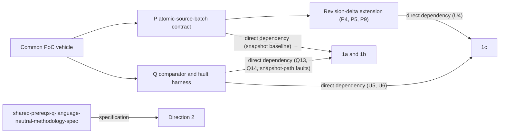
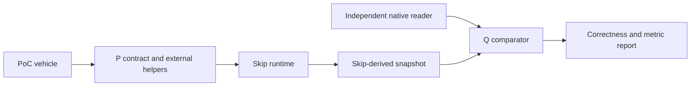
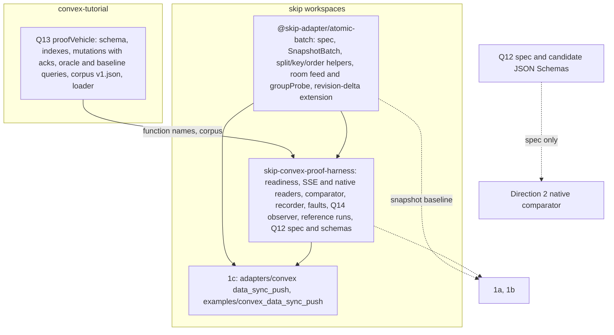
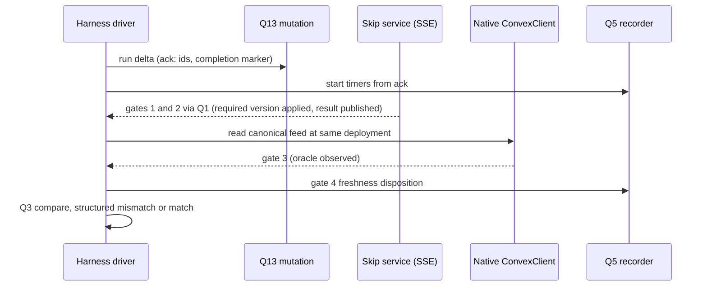
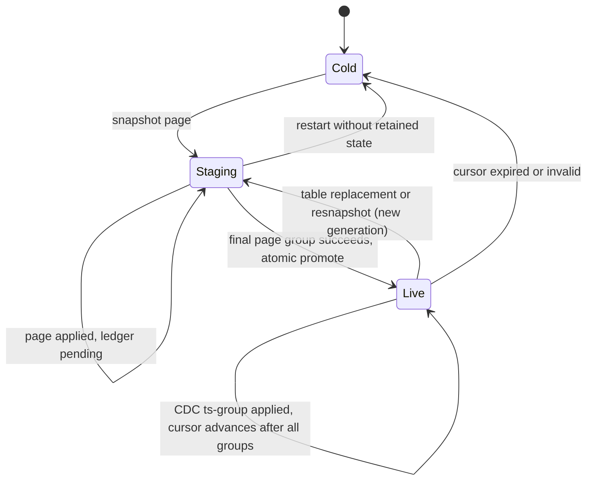

# Skip Shared Prerequisites - Plan

This plan is authoritative. A Simplified Technical English companion, [the STE version](2026-09-11-1159-feat-skip-shared-prerequisites-plan.ste.md), restates it for easier reading and translation; regenerate the companion after every change here, and use this plan wherever the two differ.

## Goal Capsule

- **Objective:** Build, once, the two pieces of infrastructure three Skip/Convex spikes (1a, 1b, and 1c) consume instead of each building its own. The first is a documented atomic multi-table write convention for Skip. The second is a correctness-comparator plus fault-injection harness. Each is an independently reviewable and independently useful deliverable, so no spike re-solves either and no correctness claim rests on ungrounded ad hoc code. Direction 2 shares the underlying atomicity and comparison problems, but its backend-native implementation cannot consume P or Q as code; it is a design-reference consumer, not an implementation dependency. 1c designed its own equivalent of both (KTD7-KTD9; KTD10) before either existed as a shared artifact; as of 2026-09-23 it adopts P (including the revision-delta extension) and Q as direct dependencies instead of hand-building them, and 1a and 1b likewise adopt P's snapshot baseline and Q directly rather than leaving adoption to their own planning (see Problem Frame and Key Decisions for the classification, and How This Work Fits Together for the per-spike detail).
- **Means:** (P) Publish the language-neutral `AtomicSourceBatch` contract, then provide TypeScript helpers only for external-source consumers that choose its encodings. (Q) Build a shared correctness-comparator and fault-injection harness against the formal five-table proof vehicle defined below, exposing counters and timers matching the shared catalog research already defined.
- **Product authority:** Not separately brainstormed — derived directly from four already product-authority-settled sibling plans. 1a and 1b named the same two structural problems under different requirement numbers; as of 2026-09-23 (user decision) they adopt P's snapshot baseline and Q as direct dependencies instead of deferring that choice to their own planning. 1c designed its own version first and has since adopted P and Q as direct dependencies (user decision, 2026-09-23). Direction 2 names the same problems but requires backend-native implementation, so this plan supplies design evidence rather than a direct dependency. This plan owns the shared prerequisite tier beneath 1a, 1b, and 1c, with a design-reference relationship to Direction 2; see How This Work Fits Together for the exact per-spike mapping.
- **Open blockers:** None. Packaging, harness topology, and the Q9 reference source are resolved in KTD1-KTD4.
- **Stop conditions:** Stop and escalate when a consuming spike's scenario cannot be met through P's or Q's interface; fix it here as a P/Q defect, never locally. Stop when a unit would require a Skip runtime or FFI change or a convex-backend change (P8). Stop when the corpus translation disagrees with `research/skip-convex-integration/semantic-vectors-v1.md`; the research doc wins.
- **Execution profile:** Three repositories: `skip` for P and Q, `convex-tutorial` for Q13, `convex-backend` for docs only. Snapshot-baseline units U1-U12 first, then revision-delta units U13-U15; U16 (Direction 2's specification) follows U12 and gates neither tier.

---

## Product Contract

**Product Contract preservation:** Product Contract meaning unchanged except these review-approved corrections (2026-09-23): the fixture allows repeated likes per `(message, user)` as V6 requires; Q12 assigns gate three to Q2; Q14 and AE13's observer watch `groupProbe` alongside the feed, and every consumer serves it; AE1 claims only source-write atomicity plus correct settled output; and the Direction 2 relationship is resolved as specification-only. Deferred-to-Planning questions are resolved in place and point at KTD1-KTD4.

### Summary

A foundational, fifth plan alongside the four Skip/Convex integration spikes (1a, 1b, 1c, Direction 2). It builds no spike itself. It specifies the transport-neutral `AtomicSourceBatch` contract and provides TypeScript helpers for the external-source consumers (P), and it builds the correctness-comparator and fault-injection harness that none of the four spikes currently has (Q), wired to the formal five-table proof vehicle below. Direction 2 consumes the specification and implements its native equivalent; it does not import the TypeScript helpers. Both sub-deliverables are reviewable on their own terms, independent of which (if any) spike is later generalized to production.

### Problem Frame

Two sibling plans (1a and 1b) independently state the same two open items and defer both to their own planning as unresolved Outstanding Questions, using different requirement numbers for what is structurally one problem in each case. That combination supports P/Q as a shared dependency; it does not prove either spike cannot close the gaps independently, so 1a's and 1b's adoption of P's snapshot baseline and Q (2026-09-23) is a user decision to avoid duplicate work, not a necessity claim. Direction 2 states the same structural problems but cannot consume this plan's external TypeScript/SSE implementation, so it is a design-reference consumer rather than an implementation dependency. The remaining plan, 1c, designed its own solution to both first and now consumes P and Q instead — see the Reconciliation subsection under How This Work Fits Together.

Each sibling plan hits both gaps independently, in its own vocabulary — real duplication, not a coincidence of terminology:

| Gap | 1a | 1b | Direction 2 | 1c |
|---|---|---|---|---|
| Atomic multi-collection write | R2 via P's `SnapshotBatch` keyed by query ID (adopted 2026-09-23; 1a Dependencies / Assumptions) | R4 via P's page-region `SnapshotBatch` (adopted 2026-09-23; 1b Dependencies / Assumptions) | R2 design-reference; resolved natively by its KTD3 (line 377), Dependencies line 277 | KTD7-KTD9 designed first; U4 now consumes P's revision-delta extension |
| Correctness comparator | R6 via Q (adopted 2026-09-23), 6 scenarios | R9/R13 via Q (adopted 2026-09-23) | R13 spec-consumer (Q12), 7 scenarios | KTD10 designed first; U6 now consumes Q |

**(a) is resolved without a Skip runtime change.** No `updateMany` exists anywhere in skipruntime-ts or skiplang (`CollectionWriter.update`/`ServiceInstance.update`, `skipruntime-ts/core/src/index.ts:476-501,768-782`, confirmed by exhaustive grep and absent through the CHANGELOG to v0.0.19 — `research-skip-atomic-write.md`). `research-skip-source-state.md`'s "Combined input" section already resolves it, generalizing the shipped `~/src/skip/examples/convex_reactive/skip/service.ts` pattern: a tagged-union query result (`shared/model.ts:16-18`) delivered as one `callbacks.update` per Transition, split via `ProjectsOnly`/`TasksOnly` mappers (`service.ts:34-49`) and rejoined (`:51-89,160-161`) — `DESIGN.md:114-118,314-315` names why (avoids N independent subscriptions delivering into Skip separately) and the hazard for any future partitioning. A convention plus a small library, not new FFI.

**(b) has no existing implementation anywhere in this repo.** `research-poc-vehicle-and-harness.md:76`: "No harness exists." `crates/common/src/comparators/` is an unrelated query-engine comparator; `~/src/convex-tutorial/convex/chat.test.ts` has real `convex-test`/vitest infrastructure usable as half of the independent-native-reader path, but the comparator, settled-checkpoint anchoring, and fault-injection layer exist for none of 1a, 1b, or Direction 2.

**1c designed both first and now consumes P and Q.** 1c's R8 and R15 state the same structural requirements. 1c (`implementation-ready` as of 2026-09-11, not yet built) designed its own solution to both — KTD7-KTD9 (a strict superset of the `convex_reactive` pattern above) and KTD10's harness — before this plan existed. Because none of that is built, 1c adopts P and Q instead of hand-building them: its U4 consumes P's revision-delta extension, its U5 consumes Q13's proof-vehicle fixture, and its U6 consumes Q. 1c's designs remain the most detailed validation target for both; see Reconciliation under How This Work Fits Together.

### Key Decisions

- **One combined plan document, two independently reviewable sub-deliverables, not a merged requirement list and not two separate documents.** (Governs document structure.) The two sub-deliverables have different plausible implementers — P specifies a cross-language contract and external TypeScript helpers, Q touches the PoC vehicle app plus a Node/TS test harness — and different review boundaries, so they get their own requirement-ID prefixes (`P1-Pn`, `Q1-Qn`). Q's runnable reference may use P's external-source helpers, so delivery is sequenced P then Q; review boundaries remain independent. They stay in one document because they share the same PoC vehicle (`~/src/convex-tutorial`) and the same relationship to all four downstream spikes. The snapshot baseline of P and Q must land before 1a or 1b is implemented and evaluated for real; P's revision-delta extension and Q's revision-delta fault extension must land before 1c's U4 and U6 are verified; Direction 2 receives design evidence rather than a code dependency. Splitting into two documents would duplicate the vehicle-freezing content and the four-spike relationship mapping.
- **P/Q are direct dependencies for 1a, 1b, and 1c; Direction 2 consumes Q12's methodology specification.** (Governs Problem Frame, How This Work Fits Together, Success Criteria.) 1a and 1b are `requirements-only`; as of 2026-09-23 (user decision) each adopts P's snapshot baseline for its atomic write and Q (including Q13's fixture) for its comparator, faults, and metrics, instead of leaving adoption to its own planning. Their earlier deferred state was not proof of impossibility, so this is a decision to avoid parallel solutions, not a claim that neither could build its own; a gap either finds is escalated as a P/Q defect. Direction 2 needs its own backend-native implementation and cannot import P or Q code; Q12 is its consumable specification. 1c is `implementation-ready` and designed its own equivalent of both first (KTD7-KTD9; KTD10); it now consumes P and Q rather than hand-building them, and escalates any gap as a P/Q defect instead of falling back to a local implementation (user decision, 2026-09-23).
- **Extract and formalize, don't invent — for the external helper portion of P1-P8.** The combined-collection pattern is already shipped and working in `~/src/skip/examples/convex_reactive`; the abstract mapping prevents each direction from incorrectly treating that external TypeScript precedent as a universal implementation. **P9 is the exception:** no shipped precedent — it follows 1c's KTD7-KTD9 design. The one-atomic-call primitive underneath it is shipped; the generation-fencing and replay-ledger bookkeeping is new design work that 1c's U4 is the first consumer to validate.
- **Build the harness once against one formal proof-vehicle contract.** (Governs Q1-Q10, Q13, Q14, and the Shared proof-vehicle contract.) The shared plan fixes the five-table fixture, canonical feed, keying, ordering, and comparison semantics once; every spike uses that product even when its transport and internal source topology differ. This supersedes the older two-table `messages`/`users` research vehicle wherever the plans differ. Re-deriving comparator logic or selecting a different demo product per spike would make cross-spike results incomparable.
- **Each sub-deliverable ships its own tests against synthetic/PoC data with no dependency on any consuming spike's code.** (Governs P7, Q8, Q9; also Success Criteria.) This is what makes both independently reviewable: a reviewer can approve either without reading 1a/1b/1c/Direction 2 code.
- **Standalone usefulness is a first-class requirement, not an incidental side effect.** (Governs P8, Q10; also Success Criteria.) Both deliverables must retain value if zero spikes are ultimately generalized to production.
- **Ground P and Q in 1c's implementation-ready design as a revision-delta extension, not only in `convex_reactive`'s simpler precedent as the sole baseline.** (Added 2026-09-12; revised 2026-09-14 and 2026-09-23; governs P4, P5, P9, Q6, Q11.) 1c's KTD7-KTD9 and U4/U6 units independently designed a more advanced version of both P and Q before either existed as a shared artifact. Since 1c is not yet built, this plan ships 1c's stricter design (revision watermarks, tombstones, generation fencing, replay ledger, and the CDC fault injectors) as a revision-delta extension on top of the snapshot baseline. 1c adopts the extension as a direct dependency; 1a and 1b, whose needs the snapshot baseline covers, never wait for it.
- **Extract Q's methodology as a language-independent specification, not only as TypeScript code.** (Added 2026-09-13; governs Q12.) 1a, 1b, and Direction 2 each independently restate the same settled-checkpoint definition, comparator normalization rules, and `research-spike-comparison.md` counter/timer names Q1/Q3/Q5 already implement in TypeScript. Q2's dual-reader wiring is unavoidably TypeScript/SSE-specific and out of reach for backend-owned Direction 2, but the methodology isn't language-specific — a written spec lets Direction 2 implement its own native-Rust comparator against the same definitions instead of re-deriving them a fourth time (full rationale under Q12).
- **Specify atomic batches once; encode snapshots and revisions differently.** (Governs P1-P5 and every downstream mapping.) `AtomicSourceBatch` names source order/version, its consistency group, and an atomic-publication invariant. `SnapshotBatch` is only for 1a/1b: complete per-query or per-region values keyed by query or region ID, with no bridge-computed row diffs. `RevisionDeltaBatch` is only for 1c/Direction 2: revisions, tombstones, replay/idempotence, and cursor/watermark rules. In 1b, Transition groups are transport groups and page-region swaps are publication/reconfiguration groups; they must not be called the same source unit.

### Requirements

**P — Atomic-source-batch contract and external-source helpers**
- P1. A language-neutral `AtomicSourceBatch` specification defines each direction's source-order version, named consistency group, ordering, delete form, replay behavior, and the invariant that the complete group is published once with no subscriber-visible torn state. P3's single write establishes this invariant only at the source input; a direction may claim it for a derived feed only after Q14 observes the full downstream chain (AE13). Its required mappings are: 1a reassembled Transition / `end_version.ts`; 1b incoming Transition transport group plus page-region-swap publication group / page-set version; 1c exact-`ts` group / revision `ts`, `snapshotTs`, cursor; Direction 2 committed transaction / commit version and causal watermark.
- P2. The specification defines two non-interchangeable encodings. `SnapshotBatch` (1a/1b) keys each entry by query ID (1a) or page-region ID (1b), with that key's complete current result array as its value; the bridge computes no row diff, unchanged queries or regions are left untouched, deletion is an empty value for a removed query or a replacement value for a swapped region, and downstream mappers split the arrays into rows so Skip derives row additions and removals. `RevisionDeltaBatch` (1c/Direction 2) carries revisions and `_id`-only tombstones, with retained-value-derived deletes, replay/idempotence, and cursor/watermark rules. A reusable TypeScript library may expose the external-source forms, split mappers, namespaced keys, and `[_creationTime, _id]` order keys; Direction 2 implements the native equivalent.
- P3. External-source helpers enforce one `writer.update(entries, isInit)` per external consistency group, never independent per-table calls for data that must appear atomically. This writer-specific rule does not prescribe Direction 2's native publication mechanism. Snapshot batches write one complete value per changed query or region with `isInit: false` in a single update per Transition (or page-region swap) and never bridge-side row deltas; revision-delta batches use explicit `[key, []]` tombstones. Whole-collection `isInit: true` is permitted only when every live query or region is included (cold start or fresh reconnect snapshot); partial `isInit: true` remains prohibited because it reads as a mass delete.
- P4. *(Revision-delta extension.)* For revision-delta consumers only, helpers implement in-value revision-watermark idempotency (apply iff `entry.ts > retained_ts`) and never reuse Skip's subscription/session-tick watermark for idempotency. Tombstones cannot be resurrected by replay; cursors/watermarks advance only after the entire group succeeds.
- P5. *(Revision-delta extension.)* For revision-delta consumers, the helpers document the tombstone/GC policy — retain while the generation lives; wholesale discard on resnapshot/generation swap; sweep tombstone watermarks once the cursor passes the retention horizon. Snapshot consumers instead discard replaced complete regions according to their source lifecycle. These are conventions consumers implement against, not new runtime code this deliverable ships.
- P6. The external-source split/join/order helpers are demonstrated against the shared proof-vehicle contract's room-scoped feed, including active-membership filtering, missing-user parity, deterministic latest-N ordering, and per-message like-count add/remove correctness, without requiring snapshot consumers to manufacture revision envelopes.
- P7. The library's own test suite exercises snapshot reconciliation without bridge diffs and split/merge/order directly against synthetic batches, and the revision-delta extension's suite exercises watermark/tombstone and generation-fencing behavior the same way, with no dependency on any spike's transport or on Q's harness — each is reviewable and testable standing alone.
- P8. The extraction states explicitly that it requires no Skip runtime or FFI change; it records the confirmed absence of a batch primitive (`research-skip-atomic-write.md`) as a still-open option for a larger future generalization, explicitly out of scope here.
- P9. *(Revision-delta extension.)* The library ships generation-fencing and replay-safety support — a staging generation for cold/replacement builds, atomic promotion of a complete candidate, a per-page pending-ledger that withholds cursor advancement until every timestamp group in a page succeeds, and generation-scoped revision watermarks, matching the bar 1c's KTD7/KTD9 design sets.
- **P baseline vs. revision-delta extension.** The **snapshot baseline** is P1-P3 (including the language-neutral `RevisionDeltaBatch` specification), P6-P8, and the TypeScript `SnapshotBatch` helpers; it is all that 1a and 1b wait on. The **revision-delta extension** is the TypeScript `RevisionDeltaBatch` helpers: P4, P5, P9, their P7 test suite, F2, AE2, and AE9. 1c adopts the extension as a direct consumer (`docs/plans/2026-09-10-1854-feat-skip-data-sync-push-source-spike-plan.md`, KTD7-KTD9, U4) and it is required scope for 1c's U4; 1a and 1b never carry it. Direction 2 implements the specification natively and imports neither tier.

**Q — Correctness-comparator and fault-injection harness**
- Q1. A readiness detector anchors on version timestamps (`Transition.end_version.ts`, Data Sync `UpToDate(ts)`, or an equivalent required-version marker) and establishes runtime gates one and two: source group applied and derived result published. It supports both checkpoint disciplines consumers use: writes quiesced until both readers settle, and writes tagged with a workload revision so both readers are compared at the same revision (1b R9). No consumer builds its own tagging scheme. It does not read the oracle or record freshness.
- Q2. A dual-reader wiring compares a Skip-derived snapshot — delivered over SSE per the shape `research-poc-vehicle-and-harness.md` sketches (`POST /v1/streams/:resource`, `GET /v1/streams/:uuid`) — against an independent native Convex reader (`ConvexClient` or `convex-test`) on the same logical query, with no shared code path between the two readers. The default native reader is `ConvexClient` against the same deployment the Skip source reads, so both readers see one database. `convex-test` is a separate in-memory database, so it is permitted only for Q's self-tests or when Q13's loader has replayed the same manifest version and mutation log into it and a pre-comparison parity check of Q13's per-table baseline queries (row counts plus content hash per table) passes against the deployment. A failed parity check is a harness error, never recorded as a Skip mismatch. The standalone SSE endpoints bind to loopback only and serve only PoC/test-fixture data; remote listening is excluded pending a future auth model — this is a minimum-exposure constraint on the harness itself, not the "no auth model" production-hardening exclusion in Scope Boundaries.
- Q3. A normalized deep-equal comparator applies the Shared proof-vehicle contract's canonical `[_creationTime, _id]` ordering, nullable-sender behavior, and exact `likeCount` rule before comparing, and reports a structured mismatch (which keys/fields diverged), not a bare boolean.
- Q4. The comparator is driven against the Shared proof-vehicle contract's five tables, required application indexes, fixed 50-message room feed, and exact output projection. It consumes a versioned V1-V6 fixture manifest whose fixtures are complete or explicit base-plus-delta and directly compares the canonical descending expected output. Every direction asserts V4's 50th/51st boundary and `_id` tie-breaker; V6 shares final-state equality, and live no-torn observation uses Q14's shared observer with each direction naming its own atomic group. Its native reader is independent of the Skip-derived reader.
- Q5. A pluggable counter/timer recorder owns checkpoint gate four: it records the freshness disposition (`current`, `stale-with-reason`, or `fallback-with-reason`) rather than inferring it from silence. It implements the required/optional/not-applicable core profile from `research-core-metric-profile.md`: 1a is correctness-only and populates Q1-Q3 plus mismatches; 1b, 1c, and Direction 2 report their applicable source representation, atomic batches, changed/dependent/reducer work, mismatch, and direction-specific freshness/fallback metrics. Snapshot rows and emitted revisions occupy the same reporting slot but are direction-tagged and never used in direct cross-direction efficiency ratios. Page, cursor, and index-lifecycle fields remain direction extensions.
- Q6. A composable fault-injection fixture drawn from `research-skip-source-state.md`'s fault list, in two tiers. The **snapshot-path baseline**, which is what 1a and 1b gate on, covers disconnect-before-checkpoint and reconnect; `QueryFailed` vs `QueryRemoved` vs not-yet-loaded; multi-table transaction in one atomic unit; and slow-consumer/bounded-backlog exhaustion. The query-state faults apply only to query-subscription sources (1a, 1b); 1c's Data Sync source emits document revisions, not reactive query results, so it has no trigger for them and uses only the baseline's disconnect, multi-table transaction, and slow-consumer faults. The **revision-delta fault extension**, delivered with P's revision-delta extension and validated against 1c's U6 rather than only a mock, covers cursor expiry/invalid/ahead; table replacement plus return to snapshotting; oversized transaction beyond the Data Sync soft limits; and Skip-process restart mid-CDC. 1c requires the extension; 1a and 1b do not wait for it. 1b's page-split and invalid-cursor reset faults need no separate tier: 1b supplies the triggers and reuses the baseline's stale-retention and recovery-to-match assertions (Q7) plus Q14's no-torn observer for the half-swapped-region check.
- Q7. Each fault injector exposes a "did the harness detect/recover/count correctly" assertion helper independent of which spike's source produces the fault, so a consuming spike supplies only its own trigger mechanism (e.g., how to force a disconnect) while reusing the detection/recovery assertion.
- Q8. The harness's own test suite validates its detection behavior using deliberately seeded mismatches — i.e., it proves the comparator actually catches a wrong Skip snapshot — independent of any spike's Skip integration code.
- Q9. The harness ships runnable end-to-end against the proof-vehicle fixture Q13 builds, with a minimal reference source of its own (wiring one P external batch encoding to a trivial mock, or to the existing `billf/convex/adapter` baseline) sufficient to prove Q works before any of 1a/1b/1c/Direction 2 exists to consume it.
- Q10. The report format (counts, timers, mismatch log) is directly consumable by any of the four spikes' own Success Criteria sections — a spike's report cites the harness's output schema rather than redefining metric names.
- Q11. The recorder's field names and units have one authority: `research-spike-comparison.md`'s shared counter/timer catalog, with `research-core-metric-profile.md`'s required/optional/not-applicable mapping. 1c's JSONL output (KTD10, produced by its U6 through Q's recorder) must be expressible in that schema; Q is not derived from 1c's design, and no consumer defines metric names of its own. 1c's already-designed U6 harness remains the most detailed validation target for the recorder and the revision-delta fault extension.
- Q12. A standalone specification document — separate from Q's TypeScript implementation, checked in alongside it — states the four required gates before equality is claimed: source group applied, result published, native oracle observed, and freshness disposition recorded. `current` is a runtime publication state independent of the comparator; `comparison-ready` is harness-only and additionally requires the oracle. Q1 owns readiness (gates one/two), Q2 native-oracle observation (gate three), and Q5 freshness/fallback recording (gate four); Q3's canonical deep equality (descending `[_creationTime, _id]`, nullable sender, exact `likeCount`) runs only after all four gates are satisfied. It maps each direction's local terms while preserving its deadline, cursor, and recovery implementation, and defines the N/K/F axes plus required/optional/N-A metrics in implementation-independent terms for Direction 2's native comparator.
- Q13. Q owns the proof-vehicle fixture: the app-layer additions to `~/src/convex-tutorial` that the Shared proof-vehicle contract requires. These are the `rooms`, `memberships`, and `likes` tables with the migrated `messages { room, sender, body }` shape; the required application indexes; deterministic mutations for every required mutation (sender rename, membership activation/deactivation, like add/remove, dangling sender, the membership-plus-likes transaction), each returning acknowledgment data (affected IDs and a harness-readable completion marker) so any consumer's recorder can start wall-clock timers without inferring internal Convex timestamps; the bounded canonical native-oracle feed query; plain per-table queries for the five tables, which serve as parity-check baselines, as 1a's R8 subscription inputs, and as 1b's supporting membership/user/like inputs; two monolithic baselines, a bounded indexed feed query taking a prefix length (1b R13) and an all-selected-rows query (1c KTD11); and the versioned V1-V6 corpus loader, which can load the same manifest into a deployment and into `convex-test`. Q2, Q4, and Q9 depend on it. Q13 has one owner, this plan: an addition a consumer needs lands as a Q13 change with Q13's own tests, reviewed with Q by the plan owner, never as a consumer-only fixture commit, and the requesting unit is verified only after that change lands. Every spike consumes this fixture rather than building its own; 1a and 1b use it for their subscriptions, writes, and baselines, 1c's U5 uses it directly, and Direction 2's backend-owned app may vendor the same schema and corpus manifest.
- Q14. A no-torn observer subscribes to the Skip-side resources that expose an atomic group (for the proof vehicle, the canonical feed and `groupProbe`) and records every published intermediate state, not only settled checkpoints, while a multi-table transaction runs. Every consumer's Skip service serves `groupProbe` as a resource beside its feed (U3 exports it as a mountable graph function), because the feed alone cannot show a membership-first tear. It asserts that no published state reflects part of an atomic group. For the proof vehicle's membership-plus-likes transaction, that means no state where the membership filter has changed but `likeCount` has not, or the reverse, after the change has passed through the full chain: split mappers, membership filter, sender join, descending order and `take(50)`, and the `likeCount` reducer. Q9's reference run is the first to prove this end to end. Every direction reuses it for its live no-torn assertion (1a's Transition, 1b's page-region swap, 1c's exact-`ts` group) and supplies only which group to watch; Direction 2 implements the equivalent observer from Q12.

### Shared proof-vehicle contract

This is the single product used by 1a, 1b, 1c, and Direction 2. A spike may vary only its transport, lifecycle mechanics, and measurement; it may not substitute a different schema, query, projection, ordering, or reducer. This contract supersedes the older two-table tutorial vehicle in `research-poc-vehicle-and-harness.md` for the four spikes.

- **Fixture schema:** `rooms { name }`; `users { name }`; `memberships { room: v.id("rooms"), user: v.id("users"), active: boolean }`; `messages { room: v.id("rooms"), sender: v.id("users"), body: string }`; and `likes { message: v.id("messages"), user: v.id("users") }`. The fixture permits at most one membership per `(room, user)`. Likes may repeat a `(message, user)` pair; `likeCount` counts like rows, and V6 relies on this.
- **Required application indexes:** `memberships.by_room_user` on `[room, user]`, `messages.by_room` on `[room]`, `messages.by_sender` on `[sender]`, and `likes.by_message` on `[message]`. Built-in `by_id` and `by_creation_time` indexes remain part of every table's contract. Every direction starts with this same enabled static set; only Direction 2 tests staged, disabled, removed, incompatible, or rebuild/fallback lifecycle behavior.
- **Canonical query:** for one caller-supplied room ID, select only messages in that room whose sender has an active matching membership. Order by `(_creationTime desc, _id desc)`, take exactly 50, and do not paginate above the observable-query boundary. 1b may paginate only below that boundary and must merge/order there; every spike's native oracle applies the same predicate, order, and limit.
- **Canonical projection:** each returned message is `{ _id, _creationTime, room, body, sender, likeCount }`, where `sender` is `{ _id, name }` when the referenced user exists and `null` when it does not, and `likeCount` is the number of `likes` rows whose `message` equals the message ID. A missing or inactive membership excludes the message; a missing liked-user document does not remove its like row from the count.
- **Required mutations and assertions:** the fixture exercises inserts, updates, deletes, a sender rename, membership activation/deactivation, like add/remove, a dangling sender ID, and a multi-table transaction that changes both membership and likes. At each settled checkpoint the Skip result must deep-equal the independent native result under this contract.
- **Semantic corpus:** versioned V1-V6 fixtures (complete or explicit base-plus-delta) publish canonical descending expected output and a manifest version. Every direction asserts the 50th/51st boundary and `_id` tie-breaker, and uses V6 final-state equality; live no-torn observation uses Q14's shared observer, with each direction naming its own atomic group.

<!-- ce-section: work-relationships -->
### How This Work Fits Together

This plan sits beneath the four spike plans in `docs/plans/README.md`, not beside them: it is a shared prerequisite tier, not a fifth spike testing its own architectural question. It builds no spike-specific transport, no backend change, and no production-facing feature. This is the current understanding, not a committed roadmap.

- **1a (`2026-09-10-1509-...`) — direct consumer of the snapshot baseline (adopted 2026-09-23).** 1a maps each reassembled `Transition` to P's per-query `SnapshotBatch`, subscribes to Q13's per-table queries for R8, drives its checkpoints with Q13's mutations and V1-V6 loader, and uses Q's readiness detector, comparator, freshness recorder, Q14 no-torn observer, and Q6's query-state and reconnect injectors, supplying only its raw-protocol triggers. The adoption is a decision, not a proof that an independent implementation is impossible (see the recorded [hard-prerequisite framing challenge](#from-2026-09-14-review)).
- **1b (`2026-09-10-1843-...`) — direct consumer of the snapshot baseline (adopted 2026-09-23).** 1b uses P's page-region `SnapshotBatch` for the page-swap atomic unit and Q for its settled-checkpoint comparison (including Q1's workload-revision tagging), metrics (Q11 names plus page extensions), Q14 no-torn observation, and Q6/Q7 faults. It takes its monolithic indexed baseline, supporting membership/user/like inputs, and deterministic writes from Q13, and supplies only its page-split and invalid-cursor triggers. As with 1a, this is a decision rather than a settled impossibility claim (see the recorded [hard-prerequisite framing challenge](#from-2026-09-14-review)).
- **1c (`2026-09-10-1854-...`) — direct consumer (adopted 2026-09-23).** 1c designed its own equivalent of both P (KTD7-KTD9) and Q (KTD10's harness) before either existed as a shared artifact, and now consumes them instead of hand-building them. Its U4 imports P's snapshot baseline plus the revision-delta extension (P4, P5, P9) for the generation-fenced ingestion state machine; its U5 consumes Q13's proof-vehicle fixture and V1-V6 corpus loader instead of adding its own tutorial fixture; its U6 builds on Q's readiness detector, dual reader, comparator, recorder, and both Q6 fault tiers, supplying only its Data Sync trigger mechanisms. 1c's R8 and R15 are satisfied through P and Q. A P or Q gap found during 1c's work is escalated and fixed here, not worked around with a local implementation. See Reconciliation below.
- **Direction 2 (`2026-09-10-1702-...`) — design-reference relationship for P, spec-consumer relationship for Q's methodology (Q12).** Direction 2's R2 and R13 name the same atomic-write and comparator problems P and Q document, but it's backend-owned (its own plan rejects an "external change-feed sidecar") and can't import P or Q2's SSE-specific dual-reader as code. Q12 is the exception: its settled-checkpoint definition, normalization rules, and counter/timer names aren't language-specific, so Direction 2's own R4/R12/R15/R13/AE7 can implement a native-Rust comparator directly against Q12 instead of citing Q5's catalog informally. P/Q's code still can't satisfy or block Direction 2's implementation — only Q12 is a genuinely adoptable shared artifact for it.
- **`docs/plans/README.md`** — This plan is the missing "Evidence hierarchy" layer beneath the four spikes' shared correctness bar (README's "Shared constraints" section) and above the raw Phase 1 research. The README's per-spike gap table already flags `research-spike-comparison.md`'s per-spike metric mapping as resolved (lines 60-82 of that research doc); this plan is what turns that mapping into runnable code (Q5) rather than leaving it as a citation gap. README should be updated, as a follow-up outside this plan's scope, to list this plan as a prerequisite tier above the four spikes once it exists.

**Research beneficial to every plan — separate from the P/Q consumption split above.** `research-poc-vehicle-and-harness.md` remains useful for keying, ordering, and harness shape, but its two-table tutorial product is superseded by the Shared proof-vehicle contract. `research-spike-comparison.md`'s N/K/F scaling axes and shared counter/timer catalog give all four plans a common vocabulary for reporting scaling results; Q11 makes that catalog the single authority for Q's recorder. `research-skip-atomic-write.md` and `research-skip-source-state.md` document the underlying atomic-write options and the envelope/tombstone/watermark conventions that all four plans' own Sources sections cite; this plan's Problem Frame verification against them answers 1c's flagged question about whether Skip's `ExternalService` supports the primitives KTD7-KTD8 assume at the one-atomic-call level (see Reconciliation below).

**Reconciliation and sequencing with 1c (added 2026-09-12; adopted 2026-09-23).** 1c was independently deepened to `implementation-ready` the same day this plan was first drafted, without either plan consuming the other: its KTD7-KTD9/U4 and U5-U6 are exactly P and Q, independently re-derived. Because 1c is not yet built, reconciliation is cheap, and three changes follow: (1) P ships 1c's stricter KTD7/KTD9 design (revision watermarks, tombstones, generation fencing, replay ledger — none of which `convex_reactive`'s simpler read-only precedent needs) as the revision-delta extension (P4, P5, P9), and Q ships 1c's CDC faults as Q6's revision-delta fault extension; (2) this plan's primitive-level verification (direct reads of `skipruntime-ts/core/src/index.ts:476-501,768-782` at HEAD `7973dce6`, plus the shipped `convex_reactive` workaround) proves the one-`callbacks.update`-call atomicity KTD8 needs, which narrows but does not close 1c's capability question: the generation-fencing/replay-ledger bookkeeping is new design work, first validated when 1c's U4 consumes P9, and no-torn-state across chained mapper and reducer stages is first observed by Q against the proof vehicle; (3) 1c's plan was edited on 2026-09-23 so that U4 imports P, U5 consumes Q13's fixture, and U6 builds on Q, with P/Q gaps escalated here rather than hand-built locally. Delivery order: the snapshot baseline first (it gates 1a and 1b), then the revision-delta extensions, validated first against 1c's exact requirements since 1c is the most advanced consumer.

**Why this is worth building beyond unblocking R-numbers:** the shared metric catalog (Q5) becomes literal shared code every spike's report can cite verbatim instead of independently-worded approximations of the same vocabulary, and the fault-injection fixture (Q6) turns eight-plus independently-described fault scenarios into one tested, reusable assertion set — a bug fixed once instead of three times. Both P and Q are independently reviewable (input/output/test-suite boundaries, no cross-spike code needed — the revision-delta extension's scope-justification is the one exception, since judging whether its scope is *right* requires reading 1c's KTD7-KTD9) and independently useful standalone (P as a candidate upstream `~/src/skip` contribution; Q as the only concrete correctness-oracle artifact any of the four spikes has today, `research-poc-vehicle-and-harness.md` confirming none exists elsewhere). See Success Criteria for the checkable form of both claims.

### Dependency relations



### Actors and flows



**Cross-document graph maintenance:** When this plan changes, update and revalidate relevant nodes, edges, statuses, and identifier-map rows in [README.md](README.md), [planning-timeline.md](planning-timeline.md), [prerequisites.md](prerequisites.md), [detailed-prerequisites.md](detailed-prerequisites.md), and [IDENTIFIER-MAP.md](IDENTIFIER-MAP.md); then render the affected diagrams and verify their references.

### Actors

- A1. Shared proof-vehicle fixture — the five-table product contract, built by Q13; source of truth for both P's demonstration and Q's comparison.
- A2. Atomic-source-batch contract and external helpers (P) — language-neutral batch mappings plus TypeScript snapshot/delta helpers, split mappers, keying/ordering helpers, and revision watermark/tombstone conventions.
- A3. Comparator and fault-injection harness (Q) — the new shared test/measurement tool: settled-checkpoint detector, dual-reader wiring, normalized comparator, counter/timer recorder, fault injectors.
- A4. Minimal reference source — a small stand-in source wired to the applicable P batch encoding (e.g. against `billf/convex/adapter`'s existing path or a hand-written mock) used only to prove Q works end-to-end before any real spike exists (Q9); not a production integration.
- A5. Consuming or reference spike (1a/1b/1c/Direction 2) — 1a, 1b, and 1c are direct consumers of P/Q code (1a and 1b of the snapshot baseline, 1c also of the revision-delta extensions), while Direction 2 implements the documented contracts natively without consuming P/Q code; out of this plan's build scope.
- A6. Skip runtime — executes P's mappers/reducers and hosts the SSE resource Q's Skip-side reader observes.

### Key Flows

- F1. External batch round-trip through P
  - **Trigger:** A2's reference wiring (A4) sends an explicitly selected snapshot or revision-delta batch from the shared proof vehicle.
  - **Actors:** A2, A4, A6.
  - **Steps:** The external helper validates keys and order metadata, issues one `writer.update(entries, isInit)` call only for its external consistency group, and Skip's mappers split the batch into per-table collections and maintain the canonical feed's `likeCount`.
  - **Outcome:** Every affected table's contribution lands in Skip from a single atomic write; no intermediate state where one table has advanced without the other is observable.
  - **Covers:** P1, P2, P3, P6.
- F2. Atomic multi-table transaction through P's revision-delta extension (1c's path)
  - **Trigger:** A minimal reference mutation changes a membership and a like in one Convex transaction.
  - **Actors:** A1, A2, A4, A6.
  - **Steps:** The reference source (A4) uses a `RevisionDeltaBatch` for every changed table row tagged with the same `ts`, and issues one external update.
  - **Outcome:** The canonical feed's membership filter and like-count reducer observe the change as one atomic step, and Q14's observer records no intermediate published state. The example validates the revision-delta extension that 1c's U4 consumes; 1a and 1b retain their complete-snapshot mappings (proven by F1/AE1) and Direction 2 its native publisher.
  - **Covers:** P3, P4, P9, Q14.
- F3. Comparator settled-checkpoint match
  - **Trigger:** A write is driven through the PoC vehicle app.
  - **Actors:** A1, A3, A6.
  - **Steps:** Q's settled-checkpoint detector (Q1) waits for the write to settle, snapshots A6's Skip-side SSE resource, independently re-reads A1 via `ConvexClient`/`convex-test`, normalizes both (Q3), and compares.
  - **Outcome:** A pass records a match; a mismatch produces a structured report identifying the diverging keys/fields, not a bare failure.
  - **Covers:** Q1, Q2, Q3, Q4.
- F4. Fault injection detection
  - **Trigger:** A fault injector (e.g. forced disconnect, cursor expiry, Skip-process restart) fires mid-flow.
  - **Actors:** A3, A4, A6.
  - **Steps:** The injector triggers the fault; the harness asserts that the fault is detected, that recovery reaches a matching state at the next settled checkpoint, and that the fault is counted under the correct catalog entry.
  - **Outcome:** The fault's detection/recovery/counting behavior is proven once, reusable by any spike that later wires its own trigger mechanism into the same assertion helper.
  - **Covers:** Q6, Q7.
- F5. Harness self-validation (no spike present)
  - **Trigger:** Q's own test suite runs against the minimal reference source (A4) with a deliberately seeded mismatch.
  - **Actors:** A3, A4.
  - **Steps:** The comparator runs against the seeded-wrong Skip snapshot and the correct native result.
  - **Outcome:** The comparator reports a mismatch, proving it actually catches divergence rather than trivially passing.
  - **Covers:** Q8, Q9.

### Acceptance Examples

- AE1. **Covers:** P1, P2, P3, P6.
  - **Given:** A reference source producing `SnapshotBatch` values for the shared proof vehicle (the snapshot baseline).
  - **When:** One Convex transaction changes a membership and adds a like.
  - **Then:** Both changes are delivered to Skip via exactly one `update` call, and the settled canonical membership filter and `likeCount` reflect the change together. The no-intermediate-state claim for the downstream chain belongs to AE13's Q14 observer.
- AE2. **Covers:** P4 (revision-delta extension).
  - **Given:** A duplicate envelope entry replayed after a reconnect, carrying an older `ts` than the retained value.
  - **When:** The library applies the replayed batch.
  - **Then:** The stale entry is ignored (counted as replayed), and Skip's retained state is unchanged.
- AE3. **Covers:** P7.
  - **Given:** The P library's own test suite, using synthetic envelope entries with no spike transport involved.
  - **When:** The suite runs split, order, watermark, and tombstone test cases.
  - **Then:** All pass without any dependency on Q's harness or any spike's code.
- AE4. **Covers:** Q1, Q2, Q3, Q4.
  - **Given:** The comparator wired to the shared proof vehicle's canonical feed.
  - **When:** A write settles.
  - **Then:** The Skip-derived snapshot matches the independent native Convex read after normalization, including the nullable-sender case for a missing joined user.
- AE5. **Covers:** Q6, Q7.
  - **Given:** The harness running against the minimal reference source.
  - **When:** A `QueryFailed`-vs-`QueryRemoved`-vs-not-yet-loaded fault injector fires.
  - **Then:** The harness correctly distinguishes all three states, asserts the expected detection/recovery behavior for each, and counts each occurrence under its own catalog entry.
- AE6. **Covers:** Q8, Q9.
  - **Given:** A deliberately seeded mismatch (the reference source's Skip snapshot is made wrong on purpose).
  - **When:** The comparator runs.
  - **Then:** It reports a mismatch with the specific diverging key/field, proving the comparator is a genuine oracle rather than a pass-through.
- AE7. **Covers:** Q5, Q10.
  - **Given:** The reference source's run, instrumented with Q's counter/timer recorder.
  - **When:** The run completes.
  - **Then:** The report contains every entry in `research-spike-comparison.md`'s shared catalog (or explicitly zero/not-applicable where the reference source doesn't exercise it), in the schema a consuming spike can cite directly.
- AE9. **Covers:** P5 (revision-delta extension).
  - **Given:** A tombstone entry within a live generation, followed by a resnapshot/generation swap.
  - **When:** The library applies both in sequence.
  - **Then:** The tombstone is retained while the original generation lives, and is wholesale discarded once the resnapshot/generation swap completes, per the documented tombstone/GC policy.
- AE10. **Covers:** P8.
  - **Given:** The P library's source tree and its README's no-runtime-change statement.
  - **When:** A reviewer checks the library's dependencies and call surface against Skip's public API.
  - **Then:** No Skip runtime or FFI symbol beyond the existing public `CollectionWriter`/`ServiceInstance` surface is touched, confirming the extraction required no Skip runtime change.
- AE11. **Covers:** Q12.
  - **Given:** Direction 2's own R4/R12/R15 and R13/AE7 requirements, and Q12's specification document.
  - **When:** A Direction 2 implementer builds a native-Rust settled-checkpoint check, comparator, and counter/timer recorder using only Q12's text, without reading Q's TypeScript source.
  - **Then:** The resulting comparator's checkpoint definition, sort/fallback normalization, and counter/timer names match Q1/Q3/Q5 exactly, so Direction 2's correctness and scaling report can cite Q12 by name instead of restating the methodology.
- AE12. **Covers:** Q4.
  - **Given:** The versioned V1-V6 corpus and its manifest.
  - **When:** The harness runs each fixture against its independent native reader and Skip-derived result.
  - **Then:** It records the manifest version, directly compares each descending canonical expected output, rejects a V4 result that includes the 51st row or reverses an `_id` tie, and requires V6's final state to match.
- AE13. **Covers:** Q14.
  - **Given:** Q9's reference source feeding the full proof-vehicle chain (split mappers, membership filter, sender join, order and `take(50)`, `likeCount` reducer), with Q14's observer subscribed to the Skip-side `groupProbe` resource (per-message active flag and `likeCount`, before the membership filter) for partial states, and to the canonical feed in parallel.
  - **When:** One Convex transaction deactivates a membership and adds likes to that sender's messages, and separately a seeded reference source publishes the two changes as two updates.
  - **Then:** The observer records no published state with only one of the changes for the atomic run, and reports a torn state for the seeded two-update run.
- AE14. **Covers:** Q2, Q13.
  - **Given:** A `convex-test` native reader loaded by Q13's loader, and a deployment the Skip source reads.
  - **When:** The mutation log applied to the deployment omits one mutation that was replayed into `convex-test`.
  - **Then:** The pre-comparison parity check fails and the harness reports a harness error before any comparison, rather than recording a Skip mismatch.
- AE8. Independent reviewability check
  - **Covers:** P7, Q8 (review-boundary claim).
  - **Given:** A reviewer with no context on 1a/1b/1c/Direction 2's implementations.
  - **When:** They review the P library PR using only its README, type definitions, and test suite, and separately review the Q harness PR using only its comparator logic, fault injectors, and seeded-mismatch tests.
  - **Then:** Both reviews reach an approve/reject decision without needing to read any spike's code.

### Success Criteria

- The P contract and external helpers correctly reproduce the shared proof vehicle's active-membership filter, nullable sender, and `likeCount` reducer through the applicable batch encoding, with test coverage independent of any spike.
- The P library documents, and its tests demonstrate, the single-fork-per-atomic-unit invariant holding across at least one multi-table `SnapshotBatch` transaction scenario (AE1); the revision-delta extension's tests additionally demonstrate it across at least one revision-delta transaction (F2) and one replay/idempotency scenario (AE2).
- The P library's revision-delta extension (P4, P5, P9) supports revision watermarks, tombstone/GC, a staging generation, atomic promotion, a per-page pending-ledger, and generation-scoped revision watermarks, matching 1c's KTD7/KTD9 bar, with test coverage independent of any spike and validated against 1c's U4 test scenarios; 1a and 1b validate against the snapshot baseline alone.
- The Q harness detects a deliberately seeded mismatch (AE6) and correctly distinguishes and counts Q6's snapshot-path baseline faults using only its minimal reference source — no spike's real integration is required to prove the harness works. Q6's revision-delta fault extension is proven against 1c's U6 Data Sync triggers.
- The Q harness's counter/timer output schema is `research-spike-comparison.md`'s shared catalog under Q11's single-authority rule, so a consuming spike's Success Criteria section (including 1c's KTD10 JSONL report) cites it directly without redefinition.
- Q12's specification document is implementation-independent enough that Direction 2 can build its own native-Rust comparator against it without reading Q's TypeScript source, and Direction 2's own Success Criteria section can cite Q12 directly instead of restating the settled-checkpoint/normalization/counter definitions in its own words.
- A reviewer can approve either the P library or the Q harness in isolation, per AE8, without cross-referencing any of the four spike plans' implementation code.
- Both deliverables retain a stated standalone value proposition in their own documentation: P as a candidate upstream contribution to `~/src/skip`, Q as a general convex-tutorial correctness-testing tool — independent of whether any of 1a/1b/1c/Direction 2 is later generalized to production.
- No convex-backend or Skip runtime code changes; both deliverables are additive libraries/tools layered on existing, unmodified APIs.
- P's snapshot baseline and Q close the atomic-write and comparator gaps 1a and 1b adopted this plan for (each plan's Dependencies / Assumptions), so neither invents its own atomic-write mechanism, comparator, fault injector, fixture, baseline query, or metric names; this is the shared value this plan is measured against for those two spikes. Q12 additionally lets Direction 2 (its R13/AE7 comparator requirements) implement its own native-Rust comparator against a shared specification instead of an independently-worded methodology, though Direction 2 still owns its own atomic-write and comparator implementation.
- Q14's observer demonstrates, on Q9's reference run against the full proof-vehicle chain, that a multi-table transaction produces no torn published state, and detects a deliberately torn run (AE13), before any spike relies on it.
- 1c's R8 and R15 are satisfied through P (with the revision-delta extension) and Q (with Q13's fixture and both Q6 fault tiers) rather than through 1c-local equivalents of KTD7-KTD9 or a bespoke comparator, so three of the four spikes share one atomic-write library and one correctness oracle.
- P and Q are labeled **provisional** until validated by contract-testing or actual integration against a real consumer — 1c's U4/U6 (the first planned consumer, and the one that exercises the revision-delta extensions), or 1a/1b if either reaches integration first. Only after that validation are P/Q's interfaces considered stable. This gate exists because self-tests against synthetic/PoC data (P7, Q8) can pass while a real consumer still needs bespoke adaptation, which would defeat the build-once-reuse Objective without anyone noticing until a spike is already underway.

### Scope Boundaries

**Deferred for later**
- Each spike's own transport-specific source implementation — mapping 1a/1b to `SnapshotBatch`, 1c to `RevisionDeltaBatch`, and Direction 2 to its native equivalent. This plan proves the contract and external helpers against a minimal reference source only (A4); each spike's own plan owns its adoption.
- The trigger mechanisms for 1b's page-split and invalid-cursor reset faults. 1b builds the triggers in its own plan; the detection, recovery, and no-torn assertions come from Q6/Q7 and Q14.
- A Skip runtime or FFI `updateMany`/batch-write primitive. `research-skip-atomic-write.md`'s option (a) remains a live idea for a larger future generalization; this plan deliberately takes option (b)'s reachable path (single merged external resource, i.e. the combined envelope collection) instead.
- Packaging the P library as a formal upstream contribution to `~/src/skip` — a plausible, valuable follow-up, but not required for this plan's success criteria.
- The actual generalize/don't-generalize decision for any of the four spikes. A passing P/Q pair establishes shared infrastructure exists and works; it does not decide which direction (if any) proceeds.

**Outside this product's identity**
- Any spike-specific architectural question (1a's raw-protocol client, 1b's page topology, 1c's backend endpoint, Direction 2's backend-native execution) — each stays inside its own plan.
- Rewriting or extending convex-backend or the Skip runtime itself.
- Production hardening of either deliverable beyond what the four spikes need to evaluate correctness and atomicity (e.g., no auth model, no multi-tenant packaging, no published npm release).

### Dependencies / Assumptions

- Assumes local checkouts of `~/src/skip` (for the `convex_reactive` precedent and skipruntime-ts) and `~/src/convex-tutorial` remain available. `~/src/skip` is assumed roughly in its current shape; `~/src/convex-tutorial` is extended by Q13 with the five-table proof-vehicle fixture.
- Assumes the `billf/convex/adapter` branch remains accessible as a candidate minimal reference source (A4, Q9) for proving the harness works before any real spike exists; a hand-written mock is an acceptable substitute if the branch drifts.
- Assumes the four sibling plans' requirement numbering (1a R2/R6, 1b R4/R9/R13, 1c R8/R15, Direction 2 R2/R13) remains stable enough to cite; if any sibling plan is revised, this plan's Problem Frame and work-relationships citations should be checked for drift.
- Assumes Q13's five-table fixture additions to convex-tutorial (schema, indexes, deterministic mutations, native-oracle and baseline queries, corpus loader) are app-layer additions, not a prohibited "backend change" for the no-backend-change spikes (1a, 1b), extending `research-poc-vehicle-and-harness.md`'s "presumed allowed" presumption for app-layer fixture additions; this plan proceeds on that presumption.
- Assumes Skip Runtime's public API surface (`CollectionWriter.update`, `ServiceInstance.update`) remains as characterized in `research-skip-atomic-write.md` for the duration of this plan; a future Skip release adding a batch primitive would not invalidate P's convention but would make it optional rather than necessary.
- 1c (`docs/plans/2026-09-10-1854-...`, `implementation-ready` as of 2026-09-11) depends on this plan: its U4 on P's snapshot baseline plus the revision-delta extension, its U5 on Q13, and its U6 on Q including Q6's revision-delta fault extension. 1c can build its non-dependent units (backend endpoint, protocol fixtures) in parallel with P/Q, but U4-U6 are not verified done until P/Q satisfy their test scenarios. A P or Q gap found by 1c is fixed in P/Q, not hand-built inside 1c.
- 1a (`docs/plans/2026-09-10-1509-...`) and 1b (`docs/plans/2026-09-10-1843-...`), both `requirements-only`, depend on P's snapshot baseline, Q's snapshot-path tier, Q13, and Q14 (adopted 2026-09-23). Neither waits on the revision-delta extensions. A gap either finds is escalated here, as with 1c.

### Outstanding Questions

**Escalated decisions — defer to an independent model before planning**
- **Direction 2 relationship (resolved 2026-09-23, user decision: specification-only):** This plan ships no backend-native atomic-write companion and no native-Rust comparator; Direction 2 consumes Q12 (U16's METHODOLOGY.md and U12's candidate schemas) and builds its own native equivalents under its own plan. History: With Q12 added (2026-09-13), Direction 2 already gets more than a bare design reference for the comparator methodology — it gets a specification to implement against directly, even though it still cannot consume Q's TypeScript code or P at all. The remaining open question is narrower than before: is a specification sufficient, or should this plan expand further to ship an actual backend-native atomic-write companion (for P) and/or a native-Rust reference comparator implementation (beyond Q12's spec) that Direction 2 can consume as code? The spec-only path (current state) leaves Direction 2 to implement both P's atomicity pattern and Q12's methodology itself, just from a shared written contract instead of independently-worded prose. The code-companion path would make Direction 2 a direct consumer but adds a backend-owned implementation and test surface this plan does not currently specify. Decide which outcome is intended; do not restore a "hard prerequisite" claim for Direction 2 without also naming the consumable backend-native deliverable. Q12's JSON Schemas (U12) are candidate schemas for the common interface the 2026-09-14 review entry below asks for; the interface counts as started only once Direction 2's plan cites a schema version.
- **P9 scope (resolved 2026-09-12; revised 2026-09-14; resolved 2026-09-23):** Revision watermarks, tombstone/GC, generation fencing, pending-page ledgers, and generation-scoped watermarks (P4, P5, P9) form the revision-delta extension. It is required scope, because 1c adopts it as a direct dependency, but it is not part of the snapshot baseline that 1a and 1b wait on. Both 1a and 1b state that revision tombstones, watermarks, and delta replay do not apply to their snapshot paths, so neither opts into it.

**Deferred to Planning**
- **Resolved (2026-09-23, KTD1):** Packaging location for the P library. P ships as the Skip workspace package `@skip-adapter/atomic-batch` at `skip: skipruntime-ts/adapters/atomic-batch/`.
- **Resolved (2026-09-23, KTD2):** Process topology for the Q harness. Q is an in-process library, the Skip workspace package `skip-convex-proof-harness`; it starts only the loopback reference service.
- **Resolved (2026-09-23, KTD1):** Upstream contribution timing. P sits beside the existing Skip adapters as the contribution candidate, and the proposal waits until the provisional gate clears.
- **Resolved (2026-09-23):** `docs/plans/README.md` lists this plan's prerequisite tier as of this enrichment's graph maintenance.
- **Resolved (2026-09-23, KTD4):** Q9's minimal reference source is a hand-written `ConvexClient` subscription to Q13's all-selected-rows query producing one `SnapshotBatch` per update, with seeded torn and wrong-output variants. It does not use `billf/convex/adapter`'s diff-and-push path.
- **Resolved (2026-09-23):** 1c's plan was edited to consume P/Q directly: U4 imports P with the revision-delta extension, U5 consumes Q13's fixture, U6 builds on Q, and the local hand-build fallback was replaced by escalating P/Q gaps to this plan.
- **Resolved (2026-09-12 doc review, strengthened):** P/Q's shared shape, derived from four planning documents' text rather than any real implementation, is treated as provisional — not final — until validated against a real consuming implementation (1c's U4/U6, the first planned consumer; or 1a/1b if either integrates first). See the corresponding Success Criteria entry.
- **Resolved (2026-09-14 doc review; superseded 2026-09-23):** P9's generation-fencing/replay-ledger scope moved out of the baseline on 2026-09-14. On 2026-09-23 it became part of the revision-delta extension together with P4 and P5, required because 1c adopts it and never carried by 1a or 1b (see the P9 scope entry above). (From 2026-09-12 doc review; revised 2026-09-14 and 2026-09-23.)
- **Resolved (2026-09-23):** 1a's and 1b's "whether to adopt P's `SnapshotBatch` helpers" questions are resolved in favor of adoption, and their open blockers, R3 wording, fault-injection, metric-naming, fixture, and baseline questions now point at P/Q (see each plan's Outstanding Questions).
- **Resolved (2026-09-23):** No component yet observed that a multi-table change stays untorn through chained Skip stages; settled-checkpoint equality alone cannot show it. Q14 adds a shared observer of every published intermediate state, first proven on Q9's reference run (AE13).
- **Resolved (2026-09-23):** A `convex-test` native reader is a separate database and could compare against different data. Q2 now defaults to `ConvexClient` on the same deployment and admits `convex-test` only after Q13's loader replays the same manifest and mutation log and a parity check passes (AE14).
- **Resolved (2026-09-23):** Whether Success Criteria should require a consuming spike to adopt P or Q. 1c now adopts both as direct dependencies, and the provisional-label gate already requires real-consumer validation (1c's U4/U6 first) before P/Q's interfaces count as stable. Success Criteria therefore keep the standalone bar for completion, and the provisional gate carries the adoption check. (From 2026-09-12 doc review.)

### Alternatives Considered

- **Let each spike build its own atomic-write shim and comparator independently.** This is the status quo the four plans currently defer to. Rejected: it is the exact duplication this plan exists to remove — four independent re-derivations of the same batch invariants and four independent, untested comparator implementations, with no shared correctness oracle and no shared metric vocabulary in practice (only in research-doc alignment).
- **Wait for a Skip runtime `updateMany`/batch primitive before building anything.** Rejected: no evidence this is imminent (absent through the CHANGELOG history, no relevant git history per `research-skip-atomic-write.md`), and a proven, shipped workaround already exists and does not require it.
- **One combined plan document with a single unified requirement list, no P/Q split.** Rejected: this would obscure that the two deliverables have different plausible implementers and independently reviewable interface boundaries, and would make partial progress (e.g. P done, Q not yet) illegible against a single requirement numbering.
- **Two fully separate plan documents, one per sub-deliverable.** Rejected: they share the same frozen PoC vehicle and the same relationship to all four downstream spikes; splitting would duplicate the vehicle-freezing content and the work-relationships mapping, and would obscure the P-then-Q delivery sequence and the 1a/1b prerequisite relationship.
- **Build the harness against a synthetic vehicle instead of `~/src/convex-tutorial`.** Rejected: `research-poc-vehicle-and-harness.md` already chose convex-tutorial as the fixture base, and Q13 extends it into the five-table Shared proof-vehicle contract every spike consumes; a separate synthetic vehicle would break the "one shared vehicle" goal this plan depends on.
- **Build P/Q incrementally inside the first spike attempted, and generalize afterward, instead of fully upfront and blocking.** Rejected for this plan's scope: the sibling plans independently re-derived the same two gaps in their planning text (see Problem Frame), which is evidence the shape generalizes; building upfront gives 1a and 1b the same correctness oracle from day one rather than staggering it. Accepted tradeoff: this serializes 1a and 1b behind the snapshot baseline, and 1c's U4-U6 verification behind the revision-delta extensions; 1c is the first real consumer that validates the extracted shapes, which answers this alternative's generalization concern without a later extract-and-rewrite. It does not block Direction 2, which has its own implementation path.

### Deferred / Open Questions

#### From 2026-09-14 review

- **"Hard prerequisite" framing for 1a/1b lacks demonstrated necessity** — Problem Frame / Key Decisions (P1, adversarial, confidence 75)

  The claim that 1a and 1b are "hard" blocked (rather than simply not yet done) rests only on the fact that those two plans' own text defers the same two gaps as open questions. But this plan's own comparison table shows sibling plan 1c independently built working solutions to the identical gaps on its own timeline, with no shared-prerequisites plan in place — direct evidence a sibling plan can close these gaps unaided, which weakens the case that 1a/1b are "hard" blocked as opposed to sequenced behind this plan as a scheduling choice.

  **Resolved (2026-09-23):** The plan no longer claims necessity. 1a and 1b depend on P/Q because the user decided they adopt the shared plan instead of rolling their own; Key Decisions and How This Work Fits Together state it as a decision, not a technical block.

- **"Not new design risk" claim understates P1-P8's actual work** — Key Decisions / P3 (P2, adversarial, confidence 75)

  Planning may under-budget review and test time for P1-P8 on the assumption that it is low-risk documentation work. P3's single-fork-per-atomic-unit invariant must correctly handle three distinct atomic-unit shapes (per reassembled Transition, per revision-timestamp group, per page-group swap), but only one of the three — the read-only `convex_reactive` precedent — has ever actually shipped; generalizing to the other two is new design work, not pure extraction, contrary to the "not new design risk" framing in Key Decisions.

  **Resolved (2026-09-23):** Sized as design work in U2 and U13, each with its own test suite, and the revision-delta shapes are validated against 1c's U4 scenarios.

- **Both plans lean on a single fixture corpus for claims it doesn't fully cover** — Q4/Q6 (correctness-comparator and fault-injection harness) and the materialized-cache plan's R13 (P2, adversarial, confidence 75)

  A reader could believe the versioned V1-V6 fixture corpus's rigor covers the lifecycle/fault half of the correctness claims resting on it, when it doesn't: the corpus's fixtures cover only data-shape scenarios (dangling references, membership, likes, boundary/tie, deletes, one atomic transaction), while bootstrap, lag, recovery, and Q6's named fault scenarios (oversized transaction, disconnect-before-checkpoint, Skip-process restart mid-CDC) are validated only by separate, unversioned fault injectors with none of the corpus's manifest-versioning rigor.

  **Resolved (2026-09-23):** Fault scenarios carry a `faultSetVersion` alongside the corpus manifest (U10, U14). The corpus still makes no lifecycle claims.

- **Serializing 1a/1b behind this plan departs from the non-blocking relationship 1c already has, with no evaluation of that alternative** — Key Decisions / Alternatives Considered (P2, product-lens, confidence 75)

  1a and 1b inherit this plan's schedule risk even though the plan's own evidence suggests they might not need to: the plan treats 1c's independently solving the same two gaps as "beneficial reuse, not blocking," but reaches the opposite choice for 1a and 1b — sequencing them behind this plan's completion — using the same kind of evidence (open questions in their own text) that was true of 1c before it solved both unaided. Alternatives Considered never evaluates offering 1a/1b the same optional-adoption relationship 1c has.

  **Resolved (2026-09-23):** 1c no longer has an optional-adoption relationship; it consumes P/Q directly, and 1a and 1b adopt the snapshot baseline and Q the same way, so all three spikes share one relationship. The schedule risk for 1a/1b is accepted and narrowed: they wait only on the snapshot baseline, Q's snapshot-path tier, Q13, and Q14, not on the revision-delta extensions (P4, P5, P9, Q6's CDC faults).

- **"Reconciliation is cheap because 1c isn't built yet" tracks the wrong kind of drift** — Reconciliation and sequencing with 1c (P2, adversarial, confidence 75)

  If 1c's design changes again after P9 is written against today's snapshot, nothing in this plan re-triggers a reconciliation pass: the plan tracks drift in sibling plans' requirement numbering but not drift in 1c's actual design content (KTD7-KTD9), which is what P9 is derived from, and P9's own bar already reversed once (mandatory → optional) within this same review cycle, showing that content isn't static. 1c is `implementation-ready` rather than requirements-only, so its design is closer to settled than a from-scratch spec — but "closer to frozen" is not frozen, and modifications remain possible; drift in 1c's design content should be detected and reconciled the same way requirement-numbering drift already is, not assumed away because 1c hasn't shipped code yet.

  **Resolved (2026-09-23):** 1c now consumes P and Q instead of owning a parallel design, so KTD7-KTD9 and KTD10 describe how 1c configures and validates P/Q rather than a separate design P tracks. Any change 1c needs is raised as a P/Q defect against this plan (1c U4/U6 execution notes), which is the reconciliation trigger this entry asked for.

- **The Q12 code-companion decision doesn't weigh that Direction 2's own plan already commits to building the same native comparator** — Outstanding Questions — Escalated decisions (Direction 2 relationship) (P2, product-lens, confidence 75)

  The escalated decision on whether to expand beyond Q12's specification to ship a native-Rust reference comparator could be resolved toward building code that duplicates work already budgeted elsewhere: Direction 2's own plan already commits to building its own native comparator against Q12 regardless (its R13/AE7), and separately asks whether to build a native reimplementation of the P pattern too, so a shared-prereqs-authored comparator would either duplicate that committed build or produce a second Rust implementation only one of four spikes would consume. Deferred with the added direction that, regardless of whether a code companion ships, the resolution should work toward a common API/interface definition spanning the native-Rust and TypeScript comparator implementations — not just a prose specification — so the two builds stay reconcilable even if neither imports the other's code.

  **Resolved (2026-09-23):** Decided specification-only, which avoids duplicating the native comparator Direction 2 already commits to. U12's JSON Schemas are the shared interface definition across the TypeScript and native-Rust comparators.

### Sources / Research

- `research/skip-convex-integration/research-skip-atomic-write.md` — the confirmed absence of a Skip Runtime batch-write primitive, the per-collection fork/merge boundary (`skipruntime-ts/core/src/index.ts:476-501,768-782`), and the three named options for satisfying atomicity (this plan takes option (b)'s combined-collection path).
- `research/skip-convex-integration/research-skip-source-state.md` — the combined-input envelope specification (`{ts, deleted, component, table, _id, _creationTime, doc}`), revision-watermark idempotency, tombstone/GC policy, ordering conventions, restart-rebuild semantics, and the fault-injection list this plan's Q6 draws from, plus the per-spike usage map showing which sections each of 1a/1b/1c/Direction 2 consumes.
- `research/skip-convex-integration/research-poc-vehicle-and-harness.md` — historical two-table vehicle research retained for keying/encoding and harness shape; its product semantics are superseded by the Shared proof-vehicle contract.
- `research/skip-convex-integration/research-spike-comparison.md` — the unified N/K/F scaling axes, the shared counter and timer catalogs, the per-spike baseline table, and the explicit per-spike metric mapping (lines 60-82) this plan's Q5 implements as code and Q12 restates as a language-independent spec.
- `docs/plans/2026-09-10-1702-feat-skip-incremental-materialized-cache-spike-plan.md`, R4/R12/R15 (logical-work instrumentation, fallback/mismatch metrics, scaling report) and R13/AE7 (independent-native-result comparison, dangling-reference parity) — Direction 2's own restatement of the same settled-checkpoint, comparator-normalization, and counter-catalog requirements Q1/Q3/Q5 already solve in TypeScript; this plan's Q12 targets these lines directly so Direction 2 implements against a spec instead of re-deriving the methodology a fourth time.
- `~/src/skip/examples/convex_reactive/skip/service.ts:34-89,160-161` — the shipped `ProjectsOnly`/`TasksOnly`/`TasksByProject`/`AddTaskTotals`/`AttachTotals` split-and-rejoin pattern this plan's P library generalizes.
- `~/src/skip/examples/convex_reactive/shared/model.ts:16-18` — the `WorkspaceRow` tagged-union precedent for this plan's envelope type.
- `~/src/skip/examples/convex_reactive/DESIGN.md:114-118,314-315` — the explicit rationale for one combined query result over N independent subscriptions, and the hazard named for any future partitioning.
- `~/src/convex-tutorial/convex/schema.ts` and `chat.ts` — a fixture base that the shared proof vehicle extends with rooms, memberships, likes, native-oracle queries, and deterministic mutations.
- `~/src/convex-tutorial/convex/chat.test.ts` — existing `convex-test`/vitest infrastructure usable as half of Q's independent-native-reader path.
- `crates/common/src/comparators/` (`lower_bound.rs`, `tuple.rs`, `mod.rs`) — confirms, by contrast, that no Skip/Convex correctness comparator exists anywhere in this codebase; this is an unrelated query-engine comparator.
- `docs/plans/2026-09-10-1509-feat-skip-sync-protocol-client-plan.md`, `2026-09-10-1702-feat-skip-incremental-materialized-cache-spike-plan.md`, `2026-09-10-1843-feat-skip-paginated-reactive-source-spike-plan.md`, `2026-09-10-1854-feat-skip-data-sync-push-source-spike-plan.md` — the four sibling plans whose deferred requirements (R2/R6, R4/R9/R13, R8/R15, R2/R13) this plan resolves once, and whose own file:line citations for the atomic-write and harness gaps this Problem Frame quotes directly.
- `docs/plans/2026-09-10-1854-feat-skip-data-sync-push-source-spike-plan.md`, KTD7-KTD9 and Implementation Unit U4 — 1c's generation-fenced, replay-safe combined-collection scheme, which this plan's revision-delta extension (P4, P5, P9) implements and U4 consumes.
- `docs/plans/2026-09-10-1854-feat-skip-data-sync-push-source-spike-plan.md`, Implementation Units U5-U6 and KTD10 — 1c's deterministic-mutation oracle and comparison harness, which now consume Q13's fixture and Q's harness; KTD10's JSONL is expressed in Q11's catalog schema.
- `docs/plans/2026-09-10-1854-feat-skip-data-sync-push-source-spike-plan.md`, "Deferred / Open Questions" — 1c's flagged uncertainty about whether Skip's `ExternalService` supports KTD7-KTD8's assumed atomicity/staging primitives; this plan's Problem Frame verification (direct source reads of `skipruntime-ts/core/src/index.ts` plus the shipped `convex_reactive` precedent) answers it at the single-collection-write level, and 1c's U4 validates the remaining bookkeeping through P9.
- `docs/plans/README.md` — the cross-plan overview and shared-constraints framing this plan sits beneath as a prerequisite tier.
- `crates/database/src/transaction.rs:575-586` and `crates/common/src/document.rs:230-237` — ordinary inserts get strictly increasing `_creationTime`, so V4's tie needs import (KTD5).
- `crates/database/src/bootstrap_model/import_facing.rs:31-37,68-90,106-112` — snapshot import accepts an explicit `_creationTime` and an explicit `_id` for the target table (KTD5).
- `~/src/skip/skipruntime-ts/server/src/rest.ts:110-150` and `server.ts:105-166` — SSE endpoints, event framing, heartbeat, and `runService`'s all-interfaces listen (KTD7, U11).
- `~/src/skip/skipruntime-ts/adapters/convex/src/index.test.ts:18-84` — FakeConvex and recorder-writer test patterns (U2, U13).
- `~/src/skip/docs/plans/2026-09-14-skip-shared-prerequisites-plan.md` at `a802b744` — the Skip-side companion, reconciled to this plan's KTD1/KTD2 and U-IDs.

---

## Planning Contract

### Repository Boundaries

- `skip` (`~/src/skip`, npm workspaces): P and Q. Neither changes Skip runtime or FFI code (P8).
- `convex-tutorial` (`~/src/convex-tutorial`): Q13's `proofVehicle` fixture and the `messages` migration.
- `convex-backend` (this repo): this plan and its cross-doc graph only. No backend code changes.

Paths below carry a `skip:` or `convex-tutorial:` prefix, the convention 1c's plan uses.

### Output Structure

```text
skip: skipruntime-ts/adapters/atomic-batch/
  package.json  tsconfig.json  tsconfig.test.json  README.md  SPEC.md
  src/index.ts  src/snapshot.ts  src/keys.ts  src/split.ts
  src/room_feed.ts  src/revision_delta.ts  src/generation.ts
  src/*.test.ts
skip: examples/convex_proof_harness/
  package.json  README.md  METHODOLOGY.md  schema/report.schema.json  schema/mismatch.schema.json
  src/comparator.ts  src/corpus.ts  src/readiness.ts  src/recorder.ts  src/catalog.ts  src/checkpoint.ts
  src/sse_reader.ts  src/native_reader.ts  src/observer.ts  src/parity.ts  src/faults/*.ts
  reference/service.ts  reference/source.ts  reference/run.ts
  testdata/semantic-vectors-v1.json  testdata/sse/  testdata/v1.parity.json  src/*.test.ts
convex-tutorial: convex/proofVehicle/
  feed.ts  tables.ts  mutations.ts  fixture.ts  corpus/v1.json  corpus/v1.parity.json  proofVehicle.test.ts
convex-tutorial: scripts/proof-vehicle-load.ts
  (schema additions in convex/schema.ts; getMessages/sendMessage migrated in convex/chat.ts)
```

### Key Technical Decisions

- KTD1. **P ships as the Skip workspace package `@skip-adapter/atomic-batch` at `skip: skipruntime-ts/adapters/atomic-batch/`.** Its consumers are 1c's U4 (`skip: skipruntime-ts/adapters/convex/`) and U6 (`skip: examples/convex_data_sync_push/`). Both are Skip workspaces, and both import P through a workspace link. The package pins `@skipruntime/core` 0.0.23, the version its sibling adapters use. Living beside the existing adapters also makes it the upstream-contribution candidate. The contribution waits until the provisional gate in Success Criteria clears. (session-settled: user-directed — chosen over `npm-packages/` in convex-backend because every TypeScript consumer is a Skip workspace and a cross-repo link would be fragile.) Governs P1-P9.
- KTD2. **Q is an in-process library, not a comparator server.** It ships as the private Skip workspace package `skip-convex-proof-harness` at `skip: examples/convex_proof_harness/`. 1c's `bench/compare.ts` imports its detector, readers, comparator, recorder, injectors, and observer. The only process Q starts is the loopback Skip service for the reference runs (U11, U15). A standalone comparator server would add a second network boundary no consumer needs. (session-settled: user-directed — same packaging reason as KTD1.) Governs Q1-Q11, Q14.
- KTD3. **The Q13 fixture lives in `convex-tutorial` under a `proofVehicle` module namespace.** Q calls its functions by name (`makeFunctionReference("proofVehicle/feed:roomFeed")`-style references) instead of importing tutorial-generated types across repos, so Q has no compile-time dependency on the tutorial. The coupling is exactly four things: the function names fixed in U4, `allSelectedRows`'s tagged `{table, doc}` row shape, the corpus file, and the deployment loader CLI with its JSON output (KTD5). U4 publishes this coupling as a versioned contract (function-name list, row-shape version, corpus `fixtureSetVersion`, loader CLI JSON shape); U8 and U11 fail fast on a version mismatch before any comparison. Governs Q2, Q13.
- KTD4. **Q9's reference source is a hand-written `ConvexClient` subscription to Q13's all-selected-rows query.** Each update becomes one `SnapshotBatch` under a single query key, so one Convex transaction maps to one Skip write, the `convex_reactive` single-combined-query pattern. It avoids `@skip-adapter/convex` because that adapter computes bridge-side row diffs (`diffSnapshot`), which P2 forbids for snapshot batches. Seeded variants split V6's update into two writes, one variant per order (membership first, likes first); each waits for the first write's SSE event before issuing the second, so the intermediate state is actually published. Both are AE13's torn runs, observed through U3's `groupProbe`. The source builds each batch inside its `BaseConvexClient` `addOnTransitionHandler` callback: when the all-selected-rows query appears in `transition.queries`, it reads that query's local result and tags the batch with the transition's timestamp. It does not use an `onUpdate` callback, because `ConvexClient` delivers `onUpdate` from a transition handler registered earlier, so a timestamp recorded in a later handler would be one transition stale. Gate 1's required version always lives in the source session's timestamp domain. Admission is the marker sequence observed at or past the ack, carried by a source transition; U7/U8/U11 test loader-then-marker, marker-then-patch, and trailing-subscription cases as admitted versus incomparable. A marker stays valid only while no loader import or body-patch commit carries a later timestamp than the marker commit; otherwise the sample is incomparable and the coordinator re-issues the marker after the patch, at most once — further trailing-patch invalidation fails as a harness error, matching the revision-tagged no-sample rule. The reference source issues harness mutations through the same client; the timestamp current when a mutation's promise resolves is gate 1's required version under U7's revision-tagged discipline. A consumer whose source reads on a different session from the one issuing writes (1a's read-only client, for example) cannot use the writer's timestamps: a separate session only transitions when its own subscriptions change, and the public client never exposes a mutation's commit timestamp (`ConvexClient.mutation` resolves to `{success, value, logLines}`; `/api/mutation` returns no timestamp either). Such a source also subscribes to `proofVehicle/tables:markers`. After each harness write the coordinator issues `proofVehicle/fixture:marker`, whose ack returns the new marker sequence; gate 1's required version is the timestamp of the first source-session transition whose observed marker sequence is at or past it. Skip notifies a stream only when its output changes, so a step with no output change publishes nothing. Q therefore exports a checkpoint emitter as public API: a streaming-route helper that serves a consumer's Skip resources, plus `checkpoint(version)`, which writes `event: checkpoint` carrying that source version on every open stream. Every consumer source (1a, 1b, 1c, and U11's reference service) calls it for each source group or transition, after that group's `writer.update` resolves when it carries one, so no consumer builds its own tagging scheme (Q1); gate 2 fires on the first checkpoint at or past the required version, and every feed `update` received before it is that checkpoint's published state. Governs Q1, Q9, AE13.
- KTD5. **The V1-V6 corpus becomes machine-readable JSON with symbolic labels.** `convex-tutorial: convex/proofVehicle/corpus/v1.json` is a faithful translation of `semantic-vectors-v1.md` with `fixtureSetVersion: "1.0.0"` and no added rows. The deployment loader is a Node script, `convex-tutorial: scripts/proof-vehicle-load.ts`, not a Convex module: snapshot import is a CLI operation no function can call, and every `.ts` under `convex/` is pushed and loaded by the tutorial tests. It takes a vector ID, prints the label-binding map as JSON on stdout, and writes each vector's base rows through phased snapshot import with explicit `_creationTime` offset from a fixed epoch base: rooms and users first (with `--replace`, then each label's ID is read back), memberships and messages next with resolved foreign keys, likes last. Tie pairs bind by descending `_id`, so the expected order holds whatever IDs import assigns. V4's tied rows are imported with placeholder bodies, and after binding a fixture mutation patches each body to `message-<bound label>`; a patch leaves `_creationTime` unchanged (creation time is assigned per insert, `crates/database/src/transaction.rs:583`; U5's loader reads back `_creationTime` for the tied rows before and after the patch and fails the vector if either row moved). (Import also accepts an explicit `_id` carrying the target table's number, `crates/database/src/bootstrap_model/import_facing.rs:68-90`; phasing avoids pre-minting those IDs.) Deltas run through Q13's deterministic mutations. The tutorial copy is canonical. Q vendors a copy at `skip: examples/convex_proof_harness/testdata/semantic-vectors-v1.json` and checks it by semantic hash (parsed JSON, canonically serialized with sorted keys, plus `fixtureSetVersion`); the reference run fails on semantic drift, not on formatting. Governs Q4, Q13, AE12.
- KTD6. **Q11's catalog is one TypeScript constant plus a JSON Schema.** A typed record of counter and timer names, units, and the per-direction required/optional/N-A profile, transcribed from `research-spike-comparison.md` and `research-core-metric-profile.md`. The recorder rejects unknown names and reports a missing required metric as a harness error. The JSON Schema (U12) is the language-neutral twin that 1c's JSONL and, if it adopts it, Direction 2 validate against. U12 generates both schemas from the catalog record under a versioned schema ID; U16 counts as consumed only when Direction 2 or 1c cites that schema version, and stays provisional until then. Governs Q5, Q10, Q11, Q12.
- KTD7. **The Skip-side reader is a small SSE client written inside Q.** The Skip streaming routes (`POST /v1/streams/:resource`, `GET /v1/streams/:uuid`) emit `init`/`update` events whose `data:` is a `[key, values]` array and whose `id:` is the watermark, plus a 30 s heartbeat written as `event: update` with `data:[]` and no `id:` line (`skip: skipruntime-ts/server/src/rest.ts:131-144`). skipruntime-ts has no Node client for them. One reader serves Q2's settled snapshot and Q14's every-event observer, refuses non-loopback URLs; unknown `init`/`update` variants fail closed by name while other unknown event names are counted and force any spanning comparison sample to incomparable, and malformed data fails closed. In quiesced mode an unknown-event incomparable releases the write hold and fails that checkpoint as a harness error naming the counted event. The accepted framing is versioned against `skip: skipruntime-ts/server/src/rest.ts:131-144`, and U11's conformance scenario fails naming the server version on mirror drift. It knows three event names: `init`, `update`, and the reference service's `checkpoint` (KTD4). Governs Q2, Q14.
- KTD8. **The Q13 migration keeps tutorial behavior.** `messages` moves from `{user, body}` to `{room, sender, body}`. `sendMessage` lazily creates a default room. `getMessages` is a query and cannot insert, so it returns `[]` when that room does not exist; otherwise it returns the latest 50 messages with author names through the `sender` join and keeps a `user` field aliasing `sender`, so `src/App.tsx:50` needs no change; `chat.test.ts`'s raw-document assertion on `messages[0].user` becomes `messages[0].sender`, and its `getMessages` assertions keep using the `user` alias. A deployment with no legacy `{user, body}` rows is a required precondition of U4/U5 verification: use a fresh local deployment or clear `messages` before the first push. Convex's schema push already rejects mismatched existing documents, and U5's loader also aborts with the harness error `legacy-messages-present` if any `messages` row lacks `room`. Harness-only functions live under `proofVehicle/` and are documented as proof support, as is the harness-only `proofVehicleMarkers` table (one row holding a sequence number), which sits outside the five-table vehicle. The destructive `proofVehicle/fixture:reset` refuses to run unless the deployment env var `PROOF_VEHICLE_FIXTURE` is `1`, set through `npx convex env set`. Governs Q13.

### High-Level Technical Design

Component topology across repositories:



Settled-checkpoint comparison (Q12's four gates, as Q wires them):



Revision-delta generation lifecycle (P9):



### Implementation Sequence

1. Snapshot baseline: U1 → U2 → U3; U4 → U5 → U6 → U7; U8 after U4 and U6; U9 after U8; U10 after U7 and U8; U12 after U6 and U7; U11 last, after U3, U5, U7-U10, and U12. This tier releases 1a and 1b.
2. Revision-delta tier: U13 after U2; U14 after U10 and U13; U15 after U11, U13, and U14. This tier releases verification of 1c's U4 and U6.
3. Direction 2 specification: U16 after U12, on its own schedule; it gates neither tier.

### Assumptions

- 1a and 1b have no settled code location yet. To claim the snapshot-baseline release they consume P and Q as Skip workspaces. If either needs to land outside the Skip workspace, that trips the first Goal Capsule stop condition and packaging is re-planned here, not patched over with a cross-repo `file:` link, the fragility KTD1 rejected.
- `@skipruntime/wasm` must be built before any runtime-backed scenario (U3's same-tick test, U11, U15). In the Skip workspace it links to `skipruntime-ts/wasm`, which has no `dist/` in a fresh checkout; its `build` script runs `skargo` from the Skiplang toolchain (built per `~/src/skip` INSTALL.md, or inside the repo `Dockerfile`). If it cannot be built, stop and escalate under the Goal Capsule stop conditions; do not substitute a mock runtime.
- With that build in place, a real Skip runtime runs under `tsx --test` through `@skipruntime/wasm`'s `initService`; if `tsx --test` cannot host it, the runtime-backed scenarios move into U11's harness script. `runService` is not used: it calls `listen(port)` with no host (`skip: skipruntime-ts/server/src/server.ts:147,160`), and `@skipruntime/server` exports only `server.ts`, so it cannot bind loopback-only without a Skip change (P8). U3 and U11 pre-flight the toolchain (record the `skargo` version or `Dockerfile` path; without it they fail with the named harness error `skip-toolchain-missing` before any vector runs), and U11 checks its mirrored Express surface against the real route registrars and pins them to the tested server version, failing with that version named on conformance drift. `@skipruntime/server` exports only `server.js`, so the check imports `registerControlServiceRoutes` and `registerStreamingServiceRoutes` from the workspace source file `skip: skipruntime-ts/server/src/rest.ts` by relative path; this is a test-only read of Skip source, not a runtime change (P8).
- Whether `convex-test` honors an explicit `_creationTime` is unknown. If it does not, the convex-test path proves V4's boundary but not its tie; the tie is proven by the snapshot reference run and by Q3's synthetic tests.

---

## Implementation Units

| U-ID | Title | Key files | Depends on |
|---|---|---|---|
| U1 | P contract spec and package scaffold | `skip: skipruntime-ts/adapters/atomic-batch/{SPEC.md,README.md,package.json}` | none |
| U2 | Snapshot batch helpers | `skip: .../atomic-batch/src/{snapshot,keys,split}.ts` | U1 |
| U3 | Room-feed graph and group probe (P6) | `skip: .../atomic-batch/src/room_feed.ts` | U2 |
| U4 | Q13 schema, indexes, queries | `convex-tutorial: convex/schema.ts, convex/chat.ts, convex/proofVehicle/{feed,tables}.ts` | none |
| U5 | Q13 mutations, corpus, loader | `convex-tutorial: convex/proofVehicle/{mutations,fixture}.ts, corpus/v1.json` | U4 |
| U6 | Comparator and corpus expectations | `skip: examples/convex_proof_harness/src/{comparator,corpus}.ts` | U5 |
| U7 | Readiness detector, recorder, report | `skip: .../convex_proof_harness/src/{readiness,recorder,catalog}.ts` | U6 |
| U8 | Dual readers and parity check | `skip: .../convex_proof_harness/src/{sse_reader,native_reader}.ts` | U4, U6 |
| U9 | Q14 no-torn observer | `skip: .../convex_proof_harness/src/observer.ts` | U8 |
| U10 | Snapshot-path faults and assertions | `skip: .../convex_proof_harness/src/faults/` | U7, U8 |
| U11 | Q9 reference source and snapshot run | `skip: .../convex_proof_harness/reference/` | U3, U5, U7-U10, U12 |
| U12 | Q report/mismatch JSON Schemas and review surface | `skip: .../convex_proof_harness/{schema/,README.md}` | U6, U7 |
| U13 | P revision-delta extension | `skip: .../atomic-batch/src/{revision_delta,generation}.ts` | U2 |
| U14 | Q6 revision-delta fault extension | `skip: .../convex_proof_harness/src/faults/revision_delta.ts` | U10, U13 |
| U15 | Revision-delta reference run (F2) | `skip: .../convex_proof_harness/reference/` | U11, U13, U14 |
| U16 | Q12 methodology specification | `skip: .../convex_proof_harness/METHODOLOGY.md` | U12 |

### U1. P contract spec and package scaffold

- **Goal:** Publish the language-neutral `AtomicSourceBatch` contract and an empty, buildable package.
- **Requirements:** P1, P2 (specification half), P8, AE8 (P half), AE10.
- **Dependencies:** None.
- **Files:**
  - `skip: skipruntime-ts/adapters/atomic-batch/SPEC.md` — per-direction mapping table, both encodings, the torn-state invariant, and P3's source-only scope note.
  - `skip: skipruntime-ts/adapters/atomic-batch/README.md` — no-runtime-change statement, the confirmed absence of `updateMany`, standalone value, provisional label, and a "Reviewing this package" section.
  - `skip: skipruntime-ts/adapters/atomic-batch/{package.json,tsconfig.json,tsconfig.test.json}` — mirror `@skip-adapter/postgres`.
  - `skip: package.json`, `skip: package-lock.json` — workspace entry.
- **Approach:** Write SPEC.md from P1-P3 and the Shared proof-vehicle contract without restating the research; cite it. The README's review section lists the whole review surface: README, `src/index.ts` types, and the test suite.
- **Patterns to follow:** `skip: skipruntime-ts/adapters/convex/package.json` scripts (`tsx --test`, typecheck, lint).
- **Test scenarios:**
  - Covers AE10. A dependency-surface test asserts the package imports only public `@skipruntime/core` symbols.
  - Covers AE8. The same test asserts nothing is imported from any spike package (`adapters/convex`, `examples/convex_data_sync_push`) or from Q.
- **Verification:** The package builds, lints, and passes its dependency-surface test inside the workspace.

### U2. Snapshot batch helpers

- **Goal:** TypeScript helpers that write one complete `SnapshotBatch` as one Skip update.
- **Requirements:** P2, P3, P7, AE1, AE3, F1 (library half).
- **Dependencies:** U1.
- **Files:** `skip: .../atomic-batch/src/{snapshot,keys,split,index}.ts` and their tests.
- **Approach:**
  - A keyed builder for query-ID and page-region keys that rejects duplicate keys.
  - `applySnapshotBatch` issues exactly one `writer.update(entries, isInit)`; `isInit: true` is allowed only when every live key is present, and a partial `isInit` throws. No row diffing.
  - Namespaced key helpers (`<component>/<table>/<id>`) and a descending `[_creationTime, _id]` order-key comparator.
  - Split mappers that project a combined collection into per-table collections by each row's `table` tag: for a `SnapshotBatch` they iterate the query-keyed value array of `{table, doc}` rows, and for a `RevisionDeltaBatch` they read the envelope's `table` field. Either way the output key is `<component>/<table>/<id>`, so one split mapper serves both encodings; `marker` rows go to a control collection.
- **Patterns to follow:** `skip: examples/convex_reactive/skip/service.ts:34-49` split mappers; a recorder writer like `skip: skipruntime-ts/adapters/convex/src/index.test.ts:62-84`.
- **Test scenarios:**
  - Covers AE1. A multi-table batch produces exactly one update.
  - Unchanged keys are omitted; an emptied query is written as an empty value.
  - A partial `isInit` is rejected; duplicate keys are rejected.
  - The order key sorts equal `_creationTime` by descending `_id`.
  - Split mappers route each row to its table and reject unknown tables with an error.
  - One query-keyed snapshot array and the equivalent revision envelopes produce the same per-table collections.
  - Covers AE3. The suite runs with no dependency on Q or any spike.
- **Verification:** `npm test -w @skip-adapter/atomic-batch` passes.

### U3. Room-feed graph and group probe

- **Goal:** The proof-vehicle room feed built on P, plus the watched state Q14 needs for V6.
- **Requirements:** P6, AE1.
- **Dependencies:** U2.
- **Files:** `skip: .../atomic-batch/src/room_feed.ts` and its test.
- **Approach:** A Skip graph over the split collections:
  - an active-membership filter keyed by `(room, user)`;
  - a nullable sender join;
  - a per-message `likeCount` reducer with exact inverse removal;
  - a descending order-key `take(50)`;
  - `groupProbe`, a separate resource keyed by message with value `{active, likeCount}` taken before the membership filter, exported as a standalone graph function over P's split collections so any consumer graph (1a, 1b, 1c) can mount and serve it. It derives from the same split collections in the same update, exists only as Q14's watched state, and never enters the Q3 comparison.

  Exported for U11, U15, and consumers.
- **Patterns to follow:** `convex_reactive` `TasksByProject`/`AddTaskTotals`/`AttachTotals` (`service.ts:51-111`); `skip: examples/chatroom/reactive_service` lookup joins.
- **Test scenarios:**
  - A deleted sender yields `sender: null`.
  - Flipping membership includes or excludes the message.
  - Adding then removing a like returns `likeCount` to 0; deleting a liked user keeps the count.
  - 51 messages yield 50, and an equal-time pair orders by descending `_id`.
  - One combined update changing membership and likes changes both outputs in the same tick.
  - `groupProbe` reports `{active, likeCount}` for a message whose membership is inactive.
- **Verification:** `npm test -w @skip-adapter/atomic-batch` passes.

### U4. Q13 schema, indexes, and queries

- **Goal:** Q13's five-table schema and read side, with tutorial behavior preserved.
- **Requirements:** Q13, Q4 (oracle), Q2 (parity reads).
- **Dependencies:** None. Run `npx convex dev` once first so `convex-tutorial: convex/_generated/ai/guidelines.md` exists, and read it before writing Convex code.
- **Files:** `convex-tutorial: convex/schema.ts`, `convex/chat.ts`, `convex/chat.test.ts`, `convex/proofVehicle/{feed,tables}.ts`, `convex/proofVehicle/proofVehicle.test.ts`.
- **Approach:** Per KTD8:
  - five tables and the four application indexes from the Shared proof-vehicle contract;
  - `proofVehicle/feed:roomFeed(room)` — the canonical oracle;
  - `proofVehicle/feed:roomFeedPrefix(room, n)` — the bounded indexed baseline (1b R13);
  - `proofVehicle/tables:allSelectedRows` — the monolithic baseline (1c KTD11) and Q9's source query. It returns an array of `{table, doc}` rows tagged with the table name, following `convex_reactive`'s `WorkspaceRow` tagged union (`skip: examples/convex_reactive/shared/model.ts:16-18`), including the harness-only `marker` row;
  - `proofVehicle/tables:markers` — the harness-only marker sequence row, for separate-session sources (KTD4);
  - `proofVehicle/tables:*` — plain per-table reads. Parity reads return rows; Q computes each table's `{count, contentHash}` after mapping every `_id` and foreign key to its corpus label through the load-binding map and replacing `_creationTime` with its corpus value, because raw IDs always differ between a deployment and convex-test;
  - migrate `sendMessage`/`getMessages`.
- **Patterns to follow:** existing `convex-tutorial: convex/chat.ts` and `chat.test.ts`.
- **Test scenarios:**
  - The tutorial flow still returns author names and the `user` field, and `getMessages` returns `[]` before any message is sent.
  - The oracle orders descending by `(_creationTime, _id)`, limits to 50, excludes missing or inactive memberships, returns `sender: null` for a deleted user, and computes exact `likeCount`.
  - The prefix query honors `n`; `allSelectedRows` returns every row, each tagged with its table.
- **Verification:** `npm test` in convex-tutorial passes.

### U5. Q13 mutations, corpus, and loader

- **Goal:** Deterministic writes, the machine-readable corpus, and a loader for both a deployment and convex-test.
- **Requirements:** Q13, Q4, Q2 (convex-test admission), AE12, AE14.
- **Dependencies:** U4.
- **Files:** `convex-tutorial: convex/proofVehicle/{mutations,fixture}.ts` (mutations, `fixture:reset`, V4's body-patch mutation, `fixture:marker`), `convex/proofVehicle/corpus/v1.json`, `convex/proofVehicle/corpus/v1.parity.json` (golden per-vector base-state hashes), `scripts/proof-vehicle-load.ts` (deployment loader CLI), tests in `proofVehicle.test.ts`.
- **Approach:**
  - Mutations: send, update, and delete message; rename and delete user; activate and deactivate membership; add and remove like; dangling sender; `membershipAndLikesTxn`. Every mutation returns `{affectedIds, marker}`. Adding a like and `membershipAndLikesTxn` do not deduplicate `(message, user)`, because V6 adds a second like by `b` on `a1`.
  - `corpus/v1.json` per KTD5; the manifest version is exposed to callers.
  - `fixture:reset` behind the `PROOF_VEHICLE_FIXTURE` guard.
  - The deployment loader CLI (`scripts/proof-vehicle-load.ts`): the `legacy-messages-present` check, phased per-vector `npx convex import`, ID read-back through `proofVehicle/tables:*` queries, label binding, and V4's post-bind body patch; it prints the label-binding map as JSON.
  - A convex-test loader that inserts directly, and a mutation-log recorder so one log replays into either target.
  - A label-mapped parity helper in convex-tutorial, and golden per-table `{count, contentHash}` values for each vector's base state recorded beside `corpus/v1.json` (`corpus/v1.parity.json`). The parity file carries `fixtureSetVersion` and a hash-algorithm ID. Q's parity function (U8) must reproduce them, which pins the two implementations to one result.
- **Test scenarios:**
  - Each mutation's acks match the rows it wrote.
  - V6's transaction leaves two like rows on `a1`, so its count before the membership filter is 2.
  - Reset refuses to run without the guard.
  - Each vector's delta under convex-test produces its `Out(...)`, V4's tie excepted per Assumptions.
  - Covers AE14. Replaying one log into a deployment-shaped load (import-assigned IDs) and a convex-test load yields equal label-mapped parity hashes; when the deployment log omits one mutation, the parity check fails with a harness error before any comparison.
  - V4's tied rows carry `message-<bound label>` bodies after the patch.
  - The loader aborts on a legacy `messages` row.
- **Verification:** `npm test` in convex-tutorial passes; every vector's expected output, V4's tie included, is also checked on a local deployment through the import loader during U11.

### U6. Comparator and corpus expectations

- **Goal:** The normalized comparator and corpus-driven expected outputs.
- **Requirements:** Q3, Q4, Q8, AE4, AE6, AE12.
- **Dependencies:** U5.
- **Files:** `skip: examples/convex_proof_harness/src/{comparator,corpus}.ts`, `testdata/semantic-vectors-v1.json`, tests; `skip: package.json` workspace entry.
- **Approach:** Canonicalize both sides (descending order, nullable sender, exact `likeCount`); emit a structured mismatch `{vector, key, field, expected, actual}` in the shape U12's mismatch schema later formalizes; load the vendored corpus, verify its semantic hash, and resolve labels through the load-binding map. No tolerance options.
- **Test scenarios:**
  - Identical feeds match.
  - Covers AE6, AE12. Wrong `likeCount`, a swapped tie, an included 51st row, `"Unknown"` in place of `null`, a missing row, and an extra row each produce a mismatch naming key and field.
  - Every V1-V6 expected output matches itself.
  - A semantically changed vendored corpus fails the semantic-hash check; a reformatted one passes.
- **Verification:** `npm test -w skip-convex-proof-harness` passes.

### U7. Readiness detector, recorder, and report

- **Goal:** Q1's readiness gates, Q5's recorder with Q11's catalog, and the JSONL report.
- **Requirements:** Q1, Q5, Q10, Q11.
- **Dependencies:** U6.
- **Files:** `skip: .../convex_proof_harness/src/{readiness,recorder,catalog,checkpoint}.ts` and tests.
- **Approach:** A readiness predicate over a caller-supplied version stream (Transition `end_version.ts`, `UpToDate(ts)`, page-set version) under two disciplines, quiesced and revision-tagged; it owns gates 1 and 2 only. The recorder owns gate 4 and the freshness disposition, validates names against KTD6's catalog, and writes JSONL.
- **Test scenarios:**
  - Readiness never fires before the required version, even when a heartbeat or empty update arrives.
  - A step with no output change (V3 delta 3's delete of `U(c)`) settles on its `checkpoint` event.
  - A consumer-style service built only on the exported checkpoint emitter reaches gate 2 on a no-change step.
  - A source on a separate session from the writer reaches gate 1 through the marker sequence (first source transition whose observed sequence is at or past the ack), for a base-state marker and for V3 delta 3.
  - Revision-tagged mode ignores an earlier revision.
  - In quiesced mode the harness coordinator holds new writes until Q1 reports gates one and two and Q2 reports gate three; Q1 itself never reads the oracle.
  - An unknown metric name throws; a missing required metric for the chosen direction profile is a harness error.
  - 1a's correctness-only profile accepts only Q1-Q3 plus the mismatch count.
  - A direction tag is required on the snapshot-row and revision slots.
- **Verification:** `npm test -w skip-convex-proof-harness` passes.

### U8. Dual readers and parity check

- **Goal:** Independent Skip-side and native readers, and the parity gate for convex-test.
- **Requirements:** Q2, AE4.
- **Dependencies:** U4, U6.
- **Files:** `skip: .../convex_proof_harness/src/{sse_reader,native_reader,parity}.ts`, `testdata/sse/`, `testdata/v1.parity.json` (vendored golden hashes beside the corpus copy), tests.
- **Approach:**
  - The SSE reader per KTD7. A heartbeat is an `update` with `data:[]` and no `id:` line; an empty update that carries `id:` is a real update. Non-loopback hosts are refused; unknown `init`/`update` variants fail closed by name while other unknown event names are ignored with a count, and malformed `data:` fails closed.
  - The native reader uses `ConvexClient` against the same deployment by default, resolves functions by name, and records the transition version each result was read at. A separate sync session only transitions when its own subscriptions change (`crates/sync/src/worker.rs`), so a long-lived subscription can trail the target. After gate 2, the reader therefore takes a fresh one-shot read on a client that holds no standing subscription to the compared query and args, because `ConvexClient.query` returns the cached local result for an already-subscribed query without contacting the server (`npm-packages/convex/src/browser/simple_client.ts:528-531`). The read subscribes, takes the first result, unsubscribes, and records that client's transition timestamp as its version; adding the query forces a transition at the latest timestamp. The sample is admitted when its version is at or past Q1's target revision and no harness mutation was issued after the target mutation before the native read returned; in revision-tagged mode the harness coordinator pauses new writes from gate 2 until that read returns. Any other sample is labeled incomparable, never a Skip mismatch.
  - Q has no convex-test reader: `convexTest` needs the tutorial's modules and a Vite environment, which KTD3 and the Skip package exclude. Q exports the label-mapped parity function as pure code over two per-table row sets; Q2's convex-test admission and AE14's live proof run in convex-tutorial's U5 suite.
  - The two readers share no code.
- **Test scenarios:** against a fake SSE server on `127.0.0.1`:
  - Events split across chunks and multiple events per chunk parse correctly.
  - Heartbeats are ignored while an `id:`-bearing empty update is delivered; `checkpoint` events are delivered with their version.
  - A `0.0.0.0` or remote URL is refused; an unknown `init`/`update` variant fails closed while other unknown event names are counted and force spanning samples to incomparable.
  - Synthetic transcripts covering splits, multi-event chunks, heartbeats, and unknown non-`init`/`update` names replay without error; a transcript with a malformed `data:` payload or an unknown `init`/`update` variant fails with a parse error naming the event. Real-server transcript replay lives in U11.
  - A native result read before the target revision is labeled incomparable; one read at or past the target with no later write issued is admitted.
  - With a standing subscription open on another client and a write that does not invalidate `roomFeed`, the gate-3 read still returns a version at or past the target.
  - A mutation that commits before the native read but resolves after it makes the sample incomparable.
  - A revision-tagged run that admits no sample for a checkpoint fails as a harness error.
  - The parity function reports a harness error, never a mismatch, when two row sets differ.
  - The parity function reproduces the vendored `testdata/v1.parity.json` hashes from the same label-mapped rows, and fails on algorithm or version mismatch.
- **Verification:** `npm test -w skip-convex-proof-harness` passes.

### U9. Q14 no-torn observer

- **Goal:** An observer that detects any published intermediate state of a named atomic group, in either write order.
- **Requirements:** Q14, AE13.
- **Dependencies:** U8.
- **Files:** `skip: .../convex_proof_harness/src/observer.ts` and tests.
- **Approach:**
  - Subscribe through the SSE reader and record every published state keyed by its `id:` watermark.
  - The caller names an atomic group as a watched resource plus the pre-state and post-state values of its watched keys. A torn state is any published state on those keys equal to neither.
  - The observer refuses, as a harness error, a group whose pre and post are equal or whose single-half partial states equal either one, so a group that cannot tell both orders apart never counts as proof.
  - For V6 the canonical feed alone fails that check: a membership-first intermediate already equals the final `Out()`. The watched resource is U3's `groupProbe`: pre `{active: true, likeCount: 1}`, post `{active: false, likeCount: 2}`; a membership-first tear shows `{false, 1}` and a likes-first tear `{true, 2}`. The feed stream is observed in parallel and must show only V6's pre or post output.
- **Test scenarios:** synthetic event sequences:
  - An atomic sequence passes.
  - A membership-first and a likes-first two-step sequence each report the torn event's watermark.
  - A group definition on the feed alone for V6, or a consumer service that does not serve `groupProbe`, is rejected as a harness error.
  - Unrelated interleaved updates do not false-positive; heartbeats are ignored.
- **Verification:** `npm test -w skip-convex-proof-harness` passes; the live proof is U11.

### U10. Snapshot-path faults and assertions

- **Goal:** Q6's snapshot-path baseline tier and Q7's reusable assertions.
- **Requirements:** Q6 (baseline), Q7, AE5.
- **Dependencies:** U7, U8.
- **Files:** `skip: .../convex_proof_harness/src/faults/` and tests.
- **Approach:** An injector interface `{trigger(), expectedState, counterName}`. Baseline injectors: disconnect before a checkpoint and reconnect; `QueryFailed` vs `QueryRemoved` vs not-yet-loaded; multi-table transaction; slow consumer with bounded-backlog exhaustion. Assertion helpers check detection, recovery to a match at the next checkpoint, and a count under the catalog name. Expected states follow `research-publication-state-semantics.md`: freeze, blank, or not-yet-loaded, never partial-as-current. Scenarios carry a `faultSetVersion`.
- **Test scenarios:** against a mock source:
  - Covers AE5. Each of the three query states maps to its own expected state and counter.
  - Recovery that never matches fails the assertion; a double count fails.
  - A consumer supplies only `trigger`.
- **Verification:** `npm test -w skip-convex-proof-harness` passes.

### U11. Q9 reference source and snapshot reference run

- **Goal:** Prove Q end to end on a local deployment before any spike exists.
- **Requirements:** Q9, Q14, AE4, AE6, AE7, AE12, AE13, F1, F3, F4, F5.
- **Dependencies:** U3, U5, U7-U10, U12.
- **Files:** `skip: .../convex_proof_harness/reference/{service,source,run}.ts`, `package.json` script `reference:snapshot`.
- **Approach:**
  - `service.ts` runs U3's feed and `groupProbe` on `initService`, with Q-owned control and streaming routes mirroring `skip: skipruntime-ts/server/src/rest.ts` (POST/GET/DELETE `/v1/streams`, `init`/`update` with `id:` watermark, 30 s heartbeat) plus KTD4's `checkpoint` event, all through Q's exported checkpoint emitter on Express listeners bound explicitly to `127.0.0.1`.
  - `source.ts` implements KTD4: both seeded two-write orders, transition-timestamp tagging, a seeded-wrong-output variant, and a scripted fault seam for query-state and bounded-backlog events a `ConvexClient` subscription cannot emit.
  - `run.ts` loads each vector by running the tutorial's loader CLI as a subprocess and parsing its label-binding map. The loader's writes resolve no promise on the source client, so after it exits `run.ts` issues `proofVehicle/fixture:marker`, which increments a sequence in the harness-only `proofVehicleMarkers` row that the source subscribes to (it is part of `allSelectedRows`, tagged `marker`, and split into a control collection that no feed reads). The marker's commit timestamp is never read directly: the timestamp of the first source-session transition whose observed marker sequence is at or past the ack is the base state's required version, and the source is guaranteed a transition that carries it. No-change steps use the same marker. It then runs the vector's deltas, compares at every checkpoint, exercises U10's assertions with live triggers where available and the scripted seam for `QueryFailed`, `QueryRemoved`, not-yet-loaded, and bounded-backlog exhaustion, records SSE transcripts into `testdata/sse/`, and writes the JSONL report. Recorded transcripts replay through U8's parser without error. Transport-specific triggers stay with consuming spikes.
  - The run fails on a corpus semantic-hash difference against the tutorial copy.
- **Test scenarios:**
  - V1-V6 all match; V4's boundary and tie hold on the deployment.
  - Covers AE13. The V6 atomic run shows no torn state on `groupProbe` or the feed, and both seeded two-write orders report torn.
  - Covers F1. Every snapshot vector arrives through one `writer.update` per source transaction, checked by a counting writer wrapper.
  - Covers AE6, F5. The seeded wrong output reports the diverging key and field.
  - Covers AE7. The report validates against the schema and lists every catalog entry, zero or N/A where not exercised.
  - Covers F4. A live disconnect recovers to a match; scripted query-state and backlog faults reach their expected states through the same U10 assertions.
  - Both listeners' `address()` is loopback, and the bind check refuses a non-loopback listener.
  - A conformance scenario imports `registerControlServiceRoutes` and `registerStreamingServiceRoutes` from `skip: skipruntime-ts/server/src/rest.ts` by workspace-relative path (the package's `exports` map exposes only `server.js`), registers them on a throwaway Express app bound to `127.0.0.1` over the reference `ServiceInstance`, and diffs method, path, and framing against the mirrored Express routes. It fails naming the tested server version (from `skip: skipruntime-ts/server/package.json`) on mismatch, and fails with the named harness error `skip-route-source-missing` if that file or either export is gone.
  - For harness-issued delta checkpoints, gate 1 waits on the transition timestamp captured when the mutation resolved; for loader-loaded base states (including the V4 body patch), gate 1 waits on the marker-observed transition timestamp. Each batch's feed update precedes its `checkpoint` event.
  - Each batch's tag equals the timestamp of the transition that delivered its rows.
  - V4's base comparison waits for the marker issued after the body patch; a marker issued before a trailing patch is rejected as incomparable.
- **Verification:** `npm run reference:snapshot -w skip-convex-proof-harness` against a fresh `npx convex dev` exits 0, without U13-U15.

### U12. Q report/mismatch JSON Schemas and review surface

- **Goal:** The candidate report and mismatch schemas U11 validates against, and Q's independent review surface.
- **Requirements:** Q10, Q12 (schema half), AE8 (Q half).
- **Dependencies:** U6, U7.
- **Files:** `skip: .../convex_proof_harness/schema/{report,mismatch}.schema.json`, `README.md`.
- **Approach:** The schemas are candidates for the interface Direction 2's review entry asks for, not a claimed shared interface. The README states standalone value, the provisional label, and a "Reviewing this package" section naming the comparator, fault injectors, and seeded-mismatch tests as the review surface.
- **Test scenarios:**
  - U7's report and U6's mismatch fixtures validate; a report with a renamed metric fails.
  - Covers AE8. A dependency-surface test asserts Q imports no spike package.
- **Verification:** `npm test -w skip-convex-proof-harness` passes.

### U13. P revision-delta extension

- **Goal:** Watermarks, tombstones, and the generation state machine that 1c's U4 consumes.
- **Requirements:** P4, P5, P9, P7 (extension suite), AE2, AE9, F2 (library half).
- **Dependencies:** U2.
- **Files:** `skip: .../atomic-batch/src/{revision_delta,generation}.ts` and tests.
- **Approach:**
  - Envelope `{ts, deleted, component, table, _id, _creationTime, doc}`, with `ts` carried as a string or bigint.
  - In-value watermark: apply iff `entry.ts > retained_ts`, never the session tick.
  - `_id`-only tombstones become `[key, []]`, derived from the retained value.
  - A generation object with staging, atomic promotion, and a per-page pending ledger; the cursor is released only after every group succeeds. Watermarks are generation-scoped.
  - GC: retain while the generation lives, discard wholesale on swap, sweep past the horizon.
- **Patterns to follow:** `skip: skipruntime-ts/adapters/convex/src/index.ts:249-332` generation fencing and delivery chain; 1c U4's scenario list (`docs/plans/2026-09-10-1854-feat-skip-data-sync-push-source-spike-plan.md`, U4).
- **Test scenarios:**
  - Covers AE2. A replayed older `ts` is ignored and counted.
  - An upsert followed by a tombstone in an uncheckpointed page cannot be resurrected by replay.
  - Failure before the first group, between groups, and after the final update but before the cursor is set replays with no loss and no double apply.
  - A cold multi-page snapshot publishes nothing partial and promotes once; a second replacement restarts only the candidate.
  - A late event from an old generation is dropped.
  - Covers AE9. A tombstone is retained within its generation and discarded on swap.
  - Timestamps above `2^53` stay distinct and ordered.
- **Verification:** `npm test -w @skip-adapter/atomic-batch` passes.

### U14. Q6 revision-delta fault extension

- **Goal:** The CDC-path fault injectors, proven against a scripted mock here and against real triggers in 1c's U6.
- **Requirements:** Q6 (extension), Q7.
- **Dependencies:** U10, U13.
- **Files:** `skip: .../convex_proof_harness/src/faults/revision_delta.ts` and tests.
- **Approach:** Injectors for cursor expired, invalid, and ahead; table replacement and the return to snapshotting; an oversized transaction past the Data Sync soft limits (16384 entries, 64 MiB, 32768 rows); a Skip-process restart mid-CDC. Each reuses U10's assertions and ships a scripted-mock trigger; 1c's U6 supplies the real triggers.
- **Test scenarios:**
  - Each injector against the scripted mock reaches its expected publication state and counter.
  - A restart with no retained state starts cold.
- **Verification:** `npm test -w skip-convex-proof-harness` passes.

### U15. Revision-delta reference run (F2)

- **Goal:** F2 end to end through the revision-delta extension.
- **Requirements:** P3, P4, P9, Q14, F2.
- **Dependencies:** U11, U13, U14.
- **Files:** `skip: .../convex_proof_harness/reference/` additions, `package.json` script `reference:revision`.
- **Approach:** A scripted `RevisionDeltaBatch` source replays V6 as one exact-`ts` group into U3's feed on the reference service, with the Q14 observer on `groupProbe`. Seeded variants use two groups, one per order.
- **Test scenarios:**
  - One group shows no torn state.
  - Both two-group orders report torn.
  - A replayed group is ignored and its counter increments.
- **Verification:** `npm run reference:revision -w skip-convex-proof-harness` exits 0 on the same deployment setup.

### U16. Q12 methodology specification

- **Goal:** Q12 as language-neutral text for Direction 2, outside the snapshot-baseline gate.
- **Requirements:** Q12 (specification half), AE11.
- **Dependencies:** U12.
- **Files:** `skip: .../convex_proof_harness/METHODOLOGY.md`.
- **Approach:** Cover the four gates, `current` vs `comparison-ready`, normalization rules, the per-direction binding table, the N/K/F axes, and Q14's no-torn observation protocol (record every published state for a named atomic group; flag any state equal to neither its pre-state nor its post-state; refuse a group whose single-half partial states cannot be told apart), citing `research-logical-checkpoint-contract.md` rather than restating it, and referencing U12's schemas by version.
- **Test scenarios:** None beyond U12's schema tests; this unit is prose.
- **Verification:** Covers AE11: a reviewer maps every term Direction 2's R4/R12/R13/R15 use onto a METHODOLOGY section without opening Q's TypeScript source. Not required for the snapshot-baseline gate.

---

## Verification Contract

| Scope | Command | Proves |
|---|---|---|
| Skip runtime prerequisite | `npm run build -w @skipruntime/wasm` in `~/src/skip` (Skiplang toolchain per INSTALL.md or the repo `Dockerfile`) | U3's runtime scenario, U11, U15 can run |
| P package | `npm test -w @skip-adapter/atomic-batch` (typecheck plus `tsx --test`) | U1-U3, U13 |
| Q package | `npm test -w skip-convex-proof-harness` | U6-U10, U12, U14 at unit level |
| Q12 spec | review of `METHODOLOGY.md` against Direction 2's R4/R12/R13/R15 | U16 (AE11) |
| Q13 | `npm test` in convex-tutorial (vitest plus convex-test) | U4, U5; V4's boundary only. V4's tie is proven by the snapshot reference run, and the baseline gate fails without it |
| Snapshot reference | fresh local `npx convex dev` in convex-tutorial, `npx convex env set PROOF_VEHICLE_FIXTURE 1`, then `npm run reference:snapshot -w skip-convex-proof-harness` | U11; AE4, AE6, AE7, AE12, AE13, F1, F3-F5 live |
| Revision reference | same deployment setup, then `npm run reference:revision -w skip-convex-proof-harness` | U15; F2 live |
| Lint | `npm run lint` in each touched Skip workspace | style parity |
| Docs | render Mermaid in touched `docs/plans/*` and check cross-plan anchors resolve | graph maintenance |

Snapshot-baseline release gate: U1-U12 green plus the snapshot reference run; U13-U16 are not required. Revision-delta gate: U13-U15 green including the revision reference run, then 1c's U4/U6 scenarios, per the provisional gate.

---

## Definition of Done

- Every unit's test scenarios exist and pass under the Verification Contract commands.
- Both reference runs exit 0 against a fresh local deployment after their tiers are built; the snapshot run's V4 tie scenario is the required proof of the tie.
- AE1-AE14 and F1-F5 each name an owning unit and scenario.
- No Skip runtime, FFI, or convex-backend code changed (P8).
- The tutorial app flow still works (KTD8).
- P's README, Q's README, and Q's METHODOLOGY (U16) each state standalone value, and both packages stay labeled provisional until a real consumer validates them.
- The cross-doc graph reflects the shipped state.
- Abandoned-attempt code is removed from the diff.
