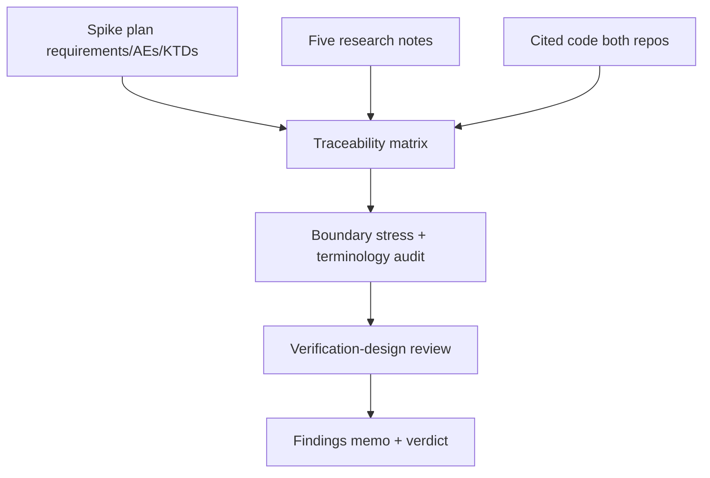

# Direction 2 Cross-Check Audit - Plan

## Goal Capsule

- **Objective:** A concise findings memo states whether the Direction 2 spike plan is ready across its eight implementation units, separating verified facts, plan assumptions, contradictions, and launch blockers. Bare R/AE/KTD/U IDs refer to this audit; spike-plan identifiers use their `incremental-materialized-cache-*` anchors from docs/plans/IDENTIFIER-MAP.md.
- **Means:** Read-only traceability audit of the spike plan against both research sets plus directly cited code, reusing the KTD verdict taxonomy the Skip side already established (KTD1).
- **Product authority:** Settled by the user in conversation. This plan owns only the audit; the spike plan and research notes are inputs and are not edited.
- **Execution profile:** Knowledge work only. No code changes, no benchmark runs, no edits to the spike plan or research notes. The memo is a separate artifact.
- **Stop conditions:** Stop and report if a source file cited as evidence is unreadable or a WIP dependency cannot be classified as settled-vs-prerequisite; each is a memo limitation, not a reason to widen scope.

---

## Product Contract

### Summary

Audit the Direction 2 backend-native materialized-cache spike plan against its supporting research and the code that determines feasibility, then deliver a findings memo with an executive verdict of ready, ready with explicit prerequisites, or blocked.

### Problem Frame

The spike plan is marked implementation-ready and proposes eight implementation units. Its correctness claims rest on Skip host behavior, Convex write-log and sync semantics, and lifecycle policies spread across two repositories. The audit exists to check those claims before implementation starts, so the spike implementation units do not build on a contradicted premise or an uncommitted upstream WIP treated as settled fact.

### Requirements

**Matrix and evidence**

- R1. Every requirement, acceptance example, and key technical decision in the spike plan (anchors in docs/plans/IDENTIFIER-MAP.md under `incremental-materialized-cache-*`) has one matrix row with plan claim, supporting research claim, directly cited implementation evidence where available, and verdict of aligned, underspecified, contradicted, or unverified.
- R2. Every matrix row without an evidence path is classified as a deliberate backend policy, an unverified external premise, or an upstream prerequisite. Only a behavior the backend can choose and enforce is marked as a host-policy assumption.

**Source re-check**

- R3. Highest-risk claims are re-checked against the cited code in both repositories: host surface and atomic update, persistent graph and inverse reducer plus ordered take-50 feed, write-log grouping and snapshot and fence recovery, registry and schema metadata, sync subscription and version semantics, Node-child lifecycle and local-backend wiring.

**Terminology and boundaries**

- R4. Lifecycle states, fallback reasons, required version, applied and published and fence timestamps, and generation invalidation mean the same thing in every document, and the five-table shared room-feed contract is confirmed as the sole binding vehicle.
- R5. The five correctness boundaries are stressed: atomic multi-table apply with no torn state, seed and tail fencing, serialized read-many with version pinning and no read and subscribe race, index and schema ineligibility before stale serve, and attributable native fallback on failure.

### Acceptance Examples

- AE1. Given one committed transaction touching membership and likes, when the matrix row for atomicity is closed, then it cites a single `ServiceInstance.update` batch, one room notification, and the host-package test (`incremental-materialized-cache-u-skip-host-package`) that pins merge versus notifier ordering.
- AE2. Given the `read_many` plus `view-version-expired` surface, when U2 observes each item as committed code at a cited path plus lines versus uncommitted or only-cited, then committed items are treated as settled facts and the rest as prerequisites with the observed WIP state cited.
- AE3. Given the JSON value boundary, when the memo is written, then int64 and bytes and missing-field handling is either a lossless contract or an explicit safe-subset restriction, with the test that closes it.

### Scope Boundaries

- No edits to code, the spike plan, or any research note.
- No performance benchmark or scaling measurement; `incremental-materialized-cache-u-scaling-study-verdict` behavior is reviewed as a design, not executed.
- No new product API or consistency-mode design.

### Deferred to Follow-Up Work

- Executing the audit itself beyond this plan (a later `ce-work` knowledge-work run).
- Re-verifying claims if upstream WIP (`read_many`, version expiry) lands after the memo.

### Sources / Research

- docs/plans/2026-09-10-1702-feat-skip-incremental-materialized-cache-spike-plan.md — audited artifact; its requirements, acceptance examples, KTDs, and units resolve via the `incremental-materialized-cache-*` anchors in docs/plans/IDENTIFIER-MAP.md.
- docs/plans/2026-09-11-1159-feat-skip-shared-prerequisites-plan.md — P contract, Q12 four-gate methodology, five-table contract.
- research/skip-convex-integration/research-skip-engine.md — engine and reducer semantics.
- research/skip-convex-integration/research-poc-vehicle-and-harness.md — two-table history, keying and harness shape.
- research/skip-convex-integration/overview.md — direction map and vehicle supersession note.
- research/skip-convex-integration/research-publication-state-semantics.md — current versus comparison-ready vocabulary.
- research/skip-convex-integration/semantic-vectors-v1.md — V1–V6 corpus.
- docs/research/research-dir2-host-requirements.md in ~/src/skip — KTD verdict taxonomy and requirements list.
- docs/research/research-dir2-skip-evidence.md in ~/src/skip — per-KTD Skip-repo evidence with line refs.
- crates/database/src/committer.rs, crates/database/src/write_log.rs, crates/database/src/subscription.rs, crates/database/src/snapshot_manager.rs, crates/sync/src/worker.rs, crates/node_executor/src/local.rs — Convex seams.

---

## Planning Contract

### Key Technical Decisions

- KTD1. Matrix verdicts reuse the Skip-side taxonomy of validated here, validated premise, cross-checked, and trust upstream, extended with aligned, underspecified, contradicted, and unverified for the memo rows. Governs R1, R2.
- KTD2. Uncommitted upstream WIP is never treated as settled fact. Serialized `read_many`, `view-version-expired`, and generation-bound invalidation are prerequisites in the memo even though the spike plan cites them as mechanisms. Governs R3, R5.
- KTD3. The five-table shared room-feed contract is the sole binding vehicle. The two-table tutorial vehicle is historical context wherever it appears. Governs R4.
- KTD4. The audit is strictly read-only and produces a separate memo. Findings name exact source locations and the test that closes each one instead of editing the inputs. Governs R1–R5.

### High-Level Technical Design

### Assumptions

- Plan readiness means validating the spike plan against both research sets and directly cited code where it determines feasibility.
- `~/src/skip` is a read-only reference checkout; its WIP state at audit time is recorded, not fixed.
- `@skipruntime` 0.0.23 registry availability and the `skargo` fallback are checked as stated in the spike plan dependencies; a failed resolution is recorded as a prerequisite or blocker for affected spike units.

---

## Implementation Units

### U1. Build the requirement traceability matrix

- **Goal:** One evidence row per spike-plan requirement, acceptance example, and KTD with a verdict.
- **Requirements:** R1, R2.
- **Dependencies:** None.
- **Files:**
  - docs/plans/2026-09-10-1702-feat-skip-incremental-materialized-cache-spike-plan.md
  - research/skip-convex-integration/research-skip-engine.md
  - research/skip-convex-integration/research-poc-vehicle-and-harness.md
  - research/skip-convex-integration/overview.md
  - research/skip-convex-integration/research-publication-state-semantics.md
  - research/skip-convex-integration/semantic-vectors-v1.md
- **Approach:**
  1. Extract plan requirement plus chosen design per row.
  2. Attach supporting claims from the five research notes.
  3. Attach direct implementation evidence cited by those notes.
  4. Assign a verdict and classify each evidence-free row as backend policy, external premise, or upstream prerequisite; use the host-policy label only for backend-enforceable behavior.
- **Test scenarios:**
  - Every spike-plan requirement, acceptance example, and KTD has a row; none is silently dropped.
  - Each contradicted or unverified row names the exact conflicting source location.
- **Verification:** Matrix covers every spike-plan requirement, acceptance example, and KTD with no empty verdict.

### U2. Re-check highest-risk source claims

- **Goal:** Confirm or contradict the feasibility-critical code claims in both repos.
- **Requirements:** R3.
- **Dependencies:** U1.
- **Files:**
  - crates/database/src/committer.rs
  - crates/database/src/write_log.rs
  - crates/database/src/subscription.rs
  - crates/database/src/snapshot_manager.rs
  - crates/sync/src/worker.rs
  - crates/node_executor/src/local.rs
  - docs/research/research-dir2-host-requirements.md in ~/src/skip
  - docs/research/research-dir2-skip-evidence.md in ~/src/skip
- **Approach:**
  1. Record each repository's resolved revision, branch or ref, and dirty-state summary before inspecting its cited code; associate each code citation and WIP classification with that provenance.
  2. Verify single-collection `ServiceInstance.update` with no `isInit`, fork-then-merge, tombstone deletes, and non-monotonic timestamp rejection against the Skip-side line refs.
  3. Verify reducer inverse and null-to-recompute, take-50 maintenance status, and the JSON int64 and bytes and missing-field boundary.
  4. Verify LogReader tail grouping by commit timestamp, snapshot capture plus fence, retention handling, registry validation, and required-version composition plus readable-window expiry.
  5. Resolve `@skipruntime` 0.0.23 from the registry; if unavailable, verify the documented `skargo` fallback. Run an installed-artifact smoke (init, one combined update, read, notification) against the resolved package and record the tarball hash plus smoke outcome as the prerequisite or blocker.
- **Test scenarios:**
  - Merge versus notifier ordering gap is recorded with the host-package test (`incremental-materialized-cache-u-skip-host-package`) that must pin it.
  - Read and subscribe race is recorded with the subscribe-before-first-snapshot sequence plus version-tagged notifications.
  - RetentionCoordinator deferral and `ba16e0638` fixture loss are recorded as constraints, not contradictions.
  - Registry failure or an unusable `skargo` fallback is attributed to affected spike units rather than omitted from the readiness verdict.
- **Verification:** Each high-risk claim resolves to confirmed, contradicted, or open with a cited line and repository provenance; runtime-package availability has an explicit recorded outcome.

### U3. Audit terminology and vehicle consistency

- **Goal:** One shared vocabulary plus one binding vehicle across all documents.
- **Requirements:** R4.
- **Dependencies:** U1.
- **Files:**
  - research/skip-convex-integration/research-publication-state-semantics.md
  - docs/plans/CROSS-SPIKE-TRACEABILITY.md
  - docs/plans/IDENTIFIER-MAP.md
- **Approach:**
  1. Normalize lifecycle states, all twelve fallback reasons, required version, applied and published and fence timestamps, and generation invalidation.
  2. Check validated-here and cross-checked and trust-upstream phrasing against actual cited lines.
  3. Confirm the five-table contract is the only vehicle any correctness claim depends on.
- **Test scenarios:**
  - `current` never depends on the comparator while `comparison-ready` requires all four Q12 gates.
  - No finding relies on the retired two-table aggregates A1 or A2.
- **Verification:** Terminology table plus vehicle confirmation, each with source locations.

### U4. Stress correctness boundaries and verification design

- **Goal:** Prove each boundary and each spike-plan acceptance example has an executable test home.
- **Requirements:** R5.
- **Dependencies:** U2, U3.
- **Files:**
  - docs/plans/2026-09-11-1159-feat-skip-shared-prerequisites-plan.md
  - research/skip-convex-integration/semantic-vectors-v1.md
- **Approach:**
  1. Check the five R5 boundaries and KTD2 WIP seams first; on a decisive blocker record the blocked-verdict path, give blocker-linked rows full evidence and line refs, and mark all other unfinished rows blocked or unverified with reason. Such a memo cannot rise above blocked.
  2. Walk the five boundaries: atomic apply, fencing, serialized read with pinning, eligibility gating, attributable fallback.
  3. Map each spike-plan acceptance example to its spike unit test home and harness endpoint, flagging assertions the stated fixtures, public Skip API, or local-backend harness cannot prove.
  4. Confirm the scaling study separates update deltas from seed and rebuild and state cost and fails all-fallback runs.
- **Test scenarios:**
  - Covers `incremental-materialized-cache-atomic-multi-table-update`. Multi-table commit maps to one batch, one notification, no torn observation.
  - Covers `incremental-materialized-cache-restart-without-stale-publication`. Writes immediately before and after snapshot capture both survive fencing.
  - A scaling run with every relevant request fallen back is recorded as failed, not as a curve.
- **Verification:** Boundary checklist plus acceptance-example-to-test map with no unmapped spike-plan acceptance example; blocked or unverified marks are accepted only under a recorded decisive blocker.

### U5. Write the findings memo and verdict

- **Goal:** Severity-grouped memo with an actionable launch verdict.
- **Requirements:** R1, R2, R3, R4, R5.
- **Dependencies:** U1, U2, U3, U4.
- **Files:**
  - research/skip-convex-integration/2026-09-15-1434-chore-direction2-crosscheck-audit-memo.md
- **Approach:**
  1. Group findings as Blocker, Required clarification, or Risk and watch item.
  2. Give each finding source locations, impacted IDs, a document correction or implementation constraint, and the closing test.
  3. Close with a resolved-assumptions list separating source-verified behavior from backend-owned policy and the smallest prerequisite work to unblock the spike implementation units.
- **Test scenarios:**
  - Executive verdict is exactly one of ready, ready with explicit prerequisites, or blocked.
  - No unresolved contradiction remains on atomicity, freshness and version pinning, recovery fencing, index and schema eligibility, or fallback observability.
- **Verification:** Memo states whether the spike implementation units can begin and what unblocks them if not; a memo carrying blocked or unverified rows from a decisive blocker is capped at blocked.

---

## Verification Contract

| Gate | Applies to | Passing outcome |
|---|---|---|
| Matrix completeness | U1 | Every spike-plan requirement, acceptance-example, and KTD row present with verdict and evidence classification |
| Source citation and provenance check | U2, U3 | Every material code claim carries a repo-relative path with lines and a recorded repository revision and dirty state; runtime-package availability has a recorded outcome |
| Boundary and acceptance-example mapping | U4 | Five boundaries stressed; every spike-plan acceptance example has a test home or an explicit gap flag |
| Memo shape | U5 | Verdict plus severity groups plus resolved assumptions plus unblocker; verdict is blocked while any contradicted R5-boundary row lacks a correction plus closing test, and ready requires zero contradicted rows with unverified rows as explicit prerequisites |

---

## Definition of Done

- Matrix, terminology table, boundary checklist, and acceptance-example map are complete with no silent drops.
- Every finding carries source locations, impacted IDs, a correction or constraint, and its closing test.
- Verdict states spike implementation-unit readiness plus the smallest prerequisite work when not ready; ready requires zero contradicted rows, and blocked holds while any contradicted R5-boundary row lacks a correction plus closing test.
- No edits were made to the spike plan, research notes, or code.
