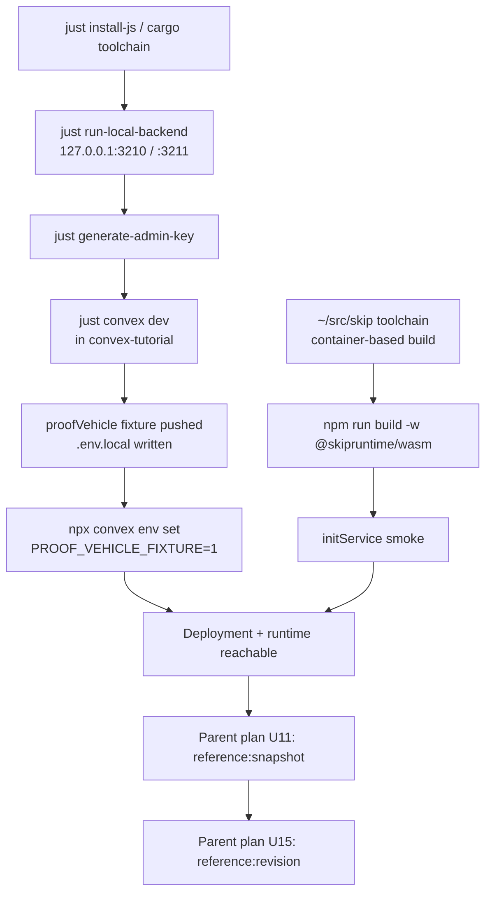

# Skip Local Convex Development Infrastructure - Plan

This plan was split out of
[the Skip Shared Prerequisites plan](2026-09-11-1159-feat-skip-shared-prerequisites-plan.md)
on 2026-09-26. That plan's U11 and U15 each name the identical unmet
requirement — "a live local Convex deployment this environment doesn't
have" — as their sole remaining blocker; every other requirement either
unit names (Q9, Q14, AE4, AE6, AE7, AE12, AE13, F1-F5, P3, P4, P9) is
already satisfied by code sitting in the `skip` worktree. Standing up
that deployment is not itself part of proving Q or P; it is
infrastructure both units currently assume exists. This plan makes it
exist. U11 and U15 stay in the parent plan and consume this plan's
Definition of Done as a dependency; they do not move here.

---

## Goal Capsule

- **Objective:** A reachable local Convex deployment plus a built Skip
  WASM runtime, both addressable at fixed loopback URLs, such that the
  parent plan's U11 (`reference:snapshot`) and U15 (`reference:revision`)
  can run against something real instead of stopping at "no deployment."
- **Means:** Use `convex-backend`'s own `Justfile` dev workflow
  (`run-local-backend`, `generate-admin-key`, `convex`) rather than the
  self-hosted Docker Compose path — this repo already builds the backend
  from source and the Docker path would add a daemon dependency this
  environment doesn't have running. Reuse the parent plan's own
  toolchain finding for `@skipruntime/wasm` (built via `container` in
  place of Docker) instead of re-deriving it.
- **Product authority:** Derived directly from the parent plan's U11 and
  U15 unit definitions and its Verification Contract's "Skip runtime
  prerequisite" and "Snapshot reference" / "Revision reference" rows.
  Not separately brainstormed.
- **Open blockers:** None known going in. Every command below has
  already been located in this repo's `Justfile` and `BUILD.md`; nothing
  here needs a new tool or a new external service.
- **Stop conditions:** Stop and escalate to the parent plan's Goal
  Capsule if a unit here turns out to need a Skip runtime, FFI, or
  convex-backend code change (P8 in the parent plan) — this plan only
  wires up existing tooling, it does not extend either codebase. Stop if
  the Skiplang toolchain cannot be built by any documented path; do not
  substitute a mock runtime (parent plan, same constraint, restated
  here for I3).
- **Execution profile:** Two repositories touched: `convex-backend`
  (running the existing local backend, no code changes) and
  `convex-tutorial` (pushing the existing `proofVehicle` fixture, no
  code changes). The `skip` worktree's build is exercised but not
  edited. No pushes to any remote without explicit user approval.

---

## Product Contract

### Summary

Stand up, once, the local Convex deployment and Skip WASM runtime that
the parent plan's U11 and U15 need to run against a real system instead
of a mock. This plan produces no test code and asserts no correctness
claims of its own; its Definition of Done is "the deployment and runtime
exist, are reachable, and hold the expected fixture" — the parent
plan's own reference scripts remain the thing that proves Q and P.

### Problem Frame

The parent plan's frontmatter already states, unit by unit, that every
code dependency for U11 (U3, U5, U7-U10, U12) and for U15 (U11, U13,
U14) is done. What is not done is infrastructure: no local backend has
ever been started in this environment, `convex-tutorial` has never been
pushed anywhere (no `.env.local` exists), and the Skiplang toolchain's
build path (LLVM 20 + matching `wasm-ld`, or the `container`-based
substitute the parent plan's U3 already found) has not been run to
completion end-to-end. Treating this as a fifth implementation unit
inside the parent plan would conflate "prove Q/P" work with "make a
server exist" work — this split keeps the parent plan's Definition of
Done about correctness claims, and puts the infrastructure prerequisite
in its own reviewable, independently-useful place (anyone else building
against this repo's local backend needs the same three things: a
running backend, a pushed fixture, and a built Skip runtime).

### Requirements

**Convex local backend**

- I1a. `local_backend` builds and runs from source via
  `just run-local-backend`, listening on `127.0.0.1:3210` (RPC) and
  `127.0.0.1:3211` (HTTP actions), using the existing `Justfile`
  recipes (`init-instance-secret`, `generate-admin-key`) with no new
  secrets material introduced.
- I1b. The backend survives a `reset-local-backend` / restart cycle
  without manual intervention, so a failed run can be retried cleanly.

**Fixture deployment**

- I2a. `convex-tutorial`'s `proofVehicle` functions push cleanly to the
  running local backend via `npx convex dev --once` with `--admin-key`
  and `--url` passed explicitly from the backend checkout's key recipe
  (the `just convex` wrapper only resolves inside `convex-backend`),
  producing a `.env.local` the loader CLI and `ConvexClient`-based
  reference source can both read.
- I2b. `PROOF_VEHICLE_FIXTURE=1` is set on the deployment (`npx convex
  env set`), matching the parent plan's Verification Contract row for
  the snapshot reference run.
- I2c. The parent plan's KTD3 four-thing coupling (function names, `allSelectedRows`'s
  tagged row shape, the corpus file, the loader CLI's JSON output) is
  confirmed live-reachable: the loader CLI runs against this
  deployment and produces output U5/U8's version check accepts.

**Skip WASM runtime**

- I3a. `@skipruntime/wasm` builds successfully (`npm run build -w
  @skipruntime/wasm` in `~/src/skip`) using the toolchain path the
  parent plan's U3 already established (`container`-based build in
  place of a native LLVM 20 + `skargo` install), recorded by version /
  image reference the way U3 already does.
- I3b. A trivial `initService` smoke (start the runtime, register one
  resource, observe one update, shut down cleanly) passes outside any
  test file, to separate "the runtime builds and runs" from "Q's
  reference service is correct" (the latter stays U11/U15's job).

**Process and sandbox readiness**

- I4a. The backend (I1) and `convex dev` in watch mode (started after
  I2's one-shot push) are documented as long-lived
  processes that must be running concurrently with any U11/U15 run;
  this plan states how to start and confirm each is up, not how to
  keep them up across sessions.
- I4b. Q's reference service (U11's `reference/service.ts`) needs a
  loopback bind; this plan proves that bind succeeds under this
  environment's sandbox with the narrow loopback permission first
  (`sandbox.network.allowLocalBinding`), so U11 isn't blocked a
  second time by an unrelated permission gate right after this plan
  closes the deployment gap. A bypass — running outside the sandbox
  or with the sandbox disabled — does not satisfy this requirement.

### Acceptance Examples

- AE1. Given a clean checkout with no `convex_local_storage/` and no
  `convex_local_backend.sqlite3`, when `just run-local-backend` is run,
  then the process listens on `127.0.0.1:3210` and `127.0.0.1:3211` and
  `just generate-admin-key` returns a non-empty key derived from the
  freshly-generated instance secret.
- AE2. Given that running backend, when `just convex dev` is run from
  `convex-tutorial`, then it pushes with no errors and writes a
  `.env.local` containing `CONVEX_URL=http://127.0.0.1:3210` (or the
  self-hosted equivalent variable names `just convex` actually uses).
- AE3. Given the pushed deployment, when the tutorial's loader CLI
  (KTD5) is run against it, then its JSON output's `fixtureSetVersion`
  matches the vendored copy in the Skip worktree at
  `skip: examples/convex_proof_harness/testdata/v1.parity.json` (U8's
  parity check target).
- AE4. Given `~/src/skip`, when `npm run build -w @skipruntime/wasm` is
  run using the `container`-based path, then it exits 0 and produces a
  `dist/` this environment didn't have before, and a follow-up
  `initService` smoke script starts, registers one resource, observes
  one update, and shuts down without a hung process.
- AE5. Given both the backend and the Skip runtime running, when U11's
  `reference/service.ts` (once written) attempts its loopback bind,
  then the bind succeeds under the in-sandbox setting this plan's I4
  confirmed; an EPERM there fails this plan rather than passing with
  a documented bypass.

### Scope Boundaries

- No changes to `local_backend`, `convex-tutorial`'s `proofVehicle`
  fixture, or any `skip` source file — this plan runs existing tooling,
  it does not extend it.
- No production or hosted deployment. Loopback only, matching every
  other unit's loopback-only constraint in the parent plan.
- No writing of U11's or U15's actual reference scripts
  (`reference/{service,source,run}.ts`) — those stay the parent plan's
  units and consume this plan's Definition of Done as their dependency.
- No push to any git remote in any of the three repositories without
  explicit user approval.

### Deferred to Follow-Up Work

- Writing and passing U11's and U15's own test scenarios — unchanged,
  still owned by the parent plan.
- Any persistent/production hosting of the local backend (fly.io,
  Railway, S3 storage, Postgres/MySQL backing) — self-hosting's
  advanced configuration docs cover that ground if it's ever needed;
  nothing here requires it.
- Automating "start the backend and `convex dev` on every session" —
  out of scope; this plan documents the manual commands, not a
  supervisor process.

### Sources / Research

- `docs/plans/2026-09-11-1159-feat-skip-shared-prerequisites-plan.md`
  — U11, U15, and the Verification Contract rows this plan exists to
  unblock.
- `BUILD.md` — `just install-js`, `just run-local-backend`, demo
  provisioning walkthrough.
- `Justfile` — `run-local-backend`, `generate-admin-key`,
  `init-instance-secret`, `convex`, `reset-local-backend` recipes (the
  concrete commands this plan's units run).
- `self-hosted/README.md` — the Docker Compose alternative, considered
  and rejected in KTD1 below in favor of the `Justfile` path already
  native to this repo.
- `~/src/skip/INSTALL.md` — Skiplang toolchain dependencies (LLVM 20,
  matching `wasm-ld`, TypeScript 5.7+) and the native build path.
- `~/src/skip/Dockerfile` — the containerized build path the parent
  plan's U3 already used via Apple's `container` CLI in place of
  Docker.

---

## Planning Contract

### Key Technical Decisions

- KTD1. **Use the `Justfile` dev workflow, not self-hosted Docker
  Compose.** `convex-backend` already builds `local_backend` from
  source with `just run-local-backend`, and `just convex`/
  `just generate-admin-key` already wrap the admin-key and URL
  plumbing the self-hosted Docker path exists to avoid hand-rolling.
  Docker Compose would add a `docker compose` daemon dependency this
  environment doesn't have (only Apple's `container` CLI is present,
  no Docker daemon); the `Justfile` path needs only `cargo`, already
  installed and toolchain-pinned via `rust-toolchain`. Governs I1, I2.
- KTD2. **The generated instance secret and admin key are dev-only and
  loopback-scoped.** `Justfile`'s own comment states the default admin
  key is safe "as long as the backend is running locally"; this plan
  treats that as given and does not add key rotation, since the parent
  plan's units never serve this backend beyond loopback. Governs I1.
- KTD3. **Reuse, don't re-derive, the parent plan's U3 toolchain
  finding for `@skipruntime/wasm`.** The prior session already
  unblocked the Skiplang toolchain build via `container` in place of a
  native LLVM 20 + `wasm-ld` install; this plan's I3 repeats and
  verifies that path end-to-end (through a runtime smoke, not just a
  build exit code) rather than treating it as a fresh unknown. If that
  path no longer works, this plan escalates under the parent plan's
  stop condition rather than substituting a mock. Governs I3.
- KTD4. **Long-lived processes are documented, not embedded.** The
  backend and `convex dev` must stay running for the full duration of
  any U11/U15 run; this plan's I4 states how to start and confirm them
  (each as its own long-lived process, started ahead of time: the
  backend from I1, and `convex dev` in watch mode without `--once`
  started after I2's one-shot push — via
  `run_in_background` or the user's own terminal) rather than having
  any single test command spawn and tear them down, since U11/U15's
  scripts assume a URL that's already live. Governs I1, I4.

### High-Level Technical Design

### Assumptions

- `cargo`, `just`, `node` 22.x, and `npm` are already installed and
  correctly versioned in this environment (confirmed: rust
  `nightly-2026-06-28` with `wasm32-wasip1` active via
  `rust-toolchain`, node 22.22.2, `just` and `container` on `PATH`).
- No Docker daemon is available or needed; every command in this plan
  either runs natively or through the already-proven `container` CLI
  substitute.
- The `skip` worktree at `feat/skip-shared-prereqs` (where U1-U16's
  code already lives) is the one this plan's I3/I5 build and smoke-test
  against; this plan does not create a new worktree.

---

## Implementation Units

### I1. Build and run the Convex local backend

- **Goal:** A running `local_backend` reachable at fixed loopback URLs.
- **Requirements:** I1a, I1b.
- **Dependencies:** None.
- **Files:** None changed; runs existing `Justfile` recipes.
- **Approach:**
  1. `npm clean-install --prefix scripts && just install-js` (idempotent
     if already done).
  2. `just run-local-backend` as a long-lived background process;
     confirm both `127.0.0.1:3210` and `:3211` accept connections.
  3. Confirm `just generate-admin-key` returns a stable, non-empty key
     across repeated calls (reuses the persisted secret, per KTD2).
  4. Exercise `just reset-local-backend` once against a throwaway run
     to confirm a clean restart works (I1b), then start the real run
     fresh.
- **Test scenarios:**
  - Backend starts with no prior `convex_local_storage/`.
  - A second `just run-local-backend` after `reset-local-backend`
    starts clean with a freshly generated secret and key.
  - `generate-admin-key` is idempotent within one storage directory.
- **Verification:** `curl` (or equivalent) against `127.0.0.1:3210` and
  `:3211` succeeds while the process runs; `just generate-admin-key`
  exits 0 with non-empty output.

### I2. Push the proof-vehicle fixture to the running backend

- **Goal:** `convex-tutorial`'s `proofVehicle` functions live on the
  backend from I1, with the fixture flag set.
- **Requirements:** I2a, I2b, I2c.
- **Dependencies:** I1.
- **Files:** `/Users/bill/src/convex-tutorial/.worktrees/feat-skip-shared-prereqs/.env.local`
  (generated, not hand-written).
- **Approach:**
  1. From the fixture worktree
     (`/Users/bill/src/convex-tutorial/.worktrees/feat-skip-shared-prereqs`,
     the checkout whose `convex/` holds `proofVehicle/`), run
     `npx convex dev --once` with the backend's key and URL passed
     explicitly:
     `npx convex dev --once --admin-key "$(just --justfile
     ~/src/convex-backend/Justfile generate-admin-key)" --url
     http://127.0.0.1:3210`.
     The `just convex` wrapper recipe is not used here: `just` resolves
     its command file upward from the invocation directory, so it finds
     no `Justfile` from a sibling checkout, and the recipe's inner key
     lookup resolves the same way.
  2. `npx convex env set PROOF_VEHICLE_FIXTURE 1` with the same explicit
     key and URL flags, against the same deployment.
  3. Run the tutorial's loader CLI (KTD5 in the parent plan) against
     this live deployment and diff its JSON output's
     `fixtureSetVersion` against
     `skip: examples/convex_proof_harness/testdata/v1.parity.json`
     (the vendored copy in the Skip worktree).
- **Test scenarios:**
  - Push succeeds with no schema or function errors.
  - `PROOF_VEHICLE_FIXTURE` reads back as `1` via `npx convex env get`
    with the same explicit key and URL flags.
  - Loader CLI's live output matches the vendored fixture-set version
    (I2c); a mismatch fails this unit rather than being silently
    absorbed by U11 later.
- **Verification:** `npx convex env get PROOF_VEHICLE_FIXTURE` (same
  explicit flags) returns `1`; loader CLI exits 0 with a matching
  `fixtureSetVersion`.

### I3. Build and smoke-test the Skip WASM runtime

- **Goal:** `@skipruntime/wasm` built and confirmed runnable, separate
  from any correctness claim about Q's reference service.
- **Requirements:** I3a, I3b.
- **Dependencies:** None (buildable in parallel with I1/I2).
- **Files:** None changed in `skip`; build artifacts only.
- **Approach:**
  1. Reuse the `container`-based toolchain path the parent plan's U3
     already established; record the image/toolchain version the way
     U3's frontmatter note already does, so a later drift is
     detectable.
  2. `npm run build -w @skipruntime/wasm` in `~/src/skip`.
  3. Write and run a throwaway smoke script (not committed as a test —
     this is infra verification, not a Q test scenario) that calls
     `initService`, registers one resource, writes one value, observes
     one update, and shuts down.
- **Test scenarios:**
  - Build exits 0 and produces `dist/`.
  - Smoke script observes exactly one update and exits cleanly with no
    hung handles.
- **Verification:** `npm run build -w @skipruntime/wasm` exits 0; smoke
  script exits 0.

### I4. Confirm sandbox/process readiness for the reference service

- **Goal:** Document what U11's `reference/service.ts` needs from this
  environment's sandbox before that unit is attempted, so it fails once
  (here, with a named cause) rather than a second time (there, as a
  generic EPERM).
- **Requirements:** I4a, I4b.
- **Dependencies:** I1, I3.
- **Files:** None changed; this plan's I4 outcome records the finding in place.
- **Approach:**
  1. Start a throwaway Express listener bound explicitly to
     `127.0.0.1` on an unused port, the same way U11's `service.ts`
     plans to, under this environment's default sandbox.
  2. First list the effective sandbox settings from this session's
     sandbox documentation to confirm the exact loopback-bind key name
     and whether it needs a restart; then test the throwaway listener
     with the narrow loopback permission first. If the bind fails under
     every in-sandbox setting, fail this unit and escalate to the
     parent plan — do not record running outside the sandbox or with
     it disabled as the documented path.
  3. Record only the observed working in-sandbox option as the
     documented path U11 follows,
     rather than rediscovering it mid-U11.
- **Test scenarios:**
  - The throwaway listener binds successfully under the confirmed
    setting.
  - A non-loopback bind attempt (e.g., `0.0.0.0`) is confirmed to still
    fail/refuse, matching every other unit's loopback-only constraint.
- **Verification:** A throwaway `127.0.0.1`-bound listener starts and
  accepts a connection under the documented setting.

### I5. End-to-end reachability smoke

- **Goal:** One check that all three pieces (backend, fixture,
  runtime) are simultaneously reachable, as the actual gate this plan
  exists to close.
- **Requirements:** All of I1-I4.
- **Dependencies:** I1, I2, I3, I4.
- **Files:** None changed.
- **Approach:** With the backend (I1) and watch-mode `convex dev`
  (started after the I2 push) running and
  the Skip runtime built (I3) under the confirmed sandbox setting (I4),
  run a minimal script that: subscribes to the tutorial's
  `allSelectedRows` query via `ConvexClient` against the live backend,
  starts a Skip `initService` instance, and confirms both are
  observably alive at the same time (one read from each, no
  correctness comparison — that's U11's job).
- **Test scenarios:**
  - Both the Convex read and the Skip read succeed in the same process
    run.
  - The script exits 0 and leaves no orphaned process.
- **Verification:** Smoke script exits 0.

---

## Verification Contract

| Scope | Command | Proves |
|---|---|---|
| Backend up | `just run-local-backend` (background) + a loopback connectivity check | I1 |
| Fixture pushed | `npx convex dev --once` with explicit key/URL flags from the fixture worktree, then `npx convex env get PROOF_VEHICLE_FIXTURE` with the same flags | I2 |
| Skip runtime | `npm run build -w @skipruntime/wasm` in `~/src/skip`, then the I3 smoke script | I3 |
| Sandbox readiness | throwaway `127.0.0.1` bind under the confirmed sandbox setting | I4 |
| Reachability | I5's combined smoke script | I5, this plan's Definition of Done |

---

## Definition of Done

- `just run-local-backend` serves a fresh deployment reachable on
  `127.0.0.1:3210`/`:3211`.
- `convex-tutorial`'s `proofVehicle` fixture is pushed to that
  deployment with `PROOF_VEHICLE_FIXTURE=1` set, and the loader CLI's
  live output matches the vendored `fixtureSetVersion`.
- `@skipruntime/wasm` is built and passes a runtime smoke independent
  of any Q test.
- U11's `reference/service.ts` loopback bind is proven to succeed under
  the confirmed in-sandbox setting, not left to be rediscovered
  mid-U11; a bypass does not satisfy this plan.
- No code in `local_backend`, `convex-tutorial`, or `skip` was changed
  to reach this state.
- The parent plan's U11 can begin writing and running
  `reference/{service,source,run}.ts` against a real, already-reachable
  deployment; U15 follows once U11 passes.
