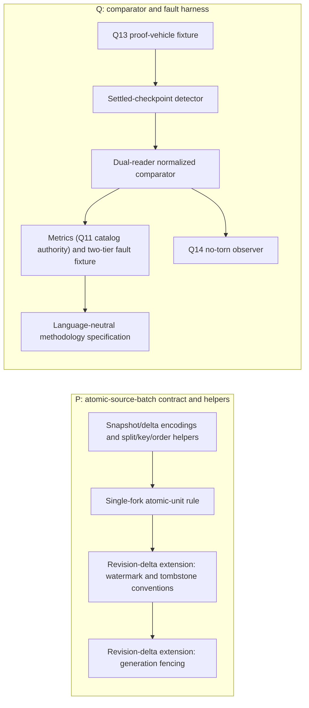
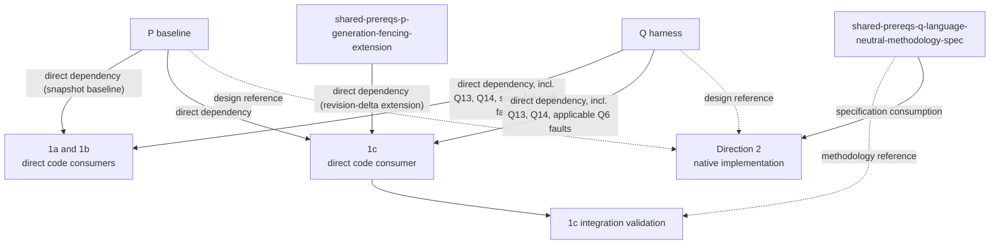

# Skip/Convex detailed prerequisites

P and Q are the shared plan's two deliverables. This document names what each
produces and how each downstream direction consumes it.

| Output | Produces | 1a / 1b | 1c | Direction 2 |
|---|---|---|---|---|
| P snapshot baseline | `AtomicSourceBatch` specification (both encodings), TypeScript `SnapshotBatch` helpers, split/key/order helpers, single-fork rule | Direct dependency (adopted 2026-09-23); the only P tier 1a/1b wait on | Direct dependency (U4) | Native implementation follows the specification; no TypeScript dependency |
| P revision-delta extension (P4, P5, `shared-prereqs-p-generation-fencing-extension`) | TypeScript `RevisionDeltaBatch` helpers: revision watermarks, tombstone/GC, staging generation, promotion, pending ledger, generation-scoped watermarks | Not a dependency | Direct dependency (U4); 1c is its first validator | Design reference only |
| Q harness | Settled detector (quiesced or workload-revision-tagged), dual-reader comparator (same-deployment `ConvexClient` default; `convex-test` only after a parity check), recorder under Q11's single catalog authority, snapshot-path fault baseline, and structured report | Direct dependency; query-state faults apply here, and 1b reuses Q7's assertions for its split/invalid-cursor triggers | Direct dependency (U6); baseline query-state faults do not apply to Data Sync | Design reference only |
| Q6 revision-delta fault extension | Cursor expiry, table replacement, oversized transaction, restart mid-CDC injectors | Not a dependency | Direct dependency (U6); proven against 1c's Data Sync triggers | Design reference only |
| `shared-prereqs-q-proof-vehicle-fixture` (Q13) | Five-table tutorial schema, indexes, deterministic mutations with acknowledgment data, native oracle, per-table queries, bounded monolithic and all-selected-rows baselines, V1-V6 corpus loader | Direct dependency: 1a's R8 subscriptions, 1b's supporting inputs and R13 baseline | Direct dependency (U5), including the KTD11 all-selected-rows baseline | May vendor the same schema and corpus manifest |
| `shared-prereqs-q-no-torn-observer` (Q14) | Observer of every published intermediate feed state; asserts no partial atomic group through the full chained graph | Direct dependency (1a Transition, 1b page-region swap) | Direct dependency (U6, exact-`ts` groups) | Implements the equivalent from Q12 |
| `shared-prereqs-q-language-neutral-methodology-spec` | Four checkpoint gates, runtime/harness vocabulary, normalization, and N/K/F metric definitions | Reference | Reference (R15 gates) | Specification consumption for native comparator and scaling work |

Implementation locations (KTD1-KTD3 of the shared plan): P is `skip: skipruntime-ts/adapters/atomic-batch/` (`@skip-adapter/atomic-batch`), Q is `skip: examples/convex_proof_harness/` (`skip-convex-proof-harness`), and Q13 is `convex-tutorial: convex/proofVehicle/`. The snapshot baseline is units `shared-prereqs-u-p-contract-scaffold` through `shared-prereqs-u-report-schemas` (U1-U12); the revision-delta tier is U13-U15; `shared-prereqs-u-methodology-spec` (U16, Q12's text) gates neither. Q14 watches a dedicated `groupProbe` resource for V6, because the canonical feed alone cannot show a membership-first tear.

**Status (2026-09-28):** every output in the table is built and validated.
U1-U16 are all done. `reference:snapshot` (U11) and `reference:revision`
(U15) pass against a live local deployment stood up by
[the local dev infrastructure plan](2026-09-26-1245-chore-skip-local-convex-dev-infra-plan.md). 1c's U4 is still the
revision-delta extension's first validator against real Data Sync pages.

Cross-document descriptive anchors are maintained in
[IDENTIFIER-MAP.md](IDENTIFIER-MAP.md); generic P/Q node labels are local to
these diagrams. Read [prerequisites.md](prerequisites.md) for the higher-level
dependency map and [planning-timeline.md](planning-timeline.md) for maturity
terminology.
The source plans are [1a](2026-09-10-1509-feat-skip-sync-protocol-client-plan.md),
[1b](2026-09-10-1843-feat-skip-paginated-reactive-source-spike-plan.md),
[1c](2026-09-10-1854-feat-skip-data-sync-push-source-spike-plan.md),
[Direction 2](2026-09-10-1702-feat-skip-incremental-materialized-cache-spike-plan.md),
and [the shared P/Q prerequisites](2026-09-11-1159-feat-skip-shared-prerequisites-plan.md).
