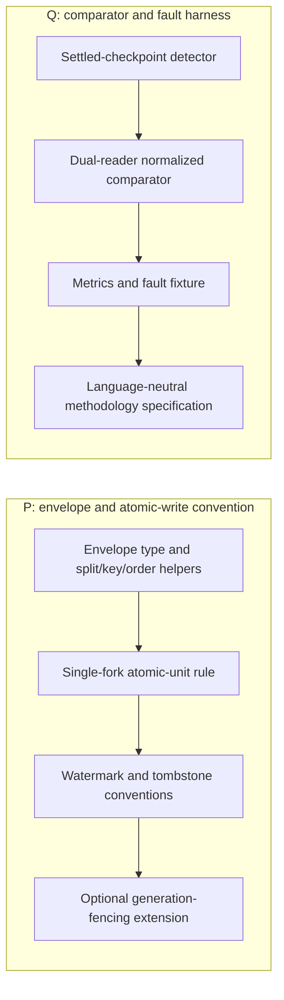
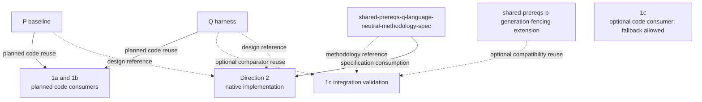

# Skip/Convex detailed prerequisites

P and Q are the shared plan's two deliverables. This document names what each
produces and how each downstream direction consumes it.

| Output | Produces | 1a / 1b | 1c | Direction 2 |
|---|---|---|---|---|
| P baseline | Envelope shape, split/key/order helpers, single-fork atomic-unit rule, watermarks, and tombstone conventions | Planned code reuse | Optional code reuse; bespoke implementation remains allowed | Design reference only |
| `shared-prereqs-p-generation-fencing-extension` | Optional staging generation, promotion, pending ledger, and generation-scoped watermarks | Not a baseline dependency | Optional compatibility reuse for stricter 1c lifecycle needs | Design reference only |
| Q harness | Settled detector, dual-reader comparator, metrics, fault fixture, and structured report | Planned code reuse | Optional code reuse for integration proof; bespoke fallback remains allowed | Design reference only |
| `shared-prereqs-q-language-neutral-methodology-spec` | Language-neutral checkpoint, normalization, and N/K/F metric definitions | Reference | Reference | Specification consumption for native comparator and scaling work |

Cross-document descriptive anchors are maintained in
[IDENTIFIER-MAP.md](IDENTIFIER-MAP.md); generic P/Q node labels are local to
these diagrams. Read [prerequisites.md](prerequisites.md) for the higher-level
dependency map and [planning-timeline.md](planning-timeline.md) for maturity
terminology.
The source plans are [1a](2026-09-10-1509-feat-skip-sync-protocol-client-plan.md),
[1b](2026-09-10-1843-feat-skip-paginated-reactive-source-spike-plan.md),
[1c](2026-09-10-1854-feat-skip-data-sync-push-source-spike-plan.md),
[Direction 2](2026-09-10-1702-feat-skip-incremental-materialized-cache-spike-plan.md),
and [the shared P/Q prerequisites](2026-09-11-1159-feat-skip-shared-prerequisites-plan.md).
