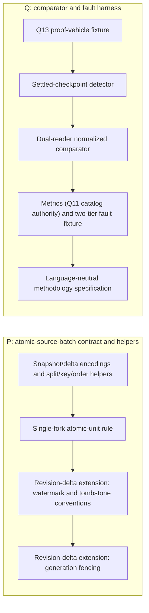
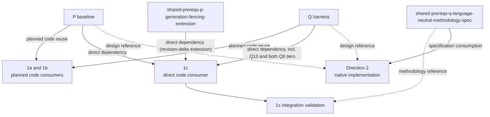

# Skip/Convex detailed prerequisites

P and Q are the shared plan's two deliverables. This document names what each
produces and how each downstream direction consumes it.

| Output | Produces | 1a / 1b | 1c | Direction 2 |
|---|---|---|---|---|
| P snapshot baseline | `AtomicSourceBatch` specification (both encodings), TypeScript `SnapshotBatch` helpers, split/key/order helpers, single-fork rule | Planned external-source code reuse; the only P tier 1a/1b wait on | Direct dependency (U4) | Native implementation follows the specification; no TypeScript dependency |
| P revision-delta extension (P4, P5, `shared-prereqs-p-generation-fencing-extension`) | TypeScript `RevisionDeltaBatch` helpers: revision watermarks, tombstone/GC, staging generation, promotion, pending ledger, generation-scoped watermarks | Not a dependency | Direct dependency (U4); 1c is its first validator | Design reference only |
| Q harness | Settled detector, dual-reader comparator, recorder under Q11's single catalog authority, snapshot-path fault baseline, and structured report | Planned code reuse | Direct dependency (U6) | Design reference only |
| Q6 revision-delta fault extension | Cursor expiry, table replacement, oversized transaction, restart mid-CDC injectors | Not a dependency | Direct dependency (U6); proven against 1c's Data Sync triggers | Design reference only |
| `shared-prereqs-q-proof-vehicle-fixture` (Q13) | Five-table tutorial schema, indexes, deterministic mutations, native oracle and baseline queries, V1-V6 corpus loader | Planned fixture | Direct dependency (U5) | May vendor the same schema and corpus manifest |
| `shared-prereqs-q-language-neutral-methodology-spec` | Four checkpoint gates, runtime/harness vocabulary, normalization, and N/K/F metric definitions | Reference | Reference (R15 gates) | Specification consumption for native comparator and scaling work |

Cross-document descriptive anchors are maintained in
[IDENTIFIER-MAP.md](IDENTIFIER-MAP.md); generic P/Q node labels are local to
these diagrams. Read [prerequisites.md](prerequisites.md) for the higher-level
dependency map and [planning-timeline.md](planning-timeline.md) for maturity
terminology.
The source plans are [1a](2026-09-10-1509-feat-skip-sync-protocol-client-plan.md),
[1b](2026-09-10-1843-feat-skip-paginated-reactive-source-spike-plan.md),
[1c](2026-09-10-1854-feat-skip-data-sync-push-source-spike-plan.md),
[Direction 2](2026-09-10-1702-feat-skip-incremental-materialized-cache-spike-plan.md),
and [the shared P/Q prerequisites](2026-09-11-1159-feat-skip-shared-prerequisites-plan.md).
