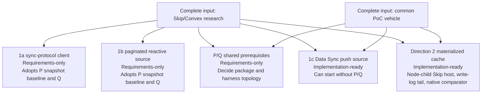
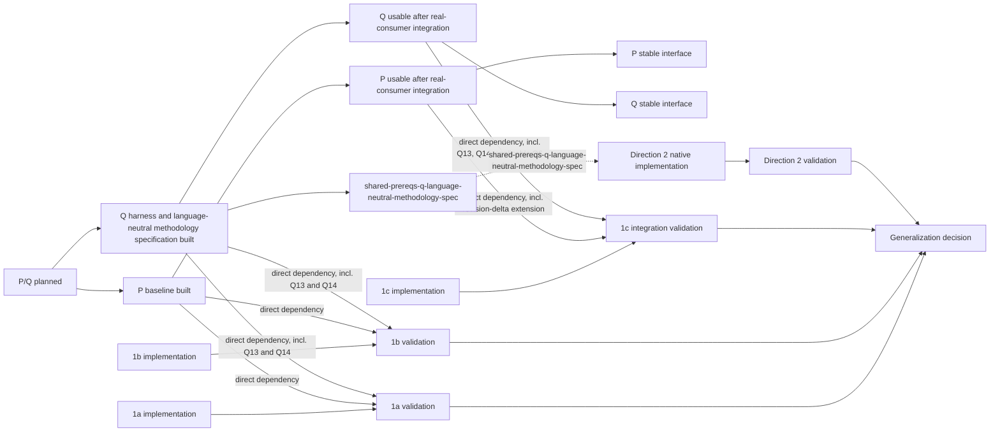
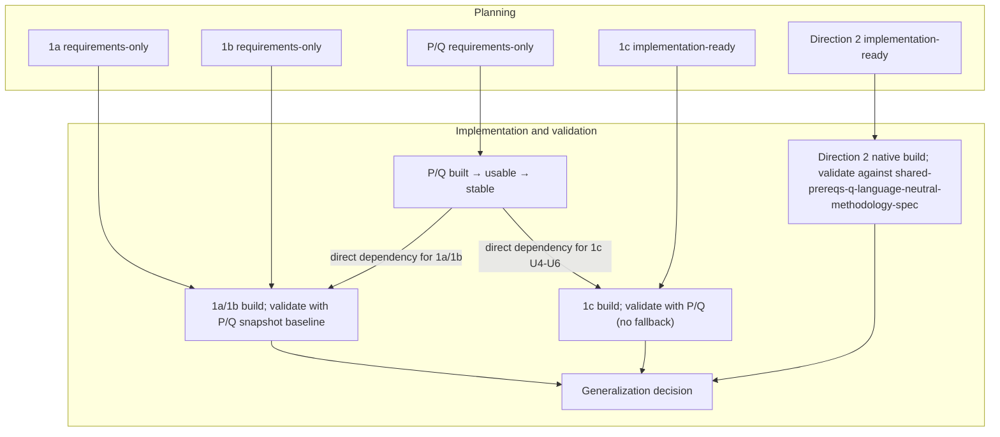

# Skip/Convex planning timeline

This timeline uses the same maturity terms for every plan in this directory.
It compares two strategic directions without treating them as phases of one
implementation.

## State taxonomy

- **Requirements-only:** product scope is captured, but implementation choices
  still need planning.
- **Decision-complete:** the decisions needed to plan are settled, but the
  implementation plan has not yet been written or reconciled.
- **Implementation-ready:** implementation units and verification criteria are
  defined; work may start.
- **Built:** the planned implementation exists, but its planned integration
  proof has not yet passed.
- **Validated:** the planned correctness and integration proof has passed.
- **Generalization decision:** evidence is sufficient to decide whether to
  harden, expand, or stop a direction; this is a decision state, not an
  automatic production commitment.

**Complete inputs** are research and the common PoC vehicle. **Usable** means
P baseline or Q is implemented and integrated by a real consumer. **Stable**
means that real-consumer integration has shown its interface needs no bespoke
adaptation. A plan can be implementation-ready before the shared P/Q it
depends on becomes usable or stable.

## Planning state

## Implementation and validation state

## Complete view

See [prerequisites.md](prerequisites.md) for dependency boundaries and
[detailed-prerequisites.md](detailed-prerequisites.md) for P/Q outputs. The
cross-document descriptive anchors used in these graphs are defined in
[IDENTIFIER-MAP.md](IDENTIFIER-MAP.md); their other node labels are local to
these diagrams.
The source plans are [1a](2026-09-10-1509-feat-skip-sync-protocol-client-plan.md),
[1b](2026-09-10-1843-feat-skip-paginated-reactive-source-spike-plan.md),
[1c](2026-09-10-1854-feat-skip-data-sync-push-source-spike-plan.md),
[Direction 2](2026-09-10-1702-feat-skip-incremental-materialized-cache-spike-plan.md),
and [the shared P/Q prerequisites](2026-09-11-1159-feat-skip-shared-prerequisites-plan.md).
