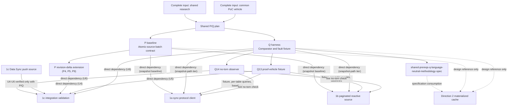

# Skip/Convex prerequisite map

This graph distinguishes direct dependencies, specification consumption, and
design-reference relationships. The 1a, 1b, and 1c dependencies on P/Q are
adoption decisions (2026-09-23). They are not claims that a spike is technically
impossible to implement another way.

- **Direct dependency (1a and 1b, adopted 2026-09-23):** 1a and 1b use P's
  `SnapshotBatch` helpers for their atomic writes, and Q (snapshot-path fault
  tier, Q13 fixture and baselines, Q14 no-torn observer) for comparison,
  faults, and metrics, supplying only their own triggers. It is a decision to
  avoid duplicate work, not a necessity claim; gaps are escalated to the
  shared plan.
- **Direct dependency (1c, adopted 2026-09-23):** 1c can start its backend
  units and push-service parser work without P/Q, but its push service (U4)
  imports P's snapshot baseline plus the revision-delta extension, its tutorial
  unit (U5) consumes Q13's fixture, and its comparison harness (U6) builds on
  Q with Q14 and the Q6 faults that apply to a Data Sync source (not the
  baseline's query-state faults). There is no bespoke fallback; P/Q gaps are fixed
  in the shared plan. 1a and 1b wait only on the snapshot baseline, never on
  the revision-delta extensions.
- **Specification consumption:** Direction 2 implements native atomicity and
  comparator code, but uses Q12's language-neutral methodology rather than
  importing TypeScript P/Q artifacts.
- **Encoding boundary:** 1a/1b use complete `SnapshotBatch` values; 1c uses
  `RevisionDeltaBatch`; Direction 2 implements the latter's native equivalent.
  In 1b, incoming Transition groups and page-swap publication groups are
  intentionally distinct.
- **Design reference:** a relationship informs a design but supplies no code
  dependency or completion gate.
- **Status (2026-09-28):** every P and Q output above is built and
  validated. That includes the revision-delta extension, Q13, Q14, both Q6
  tiers, and Q12. The shared plan's live reference runs pass against a
  local deployment, so no direct dependency above still blocks a consumer
  from starting. Each consumer still proves P/Q usable when it integrates.

Cross-document descriptive anchors above resolve through
[IDENTIFIER-MAP.md](IDENTIFIER-MAP.md); generic P/Q node labels are local to
this diagram. See [planning-timeline.md](planning-timeline.md) for maturity
states and [detailed-prerequisites.md](detailed-prerequisites.md) for the P/Q
outputs.
The source plans are [1a](2026-09-10-1509-feat-skip-sync-protocol-client-plan.md),
[1b](2026-09-10-1843-feat-skip-paginated-reactive-source-spike-plan.md),
[1c](2026-09-10-1854-feat-skip-data-sync-push-source-spike-plan.md),
[Direction 2](2026-09-10-1702-feat-skip-incremental-materialized-cache-spike-plan.md),
and [the shared P/Q prerequisites](2026-09-11-1159-feat-skip-shared-prerequisites-plan.md).
